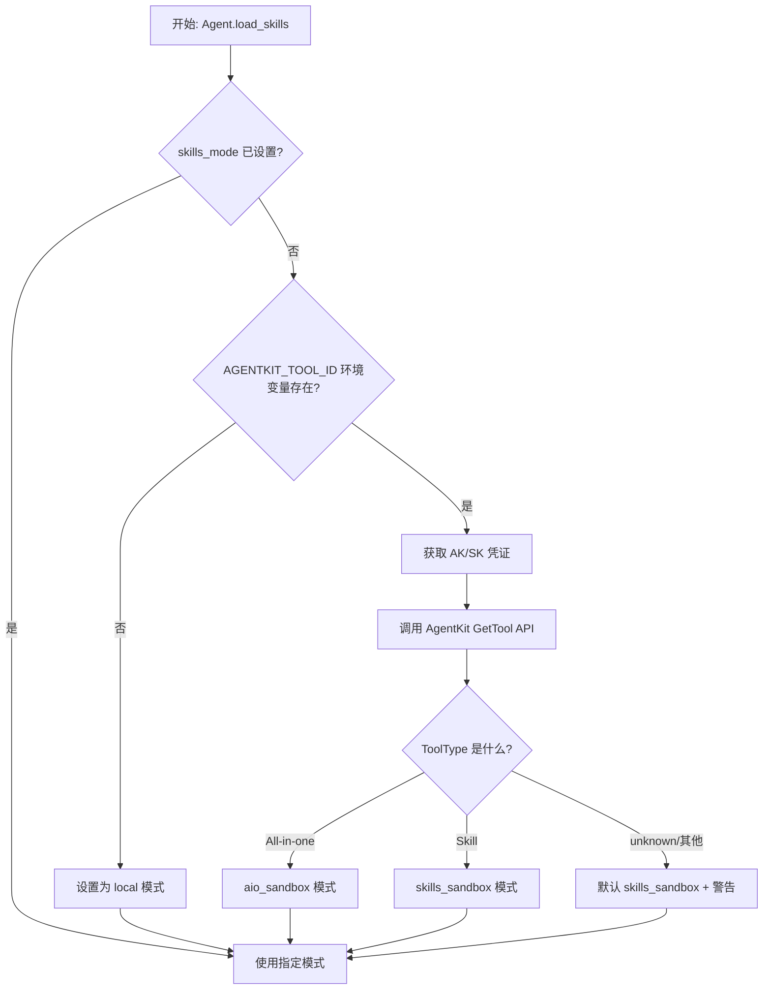
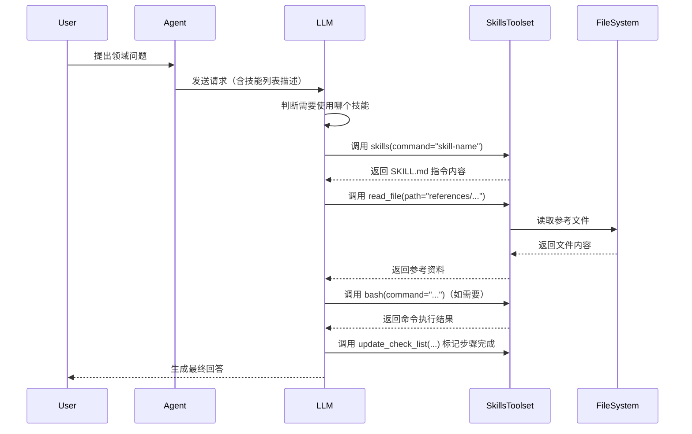

# Skills 技能系统详解

## 概述

### 技能(Skill) vs 工具(Tool) 的区别

| 维度 | Tool（工具） | Skill（技能） |
|-----|-------------|--------------|
| **本质** | 单个可调用函数/类，执行特定原子操作 | 领域知识包，包含指令、参考文档、脚本等完整能力集合 |
| **粒度** | 细粒度，单一功能（如 web_search、run_code） | 粗粒度，面向特定任务域（如代码审查、文档生成、数据分析） |
| **组成** | Python 代码实现 | SKILL.md 元数据 + 参考资料 + 可能的脚本 + 检查清单 |
| **加载方式** | Agent 初始化时直接挂载到 tools 列表 | 按需加载，通过 SkillsToolset 动态发现和执行 |
| **执行环境** | 在 Agent 主进程中直接执行 | 沙箱模式下在隔离环境执行，local 模式在主进程使用工具执行 |
| **复用性** | 通用工具，可被多个 Agent 复用 | 面向特定场景的专业能力，可跨 Agent/项目共享 |
| **知识载体** | 函数 docstring（给模型看的使用说明） | SKILL.md frontmatter + 内嵌指令 + references 目录文档 |
| **典型用途** | 网页搜索、文件读写、API 调用等基础操作 | 复杂任务如"创建 React 组件"、"生成 PPT"、"代码审查"等需要多步推理和领域知识的场景 |

简单来说：**工具是 Agent 的"手"，用来执行具体操作；技能是 Agent 的"专业知识包"，告诉它如何在特定领域完成复杂任务。**

### 什么是 Skill

在 VeADK 中，**Skill（技能）**是一种可复用的领域能力封装，它包含：

1. **元数据**：名称、描述、检查清单（通过 SKILL.md 的 frontmatter 定义）
2. **指令**：告诉模型如何使用该技能的步骤说明
3. **参考资料**：references/ 目录下的文档、模板等知识素材
4. **脚本工具**：可选的辅助脚本（在沙箱模式下执行）
5. **检查清单**：可选的分步验证项，确保任务按步骤完成

技能让 Agent 能够像专家一样处理特定领域的复杂任务，而无需每次都从零开始推理。

## Skills 加载模式

VeADK 支持三种技能加载模式，由 `skills_mode` 参数控制。代码中定义在 [veadk/agent.py:170](file:///d:/AI/.chaos/libs/veadk-python/veadk/agent.py#L170-L170)：

```python
skills_mode: Optional[Literal["skills_sandbox", "aio_sandbox", "local"]] = None
```

### 模式判定逻辑

如果用户未显式设置 `skills_mode`，Agent 在 `load_skills()` 方法中会自动判定，代码位于 [veadk/agent.py:467-534](file:///d:/AI/.chaos/libs/veadk-python/veadk/agent.py#L467-L534)：



### 模式详解

#### 1. local 模式（⚠️ 已弃用）

**状态：Deprecated（已弃用）**

代码参考：[veadk/agent.py:536-547](file:///d:/AI/.chaos/libs/veadk-python/veadk/agent.py#L536-L547)

当使用 `skills_mode='local'` 时，会触发 DeprecationWarning：

```
Agent(skills=..., skills_mode='local') is deprecated for legacy
local skill loading, including local paths and remote sources
loaded for local execution. For Google ADK-compatible local
skills, load skills with google.adk.skills.load_skill_from_dir.
For remote skill spaces, use veadk.skills.VeSkillRegistry
with google.adk.tools.skill_toolset.SkillToolset via
Agent(tools=[...]).
```

**特点：**
- 技能文件在本地文件系统直接加载
- 通过 `SkillsToolset` 提供文件读写、bash 执行等工具，Agent 在本地执行技能指令
- 不提供沙箱隔离，脚本直接在主机执行
- **已不推荐使用**，新代码应使用 ADK 原生方式或沙箱模式

**适用场景：** 仅用于向后兼容旧代码，新开发不建议使用。

**迁移建议：**
- 本地技能：使用 `google.adk.skills.load_skill_from_dir()` + `google.adk.tools.skill_toolset.SkillToolset`
- 远端技能空间：使用 `veadk.skills.VeSkillRegistry` + `SkillToolset`（通过 tools 参数传入）

参考示例：[examples/15_legacy_skills/main.py](file:///d:/AI/.chaos/libs/veadk-python/examples/15_legacy_skills/main.py) 展示了新旧两种方式的对比。

#### 2. skills_sandbox 模式（推荐）

**状态：当前推荐模式**

代码参考：[veadk/agent.py:587-590](file:///d:/AI/.chaos/libs/veadk-python/veadk/agent.py#L587-L590)

**特点：**
- 技能在专用技能沙箱环境中执行
- Agent 通过 `execute_skills` 工具调用技能，无需直接操作文件/命令
- 提供安全隔离，技能脚本不会直接影响主机环境
- 适用于标准技能空间部署场景
- SkillsToolset 在该模式下返回空工具列表（实际执行由沙箱处理）

代码参考：[veadk/tools/skills_tools/skills_toolset.py:90-91](file:///d:/AI/.chaos/libs/veadk-python/veadk/tools/skills_tools/skills_toolset.py#L90-L91)

```python
case "skills_sandbox":
    return []  # 沙箱模式下不暴露本地工具，由 execute_skills 统一处理
```

在 instruction 中会追加提示：
```
You can use the skills by calling the `execute_skills` tool.
```

#### 3. aio_sandbox 模式（All-in-One 沙箱）

**状态：AIO 专用模式**

代码参考：[veadk/agent.py:525-526](file:///d:/AI/.chaos/libs/veadk-python/veadk/agent.py#L525-L526)

**特点：**
- 用于 All-in-One 类型的 AgentKit 工具
- 技能在一体化沙箱环境中执行
- 与 skills_sandbox 类似，但沙箱环境包含更完整的运行时
- SkillsToolset 在该模式下同样返回空工具列表

代码参考：[veadk/tools/skills_tools/skills_toolset.py:93-94](file:///d:/AI/.chaos/libs/veadk-python/veadk/tools/skills_tools/skills_toolset.py#L93-L94)

**触发条件：** AgentKit GetTool API 返回 ToolType 为 "All-in-one" 时自动选择。

### 模式对比表

| 特性 | local（已弃用） | skills_sandbox | aio_sandbox |
|-----|----------------|----------------|-------------|
| **执行环境** | 本地主机进程 | 技能专用沙箱 | AIO 一体化沙箱 |
| **安全性** | 低（无隔离） | 高（沙箱隔离） | 高（沙箱隔离） |
| **可用工具** | 文件操作、bash、技能工具等完整 SkillsToolset | 仅 execute_skills 入口 | 仅 execute_skills 入口 |
| **调用方式** | skills_tool 工具 | execute_skills 工具 | execute_skills 工具 |
| **适用场景** | 本地开发/旧代码兼容 | 标准技能部署 | AIO 类型 AgentKit 工具 |
| **推荐程度** | ❌ 不推荐 | ✅ 推荐 | ✅ 特定场景推荐 |
| **触发方式** | 无 AGENTKIT_TOOL_ID 时默认（旧逻辑） | ToolType=Skill | ToolType=All-in-one |

## 技能清单机制（SKILL.md）

每个技能必须包含一个 `SKILL.md` 文件作为技能清单，使用 YAML frontmatter 定义元数据。

代码参考：[veadk/skills/utils.py:89-123](file:///d:/AI/.chaos/libs/veadk-python/veadk/skills/utils.py#L89-L123)

### SKILL.md 格式

```markdown
---
name: skill-name
description: 技能的简短描述，说明该技能的用途和适用场景
checklist:
  - id: step1
    item: 第一步要完成的事项
  - id: step2
    item: 第二步要完成的事项
---

# 技能使用说明

这里编写详细的技能指令，告诉模型：
1. 何时应该使用这个技能
2. 使用技能的具体步骤
3. 需要读取哪些参考文件
4. 输出格式要求

## 参考资料

技能相关的参考文档放在 references/ 目录下。
```

### 必填字段

| 字段 | 位置 | 必填 | 说明 |
|-----|------|-----|------|
| `name` | frontmatter | ✅ | 技能名称，唯一标识符 |
| `description` | frontmatter | ✅ | 技能描述，供模型判断何时使用该技能 |
| `checklist` | frontmatter | ❌ | 分步检查清单，每项包含 `id` 和 `item` |
| 指令正文 | Markdown 内容 | ✅ | 详细的使用说明和步骤 |

### 字段说明

- **name**：技能的唯一名称，用于在 skills_dict 中索引。加载时如果缺失名称或描述会报错。
- **description**：清晰描述技能用途，这是模型选择技能的重要依据。
- **checklist**：可选的检查清单项，Agent 可以使用 `update_check_list` 工具标记每项完成状态。

### 检查清单（Checklist）

如果技能定义了 checklist，在 instruction 中会追加提示：

代码参考：[veadk/agent.py:572-576](file:///d:/AI/.chaos/libs/veadk-python/veadk/agent.py#L572-L576)

```
Some skills have a checklist that you must complete step by step.
Use the `update_check_list` tool to mark each item as completed.
```

使用 `update_check_list` 工具更新状态：

代码参考：[veadk/skills/utils.py:35-50](file:///d:/AI/.chaos/libs/veadk-python/veadk/skills/utils.py#L35-L50)

```python
update_check_list(
    tool_context=tool_context,
    skill_name="skill-creator",
    check_item="analyze_content",
    state=True
)
```

当 `enable_skills_checklist=True` 时，会在 before_tool_callback 中注册初始化回调，在调用技能时自动初始化清单项状态。

代码参考：[veadk/agent.py:379-397](file:///d:/AI/.chaos/libs/veadk-python/veadk/agent.py#L379-L397)

### 技能目录结构

```
my-skill/
├── SKILL.md              # 技能清单（必需）
└── references/           # 参考资料目录（可选）
    ├── template.md       # 模板文件
    ├── examples.md       # 示例文档
    └── ...
```

### 本地技能加载示例

参考 [examples/15_legacy_skills/main.py:336-362](file:///d:/AI/.chaos/libs/veadk-python/examples/15_legacy_skills/main.py#L336-L362)：

```python
(SKILL_DIR / "SKILL.md").write_text("""---
name: company-qa
description: 根据公司资料回答问题，并在回答中说明依据。
---

当用户询问公司制度、团队流程或报销规则时：
1. 先读取 references/company.md。
2. 只根据资料回答。
3. 如果资料里没有答案，明确说资料未覆盖。
""", encoding="utf-8")

(references_dir / "company.md").write_text("""公司报销规则：
- 单笔超过 500 元需要直属负责人审批。
- 差旅报销需要提供发票和行程单。
- 餐补标准为每人每天 80 元。
""", encoding="utf-8")
```

## 动态技能加载流程

### 完整加载流程图

```mermaid
flowchart TD
    A[Agent 初始化] --> B{self.skills 非空?}
    B -->|否| Z[跳过技能加载]
    B -->|是| C[调用 self.load_skills]

    C --> D{self.skills_mode 是否已设置?}
    D -->|否| E[自动判定模式]
    D -->|是| F[使用指定模式]

    E --> E1{AGENTKIT_TOOL_ID 存在?}
    E1 -->|否| E2[设置为 local 并发出弃用警告]
    E1 -->|是| E3[调用 AgentKit API 获取 ToolType]
    E3 --> E4{ToolType?}
    E4 -->|All-in-one| E5[aio_sandbox]
    E4 -->|Skill| E6[skills_sandbox]
    E4 -->|其他| E7[默认 skills_sandbox + 警告]

    E2 --> G
    E5 --> G
    E6 --> G
    E7 --> G
    F --> G

    G[初始化 self.skills_dict = {}]
    G --> H[遍历 self.skills 列表]

    H --> I{路径是本地目录?}
    I -->|是| J[load_skills_from_directory<br/>扫描子目录，加载每个 SKILL.md]
    I -->|否| K[load_skills_from_cloud<br/>加载远端技能空间]

    J --> L[解析 SKILL.md frontmatter]
    K --> K1{ID 前缀 sp-?}
    K1 -->|是| K2[从 SkillHub 加载]
    K1 -->|否| K3[从 AgentKit SkillSpace 加载]
    K2 --> L
    K3 --> L

    L --> M{name 和 description 都存在?}
    M -->|否| N[记录错误，跳过该技能]
    M -->|是| O[创建 Skill 对象<br/>添加到 skills_dict]

    O --> P{还有更多技能?}
    P -->|是| H
    P -->|否| Q{skills_dict 非空?}

    Q -->|否| R[警告: No skills loaded]
    Q -->|是| S[修改 self.instruction<br/>追加技能列表描述]

    S --> T{是否有 checklist?}
    T -->|是| U[追加 checklist 使用说明]
    T -->|否| V

    U --> V{skills_mode?}
    V -->|local| W[追加: 使用 skills_tool 工具]
    V -->|skills_sandbox| X[追加: 使用 execute_skills 工具]
    V -->|aio_sandbox| Y[无额外提示]

    W --> AA[追加 SkillsToolset 到 self.tools]
    X --> AA
    Y --> AA

    AA --> AB{enable_dynamic_load_skills?}
    AB -->|是| AC[添加 check_skills 到 before_agent_callback]
    AB -->|否| AD[技能加载完成]

    N --> P
    R --> AD
    AC --> AD
    Z --> AD
```

### 关键代码位置

| 步骤 | 代码位置 |
|-----|---------|
| 入口触发 | [veadk/agent.py:377-397](file:///d:/AI/.chaos/libs/veadk-python/veadk/agent.py#L377-L397) |
| 模式自动判定 | [veadk/agent.py:467-534](file:///d:/AI/.chaos/libs/veadk-python/veadk/agent.py#L467-L534) |
| local 模式弃用警告 | [veadk/agent.py:536-547](file:///d:/AI/.chaos/libs/veadk-python/veadk/agent.py#L536-L547) |
| 本地目录加载 | [veadk/skills/utils.py:126-134](file:///d:/AI/.chaos/libs/veadk-python/veadk/skills/utils.py#L126-L134) |
| SKILL.md 解析 | [veadk/skills/utils.py:89-123](file:///d:/AI/.chaos/libs/veadk-python/veadk/skills/utils.py#L89-L123) |
| 云端技能加载 | [veadk/skills/utils.py:137-151](file:///d:/AI/.chaos/libs/veadk-python/veadk/skills/utils.py#L137-L151) |
| SkillHub 空间加载 | [veadk/skills/utils.py:361-434](file:///d:/AI/.chaos/libs/veadk-python/veadk/skills/utils.py#L361-L434) |
| SkillsToolset 挂载 | [veadk/agent.py:600](file:///d:/AI/.chaos/libs/veadk-python/veadk/agent.py#L600-L600) |
| 动态加载回调 | [veadk/agent.py:602-612](file:///d:/AI/.chaos/libs/veadk-python/veadk/agent.py#L602-L612) |

### Skill 数据模型

代码参考：[veadk/skills/skill.py:19-32](file:///d:/AI/.chaos/libs/veadk-python/veadk/skills/skill.py#L19-L32)

```python
class Skill(BaseModel):
    name: str                           # 技能名称
    description: str                    # 技能描述
    path: str                           # 本地路径或 TOS 路径
    skill_space_id: Optional[str] = None  # 所属技能空间 ID
    bucket_name: Optional[str] = None   # TOS bucket 名称
    checklist: List[Dict[str, str]] = []  # 检查清单
    id: Optional[str] = None            # 技能 ID
    slug: Optional[str] = None          # SkillHub slug
    source_type: Optional[str] = None   # 来源类型（如 "skillhub"）
    version_id: Optional[str] = None    # 版本 ID

    def get_checklist_items(self) -> List[str]:
        return [item.get("item", item.get("id", "")) for item in self.checklist]
```

## SkillsToolset 使用方式

`SkillsToolset` 是技能系统的核心工具集，它为 Agent 提供操作技能所需的工具。

代码参考：[veadk/tools/skills_tools/skills_toolset.py:43-100](file:///d:/AI/.chaos/libs/veadk-python/veadk/tools/skills_tools/skills_toolset.py#L43-L100)

### 初始化

```python
self.tools.append(SkillsToolset(self.skills_dict, self.skills_mode))
```

### 包含的工具

SkillsToolset 内部注册了以下工具：

| 工具名 | 功能 | local 模式 | 沙箱模式 |
|-------|------|-----------|---------|
| `skills` | 发现和加载技能指令 | ✅ | ❌（由沙箱处理） |
| `read_file` | 带行号读取文件 | ✅ | ❌ |
| `write_file` | 写入/创建文件 | ✅ | ❌ |
| `edit_file` | 精确替换编辑文件 | ✅ | ❌ |
| `bash` | 执行 Shell 命令 | ✅ | ❌ |
| `register_skills` | 注册新技能到远端空间 | ✅ | ❌ |
| `update_check_list` | 更新检查清单项状态 | ✅ | ❌ |

注意：在 `skills_sandbox` 和 `aio_sandbox` 模式下，`get_tools()` 返回空列表，这些工具不会暴露给模型，技能执行完全由沙箱环境的 `execute_skills` 工具处理。

代码参考：[veadk/tools/skills_tools/skills_toolset.py:86-99](file:///d:/AI/.chaos/libs/veadk-python/veadk/tools/skills_tools/skills_toolset.py#L86-L99)

```python
match self.skills_mode:
    case "local":
        return list(self._tools.values())
    case "skills_sandbox":
        return []
    case "aio_sandbox":
        return []
```

## 技能与工具的关系

### 层级关系

```
Agent
├── tools: List[ToolUnion]
│   ├── 基础工具（web_search, run_code, ...）
│   ├── 自动挂载工具（knowledgebase, load_memory, ...）
│   ├── SkillsToolset（技能工具集，当 skills 非空时自动挂载）
│   │   ├── skills（发现技能）
│   │   ├── read_file/write_file/edit_file（文件操作）
│   │   ├── bash（命令执行）
│   │   ├── register_skills（技能注册）
│   │   └── update_check_list（清单更新）
│   └── 其他工具集（TrustedMcpToolset, VannaToolset, ...）
│
└── skills: List[str] → 解析后 → skills_dict: Dict[str, Skill]
```

### 交互流程（local 模式）



### 技能如何使用工具

技能本身不是可执行代码，而是给 LLM 的指令集。LLM 阅读 SKILL.md 后，按照其中说明的步骤，自主决定调用哪些工具（包括 SkillsToolset 提供的文件操作工具、bash 工具，以及 Agent 上挂载的其他工具）来完成任务。

这是一种"LLM 编排"模式：
1. SKILL.md 告诉 LLM 完成任务的 SOP（标准操作流程）
2. LLM 根据 SOP 逐步调用工具
3. 工具返回结果给 LLM
4. LLM 综合结果生成最终输出

## VeSkillRegistry（推荐的新方式）

对于新代码，推荐使用 Google ADK 原生的 Skill 机制配合 VeSkillRegistry 来加载远端技能，而不是使用已弃用的 Agent(skills=...) 入口。

代码参考：[veadk/skills/registry.py:38-100](file:///d:/AI/.chaos/libs/veadk-python/veadk/skills/registry.py#L38-L100)

### 使用方式

参考 [examples/15_legacy_skills/main.py:377-412](file:///d:/AI/.chaos/libs/veadk-python/examples/15_legacy_skills/main.py#L377-L412)：

```python
from google.adk.skills import load_skill_from_dir
from google.adk.tools.skill_toolset import SkillToolset
from veadk.skills import VeSkillRegistry

# 1. 加载本地技能
local_skill = load_skill_from_dir(SKILL_DIR)

# 2. 创建远端技能仓库
remote_registry = VeSkillRegistry(
    skill_source_id=SKILLSPACE_ID,  # 支持 ss-（SkillSpace）和 sp-（SkillHub）前缀
    cache_dir=SKILLS_CACHE_DIR,     # 本地缓存目录
)

# 3. 创建 SkillToolset 并传入 Agent
skill_toolset = SkillToolset(
    skills=[local_skill],    # 预加载的本地技能
    registry=remote_registry, # 远端技能仓库（按需加载）
)

# 4. 通过 tools 参数传入（不使用弃用的 skills 参数）
agent = Agent(
    name="my_agent",
    instruction="...",
    tools=[skill_toolset],   # ✅ 推荐方式：通过 tools 传入
    # skills=[...]           # ❌ 弃用方式
)
```

### VeSkillRegistry 方法

| 方法 | 说明 |
|-----|------|
| `search_skills(query: str)` | 搜索远端可用技能（返回所有技能，query 参数当前被忽略） |
| `get_skill(name: str)` | 按名称获取技能，自动下载物化到本地缓存目录，返回 ADK Skill 对象 |
| `search_tool_description()` | 返回搜索工具的描述文本 |

### 技能物化（Materialization）

远端技能需要下载并解压到本地才能被 ADK 加载，这个过程称为"物化"（materialization）。

代码参考：[veadk/skills/materializer.py:44-100](file:///d:/AI/.chaos/libs/veadk-python/veadk/skills/materializer.py#L44-L100)

物化流程：
1. 检查本地缓存是否存在有效版本
2. 如无缓存或缓存失效，从远端下载技能 zip 包
3. 安全解压到临时目录
4. 规范化目录结构（确保 SKILL.md 在根目录）
5. 使用 ADK `load_skill_from_dir` 验证
6. 清理旧版本缓存
7. 返回本地技能目录路径

缓存路径格式：
```
{cache_dir}/{source_type}/{source_id}/{skill_name}/{version_key}/
```

## 使用示例

### 示例 1：local 模式（旧方式，仅作演示）

```python
import asyncio
from pathlib import Path
from veadk import Agent, Runner

# 准备本地技能目录
skill_dir = Path("./my_skills/weather-advisor")
skill_dir.mkdir(parents=True, exist_ok=True)
(skill_dir / "references").mkdir(exist_ok=True)

# 创建 SKILL.md
(skill_dir / "SKILL.md").write_text("""---
name: weather-advisor
description: 根据温度给出穿衣建议的技能
checklist:
  - id: get_temp
    item: 获取当前温度
  - id: give_advice
    item: 给出穿衣建议
---

你是一个穿衣建议专家。当用户询问天气和穿衣建议时：
1. 调用 get_city_weather 工具获取温度
2. 根据温度给出建议：<10°C穿厚外套，10-23°C穿薄夹克，>23°C穿T恤
3. 使用 update_check_list 标记步骤完成
""", encoding="utf-8")

# 使用旧方式（会显示弃用警告）
agent = Agent(
    name="weather_skill_agent",
    instruction="使用 weather-advisor 技能帮助用户。",
    skills=[str(skill_dir)],  # 本地目录路径
    skills_mode="local",      # 显式指定 local 模式
    tools=[get_city_weather],
)

async def main():
    runner = Runner(agent=agent, app_name="weather_skill_app")
    result = await runner.run(messages="北京今天穿什么？", session_id="s1")
    print(result)

asyncio.run(main())
```

### 示例 2：推荐方式（VeSkillRegistry + SkillToolset）

```python
from pathlib import Path
from veadk import Agent
from google.adk.skills import load_skill_from_dir
from google.adk.tools.skill_toolset import SkillToolset
from veadk.skills import VeSkillRegistry

# 本地技能
local_skill = load_skill_from_dir(Path("./local_skills/company-qa"))

# 远端技能空间
registry = VeSkillRegistry(
    skill_source_id="sp-xxxxxx",  # SkillHub 空间 ID
    cache_dir=Path("./.skills_cache"),
)

# 创建工具集
skill_toolset = SkillToolset(
    skills=[local_skill],
    registry=registry,
)

# 通过 tools 传入（推荐方式）
agent = Agent(
    name="modern_skill_agent",
    instruction="你可以使用本地和远端技能来帮助用户。",
    tools=[skill_toolset],  # ✅ 不使用弃用的 skills 参数
)
```

代码参考：[examples/15_legacy_skills/main.py:378-412](file:///d:/AI/.chaos/libs/veadk-python/examples/15_legacy_skills/main.py#L378-L412)

### 示例 3：沙箱模式自动判定

在 AgentKit 云环境中运行时，无需手动指定 skills_mode，会自动根据 AGENTKIT_TOOL_ID 判定：

```python
import os
from veadk import Agent

# 在 AgentKit 环境中，以下环境变量会自动设置：
# AGENTKIT_TOOL_ID, VOLCENGINE_ACCESS_KEY, VOLCENGINE_SECRET_KEY, ...

agent = Agent(
    name="cloud_skill_agent",
    instruction="你可以使用沙箱中的技能完成任务。",
    skills=["ss-yep2o9dgxswl3fpmpdle"],  # 技能空间 ID
    enable_dynamic_load_skills=True,     # 启用动态技能加载
    enable_skills_checklist=True,        # 启用检查清单
    # skills_mode 会自动判定为 skills_sandbox 或 aio_sandbox
)
```

### 示例 4：使用 checklist

在 SKILL.md 中定义 checklist：

```markdown
---
name: code-reviewer
description: 代码审查技能
checklist:
  - id: read_code
    item: 读取待审查代码
  - id: check_style
    item: 检查代码风格
  - id: check_bugs
    item: 检查潜在 Bug
  - id: check_security
    item: 检查安全问题
  - id: write_report
    item: 输出审查报告
---

执行代码审查时，按以下步骤进行：
1. 使用 read_file 读取代码文件
2. 逐项检查 checklist 中的内容
3. 每完成一步使用 update_check_list 标记为已完成
4. 最后输出完整的审查报告
```

模型执行时会在适当的时机调用：
```python
update_check_list(
    skill_name="code-reviewer",
    check_item="read_code",
    state=True
)
```

## 动态技能加载

当 `enable_dynamic_load_skills=True` 时，会在 before_agent_callback 中添加 `check_skills` 回调，支持会话过程中动态加载新技能。

代码参考：[veadk/agent.py:602-612](file:///d:/AI/.chaos/libs/veadk-python/veadk/agent.py#L602-L612)

```python
if self.enable_dynamic_load_skills:
    if self.before_agent_callback:
        if isinstance(self.before_agent_callback, list):
            self.before_agent_callback.append(check_skills)
        else:
            self.before_agent_callback = [
                self.before_agent_callback,
                check_skills,
            ]
    else:
        self.before_agent_callback = check_skills
```

这使得 Agent 可以在运行时根据需要从技能空间发现和加载新技能，而不是仅限于初始化时指定的技能列表。
