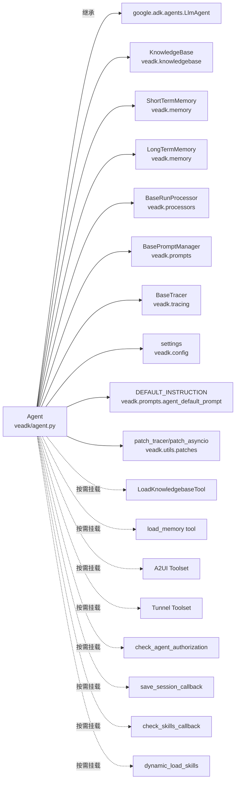
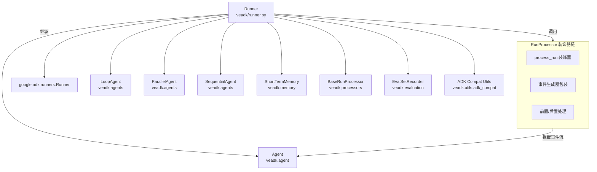

# VeADK 模块依赖关系与分层架构

本文档通过 Mermaid 图表展示 VeADK 核心模块间的 import/依赖关系，并进行分层架构说明。

---

## 一、核心模块依赖关系图

```mermaid
flowchart TD
    %% ========== 基础层（第三方依赖） ==========
    subgraph BaseLayer["基础层（Google ADK + 第三方SDK）"]
        direction LR
        ADK[Google ADK<br/>LlmAgent/BaseTool/BaseSessionService]
        A2ASDK[A2A SDK<br/>a2a.server/a2a.types]
        VolcSDK[火山引擎SDK<br/>volcenginesdkcore/vefaas/apig]
        LarkSDK[飞书SDK<br/>lark_oapi]
        ClickLib[Click CLI Framework]
        FastAPILib[FastAPI/UVicorn]
    end

    %% ========== 核心层（VeADK核心） ==========
    subgraph CoreLayer["核心层（VeADK Core）"]
        direction TB
        Config[Config/Settings<br/>veadk/config.py]
        Consts[Consts<br/>veadk/consts.py]
        Logger[Logger<br/>veadk/utils/logger.py]
        AgentClass[Agent<br/>veadk/agent.py]
        RunnerClass[Runner<br/>veadk/runner.py]
        EventTypes[Event Types<br/>veadk/types.py]
        CredentialService[VeCredentialService<br/>veadk/auth/ve_credential_service.py]

        Config --> Consts
        Config --> Logger
        AgentClass --> Config
        AgentClass --> Consts
        AgentClass --> CredentialService
        RunnerClass --> AgentClass
        RunnerClass --> Config
        RunnerClass --> EventTypes
    end

    %% ========== 能力扩展层（VeADK Extension Points） ==========
    subgraph ExtensionLayer["能力扩展层（Extension Points）"]
        direction TB
        RunProcessor[BaseRunProcessor<br/>veadk/processors/]
        Tracer[BaseTracer<br/>veadk/tracing/]
        PromptManager[BasePromptManager<br/>veadk/prompts/]
        ShortTermMem[ShortTermMemory<br/>veadk/memory/]
        LongTermMem[LongTermMemory<br/>veadk/memory/]
        KB[KnowledgeBase<br/>veadk/knowledgebase/]
        Skills[Skills Registry<br/>veadk/skills/]
        Tools[Builtin Tools<br/>veadk/tools/]
        Tunnel[Tunnel<br/>veadk/tunnel/]
        A2UI[A2UI<br/>veadk/a2ui/]
        Reflector[Reflector<br/>veadk/reflector/]
        Evaluation[Evaluation<br/>veadk/evaluation/]

        AgentClass --> RunProcessor
        AgentClass --> Tracer
        AgentClass --> PromptManager
        AgentClass --> ShortTermMem
        AgentClass --> LongTermMem
        AgentClass --> KB
        AgentClass --> Skills
        AgentClass --> Tools
        AgentClass --> Tunnel
        AgentClass --> A2UI
        RunnerClass --> ShortTermMem
    end

    %% ========== 后端实现层（Backend Implementations） ==========
    subgraph BackendLayer["后端实现层（Backend Implementations）"]
        direction TB
        STMBackends[STM Backends<br/>memory/short_term_memory_backends/]
        LTMBackends[LTM Backends<br/>memory/long_term_memory_backends/]
        KBBackends[KB Backends<br/>knowledgebase/backends/]
        Tracers[Tracer Exporters<br/>tracing/telemetry/exporters/]
        VeAuth[VeAuth Modules<br/>auth/veauth/]
        PromptImpls[Prompt Managers<br/>CozeloopPromptManager]

        ShortTermMem --> STMBackends
        LongTermMem --> LTMBackends
        KB --> KBBackends
        Tracer --> Tracers
        CredentialService --> VeAuth
        PromptManager --> PromptImpls
    end

    %% ========== 协议层（Protocols） ==========
    subgraph ProtocolLayer["协议层（Protocols）"]
        direction TB
        A2AServer[VeA2AServer<br/>a2a/ve_a2a_server.py]
        AgentCard[AgentCard<br/>a2a/agent_card.py]
        A2AHub[A2A Hub Server/Client<br/>a2a/hub/]
        A2AExecutor[A2aAgentExecutor<br/>a2a/ve_agent_executor.py]
        RemoteAgent[RemoteVeAgent<br/>a2a/remote_ve_agent.py]
        VeMiddlewares[A2A Middlewares<br/>a2a/ve_middlewares.py]

        A2AServer --> AgentCard
        A2AServer --> A2AExecutor
        A2AHub --> AgentCard
        RunnerClass --> A2AExecutor
    end

    %% ========== 集成层（Cloud Integrations） ==========
    subgraph IntegrationLayer["云集成层（Cloud Integrations）"]
        direction TB
        VeFaaS[VeFaaS<br/>integrations/ve_faas/]
        VeAPIG[VeAPIG<br/>integrations/ve_apig/]
        VeCR[VeCR<br/>integrations/ve_cr/]
        VeTOS[VeTOS<br/>integrations/ve_tos/]
        VeTLS[VeTLS<br/>integrations/ve_tls/]
        VeIdentity[VeIdentity<br/>integrations/ve_identity/]
        AgentKit[AgentKit<br/>integrations/agentkit/]
        CozeLoop[CozeLoop<br/>integrations/ve_cozeloop/]
        CloudEngine[CloudAgentEngine<br/>cloud/cloud_agent_engine.py]
        CloudApp[CloudApp<br/>cloud/cloud_app.py]
        HarnessApp[Harness App<br/>cloud/harness_app/]

        VeFaaS --> VeAPIG
        VeFaaS --> VeCR
        CloudEngine --> VeFaaS
        CloudApp --> CloudEngine
        HarnessApp --> CloudEngine
    end

    %% ========== 接入层（Channels & CLI） ==========
    subgraph AccessLayer["接入层（Channels & CLI）"]
        direction TB
        FeishuChannel[FeishuChannelExtension<br/>extensions/feishu_channel.py]
        HarnessExt[Harness Extension<br/>extensions/harness/]
        CLI[CLI Commands<br/>cli/cli.py]
        WebUI[Web UI<br/>webui/]
        Frontend[Frontend Build<br/>frontend/]
        RuntimeCodex[Codex Runtime<br/>runtime/codex/]
        RuntimePiAgent[PiAgent Runtime<br/>runtime/piagent/]

        FeishuChannel --> RunnerClass
        CLI --> VeFaaS
        CLI --> AgentKit
        CLI --> VeAPIG
    end

    %% ========== 第三方依赖连线 ==========
    AgentClass -.->|"继承"| ADK
    Tools -.->|"继承BaseTool"| ADK
    STMBackends -.->|"实现BaseSessionService"| ADK
    A2AServer -.->|"使用"| A2ASDK
    A2AHub -.->|"使用"| A2ASDK
    VeFaaS -.->|"调用"| VolcSDK
    VeAPIG -.->|"调用"| VolcSDK
    VeIdentity -.->|"调用"| VolcSDK
    FeishuChannel -.->|"使用"| LarkSDK
    CLI -.->|"基于"| ClickLib
    A2AServer -.->|"基于"| FastAPILib
    A2AHub -.->|"基于"| FastAPILib
    HarnessApp -.->|"基于"| FastAPILib

    %% ========== 样式定义 ==========
    classDef base fill:#f0f0f0,stroke:#999,stroke-width:2px
    classDef core fill:#e1f5fe,stroke:#0288d1,stroke-width:2px
    classDef ext fill:#f3e5f5,stroke:#7b1fa2,stroke-width:2px
    classDef backend fill:#e8f5e9,stroke:#388e3c,stroke-width:2px
    classDef protocol fill:#fff3e0,stroke:#f57c00,stroke-width:2px
    classDef integration fill:#ffebee,stroke:#d32f2f,stroke-width:2px
    classDef access fill:#fce4ec,stroke:#c2185b,stroke-width:2px

    class ADK,A2ASDK,VolcSDK,LarkSDK,ClickLib,FastAPILib base
    class Config,Consts,Logger,AgentClass,RunnerClass,EventTypes,CredentialService core
    class RunProcessor,Tracer,PromptManager,ShortTermMem,LongTermMem,KB,Skills,Tools,Tunnel,A2UI,Reflector,Evaluation ext
    class STMBackends,LTMBackends,KBBackends,Tracers,VeAuth,PromptImpls backend
    class A2AServer,AgentCard,A2AHub,A2AExecutor,RemoteAgent,VeMiddlewares protocol
    class VeFaaS,VeAPIG,VeCR,VeTOS,VeTLS,VeIdentity,AgentKit,CozeLoop,CloudEngine,CloudApp,HarnessApp integration
    class FeishuChannel,HarnessExt,CLI,WebUI,Frontend,RuntimeCodex,RuntimePiAgent access
```



---

## 二、Agent 核心依赖图（聚焦）



---

## 三、Runner 执行依赖图（聚焦）



---

## 四、分层架构说明

VeADK 采用清晰的六层分层架构，依赖方向严格自上而下（上层依赖下层，下层不反向依赖上层）：

### 第0层：基础层（Base Layer）- 第三方依赖

**定位**：所有外部依赖，不包含 VeADK 自身代码

| 组件 | 路径/说明 | 职责 |
|---|---|---|
| Google ADK | `google.adk.*` | LlmAgent 基类、工具抽象、会话服务、事件流、Runner 基类 |
| A2A SDK | `a2a.server`、`a2a.types` | Agent-to-Agent 协议实现、JSON-RPC、FastAPI 应用 |
| 火山引擎 SDK | `volcenginesdkcore`、`volcenginesdkvefaas`、`volcenginesdkapig` | VeFaaS、APIG、TOS、TLS、IAM 等云服务 API 封装 |
| 飞书 SDK | `lark_oapi`、`lark_channel` | 飞书机器人 WebSocket 连接、消息收发、OpenAPI |
| Click | `click` | CLI 命令行框架 |
| FastAPI/Uvicorn | `fastapi`、`uvicorn` | HTTP 服务框架，用于 A2A Server、Harness App、Hub 等 |

### 第1层：核心层（Core Layer）- VeADK 内核

**定位**：框架最核心的抽象与实现，所有其他模块都依赖此层

| 模块 | 路径 | 核心职责 |
|---|---|---|
| Config | `veadk/config.py`、`veadk/configs/` | 配置加载、环境变量管理、settings 单例、veadk_environments |
| Consts | `veadk/consts.py` | 默认常量、默认模型配置、版本头信息 |
| Logger | `veadk/utils/logger.py` | 统一日志接口 |
| **Agent** | `veadk/agent.py` | **核心类**，继承 LlmAgent，整合所有扩展能力（memory/kb/tracers等） |
| **Runner** | `veadk/runner.py` | **执行入口**，继承 ADK Runner，包装事件流、支持RunProcessor、媒体处理 |
| Event Types | `veadk/types.py` | MediaMessage 等自定义类型 |
| VeCredentialService | `veadk/auth/ve_credential_service.py` | 凭证存储服务，支持 app_name/user_id 直接访问 |

**核心依赖规则**：核心层不依赖任何上层（扩展层、集成层、接入层），仅依赖基础层。

### 第2层：扩展抽象层（Extension Abstraction Layer）- 扩展点接口

**定位**：定义所有扩展点的抽象基类/接口，规定扩展契约

| 模块 | 路径 | 抽象方法 |
|---|---|---|
| BaseRunProcessor | `veadk/processors/base_run_processor.py` | `process_run()` |
| BaseTracer | `veadk/tracing/base_tracer.py` | `dump()` |
| BasePromptManager | `veadk/prompts/prompt_manager.py` | `get_prompt()` |
| ShortTermMemory | `veadk/memory/short_term_memory.py` | 封装 backend，提供 create_session/get_session |
| LongTermMemory | `veadk/memory/long_term_memory.py` | 封装 backend，提供 save/search/load_memory 工具 |
| KnowledgeBase | `veadk/knowledgebase/knowledgebase.py` | 封装 backend，提供 add/query/load_kb 工具 |
| Skills Registry | `veadk/skills/registry.py` | 技能注册、物料化、动态加载 |
| Builtin Tools | `veadk/tools/` | web_search、run_code、load_kb 等内置工具 |
| Tunnel | `veadk/tunnel/` | TunnelRegistry、BaseProtocol、MCP协议实现 |
| A2UI | `veadk/a2ui/` | A2UI 组件目录、Toolset封装 |
| Reflector | `veadk/reflector/` | BaseReflector 反思机制抽象 |
| Evaluation | `veadk/evaluation/` | BaseEvaluator、EvalSetRecorder 评估框架 |

**设计模式**：此层大量使用**模板方法模式**、**策略模式**、**装饰器模式**，通过抽象基类规定扩展契约，具体实现延迟到后端实现层。

### 第3层：后端实现层（Backend Implementation Layer）

**定位**：扩展抽象层的具体实现，可插拔替换

| 分类 | 模块路径 | 具体实现 |
|---|---|---|
| 短期记忆后端 | `memory/short_term_memory_backends/` | SQLite、PostgreSQL、MySQL |
| 长期记忆后端 | `memory/long_term_memory_backends/` | InMemory、Redis、OpenSearch、Mem0、VikingDB、OpenViking、TOS Bucket |
| 知识库后端 | `knowledgebase/backends/` | InMemory、Milvus、OpenSearch、Redis、VikingDB、OpenViking、TOS Vector、Context Search |
| Tracer 导出器 | `tracing/telemetry/exporters/` | InMemory、TLS、APMPlus、Cozeloop、OpenTelemetry |
| VeAuth 认证 | `auth/veauth/` | ARK、Speech、OpenSearch、PostgreSQL、Viking Mem0 等各服务的凭证获取 |
| PromptManager | `prompts/prompt_manager.py` | CozeloopPromptManager（从 CozeLoop 获取） |

**设计模式**：此层使用**工厂模式**+**依赖注入**，用户通过构造参数传入 backend 实例即可切换存储后端，无需修改上层代码。

### 第4层：协议层（Protocol Layer）

**定位**：标准化 Agent 间通信协议和远程调用

| 模块 | 路径 | 核心职责 |
|---|---|---|
| VeA2AServer | `a2a/ve_a2a_server.py` | 将 VeADK Agent 包装为 A2A 协议 FastAPI 服务 |
| AgentCard | `a2a/agent_card.py` | 从 Agent 元数据生成 A2A 标准 AgentCard |
| VeAgentExecutor | `a2a/ve_agent_executor.py` | A2A 任务执行器，桥接到 VeADK Runner |
| A2A Hub | `a2a/hub/` | A2A Hub 服务器/客户端，支持 agent 分组注册与发现 |
| RemoteVeAgent | `a2a/remote_ve_agent.py` | 远程 Agent 代理，像调用本地 Agent 一样调用远程 A2A Agent |
| VeMiddlewares | `a2a/ve_middlewares.py` | A2A 中间件机制 |

### 第5层：云集成层（Cloud Integration Layer）

**定位**：与火山引擎云服务的深度集成，支持一键部署和云端托管

| 模块 | 路径 | 集成的云服务 |
|---|---|---|
| VeFaaS | `integrations/ve_faas/` | 函数计算：代码打包、函数创建、应用发布、镜像部署 |
| VeAPIG | `integrations/ve_apig/` | API 网关：Serverless 网关、服务/路由/上游管理 |
| VeCR | `integrations/ve_cr/` | 容器镜像仓库：VPC 隧道网络打通 |
| VeTOS | `integrations/ve_tos/` | 对象存储：文件上传、媒体托管 |
| VeTLS | `integrations/ve_tls/` | 日志服务：日志导出、Trace 上报 |
| VeIdentity | `integrations/ve_identity/` | 身份认证：IAM、OAuth2、MCP工具认证、Function Tool认证 |
| AgentKit | `integrations/agentkit/` | AgentKit 平台：应用托管、会话能力、评估反馈 |
| CozeLoop | `integrations/ve_cozeloop/` | CozeLoop 提示词平台 |
| CloudAgentEngine | `cloud/cloud_agent_engine.py` | 云端 Agent 引擎 |
| CloudApp | `cloud/cloud_app.py` | 云端应用入口 |
| Harness App | `cloud/harness_app/` | Harness 运行时应用、环境映射、指标收集 |

**统一凭证模式**：所有云集成模块都遵循相同的凭证获取模式：
1. 构造函数接收 `access_key`、`secret_key`、`session_token`、`region`
2. 创建 `volcenginesdkcore.Configuration()` 并配置 ak/sk/token/region
3. 初始化对应的 SDK ApiClient
4. 通过 `ve_request()` 工具函数发送签名请求

### 第6层：接入层（Access Layer）

**定位**：用户直接交互的入口，包括消息渠道、CLI 命令行、Web UI 等

| 模块 | 路径 | 功能 |
|---|---|---|
| FeishuChannelExtension | `extensions/feishu_channel.py` | 飞书渠道桥接：消息接收、user/session映射、流式响应、thread历史 |
| Harness Extension | `extensions/harness/` | Harness 运行时扩展：插件系统、事件、存储、模块（invocation_context、tool_compactor等） |
| CLI | `cli/cli.py` + `cli/cli_*.py` | 命令行工具：init/create/deploy/web/frontend/kb/eval等15+子命令 |
| Web UI | `webui/` | 静态 Web UI 资源 |
| Frontend | `frontend/` | TypeScript/React 前端：工作台、沙箱、A2UI组件、技能创建等 |
| Runtime (Codex/PiAgent) | `runtime/codex/`、`runtime/piagent/` | 替代 ADK 原生执行循环的第三方运行时桥接 |

---

## 五、依赖方向规则

```
接入层 ──▶ 云集成层 ──▶ 协议层 ──▶ 后端实现层 ──▶ 扩展抽象层 ──▶ 核心层 ──▶ 基础层
```

**关键依赖约束**：

1. **单向依赖**：所有依赖箭头从上层指向下层，下层绝不反向依赖上层
2. **核心层纯净**：核心层（Agent/Runner/Config）不依赖任何扩展点实现、云集成、渠道接入代码
3. **延迟导入**：扩展点实现在 Agent.model_post_init 中按需延迟导入，避免启动时加载所有依赖
4. **可选依赖**：runtime（codex/piagent）、飞书 SDK、火山引擎 SDK 等是可选依赖，仅在使用对应功能时才需要安装
5. **扩展契约稳定**：扩展抽象层（Base* 基类）的接口一旦发布保持稳定，后端实现可独立演进
