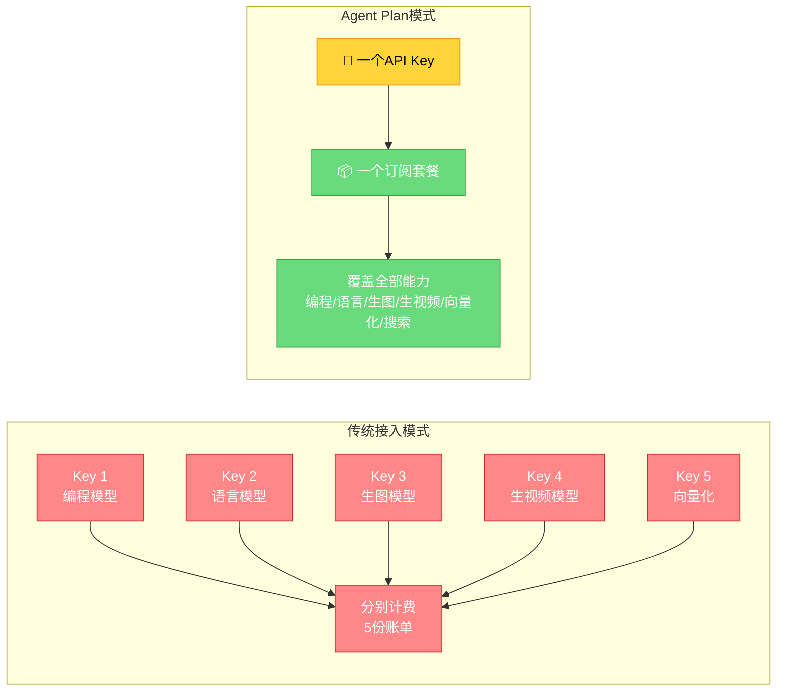
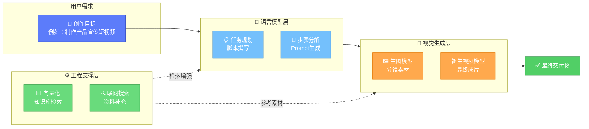

# 产品详解：什么是Agent Plan

## 一、产品定位

Agent Plan是火山引擎方舟面向Agent时代推出的**全新订阅产品**。它的核心理念是：

> **一个订阅套餐、一个API Key，覆盖主流编程模型、生图生视频模型、向量化模型、联网搜索，更多能力持续更新中。**

在Agent应用从单模态向跨模态演进的趋势下，开发者不再需要分别开通、管理、计费多个模型服务，通过Agent Plan即可一站式获取构建跨模态Agent所需的全部核心能力。

### 1.1 精确定义（能力资源视角）

> 💡 官方实践指南给出了更精确的定义：**Agent Plan 是面向Agent场景的「订阅式大模型服务套餐包」，一个套餐即覆盖主流 Agent Model 及 Agent Harness 所需用量资源。**

与订阅视角不同，资源视角的补充要点：

| 维度 | 补充说明 |
|------|---------|
| **Agent Model 用量资源** | 覆盖主流Agent开发所需的大模型调用用量（编程/语言/多模态生成/向量化） |
| **Agent Harness 用量资源** | 覆盖Harness工程底座所需用量（联网搜索、工具调用等），模型资源与工程资源一体化打包 |
| **字节SOTA级多模态模型** | 集成字节自研多模态旗舰——**Seedance**（生视频）、**Seedream**（生图） |
| **优秀国产主流模型** | 集成Doubao-Seed-Evolving等国产主流编程/语言模型 |
| **场景定位** | 从"代码编程"延伸至 **Agent全场景落地** |

> ⚠️ **归因说明**：原文仅以"字节SOTA级多模态模型（如Seedance、Seedream）"列举，"Seedance=生视频、Seedream=生图"为基于通用产品认知的推断，供定位参考，请以方舟控制台实际模型说明为准。

> 💡 若需在控制台按模型名定位多模态能力，可查阅[实践指南与项目案例](./08-practice-cases.md)章对 Seedance/Seedream 及 CookBook 案例的说明。

## 二、订阅模式特点

### 2.1 传统模式 vs Agent Plan模式

### 2.2 核心优势对比

| 对比维度 | 传统多服务接入 | Agent Plan订阅 |
|---------|--------------|---------------|
| **API Key数量** | 多个Key，需分别管理 | 1个Key，统一接入 |
| **开通流程** | 逐个服务申请开通 | 一次订阅，全部可用 |
| **计费方式** | 按服务分别计费，多份账单 | 订阅套餐制，简单清晰 |
| **能力更新** | 新服务需单独开通 | 能力持续更新，订阅即享 |
| **集成复杂度** | 多套SDK/API对接 | 统一接口规范 |
| **试用门槛** | 需分别申请试用资格 | 订阅即可开始使用 |

## 三、一个API Key覆盖的能力清单

Agent Plan通过单一API Key为开发者提供以下六大类核心能力：

### 3.1 能力全景表

| 能力类别 | 具体能力 | 典型应用场景 |
|---------|---------|-------------|
| **💻 编程模型** | 主流代码生成模型 | AI编程助手、代码审查、自动化脚本生成 |
| **💬 语言模型** | Doubao-Seed-Evolving等主力模型 | 推理、规划、对话、内容生成、任务分解 |
| **🖼️ 生图模型** | 图像生成模型 | 素材创作、设计稿生成、插画、配图 |
| **🎬 生视频模型** | 视频生成模型 | 短视频生成、动态素材、成片制作 |
| **📊 向量化模型** | Embedding模型 | 知识库检索、RAG、语义相似度计算 |
| **🔍 联网搜索** | Harness联网能力 | 实时信息获取、事实核查、资料检索 |

### 3.2 跨模态协同能力链路

**典型跨模态协同流程**（以短视频制作为例）：

1. **语言模型**接收用户需求 → 撰写脚本、生成分镜描述
2. **联网搜索/向量化**检索参考资料、风格案例
3. **生图模型**根据分镜描述生成关键帧素材
4. **生视频模型**基于素材生成最终视频片段
5. **语言模型**进行后期文案、字幕整理

## 四、持续更新承诺

Agent Plan采用"订阅即享更新"模式，官方承诺**更多能力持续更新中**，包括但不限于：

- 新发布的Doubao系列模型
- 升级后的多模态生成能力
- 增强的Harness工程能力
- 社区呼声高的第三方模型接入

订阅用户无需额外申请或付费，即可在能力上线后第一时间使用。

## 五、适合人群

Agent Plan特别适合以下类型的开发者和创作者：

| 用户类型 | 核心诉求 | Agent Plan价值 |
|---------|---------|---------------|
| **Agent开发者** | 快速构建多模态Agent | 一个Key搞定全部模型调用 |
| **全栈创作者** | 一人完成从内容到视觉到动效 | 语言+生图+生视频一站式 |
| **AI编程用户** | Claude Code/OpenCode/Codex等工具接入 | 覆盖主流编程模型 |
| **产品原型团队** | 快速验证跨模态产品想法 | 低门槛开通，开箱即用 |
| **研究者/评测者** | 对比不同模型表现 | 统一接口，方便横向测评 |

---

[🏠 返回总览](00-overview.md) | [➡️ 贡献方向详解](02-contribution-directions.md)
