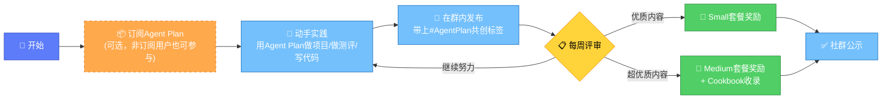

# 参与指南：如何加入共创计划

## 一、活动时间

> **倡议从即日起持续三个月**。

建议尽早参与，越早分享越容易被社区看到，也越有机会获得早期收录和奖励。每周都会进行优质内容收录，持续三个月内的分享都有机会被选中。

## 二、参与流程

### 2.1 详细步骤说明

| 步骤 | 动作 | 说明 | 是否必须 |
|------|------|------|---------|
| 1 | 订阅Agent Plan | 有订阅才能实际体验和使用相关能力进行创作 | 推荐但非必须（非订阅用户可分享测评/观察类内容） |
| 2 | 动手实践 | 用Agent Plan做项目、测模型、写代码、搭Agent | ✅ 必须有实际实践内容 |
| 3 | 发布分享 | 在官方社群内发布你的实践内容 | ✅ 必须在群内发布 |
| 4 | 带上标签 | 发布时带上 **#AgentPlan共创** 标签 | ✅ 必须带标签才算有效参与 |
| 5 | 等待评审 | 每周进行优质内容评审与收录 | - |
| 6 | 获得奖励 | 优质/超优质内容获得套餐奖励与Cookbook收录 | - |

## 三、内容要求

### 3.1 核心原则：低门槛、高包容

> **无需排版精美，无需结构完整。一段代码、一张截图、一段心得、一个问题都是有效贡献。**

这不是论文比赛，也不是设计大赛，核心是**真实的开发者实践分享**。

### 3.2 可接受的内容形式

| 形式 | 说明 | 示例 |
|------|------|------|
| **一段代码** | 几行核心代码、一个脚本片段、一个API调用示例 | "这是我用Agent Plan调用生图模型的代码，效果不错" |
| **一张截图** | 运行效果截图、产品Demo截图、对比测评截图 | "这是同一个Prompt在两个模型上的效果对比" |
| **一段心得** | 使用感受、踩坑记录、小技巧分享 | "我发现用XX参数调用生视频模型效果更好" |
| **一个问题** | 遇到的问题、没搞明白的地方、求助 | "有人遇到过这个API报错吗？怎么解决？" |
| **完整文章** | 结构完整的长文、教程、测评报告 | 《从零构建跨模态Agent完全指南》 |
| **视频演示** | Demo视频、操作录屏、成果展示 | 一段30秒的产品效果演示视频 |
| **代码仓库** | GitHub/GitCode仓库链接 | "开源了我做的XX工具，欢迎Star" |

### 3.3 内容不做要求的方面

- ❌ 不要求排版精美（Markdown格式都不需要，纯文本也行）
- ❌ 不要求结构完整（想到哪写到哪）
- ❌ 不要求字数多少（10个字也可以，10000字也欢迎）
- ❌ 不要求必须成功（失败的经验同样有价值）
- ❌ 不要求必须是原创技术（使用心得、产品展示也可以）
- ❌ 不要求专业术语准确（说人话最重要）

## 四、标签使用规范

### 4.1 必须使用的标签

所有参与共创的内容必须带上标签：**#AgentPlan共创**

> ⚠️ **重要**：不带标签的内容将无法被识别为有效参与，不会进入评审池。

### 4.2 标签使用位置

- 发布内容开头或结尾带上标签即可
- 建议放在内容最后，避免影响阅读
- 格式：`#AgentPlan共创`（注意是中文"共创"，不是英文）

### 4.3 可选附加标签

为了让你的内容更容易被分类和找到，可以额外带上相关方向标签：

| 方向 | 建议标签 |
|------|---------|
| 评测与方法类 | #模型测评 #踩坑笔记 |
| Agent落地类 | #Agent实战 #跨模态 |
| 应用与产品类 | #产品展示 #效率工具 |
| 编程协同类 | #AI编程 #ClaudeCode |
| 探索性实验类 | #实验 #脑洞大开 |

## 五、发布渠道说明

### 5.1 官方社群发布

参与共创的内容需要在**火山引擎方舟官方社群**内发布。如果你还没入群，可以通过以下方式：

1. 订阅Agent Plan后通过控制台提示入群
2. 关注方舟官方公众号获取入群方式
3. 已在群内的好友邀请入群

### 5.2 外部平台同步（可选）

欢迎同时将内容发布到外部平台，扩大影响力：

- 个人博客、公众号
- GitHub/GitCode
- 掘金、知乎、CSDN等技术社区
- B站、抖音等视频平台
- X/Twitter、微博等社交媒体

> 💡 **建议**：如果在外部平台发布，可以 @火山引擎方舟 官方账号，并在群内同步外部链接，双重曝光。

## 六、快速开始清单

准备参与的话，可以按这个清单快速开始：

- [ ] 确认已加入方舟官方社群（没加的话先找入群方式）
- [ ] （推荐）订阅Agent Plan以便实际体验：[立即订阅](https://www.volcengine.com/activity/agentplan)
- [ ] 想好要分享什么：测评？项目？踩坑？还是一个小实验？
- [ ] 动手做：写代码、跑模型、做Demo
- [ ] 把过程/结果/心得记录下来（哪怕只言片语）
- [ ] 在群内发布，**带上 #AgentPlan共创 标签**
- [ ] 等待每周评审结果，关注群内公示

## 七、不同类型参与者的起步建议

### 7.1 如果你是第一次参与

**建议从最简单的开始**：

1. 先用Agent Plan跑一个官方Quickstart
2. 遇到什么问题？有什么感受？写下来
3. 截一张运行成功（或失败）的截图
4. 发到群里，带上标签——这就是有效贡献！

### 7.2 如果你是开发者

**建议从以下方向切入**：

- 写一个小工具/脚本，解决你自己工作中的一个小痛点
- 对比一下不同模型在你熟悉的任务上的表现
- 把你配置Claude Code/OpenCode的过程记录下来

### 7.3 如果你是产品经理/设计师

**建议从以下方向切入**：

- 用Agent Plan做一个产品原型Demo
- 试试一人全栈：从文案到设计到简单页面
- 做一个自动化效率工具（周报、设计稿等）

### 7.4 如果你是创作者/内容生产者

**建议从以下方向切入**：

- 尝试跨模态内容生产：文字→图片→视频
- 做一个AI辅助创作的小工具
- 分享你用AI做内容的工作流

---

[🏠 返回总览](00-overview.md) | [⬅️ 上一章：贡献方向详解](02-contribution-directions.md) | [➡️ 下一章：回报与激励](04-rewards-recognition.md)
