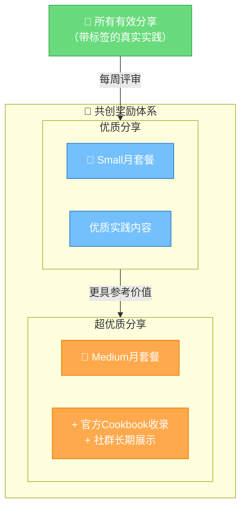

# 回报与激励：套餐奖励与Cookbook收录

## 一、奖励体系概览

Agent Plan共创计划设置了两层奖励机制，覆盖不同质量的贡献：

| 奖励层级 | 奖励内容 | 适用对象 |
|---------|---------|---------|
| **优质分享** | Agent Plan Small 单月套餐 | 按周收录的优质实践内容 |
| **超优质分享** | Agent Plan Medium 单月套餐 + 官方Cookbook收录 | 具有高度参考价值、可复用性强的标杆内容 |

## 二、套餐奖励详解

### 2.1 Small月套餐

**获得条件**：内容被评定为优质分享

**内容特质参考**：
- 真实的实践记录，有具体细节
- 对其他开发者有一定参考价值
- 包含代码、截图或具体的步骤说明
- 踩坑笔记、简单测评、小工具展示等

**示例**：
- 一篇详细的API接入踩坑记录
- 一个可运行的小脚本及使用说明
- 同一任务在2-3个模型上的对比测评
- 一个简单Demo的展示和思路说明

### 2.2 Medium月套餐

**获得条件**：内容被评定为超优质分享

**内容特质参考**：
- 内容完整、结构清晰、可直接复用
- 具有较强的启发性或标杆意义
- 跨模态协同、完整Agent案例、系统化方法论等
- 可收录进官方Cookbook作为开发者参考

**示例**：
- 从零到一构建跨模态Agent的完整教程（附代码）
- 系统化的模型选型方法论与决策树
- 一人全栈产品完整开发过程与开源代码
- 多个AI编程工具的工程化配置最佳实践
- 有深度的失败案例分析与经验总结

### 2.3 套餐价值说明

| 套餐档位 | 适用场景 | 价值定位 |
|---------|---------|---------|
| **Small** | 个人开发者日常使用、学习探索、小项目开发 | 满足大多数个人开发者的月度使用需求 |
| **Medium** | 重度使用者、产品开发、团队小范围使用 | 更高的用量配额，适合持续开发和生产使用 |

> 💡 **提示**：具体套餐配额与价格以官方页面为准：[套餐概览](https://www.volcengine.com/docs/82379/2366394?lang=zh)

## 三、官方Cookbook收录

### 3.1 什么是Cookbook

> **方舟开发者Cookbook**是火山引擎方舟官方维护的优质开发者实践食谱，收录社区中最具参考价值的实践内容。

Cookbook的价值：
- ✅ **官方背书**：内容经过官方筛选和整理
- ✅ **长期展示**：在官方文档和社群中长期展示
- ✅ **广泛传播**：被更多开发者看到和参考
- ✅ **个人品牌**：作为优质贡献者被社区认识

### 3.2 Cookbook收录标准

获得Cookbook收录的内容通常具备以下特质：

| 维度 | 要求 |
|------|------|
| **实用性** | 内容能解决真实问题，读者看完能直接上手或复用 |
| **完整性** | 有完整的背景、步骤、代码/截图、结果、总结 |
| **原创性** | 是作者真实的实践，不是简单的官方文档搬运 |
| **可复现** | 其他开发者按照内容步骤可以复现类似结果 |
| **普适性** | 不是过于小众的场景，对较多开发者有参考价值 |

### 3.3 Cookbook更新机制

- **更新频率**：**每周更新**
- **展示位置**：方舟官方文档、社群公告、开发者社区
- **内容形式**：经过编辑整理的规范化文章，保留原作者署名
- **反馈通道**：收录后会联系作者确认内容、补充信息

## 四、按周收录流程

### 4.1 评审时间线

```mermaid
gantt
    title 每周收录流程
    dateFormat  X
    axisFormat %s
    section 当周
    社群内容发布     :a1, 0, 6d
    section 周末
    内容收集与初筛   :a2, after a1, 1d
    section 周初
    官方评审会议     :a3, after a2, 1d
    中奖名单公示     :a4, after a3, 1d
    奖励发放         :a5, after a4, 1d
    Cookbook编辑     :a6, after a4, 3d
```

**说明**：以上为流程示意，实际时间以官方社群通知为准。

### 4.2 详细流程

| 阶段 | 时间 | 动作 | 说明 |
|------|------|------|------|
| **内容收集** | 全周 | 社群内带标签发布 | 随时发布，随时进入候选池 |
| **初筛** | 每周末 | 运营收集整理 | 筛选掉不带标签、非实践类、广告类内容 |
| **评审** | 每周初 | 官方团队评审 | 从内容质量、参考价值、创新性等维度评定 |
| **公示** | 评审后 | 社群内公示名单 | 公布本周获奖名单与Cookbook入选名单 |
| **发奖** | 公示后 | 套餐奖励发放 | 联系获奖者发放套餐兑换码或直接充值 |
| **Cookbook编辑** | 公示后 | 内容编辑整理 | 与作者沟通确认后整理成Cookbook文章 |

### 4.3 评审维度参考

评审不是论文盲审，没有复杂的打分表，主要看以下几个朴素的维度：

1. **真实**：是不是真的实践了？还是空谈？
2. **有用**：其他开发者看了能不能学到东西或少走弯路？
3. **有料**：有没有具体的细节（代码、截图、参数、步骤）？
4. **有心**：有没有花心思整理，让其他人容易看懂？

> 🎯 **核心评审逻辑**：如果你是另一个开发者，看到这篇分享会不会觉得"有用，收藏了"？

## 五、提高获奖概率的建议

### 5.1 基础建议（保证内容进入候选池）

- [ ] **必须带标签**：`#AgentPlan共创` 一个字都不能错
- [ ] **在群内发布**：只发外部平台不算，必须在官方社群发布
- [ ] **是真实实践**：不是转载、不是空谈、不是广告
- [ ] **有具体内容**：不要只说"Agent Plan真好用"，要说怎么用的、做了什么

### 5.2 进阶建议（提高获得Small套餐概率）

- [ ] **有代码截图**：贴几行核心代码，比纯文字更有说服力
- [ ] **有效果展示**：运行结果截图、Demo链接、视频演示
- [ ] **有步骤说明**：简单说下你是怎么做的，分了几步
- [ ] **有踩坑记录**：遇到了什么问题，怎么解决的——这类内容特别受欢迎
- [ ] **及时发布**：不要攒到最后，做完一点发一点，持续曝光

### 5.3 高级建议（冲击Medium套餐+Cookbook）

- [ ] **内容完整**：有背景、有步骤、有代码、有结果、有总结
- [ ] **结构清晰**：分段、加标题、用列表，让其他人容易阅读
- [ ] **可复用**：代码可以开源，方法可以复制，其他人能直接用
- [ ] **有深度**：不只是"怎么做"，还有"为什么这么做"、"踩了哪些坑"
- [ ] **跨方向**：既有测评、又有代码、还有成品——维度越丰富越有价值
- [ ] **跨模态**：如果能展示语言+生图+生视频的完整链路，格外受欢迎

## 六、注意事项

1. **重复获奖**：同一个作者可以多次获奖，但同一内容不会重复获奖
2. **内容版权**：原创内容版权归作者所有，Cookbook收录会获得作者授权
3. **公平公正**：评审标准对所有参与者一致，与是否为付费用户无关
4. **奖励发放**：通过社群私信或官方联系方式发放，注意查收消息
5. **税费说明**：套餐奖励为虚拟产品奖励，不涉及现金税费问题

---

[🏠 返回总览](00-overview.md) | [⬅️ 上一章：参与指南](03-participation-guide.md) | [➡️ 下一章：快速开始与资源](05-quickstart-resources.md)
