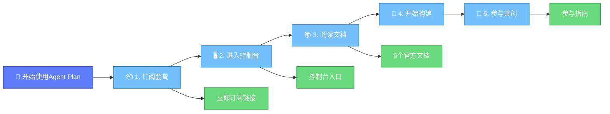
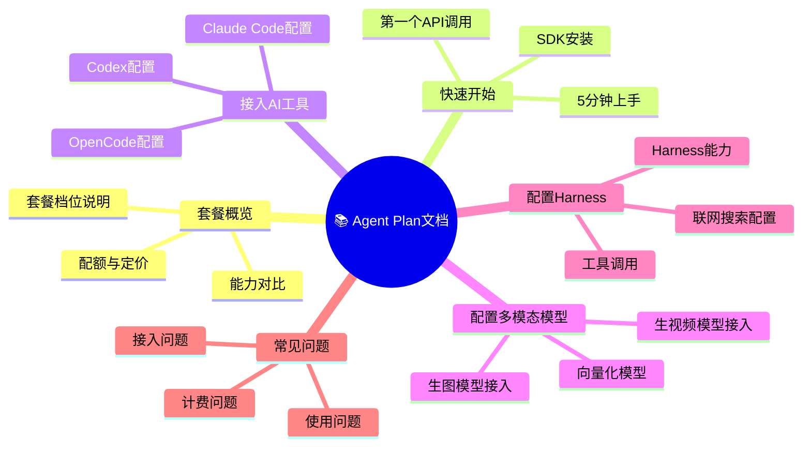

# 快速开始与资源：官方链接汇总

本章汇总了Agent Plan相关的所有官方入口链接，方便快速访问。

## 一、快速开始导航



## 二、核心入口链接

### 2.1 订阅与控制台

| 资源 | 链接 | 说明 |
|------|------|------|
| **🔗 立即订阅** | https://www.volcengine.com/activity/agentplan | Agent Plan活动订阅页面，选择套餐并开通 |
| **🖥️ 使用控制台** | https://console.volcengine.com/ark/region:cn-beijing/subscription/agent-plan | 方舟控制台Agent Plan管理页面，查看用量、获取API Key |

### 2.2 订阅后第一步建议

1. 访问[立即订阅](https://www.volcengine.com/activity/agentplan)页面选择合适套餐
2. 完成支付开通后，进入[控制台](https://console.volcengine.com/ark/region:cn-beijing/subscription/agent-plan)
3. 在控制台获取你的API Key（一个Key覆盖所有能力）
4. 阅读下方的官方文档开始接入
5. 动手做第一个项目，然后在群内分享参与共创！

## 三、官方文档资源（6个核心文档）

### 3.1 文档导航图



### 3.2 6个核心文档链接

| 序号 | 文档名称 | 链接 | 内容概要 | 阅读优先级 |
|------|---------|------|---------|-----------|
| 1 | **📋 套餐概览** | https://www.volcengine.com/docs/82379/2366394?lang=zh | Agent Plan套餐档位说明、各档位配额、包含能力对比、定价信息 | ⭐⭐⭐ 订阅前必读 |
| 2 | **🚀 快速开始** | https://www.volcengine.com/docs/82379/2373738?lang=zh | 5分钟快速上手指南、第一个API调用示例、SDK安装与配置 | ⭐⭐⭐ 新用户首选 |
| 3 | **🔌 接入AI工具** | https://www.volcengine.com/docs/82379/2373740?lang=zh | 如何在Claude Code/OpenCode/Codex等AI编程工具中配置Agent Plan | ⭐⭐⭐ 编程用户必读 |
| 4 | **🎨 配置多模态模型** | https://www.volcengine.com/docs/82379/2375486?lang=zh | 生图模型、生视频模型、向量化模型的接入配置方法 | ⭐⭐ 跨模态开发必读 |
| 5 | **🛠️ 配置Harness** | https://www.volcengine.com/docs/82379/2301412?lang=zh | Harness能力配置、联网搜索开启、工具调用设置 | ⭐⭐ Agent进阶必读 |
| 6 | **❓ 常见问题** | https://www.volcengine.com/docs/82379/2377895?lang=zh | 计费、接入、使用过程中的常见问题与解答 | ⭐ 遇到问题先查 |

## 四、按用户角色的阅读路径建议

### 4.1 如果你是第一次使用


**推荐阅读顺序**：
1. [套餐概览](https://www.volcengine.com/docs/82379/2366394?lang=zh) → 了解有什么套餐
2. [快速开始](https://www.volcengine.com/docs/82379/2373738?lang=zh) → 跑通Hello World
3. 根据你的使用场景选择后续文档

### 4.2 如果你是AI编程用户（Claude Code/OpenCode/Codex）

**推荐阅读顺序**：
1. [快速开始](https://www.volcengine.com/docs/82379/2373738?lang=zh) → 了解基本接入
2. [接入AI工具](https://www.volcengine.com/docs/82379/2373740?lang=zh) → 配置你的编程工具
3. 开始编码，遇到问题查[常见问题](https://www.volcengine.com/docs/82379/2377895?lang=zh)

### 4.3 如果你要做跨模态Agent（生图/生视频）

**推荐阅读顺序**：
1. [快速开始](https://www.volcengine.com/docs/82379/2373738?lang=zh) → 基础接入
2. [配置多模态模型](https://www.volcengine.com/docs/82379/2375486?lang=zh) → 多模态能力配置
3. [配置Harness](https://www.volcengine.com/docs/82379/2301412?lang=zh) → 开启联网搜索等能力
4. 阅读本wiki的[跨模态范式洞察](06-crossmodal-paradigm.md)章节了解典型链路

### 4.4 如果你要参与共创计划

**推荐阅读顺序**：
1. 本文档前四章（概述→产品→方向→指南）
2. [回报与激励](04-rewards-recognition.md) → 了解奖励机制
3. 订阅开通后开始动手实践
4. 做完后在群内带标签发布

## 五、链接快速复制区

为方便复制，以下是纯链接列表：

```
立即订阅：https://www.volcengine.com/activity/agentplan
使用控制台：https://console.volcengine.com/ark/region:cn-beijing/subscription/agent-plan
套餐概览：https://www.volcengine.com/docs/82379/2366394?lang=zh
快速开始：https://www.volcengine.com/docs/82379/2373738?lang=zh
接入AI工具：https://www.volcengine.com/docs/82379/2373740?lang=zh
配置多模态模型：https://www.volcengine.com/docs/82379/2375486?lang=zh
配置Harness：https://www.volcengine.com/docs/82379/2301412?lang=zh
常见问题：https://www.volcengine.com/docs/82379/2377895?lang=zh
```

## 六、其他资源

| 资源类型 | 说明 |
|---------|------|
| **官方社群** | 订阅后通过控制台提示入群，或关注官方公众号获取入群方式 |
| **方舟开发者Cookbook** | 优质开发者实践合集，每周更新 |
| **本Wiki文档** | 本文档作为共创计划参与指南，建议收藏阅读 |

---

[🏠 返回总览](00-overview.md) | [⬅️ 上一章：回报与激励](04-rewards-recognition.md) | [➡️ 下一章：跨模态范式洞察](06-crossmodal-paradigm.md)
