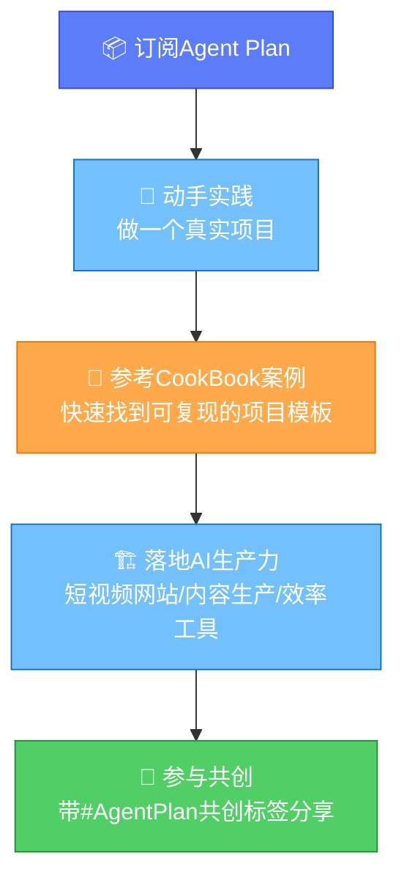

# 实践指南与项目案例：玩转Agent Plan与CookBook案例库

> **Agent Plan 是面向Agent场景的「订阅式大模型服务套餐包」**——一个套餐覆盖主流 Agent Model 及 Agent Harness 所需用量资源。集成字节SOTA级多模态模型（如Seedance、Seedream）及优秀国产主流模型，使用场景从"代码编程"延伸至Agent全场景落地。

> **📌 内容说明**：本章基于官方"Agent Plan实践指南与项目案例"页面整理，核心补充两点——①Agent Plan更精确的产品定义（Agent Model + Agent Harness 用量资源、Seedance/Seedream 等字节SOTA多模态模型、从代码编程延伸至Agent全场景落地）；②方舟Agent Plan CookBook最佳实践案例库导航。

## 一、Agent Plan精确定义

与[产品详解](./01-product-overview.md)章从"订阅模式"角度切入不同，本章从**能力资源构成**角度给出更精确的定义：

### 1.1 一句话定义

> **Agent Plan 是面向Agent场景的「订阅式大模型服务套餐包」，一个套餐即覆盖主流 Agent Model 及 Agent Harness 所需用量资源。**

三个关键点：

| 关键点 | 说明 |
|--------|------|
| **订阅式套餐包** | 不是按单个模型/接口分别计费，而是打包成一个订阅套餐 |
| **Agent Model 资源** | 覆盖主流Agent开发所需的大模型调用用量（编程/语言/多模态生成/向量化） |
| **Agent Harness 资源** | 覆盖Harness工程底座所需用量（联网搜索、工具调用等），模型资源与工程资源一体化打包 |

### 1.2 模型阵容升级

Agent Plan集成了两类模型，这是对01章"能力清单"的重要补充：

| 模型阵容 | 说明 | 示例 |
|---------|------|------|
| **字节SOTA级多模态模型** | 字节自研的多模态生成能力 | **Seedance**、**Seedream** |
| **优秀国产主流模型** | 国产头部大模型生态 | Doubao-Seed-Evolving 等主流编程/语言模型 |

> 💡 相比01章用泛称"生图模型/生视频模型"，这里明确了字节多模态旗舰模型的具体名称 **Seedance**（生视频）与 **Seedream**（生图），便于在方舟控制台按模型名定位接入。
> 
> ⚠️ **归因说明**：原文仅以"字节SOTA级多模态模型（如Seedance、Seedream）"列举，并未逐一说明各模型功能。"Seedance=生视频、Seedream=生图"为基于通用产品认知的推断，供定位参考，请以方舟控制台实际模型说明为准。

### 1.3 场景定位升级

Agent Plan的场景定位从"代码编程"延伸至 **Agent全场景落地**：

## 二、实践指南：如何玩转Agent Plan

官方"实践指南与项目案例"页面定位：提供 Agent Plan 的实践指南与项目案例，演示如何玩转方舟 Agent Plan，帮助快速上手，助力高效落地 AI 生产力。

### 2.1 玩转思路总览

### 2.2 三步上手路径

1. **订阅套餐**：访问[立即订阅](https://www.volcengine.com/activity/agentplan)选择套餐并开通，获取一个覆盖 Agent Model + Agent Harness 用量的 API Key
2. **参考案例**：从下方CookBook案例库找到与你目标最接近的项目案例，作为可复现起点
3. **落地生产力**：基于案例模板动手实现，将Agent Plan能力转化为实际AI生产力

## 三、最佳实践案例库（CookBook）

官方维护的 **Agent Plan CookBook 案例列表（持续更新中）**，收录了社区优质开发者实践，是快速上手与复现的最佳起点。

### 3.1 案例字段说明

每个案例包含以下字段：

| 字段 | 说明 |
|------|------|
| **实践主题** | 案例名称（如"🎬 开发短视频网站"） |
| **截图示例** | 案例效果截图 |
| **文档链接** | 对应的Agent Plan CookBook案例文档 |
| **项目介绍** | 案例做了什么、用了什么能力、产出什么 |
| **成本量级（AFP）** | 实践消耗的AFP额度及占套餐比例，用于估算同类项目成本 |
| **分类标签** | 案例所属方向（网站开发/短视频/多模态等） |

### 3.2 已收录案例

> ⚠️ 因案例库持续更新且部分单元格为图片，下表收录当前可提取的案例；完整最新列表请访问[官方实践指南页](https://bytedance.larkoffice.com/wiki/LuwYwRaeMi13vWkiTrWcTSFmnCg)。

| 实践主题 | 项目介绍 | 成本量级 | 分类标签 |
|---------|---------|---------|---------|
| **🎬 开发短视频网站** | 使用 Agent Plan，快速打造一个"抖音同款"的轻量化「短视频网站」，从需求定义、全模态素材生产到完整项目开发，全程无需手动编写代码 | 15000 AFP（约3% Max套餐月额度），含7张图、3个视频 | 网站开发, 短视频, 多模态 |

### 3.3 案例启示（知识拓展）

> 💡 以下为基于首个案例的衍生分析，非原文内容。

以「开发短视频网站」案例为例，可提炼出Agent Plan实操的高价值模式：

1. **全模态素材生产**：一个项目内同时用语言模型（需求/文案）+ 生图模型（Seedream，配图/封面）+ 生视频模型（Seedance，短视频素材），体现"一个Key覆盖多模态"的核心理念
2. **全程无需手动编写代码**：借助AI编程能力（编程模型 + Harness工具调用），从需求定义到项目开发全程AI驱动，是一人全栈的典型实践
3. **成本可量化**：案例给出AFP消耗（15000 AFP ≈ 3% Max套餐月额度），帮助开发者估算"做一个短视频网站"这类项目的资源成本量级
4. **标签即方向**：案例分类标签（网站开发/短视频/多模态）与[五大征集方向](./02-contribution-directions.md)呼应，是共创选题的灵感来源

## 四、与共创计划的衔接

实践指南页与共创计划形成完整闭环：

| 环节 | 对应文档 | 说明 |
|------|---------|------|
| **订阅** | [快速开始与资源](./05-quickstart-resources.md) | 获取订阅与控制台入口 |
| **参考案例** | 本章CookBook案例库 | 找到可复现的项目起点 |
| **动手实践** | [贡献方向详解](./02-contribution-directions.md) | 明确五大征集方向与内容建议 |
| **分享获奖** | [回报与激励](./04-rewards-recognition.md) | 优质分享获Small/Medium套餐奖励 |

---

[🏠 返回总览](00-overview.md) | [⬅️ 上一章：常见问题FAQ](07-faq.md)
