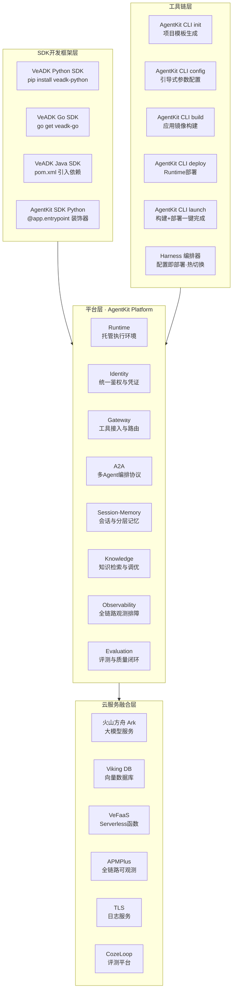

# 00 教程总览与知识地图

## AgentKit 产品生态全景图

## 11 章导航表

| 章号 | 标题 | 核心内容 | 适合人群 | 预计阅读时间 |
|------|------|---------|---------|-------------|
| 00 | 教程总览与知识地图 | 生态全景图、11章导航、三条阅读路径、交叉引用矩阵 | 所有读者 | 3 分钟 |
| 01 | 产品介绍与核心概念 | 产品定位、工程化四大痛点、八大模块、四大优势 | 初学者/产品经理 | 5 分钟 |
| 02 | 产品架构与核心能力 | Agent Ready 架构、Harness 编排、Serverless 底座、安全闭环 | 架构师/平台工程师 | 8 分钟 |
| 03 | VeADK 智能体开发框架 | 三语言安装、产品融合矩阵、DeepResearch 特性 | 开发者 | 7 分钟 |
| 04 | AgentKit SDK & CLI 工具链 | 装饰器 API、CLI 命令、三种部署模式对比 | 开发者 | 6 分钟 |
| 05 | 快速入门指南 | 前置条件、五步骤上手、命令示例、错误排查 | 初学者/开发者 | 10 分钟 |
| 06 | 应用场景与落地方案 | 四大场景架构、行业落地、选型决策树 | 产品经理/决策者 | 8 分钟 |
| 07 | 核心功能深度解析 | Identity/Gateway/A2A/Session-Memory/Knowledge 集成 | 平台工程师/开发者 | 10 分钟 |
| 08 | 竞品对比与生态定位 | 五平台十维度对比、八维度选型框架、生态定位图 | 架构师/决策者 | 7 分钟 |
| 09 | FAQ 与最佳实践 | 十五常见问题、八条最佳实践、十二项生产检查 | 所有读者 | 6 分钟 |
| 10 | 术语表与参考资源 | 二十术语表、官方链接、知识库扩展交叉引用 | 所有读者 | 4 分钟 |

## 三条阅读路径

### 路径一：快速上手路径（初学者）
> **章节顺序**：01 产品介绍 → 03 VeADK 框架 → 05 快速入门 → 09 FAQ 与最佳实践
>
> **适用人群**：首次接触 AgentKit 的 AI 应用开发者、产品经理，目标是 15 分钟内建立核心认知并完成第一个 Demo。
>
> **合计预计阅读时间**：5 + 7 + 10 + 6 = **28 分钟**

### 路径二：深度开发路径（开发者 / 平台工程师）
> **章节顺序**：01 产品介绍 → 02 产品架构 → 03 VeADK 框架 → 04 SDK & CLI → 05 快速入门 → 07 核心功能深度解析 → 09 FAQ 与最佳实践 → 10 术语表与参考资源
>
> **适用人群**：需要落地企业级智能体系统的开发者、平台工程师，目标是掌握从开发、部署到核心模块集成的全链路能力。
>
> **合计预计阅读时间**：5 + 8 + 7 + 6 + 10 + 10 + 6 + 4 = **56 分钟**

### 路径三：架构决策路径（架构师 / 技术决策者）
> **章节顺序**：01 产品介绍 → 02 产品架构 → 06 应用场景与落地方案 → 08 竞品对比与生态定位 → 09 FAQ 与最佳实践 → 10 术语表与参考资源
>
> **适用人群**：评估 AgentKit 作为企业 AI Agent 基础设施平台的架构师、技术负责人，目标是完成架构选型与技术路线决策。
>
> **合计预计阅读时间**：5 + 8 + 8 + 7 + 6 + 4 = **38 分钟**

## 与现有知识库的交叉引用矩阵

| 关联 wiki | 对应路径 | 关联章节 | 互补关系说明 |
|-----------|---------|---------|-------------|
| agent-communication-protocols（MCP/A2A 协议） | `../agent-communication-protocols/` | 07 Gateway/A2A | 本教程覆盖 AgentKit 中 MCP Server 接入与 A2A 多 Agent 编排的平台落地方式，通信协议 wiki 提供 MCP/A2A 的协议规范细节与消息格式标准，两者互补形成「协议规范 + 平台实现」的完整认知 |
| harness-seven-components-wiki（智能体7组件） | `../harness-seven-components-wiki/` | 02 架构设计 | 本教程覆盖 AgentKit Platform 8 大组件的架构设计，智能体7组件 wiki 提供通用 Harness 编排的组件抽象与设计原则，可对照理解 AgentKit Runtime 中 Harness 子能力的设计逻辑 |
| adversarial-review-wiki（对抗审查评测方法） | `../adversarial-review-wiki/` | 07 Evaluation 模块 | 本教程覆盖 AgentKit Evaluation 模块的平台评测能力与发布闸门机制，对抗审查 wiki 提供 17+1 条攻防维度的评测方法论，可直接融入 Evaluation 评测集设计提升评测深度 |
| agent-interface-deep-dive（接口深层） | `../agent-interface-deep-dive/` | 07 Identity/Gateway 鉴权设计 | 本教程覆盖 Identity 统一鉴权与 Gateway 接入路由的能力说明，接口深层 wiki 提供 Agent 接口设计的鉴权模式、错误码规范、流式协议细节，可用于指导 Gateway 层接口的深度集成 |
| agent-skills-wiki（Skill开发） | `../agent-skills-wiki/` | 04 Tool/Service 集成 | 本教程覆盖 Gateway 层 REST/OpenAPI 转换与 MCP Server 接入的工具接入流程，Skill 开发 wiki 提供标准化 Skill 的定义、开发、发布、复用全流程方法论，可用于规范 Agent 中 Tool/Skill 的开发质量 |
| longcat-agent-learning-wiki（可观测最佳实践） | `../longcat-agent-learning-wiki/` | 07 Observability | 本教程覆盖 Observability 模块对 Runtime/Gateway/Tool/Memory/Knowledge 各环节的链路观测能力，可观测 wiki 提供埋点设计、Trace 采样、告警阈值等生产级最佳实践，可直接映射到 AgentKit 观测方案配置 |

---

| 上一章 | 返回目录 | 下一章 |
|--------|---------|--------|
| ← 这是教程第 1 章 | [README](./README.md) | → [01 产品介绍与核心概念](./01-product-intro.md) |
