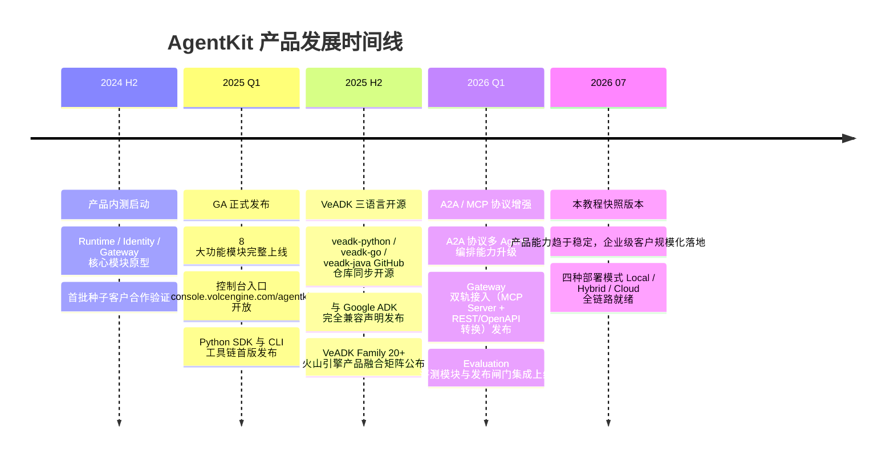

# 01 产品介绍与核心概念

## 什么是 AgentKit

AgentKit 是火山引擎推出的企业级 AI Agent 基础设施平台，面向企业与开发者提供智能体构建与运行的一站式托管能力。品牌定位明确为「Agent Ready 基础设施」，支撑企业专属 AI 工作空间的持续演进，覆盖从制作、配置、部署到调用测试、观测与评测的全生命周期关键环节。

不同于仅提供编排能力的轻量 Demo 平台，AgentKit 将智能体工程化所需的治理能力与业务能力标准化沉淀为平台组件，使企业无需从零搭建身份鉴权、工具路由、链路观测、质量评测等基础支撑体系，即可将智能体从 Demo 阶段推进至生产级部署。控制台入口位于 console.volcengine.com/agentkit，产品主页提供「立即体验」「产品文档」「应用广场」「云沙箱」四个入口。

品牌口号包含「快速投产、安全可信、存量焕新、质量可见」四项核心价值，对应企业在智能体落地过程中从开发效率到合规治理、从存量集成到持续迭代的全链路诉求。底层复用火山引擎 Serverless 与多租户隔离底座，上层通过 VeADK 三语言开源 SDK 兼容 Google ADK 与 LiteLLM 生态，形成「开源 SDK + 云托管平台 + 治理三板斧」的差异化组合。

## 企业智能体工程化的 4 大痛点

### 1. 权限边界不清

企业在引入智能体时，普遍面临用户身份、Agent 身份、工具访问权限三层身份缺乏统一治理的问题。没有标准化的鉴权体系时，Agent 调用业务工具的权限边界模糊，既可能出现越权调用导致的生产事故，也可能因权限配置过度保守而无法发挥智能体价值。跨部门共享的 Agent 平台尤其需要细粒度的角色与属性鉴权，这在自建方案中往往是投入最高的环节之一。

### 2. 工具接入分散

各业务系统暴露的 API 缺乏标准化接入层，业务团队需为每个智能体单独对接 REST/OpenAPI 接口，改造成本高且重复建设。当接口数量从几个膨胀到几十个甚至上百个时，缺乏统一的工具接入网关会导致路由规则混乱、错误码不统一、调用治理能力缺失。此外新兴的 MCP 协议与存量 REST 接口如何协同，也是存量系统智能化改造中的核心卡点。

### 3. 缺少可观测与审计链路

智能体运行异常时，问题定位极为困难。一次失败的回答可能源于大模型幻觉、运行时故障、工具调用失败、知识库检索错误或记忆污染中的任意一环，但自建方案往往只能看到最终输出，缺少区分各环节异常来源的全链路追踪能力。缺少审计日志还会带来合规风险，无法回溯 Agent 在何时调用了何种工具、访问了哪些数据。

### 4. 上线后质量评估成本高

智能体上线前缺乏标准化评测体系，仅靠人工抽样验证难以覆盖长尾场景；上线后又缺乏持续的质量监控与满意度分析机制，无法量化用户体验变化。没有发布闸门时，新版本 Agent 的质量回归风险极高，可能因一次模型切换或工具升级导致核心场景准确率大幅下降，而发现时已造成用户体验损失。

## 8 大功能模块详解

遵循洞察 2 揭示的「治理外环包裹业务内环」架构原则，9 大功能模块（Session 与 Memory 独立）按如下分组呈现：

| 模块 | 分组 | 定位 | 核心能力 | 解决的问题 |
|------|------|------|---------|-----------|
| Runtime | 业务内环 | 智能体托管执行环境 | Serverless 运行管理、Harness 动态编排、多租户隔离引擎 | 智能体代码部署后无处运行、扩缩容困难、资源利用率低 |
| A2A | 业务内环 | 多 Agent 编排协议层 | 跨 Agent 任务分发、结果回传、状态同步 | 单 Agent 能力不足，需多智能体分工协作的复杂场景 |
| Session | 业务内环 | 短期会话上下文持久化 | 多轮会话存储、上下文恢复、TTL 生命周期管理 | 对话中断后上下文丢失、多轮对话无法持续进行 |
| Memory | 业务内环 | 长期记忆沉淀与召回 | 跨会话信息沉淀、记忆版本化、质量评估机制 | 每次对话从零开始、用户偏好与业务知识无法复用 |
| Knowledge | 业务内环 | 知识检索与调优组件 | 向量检索增强、知识库接入、调优反馈闭环 | 通用模型缺乏企业专属知识、回答不准确且不及时 |
| Identity | 治理外环 | 统一身份鉴权与凭证托管 | 用户池/IdP 集成、Agent 身份标签、属性鉴权、密钥托管 | 三层身份边界不清、密钥明文存储、越权调用风险 |
| Gateway | 治理外环 | 工具接入统一入口 | MCP Server 接入、REST/OpenAPI 快速转换、路由与调用治理 | 工具接入分散、重复开发接口、缺乏调用审计与流控 |
| Observability | 治理外环 | 全链路观测与排障 | Tracing 链路追踪、Logging 日志、Metrics 指标 | 异常来源无法区分、问题定位慢、缺少审计回溯 |
| Evaluation | 治理外环 | 评测与质量闭环 | 离线评测集、发布闸门、上线后满意度分析 | 上线前无质量标准、上线后缺持续优化、回归风险高 |

## 4 大产品优势

### 1. 敏捷开发

开箱即用组件与编码脚手架功能一站式缩短智能体构建与迭代周期 [F050]。CLI init 命令一键生成 Basic App、Stream App 等多种项目模板 [F032]，开发者无需从零搭建工程结构。装饰器式 SDK API 通过 `@app.entrypoint` 即可定义入口函数 [F031]，学习成本低且代码简洁。

### 2. 生产就绪

提供从系统对接、内置运维到全程可控、可审计的全链路支持 [F051]。Observability 模块区分模型、Runtime、Gateway、Tool、Memory/Knowledge 各环节异常来源 [F017]，Evaluation 模块支撑上线前验证与发布闸门建设 [F018]。Identity 统一鉴权提供受控访问与凭证权限边界管理 [F010]，满足企业合规审计要求。

### 3. 开放兼容

支持主流框架兼容与按需选用，智能体基于开放协议与模块化设计与企业原有技术栈集成 [F052]。VeADK 与 Google ADK 完全兼容，现有项目可无缝迁移 [F024]；同时与 LiteLLM 模型推理服务兼容，支持各类主流模型接入 [F025]。Gateway 同时支持 MCP Server 标准接入与 REST/OpenAPI 快速转换双轨接入 [F012, F056]，A2A 基于开放协议构建多 Agent 编排场景 [F013, F057]。

### 4. 成本优化

通过资源秒级伸缩、智能路由链路优化与全托管服务实现规模化部署与运行的成本优化 [F053]。底层 Serverless 能力无需管理服务器，资源按需秒级扩缩容 [F059]，冷启动与预热实例策略兼顾响应速度与资源成本。多租户隔离能力使租户间资源与数据严格隔离 [F060]，平台可统一承载多部门智能体应用，避免各团队独立建设带来的资源浪费。

## 产品发展时间线

## 本章小结

本章从企业智能体工程化视角界定了 AgentKit 作为「企业级 AI Agent 基础设施平台」的定位，剖析了权限边界不清、工具接入分散、缺少可观测链路、质量评估成本高四大痛点，详解了业务内环与治理外环分层的 9 大功能模块，阐述了敏捷开发、生产就绪、开放兼容、成本优化四项产品优势，并通过时间线梳理了产品演进脉络。

下一章将进入架构层面，详解 Agent Ready 基础设施的分层架构、动态 Harness 编排能力、Serverless 弹性运行底座、安全防护三层模型以及评测与可观测闭环体系。

---

| 上一章 | 返回目录 | 下一章 |
|--------|---------|--------|
| ← [00 教程总览](./00-overview.md) | [README](./README.md) | → [02 产品架构与核心能力](./02-core-architecture.md) |
