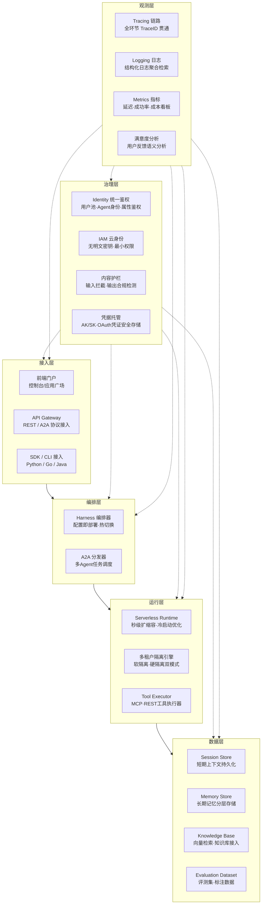
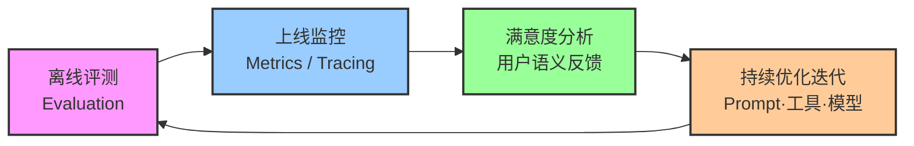

# 02 产品架构与核心能力

## Agent Ready 基础设施分层架构图

AgentKit 采用六层分层架构设计，自下而上分别为观测层、治理层、数据层、运行层、编排层、接入层。各层职责边界清晰，通过标准化接口解耦，支持独立演进与按需组合。

## 动态 Harness 编排能力

### 1. 配置即部署（Harness 配置无需代码）

Harness 编排器将智能体的模型选择、工具清单、提示词模板、记忆策略等要素抽象为声明式配置，开发者无需编写 Agent 控制流代码即可完成智能体定义与部署。配置变更实时生效，支持灰度发布与版本回滚。

**典型场景**：企业客服智能体运营团队需要每周更新产品知识库对应的工具列表和提示词。使用 Harness 配置后，运营人员通过控制台修改配置并发布，无需开发者介入修改代码和重新构建镜像，迭代周期从 1~2 天缩短至分钟级。

### 2. 动态加载（会话内热切换模型/工具/Skills）

Harness 支持在单个会话的生命周期内，根据用户意图或中间状态动态切换底层大模型、增删可用工具、加载或卸载 Skills 能力包。切换过程对会话上下文无感，无需重新建立连接。

**典型场景**：通用员工助手在处理报销查询时，自动切换为财务领域专用模型并加载财务票据 OCR 工具；处理 IT 工单时切换为技术支持模型并加载工单系统接口，在同一会话内无缝完成跨领域任务，用户无需切换多个智能体入口。

### 3. 复杂任务调度（意图解析/动态拆解/中断恢复）

Harness 内置意图解析器将复杂用户请求拆解为子任务序列，支持子任务并行执行、依赖调度与结果聚合。长周期任务支持中断点持久化，异常中断后可从断点恢复执行，无需从头重跑。

**典型场景**：市场分析师要求「对比 Q2 与 Q1 各产品线的营收变化，生成分析报告并发送给部门负责人」。Harness 自动拆解为营收数据查询（并行查询多条产品线）→ 同比环比计算 → 报告生成 → 邮件发送四个子任务，第二步计算异常时可从该步骤恢复，无需重复调用数据源接口。

## Serverless 弹性运行底座

### 1. 秒级扩缩容

Runtime 基于火山引擎 Serverless 基础设施构建，无需管理服务器节点。单 Agent 实例冷启动策略与预热实例池相结合，常规请求命中预热实例实现毫秒级响应，突发流量触发秒级弹性扩容。调用结束后资源自动释放，按实际运行时长计费。

### 2. 多租户隔离

平台提供软隔离与硬隔离两种租户隔离方案。软隔离通过容器级命名空间与 cgroup 实现资源配额隔离，适合同一企业内部的部门级共享场景，资源利用率更高。硬隔离为每个租户分配独立的计算节点与网络平面，数据面与控制面完全隔离，适合金融、政务等强合规场景或多 SaaS 客户共存的平台型业务 [F060]。

### 3. 内置工具集

开箱即用覆盖 VeADK Family 9 大类组件的 20+ 项火山引擎产品工具映射 [F026, F027]，开发者无需自行封装即可调用大模型服务、向量数据库、函数服务、日志服务、可观测平台等云产品能力。同时支持自定义工具通过 Gateway 双轨接入（MCP Server / REST-OpenAPI 转换），内置工具与自定义工具在 Runtime 中通过统一的 Tool Executor 调度执行。

## 安全防护三层模型

以下三层模型回应了 V 阶段对抗性评审中 CTO 视角关于「权限最小化与安全边界设计不足」的质疑，从身份、云资源、内容三个维度逐层防护。

### 1. 身份管控层

- **用户池与 IdP 集成**：支持企业自建身份源（AD、LDAP、OAuth 2.0、OIDC、SAML）单点登录，用户身份继承企业组织架构与角色体系
- **Agent 身份标签与属性鉴权**：每个 Agent 实例分配独立身份标签，可基于标签配置工具调用白名单、数据访问范围、网络出口策略等属性级权限
- **凭据托管与动态授权**：业务系统 AK/SK、数据库密码等凭据托管于 Identity 模块安全存储，Agent 调用时动态签发短期 Token，避免密钥在代码与配置中明文暴露

### 2. 云身份管控层

- **无明文密钥接入火山引擎云资源**：通过 IAM 角色关联（AssumeRole）实现 Agent Runtime 到云服务的身份透传，AK/SK 仅存在于 IAM 角色会话上下文中，平台侧不持久化
- **最小化 IAM 权限策略**：每个 Agent 默认仅分配其声明工具清单对应的云资源访问权限，支持按 API 粒度配置策略，避免过度授权
- **快速安全云资源访问**：VeADK SDK 内置云身份凭据获取机制，开发者无需手动管理云凭证生命周期，降低密钥泄露风险

### 3. 内容护栏层

- **用户输入风险拦截**：对用户输入进行 PII 敏感信息识别、Prompt 注入检测、恶意指令拦截，风险请求在接入层直接拒绝
- **模型输出合规检测**：对 Agent 输出进行涉政、涉黄、涉暴、歧视性内容等多维度合规扫描，不合规内容自动替换或拦截
- **自定义安全策略**：支持企业基于业务特征配置正则规则、关键词词典与零样本分类策略，覆盖内部信息泄露、竞品提及等行业特定合规场景

## 评测与可观测闭环

以下闭环流程实现「离线评测严把上线入口 → 线上观测监控运行态势 → 满意度分析量化体验 → 持续优化迭代 → 回归评测再上线」的质量螺旋提升。

**离线评测（Evaluation）**：平台提供评测集管理、用例标注、自动跑分能力，支持准确率、幻觉率、工具调用成功率、回答相关性等多维指标。新版本 Agent 发布前必须通过预设评测集的质量闸门，核心指标不达标自动拦截发布。

**上线监控（Observability Metrics/Tracing）**：接入层、编排层、运行层、数据层全环节 TraceID 贯通，Metrics 看板实时展示请求量、延迟分位值、Token 消耗、工具调用成功率等核心指标。异常阈值自动触发告警，Tracing 链路可下钻至单次请求内每一步的耗时与返回详情。

**满意度分析（用户语义）**：用户对 Agent 回答的点赞/点踩反馈结合对话内容做语义聚类，自动识别「知识库缺失」「工具调用失败」「模型幻觉」等高频不满意根因，为后续迭代提供精准优化方向。

**持续优化迭代**：基于评测报告、监控告警、满意度分析的输入，针对性调整 Prompt 模板、更新知识条目、修复工具接口、切换更适配的底层模型，形成数据驱动的闭环改进机制。

## 本章小结

本章从六层 Agent Ready 分层架构切入，自下而上阐释了观测层、治理层、数据层、运行层、编排层、接入层的职责边界与协同关系；详解了动态 Harness 编排的配置即部署、热切换、复杂任务调度三大核心能力；剖析了 Serverless 弹性底座的秒级扩缩容、多租户隔离、内置工具集三大特性；提出了身份管控层、云身份管控层、内容护栏层三层安全防护模型，回应了权限最小化的设计质疑；最后通过评测→监控→满意度→优化的 Mermaid 闭环图，串联起 AgentKit 质量持续提升的完整链路。

下一章进入开发框架层面，详解 VeADK（Volcengine Agent Development Kit）三语言 SDK 的安装方式、Family 产品融合矩阵与 DeepResearch 构建特性。

---

| 上一章 | 返回目录 | 下一章 |
|--------|---------|--------|
| ← [01 产品介绍](./01-product-intro.md) | [README](./README.md) | → [03 VeADK开发框架](./03-veadk-framework.md) |
