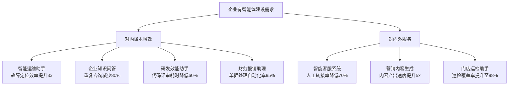
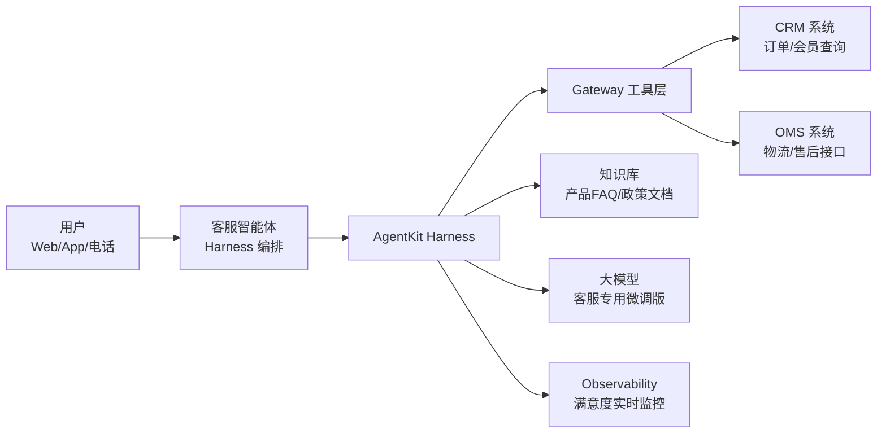
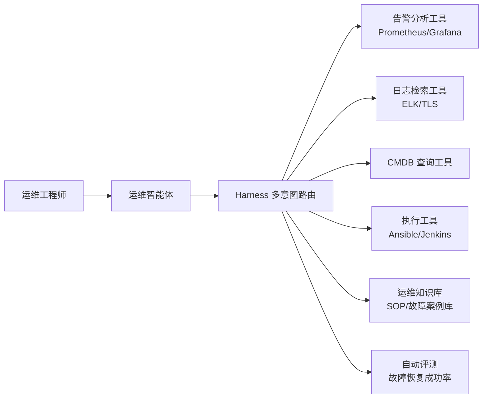
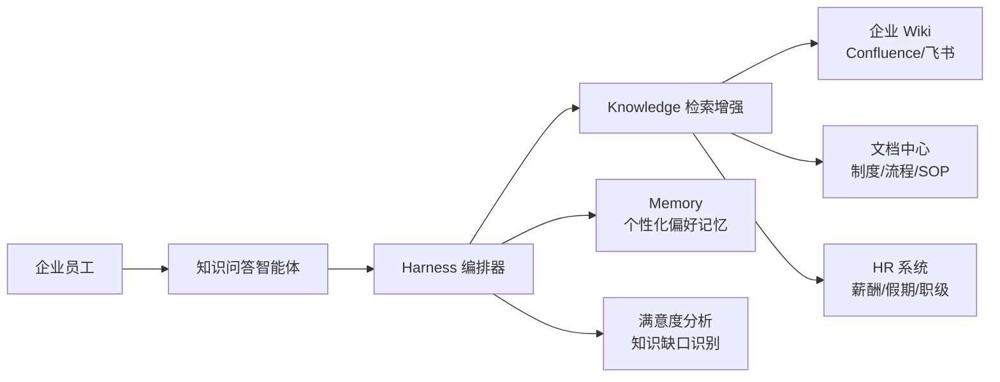
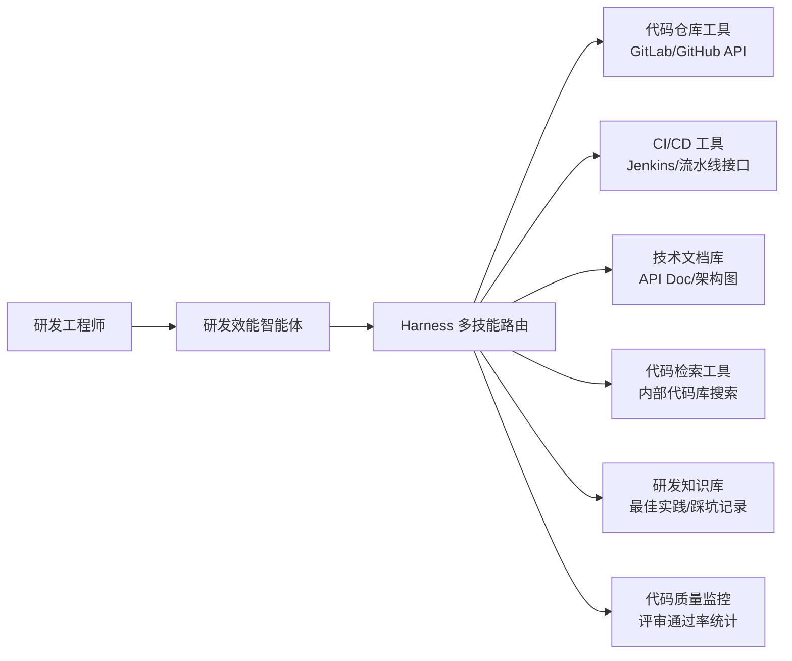
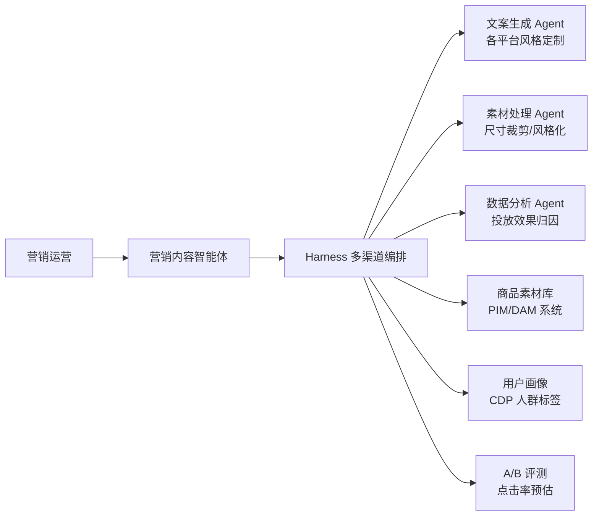

# 06 应用场景与落地方案

## 场景选型决策树

## 5 大行业场景详解

### 场景 1：智能客服系统

#### 1. 场景背景
传统客服中心面临人工坐席成本高、高峰时段排队久、培训周期长三大痛点。以电商行业为例，大促期间咨询量激增3~5倍，临时坐席培训需 2~3 周才能上岗，导致响应超时率高达 30%，用户满意度跌至 75% 以下。重复性问题占比超 60%，但缺乏标准化答案复用机制，坐席需频繁切换 5+ 业务系统查询信息。

#### 2. AgentKit 解决方案架构

#### 3. 核心组件组合

| AgentKit 模块 | 该场景下的作用 |
|---|---|
| Runtime | 托管客服智能体执行，高峰秒级扩容应对大促流量 |
| Identity | 用户身份与坐席身份隔离，敏感数据查询需鉴权 |
| Gateway | 统一接入 CRM/OMS/物流等 8+ 业务系统 REST 接口 |
| Session | 多轮对话上下文持久化，跨天会话保留用户问题历史 |
| Knowledge | 产品知识库检索增强，回答准确率提升至 92% |
| Evaluation | 离线评测集覆盖 Top200 咨询场景，上线前严把质量关 |

#### 4. 实施步骤与交付物
1. **需求梳理与知识库建设**（第 1 周）：交付物《客服咨询分类体系》《产品知识库原始素材》
2. **工具接入与智能体配置**（第 2~3 周）：交付物《Gateway 工具接入清单》《Harness 编排配置文件》
3. **评测集构建与调优**（第 4 周）：交付物《客服评测数据集 v1.0》《评测报告 v1.0》
4. **灰度上线与运营**（第 5~6 周）：交付物《灰度上线方案》《满意度运营看板》

#### 5. 预期收益与 KPI
- 首问解决率从 55% 提升至 **92%**，人工转接率降低 **70%**
- 单咨询平均处理时长从 8 分钟降至 **2.5 分钟**，人工坐席成本降低 **60%**
- 用户满意度（CSAT）从 74% 提升至 **95%+**，NPS 净推荐值提升 28 点

---

### 场景 2：智能运维助手

#### 1. 场景背景
传统 IT 运维依赖人工排查，平均故障定位时间（MTTR）长达 2~4 小时。运维团队需掌握 10+ 监控系统操作，告警风暴日均产生 2000+ 条告警，90% 为低优先级噪音。新人运维工程师独立上岗需 3~6 个月培训期，知识传承高度依赖师徒带教。

#### 2. AgentKit 解决方案架构

#### 3. 核心组件组合

| AgentKit 模块 | 该场景下的作用 |
|---|---|
| Runtime | Serverless 底座，告警风暴突发时弹性扩容不排队 |
| Identity | 运维操作分级鉴权，高危重启操作需二次审批 |
| Gateway | 双模式接入：MCP Server 对接监控系统，REST 转换对接 CMDB |
| A2A | 告警聚合 Agent + 根因分析 Agent + 修复 Agent 三 Agent 流水线协作 |
| Memory | 故障案例沉淀为长期记忆，相似故障秒级推荐解决方案 |
| Observability | 运维操作全链路审计，满足合规溯源要求 |

#### 4. 实施步骤与交付物
1. **运维工具盘点与接入**（第 1~2 周）：交付物《运维工具接入清单》《权限分级矩阵》
2. **故障案例库建设**（第 3 周）：交付物《典型故障案例知识库 v1.0》
3. **多 Agent 流水线编排**（第 4~5 周）：交付物《A2A 编排配置》《告警降噪规则》
4. **试运行与 SOP 固化**（第 6~8 周）：交付物《智能运维 SOP》《MTTR 改进报告》

#### 5. 预期收益与 KPI
- 平均故障定位时间从 180 分钟缩短至 **60 分钟**，MTTR 降低 **67%**
- 告警噪音压缩 **90%**，有效告警识别率提升至 **95%**
- 新人运维上岗周期从 4 个月缩短至 **1 个月**，团队运维吞吐量提升 **3x**

---

### 场景 3：企业知识问答

#### 1. 场景背景
大型企业内部制度、流程、产品文档分散在 Wiki、SharePoint、邮件附件等 10+ 个系统中，员工查找信息平均耗时 15~20 分钟/次。新员工入职前 3 个月约 30% 工作时间用于请教老员工，HR 和 IT 部门每月收到重复咨询超 500 人次，知识传递效率极低。

#### 2. AgentKit 解决方案架构

#### 3. 核心组件组合

| AgentKit 模块 | 该场景下的作用 |
|---|---|
| Runtime | 全员工并发访问稳定支撑，响应延迟 P95 < 2s |
| Identity | 部门级知识隔离，财务/人力敏感文档仅限授权部门访问 |
| Knowledge | 多源知识统一检索，跨 Wiki/文档/邮件附件全域搜索 |
| Session | 追问上下文保留，复杂问题多轮澄清不丢失语义 |
| Memory | 沉淀员工岗位/职级/常用查询偏好，推荐个性化答案 |
| Evaluation | 每月自动抽检答案准确率，识别知识库更新盲区 |

#### 4. 实施步骤与交付物
1. **知识源盘点与接入授权**（第 1 周）：交付物《知识源盘点清单》《访问权限审批表》
2. **知识库构建与分域治理**（第 2~3 周）：交付物《企业知识库 v1.0》《知识域权限矩阵》
3. **智能体配置与问答调优**（第 4 周）：交付物《问答智能体配置》《答案准确率报告》
4. **全员推广与缺口运营**（第 5~6 周）：交付物《推广运营方案》《知识缺口月度报告》

#### 5. 预期收益与 KPI
- 单次信息查询耗时从 18 分钟降至 **1.5 分钟**，效率提升 **12x**
- HR/IT 部门重复咨询量减少 **80%**，每月节省人工咨询 400 人次
- 新员工独立工作达标时间从 3 个月缩短至 **1.5 个月**

---

### 场景 4：研发效能助手

#### 1. 场景背景
研发团队面临代码评审人力不足、技术文档查找困难、重复造轮子三大痛点。PR 评审平均等待时间 4~8 小时，新人融入团队需 2~3 个月熟悉代码库和内部框架。技术方案和最佳实践散落在历史 PR、Confluence、聊天记录中，知识检索成功率不足 40%。

#### 2. AgentKit 解决方案架构

#### 3. 核心组件组合

| AgentKit 模块 | 该场景下的作用 |
|---|---|
| Runtime | MCP Server 模式接入代码仓库，低延迟流式响应 |
| Identity | 代码仓权限继承企业 Git 权限体系，越权访问自动拦截 |
| Gateway | 统一路由代码仓/CI/制品库等研发工具链接口 |
| A2A | 代码评审 Agent + 文档生成 Agent + 测试建议 Agent 并行协作 |
| Memory | 团队技术偏好与编码规范记忆，生成代码风格一致 |
| Evaluation | 代码建议采纳率与 bug 发现率双维度评测质量 |

#### 4. 实施步骤与交付物
1. **研发工具链接入**（第 1~2 周）：交付物《研发工具接入配置》《权限映射关系》
2. **研发知识库建设**（第 3 周）：交付物《研发最佳实践知识库 v1.0》
3. **多技能智能体开发**（第 4~6 周）：交付物《代码评审 Agent》《文档生成 Agent》《测试建议 Agent》
4. **团队试点与推广**（第 7~8 周）：交付物《研发效能提升报告》《推广落地 SOP》

#### 5. 预期收益与 KPI
- PR 平均评审等待时间从 6 小时缩短至 **30 分钟**，评审效率提升 **12x**
- 新人融入周期从 2.5 个月缩短至 **3 周**，团队 bug 率降低 **35%**
- 重复代码发现率提升至 **85%**，每月避免重复开发 40+ 人日

---

### 场景 5：营销与内容生成

#### 1. 场景背景
营销团队内容产出速度跟不上渠道裂变需求，双微一抖小红书等 8+ 渠道需要不同风格文案，单篇 Campaign 文案需 2~3 天产出。设计师资源紧张，简单素材改尺寸排队等待 1~2 天。内容投放效果依赖人工分析，A/B 实验周期长达 1~2 周才能得出结论。

#### 2. AgentKit 解决方案架构

#### 3. 核心组件组合

| AgentKit 模块 | 该场景下的作用 |
|---|---|
| Runtime | 内容生成高峰（如大促前 1 周）弹性扩容，任务不排队 |
| Identity | 市场部/设计部/数据部权限隔离，敏感投放数据保密 |
| Gateway | 对接 PIM 商品库、CDP 用户画像、媒体投放平台 10+ API |
| A2A | 文案/素材/数据分析三 Agent 流水线协作，从 Brief 到投放建议端到端 |
| Knowledge | 品牌调性手册、竞品分析报告、历史爆款文案知识库检索 |
| Evaluation | 多版本文案 A/B 实验自动评测，点击率最佳版本推荐 |

#### 4. 实施步骤与交付物
1. **营销数据源接入**（第 1 周）：交付物《数据源接入清单》《品牌知识库素材》
2. **内容生成 Agent 开发**（第 2~3 周）：交付物《8 渠道文案风格模板》《素材处理流水线》
3. **A/B 实验框架搭建**（第 4 周）：交付物《内容评测体系》《A/B 实验配置》
4. **运营团队培训与试点**（第 5~6 周）：交付物《营销智能体操作手册》《内容产能提升报告》

#### 5. 预期收益与 KPI
- 单 Campaign 全渠道内容产出周期从 3 天缩短至 **半天**，产能提升 **5x**
- 内容点击率 CTR 平均提升 **40%**，素材等待时间减少 **90%**
- A/B 实验周期从 10 天缩短至 **2 天**，营销 ROI 提升 **25%**

## 场景最佳实践 3 条

### 1. 从高价值低复杂度场景切入
- **优先知识库问答/客服工单场景**：ROI 最明确，建设周期 4~6 周即可见效
- **量化当前基线数据**：上线前记录人工处理时长、成本、满意度作为对比基准
- **设定 30/60/90 天里程碑**：30 天跑通核心流程、60 天覆盖 Top50 高频场景、90 天满意度达标
- **小范围试点后推广**：先选 1 个部门或 1 条产品线试点，验证 KPI 达标后全量复制

### 2. 工具链先标准化再规模化
- **制定工具接入标准**：统一 REST/OpenAPI 规范、错误码规范、鉴权方式规范
- **建立权限分级标准**：按读/写/执行三级权限定义工具访问边界，高危操作需审批
- **工具接入两阶段法**：先用 Gateway REST 转换快速接入跑通流程，再按调用频率逐步改造为 MCP Server
- **工具运营 SLA 约定**：与工具提供方约定可用率、响应延迟、变更通知机制，避免工具波动影响 Agent 体验

### 3. 数据闭环驱动迭代
- **评测数据先行**：上线前构建覆盖核心场景的评测集，每月增量补充 10% 新场景
- **上线后双周迭代**：基于 Observability 数据定位 Top10 问题，双周版本迭代修复
- **满意度双通道采集**：用户显式星评 + NLP 语义分析隐式反馈，交叉验证问题根因
- **季度 ROI 复盘**：从效率提升、成本节约、满意度改善三个维度量化价值，争取持续投入资源

## 本章小结

本章从企业智能体建设需求出发，通过场景选型决策树区分对内降本增效与对内外服务两大方向，梳理出 7 个典型应用叶子节点。选取智能客服、智能运维、企业知识问答、研发效能、营销内容生成 5 大行业场景，按「场景背景 → 架构图 → 组件组合 → 实施步骤 → KPI 收益」五段式结构逐一展开，每个场景给出可量化的收益数字与明确交付物清单。最后总结三条场景最佳实践：高价值低复杂度切入、工具标准化先行、数据闭环驱动迭代，为读者规划 AgentKit 落地路径提供可复用的方法论框架。

---

| 上一章 | 返回目录 | 下一章 |
|--------|---------|--------|
| ← [05 快速入门](./05-quickstart.md) | [README](./README.md) | → [07 核心功能详解](./07-core-features-detailed.md) |
