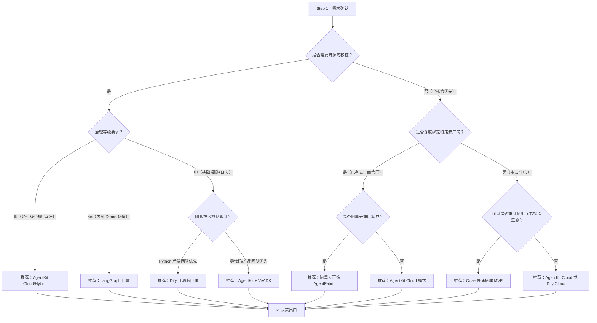
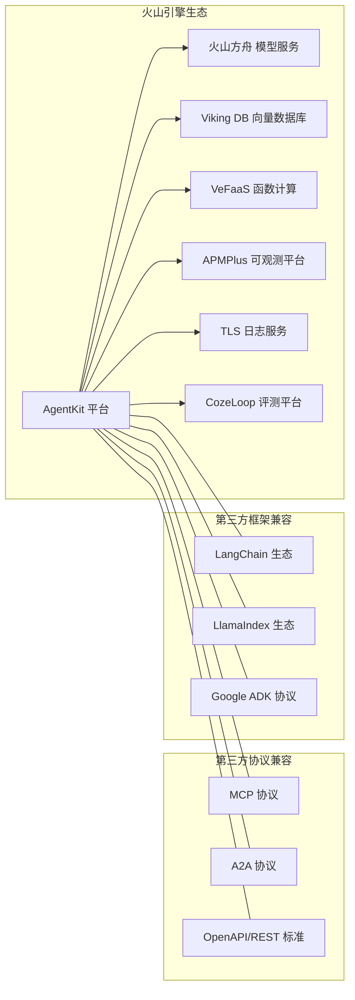

# 08 竞品对比与生态定位

## 生态位定位图

```mermaid
quadrantChart
    title AI Agent 平台生态位定位
    x-axis "开源能力弱" --> "开源能力强"
    y-axis "治理能力弱" --> "治理能力强"
    quadrant-1 开源强 + 治理强（企业级首选）
    quadrant-2 开源弱 + 治理强（托管专精）
    quadrant-3 开源弱 + 治理弱（低门槛入门）
    quadrant-4 开源强 + 治理弱（开发者友好）
    LangGraph: [0.90, 0.20] "开源框架"
    Dify: [0.75, 0.45] "开源+云"
    Coze: [0.20, 0.45] "全托管"
    阿里云百炼: [0.45, 0.60] "云厂商"
    AgentKit: [0.85, 0.90] "开源+治理"
```

**定位标签说明：**
- **LangGraph**："开源框架"——纯开源编排引擎，生态丰富但治理能力需自建
- **Dify**："开源+云"——开源可自建，治理能力中等偏向可视化编排
- **Coze**："全托管"——字节系生态闭环，开源能力有限，上手极快
- **阿里云百炼**："云厂商"——阿里云体系内深度集成，开源中等，治理偏强
- **AgentKit**："开源+治理"——VeADK 开源兼容 ADK，治理四板斧齐全，企业级定位

## 5 个产品横向对比表

| 对比维度 | AgentKit | LangGraph | Dify | Coze | 阿里云百炼 AgentFabric |
|---------|----------|-----------|------|------|----------------------|
| **产品名** | 火山引擎 AgentKit | LangGraph（LangChain） | Dify | Coze（字节跳动） | 阿里云百炼 AgentFabric |
| **开源情况** | VeADK 三语言全开源（Python/Go/Java），兼容 Google ADK；平台侧 Cloud 模式托管 | 完全开源（MIT），纯框架无托管平台 | 社区版开源（MIT），企业版闭源收费 | 闭源，仅托管 SaaS | 框架侧部分开源，平台侧全托管闭源 |
| **开发框架语言** | Python / Go / Java 三官方 SDK | Python / TypeScript 双 SDK | Python 后端 + React 前端，低代码为主 | 零代码/低代码，插件用 Python/Node.js | Python SDK + 低代码可视化 |
| **Local 部署** | ✅ 完整 Local 模式（VeADK 本地运行） | ✅ 纯本地（框架） | ✅ Docker Compose 一键部署 | ❌ 无本地部署 | ⚠️ 有限本地（SDK可本地跑，治理能力云端） |
| **Hybrid 部署** | ✅ Hybrid 模式（本地 Runtime + 云治理） | ⚠️ 需自建（LangSmith 云观测） | ⚠️ 需自建混合架构 | ❌ 无 | ✅ 专有云+公共云混合 |
| **Cloud 托管** | ✅ Cloud 模式（Serverless + 多租户） | ❌ 需自建或用 LangSmith | ✅ Dify Cloud SaaS | ✅ 全托管 SaaS | ✅ 阿里云全托管 |
| **Harness 编排** | 代码优先 + 配置优先双模式；支持 Session 内热切换模型/工具/Skills；动态任务拆解与中断恢复 | 纯代码优先（Python/TS 定义图）；StateGraph 有状态流；无热切换 | 配置优先（低代码可视化工作流）；代码扩展需写插件 | 纯配置优先（零代码画布编排）；插件机制扩展 | 配置优先 + 代码混合；可视化工作流画布 |
| **身份鉴权模型** | 4+ 元：Identity 独立身份 + Agent 角色 + 人类用户角色 + Tool 白名单 + 凭据托管 | 依赖 LangSmith / 自建 IAM，无内置统一鉴权 | 基础 RBAC（用户/团队/管理员）；密钥管理基础 | 平台账号体系 + 插件权限粗粒度 | 阿里云 RAM 深度集成；RBAC + ABAC |
| **可观测性覆盖** | 5 环节全链路 Trace：模型调用 / Runtime / Gateway Tool / Knowledge 检索 / Memory 读写；Metrics + Log + Trace 全覆盖 | 依赖 LangSmith（付费）；基础 Trace 覆盖模型/Tool；无内置 Metrics | 基础日志（对话历史）；调用次数统计；无完整 Trace | 对话日志 + 调用统计；无链路级 Trace | 阿里云 ARMS 集成；链路 Trace + 日志 + 监控 |
| **评测体系** | 离线评测（自定义数据集）+ 在线评测（生产流量抽样）+ 发布闸门自动化（CI/CD 拦截） | 依赖 LangSmith Eval（付费）；数据集评测 + 在线评分 | 基础对话评分（人工点赞点踩）；无自动化发布闸门 | 人工评分为主；无标准化评测模块 | 离线评测数据集 + A/B 实验；与模型训练链路打通 |
| **MCP 协议支持** | ✅ Gateway 原生支持 MCP Server 接入；REST→MCP 双向转换 | ⚠️ 社区适配中；无官方原生支持 | ⚠️ 插件机制非标准 MCP；需自定义适配 | ❌ 私有插件协议；不兼容 MCP | ⚠️ 阿里云插件协议；MCP 兼容待发布 |
| **A2A 协议支持** | ✅ 原生 A2A 多 Agent 编排；任务分发/结果回传/状态同步 | ⚠️ 多 Agent 通过图结构模拟；非标准 A2A 协议 | ⚠️ 工作流串联多 Agent；非 A2A 标准 | ✅ 原生支持 Coze A2A（但与标准不兼容） | ⚠️ 多 Agent 编排；协议兼容性待验证 |
| **典型优势** | ① 治理四板斧（Identity+Gateway+Observability+Evaluation）最齐全；② VeADK 兼容 Google ADK 迁移成本低；③ 三部署模式渐进切换；④ REST/OpenAPI 存量快速接入 | ① 开源生态最成熟；② 编排灵活性最高；③ 社区资源丰富 | ① 低代码上手最快；② 可视化工作流友好；③ Docker 自建便利 | ① 零代码门槛最低；② 字节系生态（抖音/飞书）打通；③ 插件市场丰富 | ① 阿里云全家桶深度集成；② 模型训练→部署链路打通；③ 企业级客户支持 |
| **典型局限** | ① 社区生态较 LangGraph 尚在积累；② 低代码可视化能力弱于 Dify/Coze；③ 文档体系完善度待提升 | ① 治理能力几乎全需自建；② 无官方托管平台；③ 学习曲线陡峭 | ① 企业版收费高；② 复杂编排受低代码限制；③ 定制化深度不足 | ① 完全闭源无法本地部署；② 数据绑定字节生态；③ 企业级治理能力薄弱 | ① 阿里云生态绑定强；② 开源深度不足；③ 混合云模式成本高 |

## 选型决策流程



**决策分支要点：**
1. **开源可移植分支**：有数据本地化/合规要求、不愿被单厂商锁定的团队，优先评估 AgentKit（治理等级高）或 Dify 开源版（中等治理）
2. **全托管分支**：追求快速上线、无运维团队的场景，根据现有云厂商合同和生态绑定情况选择
3. **团队适配**：Python 后端团队适配 Dify/LangGraph 更快，零代码团队优先 Coze，企业级工程团队优先 AgentKit

## 生态伙伴与集成图



**生态节点说明（共 13 个）：**

| 生态类别 | 节点 | 集成说明 |
|---------|------|---------|
| 火山引擎生态 | 火山方舟 | AgentKit 默认模型供应方，支持模型热切换与智能路由 |
| 火山引擎生态 | Viking DB | Knowledge 模块默认向量存储，支持混合检索 |
| 火山引擎生态 | VeFaaS | Cloud 模式 Serverless 底座，秒级弹性扩缩容 |
| 火山引擎生态 | APMPlus | Observability 模块对接，全链路 Trace 可视化 |
| 火山引擎生态 | TLS | 审计日志与调用日志存储，支持多维度检索 |
| 火山引擎生态 | CozeLoop | Evaluation 模块评测底座，离线+在线评测 |
| 火山引擎生态 | AgentKit 平台 | 核心集成中枢 |
| 第三方协议 | MCP 协议 | Gateway 原生支持 MCP Server 标准接入 |
| 第三方协议 | A2A 协议 | 多 Agent 编排标准协议，跨平台任务协同 |
| 第三方协议 | OpenAPI/REST | Gateway 自动转换存量 REST 接口为 Tool |
| 第三方框架 | LangChain 生态 | VeADK 兼容 LangChain Tool 与 Chain 定义 |
| 第三方框架 | LlamaIndex 生态 | Knowledge 模块兼容 LlamaIndex 索引与检索 |
| 第三方框架 | Google ADK 协议 | VeADK 与 Google ADK 完全兼容，迁移零成本 |

## 本章小结

本章从**生态位定位、横向对比矩阵、选型决策流程、生态伙伴集成**四个维度建立了 AgentKit 的全景认知：

1. **生态位**：AgentKit 占据「开源能力强 + 治理能力最强」的右上象限，是企业级生产环境的首选定位
2. **横向差异**：与 LangGraph（纯开源无治理）、Dify（开源+低代码）、Coze（闭源零代码）、阿里云百炼（云厂商绑定）的差异清晰，核心壁垒是治理四板斧 + VeADK 兼容性
3. **选型流程**：通过「开源需求 → 治理等级 → 团队栈 → 云厂商绑定」四层决策树，可快速定位适合的产品
4. **生态深度**：7 个火山引擎内部产品 + 3 个标准协议 + 3 个主流框架的生态矩阵，保障了存量系统接入与未来扩展性

---

| 上一章 | 返回目录 | 下一章 |
|--------|---------|--------|
| ← [07 核心功能](./07-core-features-detailed.md) | [README](./README.md) | → [09 FAQ与最佳实践](./09-faq-best-practices.md) |
