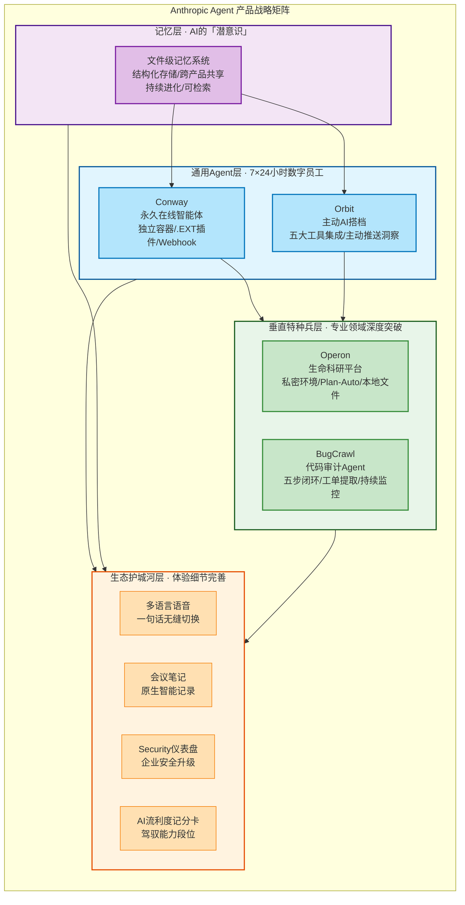

# Anthropic Agent 产品线路线图完整学习教程

> **原文链接**: https://mp.weixin.qq.com/s/e-cbArpf6-RShpjqBJWB5A?from=industrynews&color_scheme=light#rd
> **作者**: 新智元（微信公众号）
> **信息来源**: TestingCatalog 从 Claude 代码引用和隐藏界面字符串中挖掘
> **发布时机**: Opus 4.8 发布一周后

---

## 📋 目录导航

- [一、文章背景与核心论点](#一文章背景与核心论点)
- [二、Conway：永久在线智能体（Always-on Agent）](#二conway永久在线智能体always-on-agent)
- [三、文件级记忆系统：AI的「潜意识」觉醒](#三文件级记忆系统ai的潜意识觉醒)
- [四、Orbit：主动出击的AI搭档](#四orbit主动出击的ai搭档)
- [五、垂直领域「特种部队」：Operon与BugCrawl](#五垂直领域特种部队operon与bugcrawl)
- [六、生态护城河升级](#六生态护城河升级)
- [七、OpenAI反击：GPT-5.6的幽灵](#七openai反击gpt-56的幽灵)
- [八、核心信息汇总表](#八核心信息汇总表)
- [九、行业洞察与深度思考](#九行业洞察与深度思考)
- [十、内容三维评估（专业性/准确性/时效性）](#十内容三维评估专业性准确性时效性)
- [十一、常见问题解答（FAQ）](#十一常见问题解答faq)
- [十二、相关资源链接](#十二相关资源链接)

---

## 一、文章背景与核心论点

Opus 4.8 发布仅一周后，技术媒体 TestingCatalog 就通过对 Claude 代码引用和隐藏界面字符串的深度挖掘，发现了 Anthropic 正在秘密研发的至少六条全新产品线。这一发现揭示了 Anthropic 正在进行的重大战略转型——从对话式 AI 向完整的 Agent 生态系统演进。

### 1.1 六条产品线全景

此次挖掘出的六条产品线覆盖了从基础能力到垂直应用的完整布局：

| 产品线名称 | 定位 | 核心价值 |
|------------|------|----------|
| **Conway** | 永久在线智能体 | 7×24小时持续运行，无需用户主动发起对话 |
| **文件级记忆系统** | AI的「潜意识」 | 跨会话持久化记忆，深度理解用户上下文 |
| **Orbit** | 主动助手 | 主动监控、预判需求、主动提供帮助 |
| **Operon** | 科研平台 | 面向科学研究的垂直领域专业Agent |
| **BugCrawl** | 代码审计 | 自动化代码安全审计与漏洞发现 |
| **多语言语音模式** | 多模态交互 | 支持多语言实时语音对话能力 |

### 1.2 核心方向：走出聊天框

这六条产品线共同指向一个清晰的战略方向——**Claude 正在走出聊天框**。传统的对话式 AI 模式是"用户提问→AI回答"的被动响应模式，而 Anthropic 正在构建的新一代 Agent 生态具备三个关键特征：

1. **从被动响应到主动工作**：AI 不再等待用户指令，而是能够主动监控环境、发现问题、执行任务
2. **永久在线**：像人类助手一样7×24小时持续运行，随时待命
3. **垂直专精**：不再是通用聊天机器人，而是在科研、代码审计等专业领域具备深度能力

### 1.3 Anthropic 的战略宣言

文章中引用了 Anthropic 内部的一句核心名言，精准概括了公司的长期定位：

> 「Anthropic从来不是一家仅仅为了写代码而存在的公司。它是一家致力于『智能』的公司，只是碰巧选择从编程领域切入。随着Claude智能的不断扩展，它将被应用于人类智慧能够发挥作用的每一个领域。理解了这一点，你也就理解了未来。」

### 1.4 战略定位：从模型竞赛到生态构建

这一产品线布局标志着 AI 行业竞争格局的重大转变：**模型参数内卷不再是终极追求**。Anthropic 的目标不再仅仅是训练更大、更强的语言模型，而是构建一个能够：

- **接管工作流**：深度嵌入用户的日常工作流程，成为不可或缺的生产力工具
- **主动思考**：具备自主规划、决策、执行的能力，而不仅仅是被动响应
- **拥有记忆**：通过文件级记忆系统实现跨会话的知识积累和上下文理解
- **专业技能**：在特定垂直领域（科研、代码审计等）达到专家级水平

的 AI 超级智能体生态系统。这一战略如果成功实现，将重新定义人与 AI 的协作方式。

---

## 二、Conway：永久在线智能体（Always-on Agent）

Conway 是此次挖掘中最具革命性的产品线，它代表了 AI 交互范式的根本转变——从被动响应的对话框走向始终在线的独立智能体。

### 2.1 Conway 定位

**定义**：始终在线的常驻代理（Always-on Agent）

Conway 的核心定位与传统聊天机器人有着本质区别：

| 维度 | 传统AI助手 | Conway永久在线智能体 |
|------|------------|---------------------|
| **运行状态** | 用户打开时运行，关闭即停止 | 7×24小时持续在线运行 |
| **依赖环境** | 必须打开网页或对话框 | 拥有独立运行的托管容器环境 |
| **触发方式** | 等待用户输入指令 | 可被外部事件主动唤醒 |
| **存在形式** | 对话框内的问答工具 | 全天候运转的独立工作台 |

**核心特征**：Conway 拥有独立运行的托管容器环境，不依赖用户打开网页或对话框即可持续运行。这意味着它更像是一个随时待命的数字员工，而非需要你主动唤醒的工具。

### 2.2 交互范式革命：告别对话框

#### 现有AI的核心痛点

当前所有主流 AI 产品都共享同一个致命局限：**必须打开网页输入文字才动，一关网页就"死"了**。

这种模式存在三个根本问题：
1. **强依赖用户主动发起**：AI 永远在等待，不会主动工作
2. **会话生命周期与界面绑定**：关闭标签页等于终止 AI 的所有工作
3. **上下文断裂**：每次重新打开都需要重新建立上下文

#### Conway 的全新交互范式

Conway 彻底打破了传统对话框的束缚，带来了三种全新的交互入口：

- **不出现在传统聊天界面**：它不是你在 Claude 主界面里新开的一个对话窗口
- **作为独立侧边栏选项**：在 Claude 界面中拥有专属的侧边栏入口，与普通对话并列
- **打开专门绑定到「Conway实例」的专属页面**：每个 Conway 实例都有自己独立的工作空间
- **不是对话框，而是全天候运转的独立工作台**：更像一个你可以随时查看的虚拟桌面，AI 在后台持续工作

这一转变的本质是：**AI 从"你问我答的工具"变成了"持续为你工作的伙伴"**。你不需要时刻盯着它，它会在后台默默完成任务，只在需要时通知你。

### 2.3 史诗级扩展标准：.EXT与插件帝国

Conway 的独立运行环境带来了一个更具战略意义的能力——可扩展性。

#### 插件生态架构

独立环境可接入外部集成、安装特定技能、添加插件，形成完整的能力扩展体系：
- 插件以卡片/标签页形式排列在侧边栏
- 像浏览器切换标签页一样流畅地在不同插件能力间切换
- 每个插件为 Conway 增加特定领域的专业能力

#### .EXT 打包格式：AI时代的App Store时刻

代码中发现的「UI tabs」自定义抽象层，指向一个全新的扩展标准——**.EXT 打包格式**。

这一发现具有里程碑式的战略意义：

> **这将是 AI 时代的「App Store」时刻！**

Anthropic 可能采取的战略路径：
1. **开放标准**：让全球开发者构建、分享、下载插件
2. **跨代理复用**：扩展插件可跨代理重复使用，盘活基于 Claude 的开发者生态
3. **网络效应**：就像 iPhone 的 App Store 重新定义了移动互联网，.EXT 标准可能重新定义 AI 应用生态

这意味着 Conway 不会只是 Anthropic 一家的产品，而是一个可扩展的平台——任何人都可以为它开发新能力，形成强大的生态护城河。

### 2.4 Webhook唤醒与被动触发革命

这是 Conway 最强大、最具颠覆性的特性：**Webhook 支持**。

#### 技术暗示：公开URL接口

Webhook 支持强烈暗示 Conway 将拥有公开 URL 接口，能够接收来自外部世界的 HTTP 请求。这是从"封闭对话系统"走向"开放网络节点"的关键一步。

#### 典型触发场景

当你不在电脑前时，外部服务可以通过调用接口直接唤醒 Conway：

| 触发场景 | Conway 的响应 |
|----------|--------------|
| **服务器崩溃告警** | 立即登录服务器查看日志，定位问题，尝试自动恢复，只给你发一份处理结果报告 |
| **店铺收到大订单** | 自动核对库存、确认支付、生成发货单、通知仓库，异常情况才向你请示 |
| **重要客户发来邮件** | 分析邮件内容，查询历史沟通记录，起草回复建议，紧急情况立即推送通知给你 |

#### 革命性的工作方式

Conway 的工作流形成了一个完美的闭环：

1. **云端瞬间「惊醒」**：外部事件触发 Webhook，Conway 从待命状态立即激活
2. **结合Chrome控制台和通知系统直接处理**：利用内置的浏览器能力和工具自主执行任务
3. **仅发处理结果报告**：任务完成后，只向你推送最终结果或需要决策的关键节点

**与现有AI的本质区别**：**不需要用户发 Prompt，外部事件直接唤醒**。这才是真正的"智能代理"——它能够感知外部世界的变化并自主响应，而不是永远等待你的指令。

### 2.5 部署范围与限制

#### 全面覆盖的部署策略

Conway 将实现全平台登录，覆盖 Claude 的所有主要入口：
- **Claude Code**：面向开发者的编程环境
- **移动端**：iOS/Android 应用
- **Web端**：网页版 Claude

这意味着你可以在任何设备上查看和管理你的 Conway 实例，实现真正的跨设备连续性。

#### 算力控制策略

每位用户目前计划限制只能拥有 **一个 Conway 代理**。

**原因**：Conway 强大的远程驻留特性需要严格控制算力消耗。7×24小时持续运行的智能体对云端资源的需求远大于按需响应的对话模型，限制单实例是保障服务稳定性和公平性的必要措施。

这一限制也暗示了 Conway 的定位：它不是你可以随意创建多个的临时对话，而是一个需要精心配置、长期陪伴你的"数字分身"。

### 2.6 竞争定位

#### 直接竞争对手

Conway 的推出直接瞄准了目前风头正劲的开源 AI 代理项目，包括但不限于：
- **OpenClaw**：开源自主代理框架
- **Hermes**：各类开源常驻智能体项目
- 其他社区驱动的 Always-on Agent 解决方案

#### 战略意义：Anthropic 对开源Agent生态最强硬、最直接的反击

在此之前，开源社区在"永久在线智能体"这一方向上走在了闭源商业产品前面。各类开源项目让早期用户体验到了 7×24 小时 AI 代理的魅力。

Conway 的发布标志着：
1. **Anthropic 正式下场**：将开源社区探索出的产品方向商业化、产品化
2. **体验碾压优势**：官方深度集成的体验将远超开源方案的拼凑感
3. **生态闭环**：结合 .EXT 插件标准，形成开源方案无法比拟的生态优势
4. **算力背书**：Anthropic 强大的云端算力支持是开源项目难以企及的基础设施优势

这是 Anthropic 从"模型提供商"向"AI 基础设施平台"转型的关键一战。

---

## 三、文件级记忆系统：AI的「潜意识」觉醒

记忆能力是衡量 AI 智能体是否真正"可用"的核心指标。Anthropic 即将推出的文件级记忆系统，将彻底解决长期困扰用户的"AI失忆症"问题。

### 3.1 现有记忆的痛点：扁平摘要的灾难

AI 没有记忆是目前用户体验最痛苦的痛点之一。

你是否有过这样的经历：
- 昨天刚花了半小时教 AI 你的写作风格、常用术语和排版偏好，今天开新对话时它忘得一干二净
- 上周在某个项目中讨论过的关键决策，这周再提及时 AI 完全没有印象
- 复杂项目进行到一半，每次都要重新解释背景信息和之前的进展

**问题根源**：现有 AI 记忆大多采用「扁平摘要（Flat Summary）」机制——把对话历史压缩成几句话存起来。

这种机制在简单对话场景下勉强够用，但面对复杂项目时几乎是灾难性的：
1. **丢失细节**：关键决策、具体数据、特殊偏好等重要信息在压缩过程中被丢弃
2. **无法结构化检索**：记忆是一团模糊的文字，无法按主题、时间、项目等维度精准查找
3. **跨场景遗忘**：在对话 A 中获得的信息，无法有效迁移到对话 B 中使用
4. **容量有限**：摘要长度受限，记忆内容很快就会被新信息覆盖

### 3.2 记忆革命：从扁平摘要到文件级记忆

Anthropic 将彻底摒弃传统扁平摘要，带来革命性的「基于文件的记忆（File-based Memory）」。

这不是对现有记忆机制的小幅改进，而是记忆结构的一次升维：

- **结构化存储**：用户（以及托管的 AI 代理）能以文件形式对存储的上下文进行结构化、分类和长期微调
- **动态进化**：记忆文件不是静态的，而是随时间和互动不断优化、更新、完善
- **分类管理**：不同类型的记忆（个人偏好、项目知识、工作流、历史bug等）分门别类存储
- **可检索性**：需要时可以精准定位到具体的记忆文件，而不是在模糊的摘要中大海捞针

想象一下，AI 的记忆不再是简单的几句话摘要，而是一个有结构、有分类、可检索、可进化的持久记忆库——就像人类大脑中的长期记忆系统。

### 3.3 跨产品共享记忆层：统一的「大脑文件柜」

文件级记忆系统带来的最大红利，是形成跨产品的「共享记忆层」。

**核心价值**：不管你在哪个端使用 Claude，都共享同一个大脑。

| 使用场景 | 记忆共享表现 |
|---------|-------------|
| **网页端与Claude聊天** | 讨论策划案时提到的关键数据和决策方向 |
| **Conway里让它写代码** | 自动记得你的代码风格偏好、项目架构约定、上周遇到的bug |
| **移动端通过语音交流** | 在路上随口提到的新想法，回到电脑前AI已经整理好了 |

**记忆深度**：
- 知道你是谁——你的职业背景、沟通风格、决策偏好
- 记得上周在某个代码文件中遇到的具体bug，以及你是如何解决的
- 记得上个月策划案里的具体数据、目标受众、核心卖点
- 理解你在不同项目中不同的工作方式和偏好设置

这种统一的记忆层可以类比为：AI 终于拥有了可以沉淀的「潜意识」。就像人类不需要刻意回忆就能记得如何骑自行车、记得亲人的生日、记得工作中的重要经验一样，AI 的记忆将真正实现跨会话、跨场景、跨产品的持久化。

### 3.4 记忆进化路径对比表

三种记忆模式的核心差异对比：

| 记忆模式 | 结构 | 持久度 | 跨产品 | 复杂项目表现 |
|---------|------|--------|--------|-------------|
| 无记忆 | 无 | 会话内 | 否 | 完全无法工作 |
| 扁平摘要 | 几句话压缩 | 短期 | 有限 | 灾难性失效 |
| 文件级记忆 | 结构化/分类/文件形式 | 长期 | 全端共享 | 可沉淀可进化 |

文件级记忆系统的推出，将标志着 AI 从"随用随忘的工具"真正进化为"越用越懂你的伙伴"。当 AI 能够真正记住你、理解你、积累与你协作的经验时，人机协作的效率将产生质的飞跃。

---

## 四、Orbit：主动出击的AI搭档

如果说 Conway 是"永久在线的工作台"，那么 Orbit 就是真正融入你日常工作流的"主动搭档"——它不再等待你的指令，而是在你需要之前就把答案准备好。

### 4.1 核心理念：从被动响应到主动出击

我们已经习惯了向 AI 下达指令：写一封邮件、总结一份文档、调试一段代码。但真实职场中，最优秀的助理从来不需要老板事无巨细地吩咐。

优秀的助理会主动观察你的工作节奏，发现潜在问题，提前准备好解决方案。当你还在思考"这件事该怎么办"时，他们已经把方案放在了你的桌上。

Orbit 的核心逻辑正是如此：**在你不问的时候，把答案准备好**。它不需要你精心设计 Prompt，不需要你主动发起对话，而是像一个真正懂你的助理一样，在后台持续观察你的工作状态，主动捕捉你可能需要的信息和帮助。

这是 AI 从「被动响应」走向「主动出击」的标志性产品。它不再是一个等待你发问的工具，而是一个能够预判你需求、主动为你分忧的工作搭档。

### 4.2 工具集成：深度连接生产力工具

Claude Orbit 获得了一项「部署常用应用程序」的超级能力——它不再局限于 Claude 自身的对话框，而是能够深度整合你日常使用的核心生产力工具，在这些工具之间自由穿梭。

目前 Orbit 计划深度整合的工具包括：

- **Gmail & 日历**：掌握你的邮件往来和日程安排，理解你的沟通节奏和会议安排
- **Slack 聊天记录**：实时追踪团队沟通动态，从海量消息中提炼关键信息
- **GitHub 代码库**：关注代码提交、PR 状态、Issue 进展，掌握开发动态
- **Google Drive 云端硬盘**：访问文档、表格、演示文稿，理解项目资料上下文
- **Figma 设计图**：查看设计变更，理解产品迭代方向

Orbit 在后台安静地游走于这些软件之间，持续捕捉属于你的个性化见解。它不是简单地读取数据，而是将分散在各个工具中的信息串联起来，形成对你工作状态的完整理解。

### 4.3 典型场景：早上9点的AI助理

让我们通过一个具体场景来感受 Orbit 带来的工作方式变革：

**早上9点，你打开电脑。**

你还没来得及打开任何软件，Orbit 已经完成了一整套工作：

- 它帮你阅读了昨晚 Slack 里几十条错综复杂的群聊，过滤掉了无关的闲聊和表情回复
- 它不仅总结了三个需要你立刻拍板的关键决定，还附上了每个决定的背景信息和可选方案
- 它结合了 Google Drive 里最新的财务报表数据，为其中一个关于预算审批的决定提供了数据支撑
- 它在 Gmail 里自动草拟了一封回复客户的邮件，措辞和语气完全符合你一贯的沟通风格
- 就在你浏览这些信息时，一个温柔的弹窗出现在屏幕角落：「我看您下午2点和客户的会议材料还没准备好，相关的背景资料我已经整理好了，需要我先拉一个大纲吗？」

整个过程中，你没有输入一个字的 Prompt，没有发起任何一次对话。但 Orbit 已经像一个工作了多年的资深助理一样，把你早上需要处理的事情都安排得井井有条。

这就是主动式 AI 的真正价值——它不是等你告诉它该做什么，而是它知道你该做什么。

### 4.4 价值定位：从工具到搭档

Orbit 的出现，将让 AI 真正实现从「工具」到「搭档」的蜕变。

传统 AI 工具的本质是"高级计算器"——你输入问题，它输出答案，用完即走。而 Orbit 是一个持续陪伴你的工作伙伴，它理解你的工作习惯，预判你的需求，主动为你创造价值。

| 维度 | 传统AI助手 | Orbit主动助手 |
|------|-----------|--------------|
| 交互方式 | 你问它答 | 主动推送洞察 |
| 工作时机 | 等待指令 | 后台持续运行 |
| 工具集成 | 单一工具 | 跨多应用游走 |
| 价值定位 | 工具 | 搭档 |

不等待 Prompt，而是主动给你洞察——这一转变的意义怎么强调都不为过。它意味着 AI 不再是一个需要你"使用"的外物，而是融入你工作流的一部分，像你的左右手一样自然。

### 4.5 Orbit vs Claude Tag：差异简析

值得注意的是，Orbit 与此前曝光的 Claude Tag 虽然都涉及"主动工作"能力，但两者的定位和适用场景有明显区别：

**Claude Tag**：
- 面向企业协作场景
- 强调团队共享、Ambient Mode（环境感知模式）
- 支持异步执行团队任务
- 核心价值在于提升团队协作效率

**Orbit**：
- 面向个人生产力场景
- 强调主动洞察、多工具整合
- 专注于接管个人工作流
- 核心价值在于成为个人的专属AI搭档

两者定位不同，一个面向团队协作场景，一个面向个人主动助手场景，共同构成了 Anthropic 在"主动式 AI"领域的双线布局。Claude Tag 让团队协作更顺畅，Orbit 让个人工作更高效，两者互为补充，覆盖不同的用户需求场景。

---

## 五、垂直领域「特种部队」：Operon与BugCrawl

如果说 Conway 和 Orbit 是 Anthropic 面向通用场景的"常规兵种"，那么接下来要介绍的两款产品就是针对特定垂直领域打造的"特种部队"——它们不追求大而全，而是在专业领域做到极致深度。

### 5.1 Operon：生命科学的「数字实验室」

Operon 的出现，是对 Anthropic 战略定位最有力的证明。

**定位**：如果 Conway 和 Orbit 是通用兵种，Operon 就是针对特定领域的 AI「特种部队」。它专为生命科学研究者打造，是第四种桌面模式——与现有 Chat、Code、Cowork 模式并列。

这不是简单的生化知识问答机器人，而是真正的科研辅助平台。核心理念验证：Anthropic 自认为是一家智能公司而非单纯的编程公司，Operon 就是这一理念的最佳证明。

#### 核心能力

Operon 为生命科学研究提供了三大核心能力：

1. **私密环境与项目会话**：确保顶级科研数据的绝对安全。科研数据往往涉及未发表的研究成果、敏感的实验数据乃至商业机密，Operon 构建了隔离的私密环境，让研究者可以放心地将最核心的数据交给 AI 处理。

2. **Plan 与 Auto 模式**：AI 可以自主帮你设计实验步骤。这不是简单的建议，而是真正的实验规划——从假设提出、实验设计、对照组设置到数据分析方案，AI 能够像一个经验丰富的博士后协作者一样，帮你梳理完整的研究路径。

3. **本地文件直接访问权限**：能够直接抓取和分析庞大的本地科研数据集。生命科学研究产生的数据量往往是惊人的——单细胞测序数据、蛋白质结构文件、显微镜图像序列，这些文件动辄几十GB甚至上百GB。Operon 不需要你把数据上传到云端，而是可以直接在本地访问和分析，既高效又安全。

#### 重点应用场景

Operon 首批重点支持的应用场景直指生命科学研究中最具挑战性、也最有价值的方向：

- **CRISPR（基因编辑）筛选设计**：CRISPR 筛选是现代遗传学研究的核心工具，但设计一个高质量的筛选文库需要考虑无数因素——靶点选择、脱靶效应评估、文库覆盖率、阳性对照设计。Operon 可以帮研究者系统性地完成这些设计工作，大幅降低实验失败的风险。

- **单细胞 RNA 分析**：单细胞 RNA 测序产生的数据量巨大、分析流程复杂，从质量控制、归一化、细胞聚类到差异表达分析、轨迹推断，每一步都需要专业的生物信息学知识。Operon 能够端到端地完成这些分析，并生成符合学术规范的可视化结果和解读报告。

#### 试点推测

鉴于 Anthropic 之前在 AI for Science 领域的深度布局——包括与顶尖科研机构的合作、在蛋白质结构预测等方向的探索——这项功能可能已经在一些顶尖科研机构中进行秘密试点测试。

**价值升华**：AI 不仅能帮你写前端页面，更要在微观世界里帮你破解生命密码——这才是科技的终极浪漫。当 AI 能够真正辅助科学家做出新的发现、加速新药研发、帮助理解疾病机制时，它的价值将远远超越提升工作效率的层面。

---

### 5.2 BugCrawl：程序员的「无情捉虫机器」

如果说 Operon 是面向科学家的特种部队，那么 BugCrawl 就是面向程序员的"无情捉虫机器"——它完善了 Anthropic 在代码代理领域的布局。

**定位**：对标 Claude Security，但目标不是寻找安全漏洞，而是专注于寻找代码中的通用 Bug。Claude Security 专注于安全漏洞（SQL注入、XSS、权限绕过等），而 BugCrawl 的视野更广阔——逻辑错误、边界条件处理不当、空指针异常、资源泄漏、并发问题，所有这些让程序员头疼的普通 Bug，都是它的捕猎目标。

**入口**：在 Claude Code 中作为独立入口出现，带有「存储库选择器」。你可以选择要扫描的代码仓库，然后让 BugCrawl 开始工作。

**贴心设计**：带有「高 Token 消耗警告」提示。因为 BugCrawl 需要深度扫描整个代码库、理解代码逻辑、追踪数据流，它的 Token 消耗量会非常大。Anthropic 非常诚实地在界面上提醒用户这一点，避免用户收到账单时"惊喜"。

#### BugCrawl 完整工作流（初级QA测试工程师的噩梦）

BugCrawl 不是简单的静态代码分析工具——它实现了从发现 Bug 到修复验证的完整闭环，整个工作流一气呵成：

1. **工单提取**：主动从 GitHub、Jira 或 Linear 中提取 Bug 工单。不需要你手动输入 Bug 描述，BugCrawl 会自动连接你的项目管理工具，拉取最新的 Bug 报告，理解问题描述和复现步骤。

2. **代码定位**：在代码库中爬行定位问题。拿到 Bug 描述后，BugCrawl 会像一个经验丰富的调试专家一样，在庞大的代码库中追踪问题根源——从错误日志开始，沿着调用链反向追踪，定位到导致 Bug 的具体代码位置。

3. **测试编写**：自动编写测试用例。在修复 Bug 之前，BugCrawl 会先编写一个能够复现该 Bug 的测试用例——这是测试驱动开发（TDD）的最佳实践，确保修复确实解决了问题，同时防止未来的代码变更重新引入这个 Bug。

4. **修复验证**：修复代码并验证修复结果。定位问题后，BugCrawl 会生成修复方案，修改代码，然后运行测试用例验证修复是否有效。如果修复引入了新的问题，它会自动回滚并尝试其他方案。

5. **持续监控**：持续监控代码的后续部署。修复合并后，BugCrawl 的工作还没有结束——它会持续监控 CI/CD 流水线、观察线上错误日志，确保这个 Bug 真的被彻底消灭了，而不是以另一种形式卷土重来。

整个过程一气呵成，从发现 Bug 到修复验证再到部署监控，形成完整闭环。

#### 岗位影响分析

BugCrawl 的出现将对软件开发生态产生深远影响，尤其是初级 QA 测试工程师的工作流将被大幅改变。

但这不是完全取代，而是改变工作方式——从手动找 Bug 变为审核 AI 的修复方案。

| 工作内容 | 传统QA工作流 | BugCrawl时代的QA工作流 |
|---------|-------------|----------------------|
| **Bug发现** | 手动测试、编写测试用例、复现问题 | 审核AI发现的Bug清单，确认优先级和严重性 |
| **问题定位** | 阅读代码、打断点、一步步调试 | 审查AI的根因分析，确认定位是否准确 |
| **修复验证** | 手动回归测试、验证修复效果 | 审核AI的修复方案和测试用例，进行边界场景补充测试 |
| **核心价值** | 执行重复性测试工作 | 聚焦测试策略、质量标准、用户体验等高价值工作 |

初级 QA 工程师不需要恐慌，但需要进化——从"测试执行者"转变为"质量策略师"。那些能够理解业务逻辑、设计测试策略、评估用户影响的 QA 工程师，会在 AI 时代变得更加有价值；而那些只会机械执行测试用例的角色，确实会面临被自动化取代的风险。

这是技术进步的必然规律——就像自动化测试工具没有消灭测试工程师，而是让他们从手动点击中解放出来，聚焦于更有创造性的工作一样，BugCrawl 也会重新定义 QA 这个角色的价值。

---

## 六、生态护城河升级

除了上述重磅「大招」，Anthropic在生态细节打磨上也准备了一系列惊喜，旨在构建密不透风的护城河。

### 6.1 多语言无缝切换的新语音模式

- 仍基于文本到语音技术
- 每个语种可能只有一两个声音
- 杀手锏：能够在一句话中间进行无缝的多语言切换
- 场景价值：国际化团队、多语言混说场景

### 6.2 会议笔记捕捉

- Claude亲自下场会议记录红海赛道
- 类似Granola或Notion的会议笔记捕捉
- 提供更原生、更智能的记录与提炼服务

### 6.3 全新改版Claude Security仪表盘

- 面对企业用户对数据安全日益增长的焦虑
- 安全面板升级势在必行

### 6.4 AI流利度记分卡

- 设置面板中将增加这一有趣功能
- 直观看到自己驾驭AI的能力段位
- 还包含其他统计数据

### 6.5 已搁置功能：像素风Avatar

- 注：之前被网友扒出的像素风虚拟形象Avatar功能，似乎已被内部搁置
- 不要指望在近期看到它

### 生态升级汇总表格

| 升级项 | 核心特性 | 目标用户 |
|--------|---------|---------|
| 多语言语音 | 一句话中无缝切换多语言 | 国际化用户 |
| 会议笔记 | 原生智能会议记录提炼 | 职场用户 |
| Security仪表盘 | 企业安全管理升级 | 企业客户 |
| AI流利度记分卡 | AI驾驭能力段位展示 | 所有用户 |

---

## 七、OpenAI反击：GPT-5.6的幽灵

当Anthropic准备大杀四方时，对面的OpenAI绝不可能坐看自己失去王座。

### 7.1 「恐怖平衡」竞争格局

引用AI研究员在X上的感慨：

> 「从先验的角度来看，难道不觉得有点惊讶吗？OpenAI和Anthropic现在居然咬得如此之紧，以至于人们完全是在根据『谁刚刚发布了最新模型』而在两家之间跳来跳去？我们本来难道不应该期望其中一家现在已经遥遥领先、一骑绝尘了吗？」

两家技术实力目前处于微妙的「恐怖平衡」。

### 7.2 GPT-5.6传闻状态

打破平衡的变量很可能是传闻中已开启灰度测试的GPT-5.6：
- 海外Discord核心开发者社区中有人声称看到了GPT-5.6输出结果
- 爆料：就在几天前，OpenAI全新编程界面Canvas已在底层暗中将请求路由给GPT-5.6模型进行测试

### 7.3 GPT-5.6三大核心特征

1. **性能抗衡「神话级」**：在众多基准测试中，GPT-5.6将直接与Anthropic预期发布的Mythos级别模型并驾齐驱
2. **效率与成本极致压缩**：具备更高Token效率，价格将显著降低——OpenAI准备用「价格战+高性能」双管齐下
3. **修复「AI感」废话**：修复GPT模型输出冗长、机械、AI味重的问题（开发者戏称Slop），类似当前最聪明的Sonnet 3.7版本的记忆与表达方式

### 7.4 战略对比：生态包围 vs 模型突围

- **Anthropic战略**：用丰富的Agent生态包围OpenAI（Conway/Orbit/Operon/BugCrawl/记忆/插件生态）
- **OpenAI战略**：用更强大、更便宜的底层模型GPT-5.6进行暴力突围

总结：这场科技圈大战，剧情正演到高潮。

---

## 八、核心信息汇总表

| 产品线名称 | 核心定位 | 关键特性 | 战略意义 | 信息可信度 |
|------------|----------|----------|----------|------------|
| Conway | 永久在线常驻Agent | 独立容器/.EXT插件/Webhook唤醒/单实例 | AI时代App Store/开源Agent反击 | ⭐⭐⭐⭐（代码挖掘可信度高） |
| 文件级记忆 | 结构化持久记忆 | 文件形式存储/跨产品共享/持续进化 | AI「潜意识」/全端一致体验 | ⭐⭐⭐⭐（代码挖掘可信度高） |
| Orbit | 主动式助手 | 五大工具集成/后台运行/主动推送洞察 | 从工具到搭档的范式变革 | ⭐⭐⭐⭐（代码挖掘可信度高） |
| Operon | 生命科研平台 | 第四种桌面模式/私密环境/Plan-Auto/本地文件 | 验证「智能公司」定位/垂直领域突破 | ⭐⭐⭐（代码挖掘，可能内测中） |
| BugCrawl | 代码Bug自动修复 | 五步工作流/工单自动提取/Token警告 | QA工作流变革/代码代理完善 | ⭐⭐⭐⭐（代码挖掘可信度高） |
| 生态升级包 | 体验细节完善 | 多语言语音/会议笔记/安全仪表盘/记分卡 | 构建生态护城河 | ⭐⭐⭐（部分为字符串挖掘） |
| GPT-5.6（传闻） | OpenAI下一代模型 | 性能Mythos级/成本压缩/Slop修复 | 模型暴力突围/价格战 | ⭐⭐（社区传闻，可信度较低）⚠️ 社区传闻，非官方确认 |

---

## 九、行业洞察与深度思考

下图展示了Anthropic六大产品线的战略布局，从通用Agent到记忆层，再到垂直特种兵和生态护城河，构建完整的Agent生态矩阵：

这是最重要的分析章节，包含7个维度的洞察：

### 9.1 交互范式革命：对话框→工作台→永远在线

- 第一代：对话框（ChatGPT/Claude传统模式）- 你问它答，关了就死
- 第二代：工作台（Claude Code/Cowork模式）- 专属工作空间，但仍需用户主动启动
- 第三代：永远在线（Conway模式）- 云端常驻、Webhook唤醒、事件驱动，AI真正成为24/7数字员工
- 意义：人机交互三次跃迁，每次都重新定义AI的角色定位

### 9.2 记忆层进化：从失忆到潜意识

- 进化路径：无记忆→扁平摘要→文件级记忆→跨端共享记忆层
- 文件记忆不仅是存储升级，更是认知能力的升维——结构化、可分类、可进化、可检索
- 跨产品共享记忆层意味着AI终于有了统一的「自我」，不再是每打开一个窗口就失忆的「金鱼脑」

### 9.3 主动AI范式：不等Prompt，主动给答案

- Orbit代表的主动AI是最被低估的变革
- 传统AI是「工具」：你必须明确知道要问什么、怎么问
- 主动AI是「搭档」：它知道你需要什么，在你开口之前就准备好答案
- 这要求AI具备：上下文理解能力、跨工具游走能力、用户意图预判能力

### 9.4 垂直化趋势：通用Agent→垂直特种兵

- Conway/Orbit是通用兵种，Operon/BugCrawl是垂直特种兵
- 当通用Agent能力趋同时，垂直领域深度成为差异化关键
- Operon瞄准生命科学，BugCrawl瞄准代码QA，未来会有更多垂直领域Agent（法律、医疗、金融等）
- 垂直化意味着：领域知识深度、专用工作流、专业数据接入

### 9.5 生态战争：.EXT是Anthropic的App Store时刻

- .EXT扩展标准的战略意义怎么强调都不为过
- 苹果靠App Store建立了移动生态护城河
- Anthropic靠.EXT可能建立AI时代的插件生态
- 开放标准+开发者生态+跨代理复用=网络效应
- 一旦生态形成，切换成本极高，竞争格局将固化

### 9.6 双雄争霸：生态包围 vs 模型暴力突围

- Anthropic路线：Agent生态包围战（Conway/Orbit/Operon/BugCrawl/记忆/插件）- 做宽做厚
- OpenAI路线：底层模型暴力突围（GPT-5.6性能/成本/质量三维打击）- 做深做强
- 两种路线各有道理：生态路线粘性强但开发慢，模型路线见效快但容易被追赶
- 恐怖平衡可能持续较长时间，最终可能是「生态+模型」双优者胜出

### 9.7 工作流变革：人类需要重新定位

- 当AI开始主动思考、拥有持久记忆、能在特定领域独立推进项目时
- 人类角色需要从「执行者」转变为「决策者/审核者/方向制定者」
- 不是AI取代人类，而是会用AI的人取代不会用AI的人
- 核心能力变化：从「写代码/做测试/写邮件」变为「定义问题/审核结果/制定战略」
- 结尾升华：Anthropic的野心，是把AI从「搜索引擎的替代品」变成「人类大脑的外部协处理器」

---

## 十、内容三维评估（专业性/准确性/时效性）

### 10.1 专业性评估：⭐⭐⭐⭐（四星）

- 信息来源专业：TestingCatalog从代码引用和隐藏界面字符串挖掘，方法可靠
- 产品线描述具体：有功能描述、界面元素、代码字符串证据
- 但属于未发布产品爆料，最终形态可能变化
- GPT-5.6信息来自社区传闻，专业性打折扣

### 10.2 准确性评估：⭐⭐⭐（三星）

- 六条产品线：可信度较高，TestingCatalog有多次成功挖掘历史（类似苹果爆料媒体）
- 产品细节（功能描述、UI布局）：基于代码字符串推断，大方向正确但细节可能调整
- 发布时间：文章未明确给出具体时间表，存在延期可能
- GPT-5.6：可信度较低，属于社区传闻+Discord爆料，OpenAI未官方确认
- 重要提醒：⚠️ 所有未发布产品信息均存在变动、延期甚至取消的风险，请以官方发布为准

### 10.3 时效性评估：⭐⭐⭐⭐⭐（五星）

- 文章发布于2026年7月初
- Opus 4.8发布仅一周，属于最新前沿动态
- 产品处于即将发布阶段（代码已内置，界面字符串已存在），预计未来几周陆续推出
- 属于高时效性的AI行业情报

### 10.4 信息价值与风险提示

- 价值：六条产品线清晰勾勒出Anthropic的Agent战略全景，对理解AI行业发展方向极具参考价值
- 风险：未发布产品可能调整/延期；GPT-5.6传闻需谨慎对待；竞争格局分析基于当前信息，未来可能变化

---

## 十一、常见问题解答（FAQ）

**Q1: 这六条产品线预计什么时候正式发布？**
A: 根据文章信息，这些产品预计在「未来几周」陆续登场，但具体时间表Anthropic尚未官方公布，建议关注官方公告。

**Q2: Conway的Webhook功能需要编程能力才能使用吗？**
A: 从爆料信息看，Webhook是面向开发者/高级用户的功能，需要一定的技术能力配置接口。但预计Anthropic会提供模板化配置，降低普通用户使用门槛。

**Q3: 文件级记忆与现在Claude已有的记忆功能有什么区别？**
A: 现有记忆多为扁平摘要式（几句话压缩），新的文件级记忆是结构化存储，支持分类、长期微调、跨产品共享，记忆深度和持久性大幅提升。

**Q4: Orbit主动助手与之前发布的Claude Tag有什么关系？**
A: Claude Tag面向企业团队协作场景（Slack集成、团队共享），Orbit面向个人生产力场景（跨Gmail/Slack/GitHub等个人工具的主动洞察），定位不同但理念相通。

**Q5: Operon科研平台普通用户可以使用吗？**
A: Operon是专为生命科学研究者设计的垂直模式，可能初期仅对科研机构开放或需要申请试用，普通用户短期内可能无法直接使用。

**Q6: BugCrawl会取代程序员和QA工程师吗？**
A: 不会完全取代，但会大幅改变工作方式。初级QA的重复找Bug工作可能被自动化，QA工程师将更多转向质量策略制定、测试方案设计等高阶工作。程序员仍需审核AI修复的代码。

**Q7: .EXT插件标准什么时候开放？普通开发者如何准备？**
A: 开放时间尚未公布。开发者可以提前熟悉Claude Code的扩展机制和MCP协议，关注Anthropic官方开发者文档更新。

**Q8: GPT-5.6是真的存在吗？什么时候发布？**
A: GPT-5.6目前仅为社区传闻（Discord开发者社区爆料、Canvas底层路由测试），OpenAI未官方确认。请谨慎对待非官方信息，等待正式发布。

**Q9: Anthropic与OpenAI谁会在这场竞争中最终胜出？**
A: 目前两家处于「恐怖平衡」状态，各有优势（Anthropic强在Agent生态，OpenAI强在模型性能/成本）。最终胜负取决于生态粘性与模型能力的综合较量，短期内可能持续双雄并立格局。

**Q10: 永久在线Agent（Conway）的安全和隐私风险如何控制？**
A: 这是关键问题。预计Anthropic会提供：细粒度权限控制、操作审计日志、敏感操作人工确认、数据加密存储等安全机制。但永久在线意味着更大攻击面，用户需谨慎配置权限。

---

## 十二、相关资源链接

1. **原文链接**：[新智元 - Opus 4.8才发一周，Anthropic王炸产品库全扒光](https://mp.weixin.qq.com/s/e-cbArpf6-RShpjqBJWB5A?from=industrynews&color_scheme=light#rd)
2. **原始爆料来源**：[TestingCatalog - What releases to expect from Anthropic in coming weeks](https://www.testingcatalog.com/what-releases-to-expect-from-anthropic-in-coming-weeks/)
3. **X平台讨论**：[@chetaslua 相关推文](https://x.com/chetaslua/status/2061122945867809170?s=20)
4. **Anthropic官方**：[Anthropic官网](https://www.anthropic.com)
5. **Claude Code**：[Claude Code文档](https://docs.anthropic.com/en/docs/claude-code)
6. **Claude Tag**：了解Anthropic此前发布的企业协作产品
7. **OpenAI官方**：[OpenAI博客](https://openai.com/blog)（关注GPT-5.6官方消息）

---

> **结语**：盘点完Anthropic即将抛出的这套Agent组合拳，不难发现——AI正在走出聊天框，从「搜索引擎的替代品」进化为「人类大脑的外部协处理器」。当AI开始主动思考、拥有持久记忆、甚至能在特定领域独立推进项目时，我们每个人都需要重新思考自己在未来工作流中的定位。
>
> 未来已来，你准备好迎接哪个版本？

