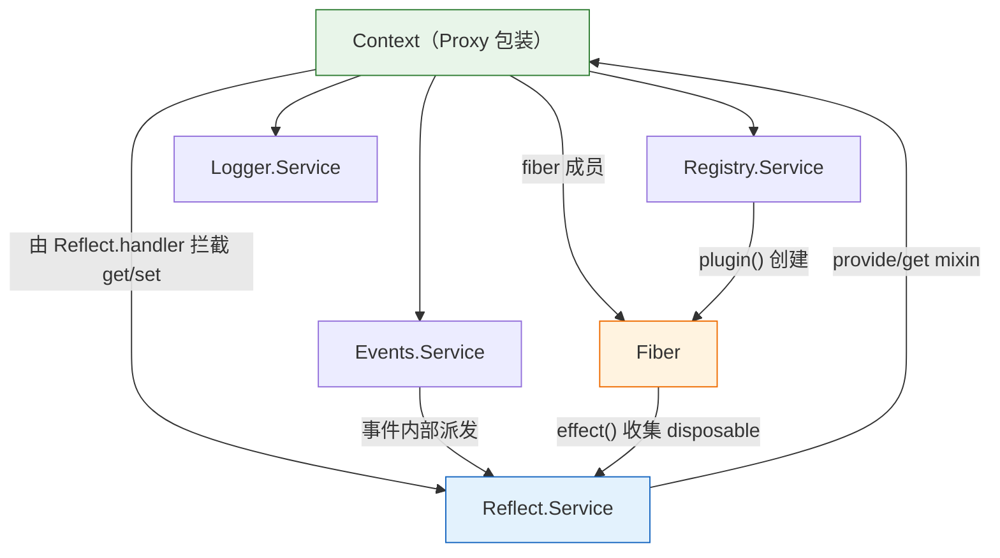

# Cordis — 核心抽象与架构

> 一句话摘要：本章讲解 Cordis 核心库 `packages/core` 的七大核心抽象——`Context`、`Service`、`Fiber`、`Registry`、`Reflect`、`Events`、`Logger`——各自的职责、关键成员与相互协作关系，这是理解后续效应/协同效应机制、生命周期与装配的基础。

---

## 1. 七大核心抽象总览

| 抽象 | 职责 | 关键成员 |
|------|------|---------|
| **Context** | 中心一等对象，承载依赖、效应追踪与事件 | `extend`/`isolate`/`intercept`、`events`/`logger`/`reflect`/`registry`/`fiber` |
| **Service** | 服务的抽象基类，提供依赖注入符号与可调用能力 | `init`/`check`/`config`/`invoke`/`extend`/`tracker`/`resolveConfig` |
| **Fiber** | 单个插件的运行时实例：生命周期状态机 + 效应回收 | `effect`/`dispose`/`await`/`update`/`restart`、`state` |
| **Registry** | 插件注册与运行时管理 | `plugin`/`inject`/`get`/`delete`、`Plugin` 类型 |
| **Reflect** | 通过 Proxy 拦截属性读写、实现依赖注入 | `provide`/`get`/`set`/`accessor`/`mixin`/`notify` |
| **Events** | 事件分发（五种分发模式） | `emit`/`parallel`/`serial`/`bail`/`waterfall`、`on`/`once` |
| **Logger** | 日志记录与导出器 | `exporter`/`buffer`、`Logger` 格式化器 |

---

## 2. Context：上下文

`Context`（`packages/core/src/context.ts`）是 Cordis 的一等核心对象。它的构造过程体现了「统一上下文」的设计（对照第 1 章）：同一个对象既承载效应追踪（`fiber`），又承载协同效应解析（`isolate`/`intercept`）。

```ts
export class Context {
  static readonly effect = symbols.effect
  static readonly filter = symbols.filter
  static readonly isolate = symbols.isolate
  static readonly intercept = symbols.intercept
  // ...
  constructor() {
    this[symbols.isolate] = Object.create(null)
    this[symbols.intercept] = Object.create(null)
    const self = new Proxy<this>(this, ReflectService.handler)
    this.root = self
    this.fiber = new Fiber(self, {}, Object.create(null), null, () => [])
    this.reflect = new ReflectService(self)
    this.registry = new RegistryService(self)
    this.events = new EventsService(self)
    this.logger = new LoggerService(self)
    this.fiber._disposables.clear()
    return self
  }
}
```

**要点**：

1. **Proxy 包装**：`Context` 通过 `new Proxy(this, ReflectService.handler)` 包装，所有属性读写都会被 `ReflectService` 的 `get`/`set`/`has` 拦截（见第 4 章），这是依赖注入「无需声明即可访问服务」的机制来源。
2. **原型链继承**：`extend()` 通过 `Object.create` 派生子上下文，实现配置与隔离的继承。
3. **`isolate` 与 `intercept`**：两个以 `Object.create(null)` 初始化的映射，分别记录「服务隔离键」与「服务配置拦截」。`isolate(name, label)` 与 `intercept(name, config)` 都返回一个 `extend` 后的新子上下文。

```ts
extend(meta = {}): this {
  const shadow = Reflect.getOwnPropertyDescriptor(this, symbols.shadow)?.value
  const self = Object.create(getTraceable(this, this))
  for (const prop of Reflect.ownKeys(meta)) {
    Object.defineProperty(self, prop, Reflect.getOwnPropertyDescriptor(meta, prop)!)
  }
  if (!shadow) return self
  return Object.assign(Object.create(self), { [symbols.shadow]: shadow })
}
```

---

## 3. Service：服务基类

`Service`（`packages/core/src/service.ts`）是所有可注入能力的基类。它定义了一组**唯一符号（unique symbol）**作为服务的「约定方法名」，避免与用户方法冲突：

```ts
export abstract class Service<out T = never> {
  static readonly init: unique symbol = symbols.init
  static readonly check: unique symbol = symbols.check
  static readonly config: unique symbol = symbols.config
  static readonly invoke: unique symbol = symbols.invoke
  static readonly extend: unique symbol = symbols.extend
  static readonly tracker: unique symbol = symbols.tracker
  static readonly resolveConfig: unique symbol = symbols.resolveConfig
  declare [symbols.config]: T
  // ...
}
```

这些符号的语义：

| 符号 | 语义 |
|------|------|
| `init` | 服务的异步初始化（可为 async generator，逐步 `yield` 清理函数） |
| `check` | 一个返回布尔值的谓词，用于判断服务在「当前上下文」是否可用 |
| `config` | 服务的配置类型声明 |
| `invoke` | 使服务实例「可调用」（`createCallable` 包装） |
| `extend` | 派生一个扩展实例 |
| `tracker` | 关联追踪元数据（用于 traceable 代理，见第 4 章） |
| `resolveConfig` | 合并继承链上的拦截配置 |

构造函数中有两个关键动作：

```ts
constructor(protected ctx: Context, name: string) {
  name ??= this.constructor['provide'] as string
  let self = this
  if (self[symbols.invoke]) {
    self = createCallable(name, joinPrototype(Object.getPrototypeOf(this), Function.prototype), tracker)
  }
  self.ctx = ctx
  self.name = name
  defineProperty(self, symbols.tracker, tracker)
  self.ctx.reflect.provide(name, self, this[symbols.check])
  return self
}
```

- 若服务定义了 `invoke`，则它被包装成**可调用函数**（如 `ctx.logger()` 既是服务又可调用）。
- 服务实例通过 `ctx.reflect.provide(name, self, check)` 注册到上下文中，`check` 作为可用性谓词一并提供。

`resolveConfig` 演示了「coeffect 的逐层解析」：沿 `Context.intercept` 的原型链向上收集同名配置并合并：

```ts
[symbols.resolveConfig](base?: T, head?: T): T {
  let intercept = this.ctx[Context.intercept]
  const configs: any[] = []
  while (this.name in intercept) {
    if (Object.hasOwn(intercept, this.name)) configs.unshift(intercept[this.name])
    intercept = Object.getPrototypeOf(intercept)
  }
  if (base) configs.unshift(base)
  if (head) configs.push(head)
  if (this['Config']?.merge) return this['Config'].merge(...configs)
  return Object.assign({}, ...configs)
}
```

---

## 4. Registry：插件注册

`RegistryService`（`packages/core/src/registry.ts`）管理插件的生命周期入口。它定义了三种插件形态（详见第 5 章），并提供统一的 `plugin()` 创建管道：

```ts
plugin(plugin: Plugin, config?: any, getOuterStack = buildOuterStack()) {
  const callback = this.resolve(plugin)
  if (!callback) throw new Error('invalid plugin, expect function or object with an "apply" method, received ' + typeof plugin)
  this.ctx.fiber.assertActive()
  // 创建或复用 Plugin.Runtime，然后建立新的 Fiber
  const fiber = new Fiber(this.ctx, config, Inject.resolve(plugin.inject), runtime, getOuterStack)
  const wrapped = Object.create(fiber) as Fiber & PromiseLike<Fiber>
  wrapped.then = (onFulfilled, onRejected) => fiber.await().then(onFulfilled, onRejected)
  return wrapped
}
```

要点：
- 插件返回值是一个「`Fiber` + PromiseLike」的包装对象，可以 `await` 其激活完成。
- `runtime` 缓存同一回调函数的一个运行时实例，同一插件多次装配共享 `runtime.fibers` 列表。
- `inject`（依赖声明）通过 `Inject.resolve` 归一化为 `Dict`。

---

## 5. Reflect：依赖注入的代理机制

`ReflectService`（`packages/core/src/reflect.ts`）是 Cordis「响应式协同效应」的核心（对照第 1 章）。它提供了：

- `handler`：一个 `ProxyHandler<Context>`，拦截 `get`/`set`/`has`；
- `provide`/`get`/`set`：服务（coeffect）的注册与读取；
- `accessor`：声明访问器属性；
- `mixin`：把某个服务的方法「混入」到 `ctx` 上；
- `notify`：向所有依赖某服务的插件通知变化。

构造时，它把常用服务的方法 mixin 到上下文，使用户能直接写 `ctx.plugin()`、`ctx.on()`、`ctx.effect()`、`ctx.provide()` 等：

```ts
constructor(public ctx: Context) {
  // ...
  this.mixin('reflect', ['get', 'set', 'provide', 'accessor', 'mixin'])
  this.mixin('fiber', ['runtime', 'effect'])
  this.mixin('registry', ['inject', 'plugin'])
  this.mixin('events', ['on', 'once', 'parallel', 'emit', 'serial', 'bail', 'waterfall'])
}
```

`provide` 是核心：它把服务实现注册到 `store`（以 `isolate` symbol 为键），返回一个**逆函数（disposable）**用于撤销注册：

```ts
provide(name: string, value?: any, check?: () => boolean) {
  return this.ctx.fiber.effect(() => {
    // ... 建立 Impl 并写入 store
    return async () => {
      delete this.store[key]
      const fibers = this.notify([name])
      await Promise.allSettled(fibers.map(fiber => fiber.await()))
      delete this.ctx.fiber.store![name]
    }
  }, `ctx.provide(${JSON.stringify(name)})`)
}
```

> **关键对应**：`provide` 的返回值就是论文中的「逆函数」——撤销一次「上下文变换」（注册一个服务）。它同时触发了 `notify`，即「响应式协同效应」中的上下文变化通知。

`notify` 遍历所有已注册插件的所有纤维，检查它们是否 `inject` 了被变更的服务，据此调用 `fiber._checkImpl` 与 `fiber._refresh`（激活/停用）。

---

## 6. Events：五种事件分发模式

`EventsService`（`packages/core/src/events.ts`）定义五种分发模式（`DispatchMode`）：

| 模式 | 语义 | 返回值 |
|------|------|--------|
| `emit` | 同步依次触发所有监听器，不关心返回值 | `void` |
| `parallel` | 并行触发所有监听器，若任一 reject 则抛 `AggregateError` | `Promise<void>` |
| `serial` | 依次 `await` 触发，遇到「非空返回值」即短路 | 首个非空值 |
| `bail` | 同步依次触发，遇到「非空返回值」即短路 | 首个非空值 |
| `waterfall` | 中间件式：每个监听器可调用 `next` 传递控制权 | 链尾返回值 |

`on` 的注册被包装进 `ctx.fiber.effect`，因此**监听器的注销也遵循可逆效应机制**——监听器随所属光纤一起被回收：

```ts
on(name, listener, options) {
  this.ctx.fiber.assertActive()
  listener = this.ctx.reflect.bind(listener)
  const result = this.bail(this.ctx, 'internal/listener', name, listener, options)
  if (result) return result
  const hooks = this._hooks[name] ||= []
  return this.register(label, hooks, listener, options)
}
```

Cordis 自身依赖一批 `internal/` 事件完成协作（如 `internal/plugin`、`internal/status`、`internal/update`、`internal/get`、`internal/set`、`internal/service`）。

---

## 7. Logger：日志与导出器

`LoggerService`（`packages/core/src/logger.ts`）是一个**可调用服务**（`ctx.logger('name')` 返回一个 `Logger`），维护一个 `Message` 缓冲区与多个 `Exporter`（导出器）。

- `exporter(exporter)` 注册一个导出器，返回移除该导出器的逆函数（同样走 `ctx.effect`）。
- 内置一个把消息写入环形缓冲区（`bufferSize = 1000`）的默认导出器。
- `Logger` 通过 `defaultFormatters`（如 `%s`/`%d`/`%o`/`%c` 等 printf 风格占位符）格式化输出。

`LoggerService` 还实现了 `invoke`（因此可被调用），其按当前 `intercept` 解析日志级别与名字：

```ts
[symbols.invoke](name?: string): Logger {
  const config = this._resolveConfig()   // 沿 intercept 链解析
  name ??= hyphenate(fiber.name)
  return new Logger({ name, level: config.level, meta: { fiber: new WeakRef(fiber) } }, this)
}
```

---

## 8. 协作关系图



> **解读**：`Context` 通过 Proxy 委托属性访问给 `ReflectService`，从而让服务访问（coeffect 解析）与依赖注入统一；`RegistryService.plugin` 创建 `Fiber`；`Fiber.effect` 负责收集 disposable，这个「可逆效应」机制被 `Reflect.provide`、`Events.on`、`Logger.exporter` 等大量复用；`EventsService` 用 `internal/*` 事件与 `ReflectService` 协作完成服务变更通知。

---

- [上一章：文件结构与 Monorepo](02-repo-structure.md) | [下一章：效应与协同效应机制](04-effects-coeffects.md) →