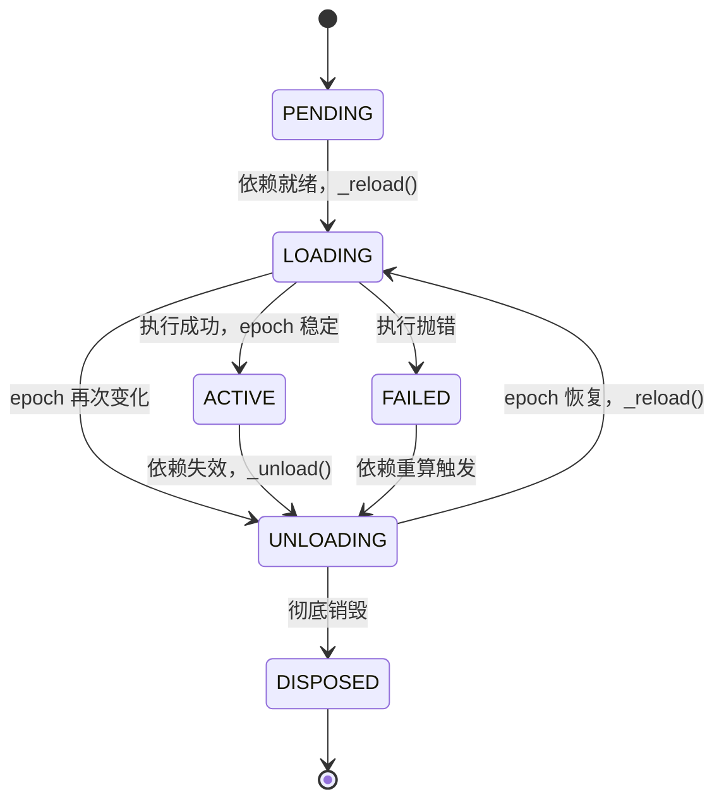

# Cordis — 生命周期与 Fiber 状态机

> 一句话摘要：本章深入讲解 `Fiber`（纤维）——每个插件的运行时实例。它用一个六态状态机管理插件生命周期，用 `ctx.effect()` 收集可逆副作用（disposable），用 `epoch` 机制实现依赖变化触发的自动加载/卸载，并提供 `await`/`restart`/`update` 等控制原语。

---

## 1. Fiber 是什么

在 Cordis 中，`Fiber`（`packages/core/src/fiber.ts`）是**单个插件实例的运行时载体**。每次调用 `ctx.plugin(...)` 都会创建一个新的 `Fiber`（`packages/core/src/registry.ts` 的 `plugin()`）：

```ts
const fiber = new Fiber(this.ctx, config, Inject.resolve(plugin.inject), runtime, getOuterStack)
```

一个 `Fiber` 持有以下关键成员：

| 成员 | 类型 | 职责 |
|------|------|------|
| `ctx` / `context` | `Context` | 该光纤所属的上下文（`runtime` 存在时是父上下文的 `extend` 子上下文） |
| `config` | `any` | 插件配置（经 `resolveConfig` 校验） |
| `inject` | `Dict<any>` | 依赖声明表（`{ name: config \| null }`） |
| `runtime` | `Plugin.Runtime \| null` | 插件运行时（`null` 表示根光纤） |
| `state` | `FiberState` | 生命周期状态 |
| `uid` | `number \| null` | 光纤编号（`null` 表示已销毁） |
| `_disposables` | `DisposableList` | 效应回收列表（可逆副作用） |
| `_runner` | `EffectRunner` | 效应执行器，含 `epoch` 标记 |
| `inertia` | `Promise<void>` | 进行中的加载/卸载任务 |

---

## 2. 六态状态机

`FiberState` 枚举定义了光纤的六个状态（`packages/core/src/fiber.ts`）：

```ts
export const enum FiberState {
  PENDING,    // 0 待激活：依赖未满足或未开始加载
  LOADING,    // 1 加载中
  ACTIVE,     // 2 已激活
  FAILED,     // 3 加载失败
  DISPOSED,   // 4 已销毁
  UNLOADING,  // 5 卸载中
}
```

状态迁移由 `_updateState`、`_setEpoch`、`_reload`、`_unload` 协作完成：



关键状态判定逻辑：

```ts
private _getState() {
  if (this.uid === null) return FiberState.DISPOSED   // 已销毁
  if (this._error) return FiberState.FAILED           // 加载失败
  if (this._runner.epoch !== INACTIVE) return FiberState.ACTIVE  // 有活跃 epoch
  return FiberState.PENDING                           // 否则待激活/已卸载
}
```

> **状态通知**：`_updateState` 只在 `ACTIVE` 与非活跃态之间切换时，对当前光纤自己 `provide` 的服务触发 `reflect.notify`，从而把状态变化广播给依赖它的其它光纤。

---

## 3. 根光纤 vs 普通光纤

`Fiber` 构造器区分两种情形：

- **`runtime` 为 `null`（根光纤）**：`parent` 就是根 `Context` 自身，`uid = 0`，`state = ACTIVE`，`dispose = () => this.restart()`。根光纤永不销毁，`ctx.dispose()` 实际是重启自身。
- **`runtime` 存在（普通光纤）**：创建子上下文 `parent.extend({ fiber: this })`，处理 `inject` 到 `intercept`，通过父光纤的 `effect` 注册自己的销毁逻辑。

```ts
constructor(parent, config, inject, runtime, getOuterStack) {
  if (runtime) {
    // ... 普通光纤的完整初始化
    this.dispose = parent.fiber.effect(() => {
      const remove = runtime.fibers.push(this)
      try { this.config = resolveConfig(runtime, config); this._refresh() }
      catch (error) { this.ctx.logger.error(error); this._error = error }
      return async () => {
        this.uid = null
        // ... 逆序等待所有进行中的 inertia 完成
        while (this.inertia) await this.inertia
      }
    }, 'ctx.plugin()')
  } else {
    // 根光纤
    this.uid = 0
    this.ctx = this.context = parent
    this.state = FiberState.ACTIVE
    this.dispose = () => this.restart()
  }
}
```

> Fiber 的「创建/销毁」本身也是可逆效应：父上下文用 `ctx.effect()` 包裹光纤的初始化与反向销毁，从而保证子光纤也能被干净回收。

---

## 4. `ctx.effect()`：可逆效应的入口

`effect()` 是 Cordis 把论文「可逆效应」落地的核心 API，有同步/异步两种重载：

```ts
effect(execute: () => SyncEffect, label?: string): Disposable<Promise<void>>
effect(execute: () => Effect, label?: string): AsyncDisposable<Promise<void>>
```

支持四种效应返回形态（`Effect` 类型）：

```ts
type SyncEffect<T> =
  | Disposable<T>                                    // 直接返回逆函数
  | Iterable<Disposable<T>, void, void>              // 同步可迭代逐项产生逆

type AsyncEffect<T> =
  | Promise<Disposable<T>>                           // 异步返回逆函数
  | AsyncIterable<Disposable<T>, void, void>         // 异步可迭代逐项产生逆
```

其中 `Disposable<T> = () => T`，即「逆函数」。

### 4.1 逆序回收

`effect()` 内部的 `dispose` 以**逆序**执行收集到的所有逆函数：

```ts
const dispose = () => {
  let task!: void | Promise<void>
  for (const dispose of disposables.splice(0).reverse()) {
    if (task) task = task.then(dispose)
    else { const result = dispose(); if (result && 'then' in result) task = result }
  }
  return task
}
```

`splice(0).reverse()` 保证「后注册先回收」，恰好对应论文中「扭转组合」里逆变换 `g2∘g1` 的栈式语义。

### 4.2 效应元信息

`effect()` 会为每个效应记录 `EffectMeta { label, children }`，形成效应树，用于调试与可观测性：

```ts
interface EffectMeta { label: string; children: EffectMeta[] }
getEffects(): EffectMeta[]
```

---

## 5. epoch：响应式激活/停用的信号

`epoch` 是光纤动态组合的核心「信号」。它是一个字符串，由当前光纤所有依赖服务实现的 `uid` 拼接而成：

```ts
_refresh() {
  let epoch: string | boolean = false
  epoch = ''
  for (const name of Object.keys(this.inject)) {
    const impl = this._store[name]
    if (!impl) { epoch = INACTIVE; break }   // 有依赖未满足 → 标记 INACTIVE
    epoch += ':' + impl.fiber.uid            // 拼接每个依赖服务的实现 uid
  }
  this._setEpoch(epoch)
}
```

- `INACTIVE = '__INACTIVE__'` 是哨兵值，表示「有依赖未满足」。
- 当某个被依赖的服务被重新 `provide`/`set` 时，`ReflectService.notify` 会调用 `fiber._checkImpl` + `fiber._refresh`，重新计算 `epoch`。
- 若 `epoch` 从 `INACTIVE` 变为包含有效 uid（或反之），`_setEpoch` 触发 `_reload`/`_unload`。

```ts
private _setEpoch(epoch: string) {
  const oldEpoch = this._runner.epoch
  if (epoch === oldEpoch) return          // epoch 未变 → 无需处理
  this._runner.epoch = epoch
  if (this.inertia) return                 // 已有进行中任务 → 之后会接力
  this._updateState(() => {
    if (epoch !== INACTIVE && oldEpoch === INACTIVE) {
      this.inertia = this._reload()        // 从非活跃 → 活跃：加载
      return FiberState.LOADING
    } else {
      this.inertia = this._unload()        // 从活跃 → 非活跃：卸载
      return FiberState.UNLOADING
    }
  })
}
```

这正实现了论文的「响应式协同效应」：依赖（coeffect）满足 → 激活（activating），依赖失效 → 停用（deactivating），无关变化 → 中性（neutral，epoch 不变）。

---

## 6. 加载与卸载

### 6.1 `_reload`

```ts
private async _reload() {
  this.store = { ...this._store }
  const oldEpoch = this._runner.epoch
  try {
    await Promise.resolve()
    await this._execute(this._runner)      // 执行插件回调，收集副作用
  } catch (reason) {
    this.ctx.logger.error(reason)
    this._error = reason
    this._runner.epoch = INACTIVE
  }
  // 执行期间 epoch 又变了 → 立即转向卸载
  this._updateState(() => {
    if (this._runner.epoch === oldEpoch) this.inertia = undefined
    else { this.inertia = this._unload(); return FiberState.UNLOADING }
  })
}
```

### 6.2 `_unload`

卸载时逆序执行所有 `_disposables`：

```ts
private async _unload() {
  await Promise.all(this._disposables.clear().map(async (dispose) => {
    try { await composeError(async (info) => { await dispose() }, ...) }
    catch (reason) { this.ctx.logger.error(reason) }
  }))
  this.store = undefined
  this._updateState(() => { ... })
}
```

---

## 7. 控制原语

| 方法 | 语义 |
|------|------|
| `await()` | 等待所有 `inertia` 完成；若加载失败则抛出 `_error` |
| `restart()` | 置 `epoch` 为 `INACTIVE` 再 `_refresh`，重启光纤 |
| `update(config, noSave?)` | 校验新配置，触发 `internal/update` 瀑布再重启 |
| `assertActive()` | 断言当前上下文活跃，否则抛 `INACTIVE_EFFECT` |
| `name` | 沿父链向上查找首个带 `runtime.name` 的光纤，用于标识 |

---

## 8. 与论文「动态组合演算」的对应

论文第 4 项贡献是把可逆效应 + 响应式协同效应组合为「组件」，并赋予生命周期运算语义。`Fiber` 正是这一「组件演算」的实现：

| 论文演算概念 | Fiber 实现 |
|-------------|-----------|
| 组件（component） | `Fiber` 实例 |
| 组件的效应（effect） | `_disposables`（逆序回收列表） |
| 组件的协同效应（coeffect） | `inject` + `_store` |
| 激活/停用迁移 | `_setEpoch` → `_reload`/`_unload` |
| 组合性（composability） | 父光纤用 `effect` 包裹子光纤，构成嵌套可逆结构 |

---

- [上一章：插件系统与依赖注入](05-plugin-system.md) | [下一章：声明式加载与配置合并](07-loader-config.md) →