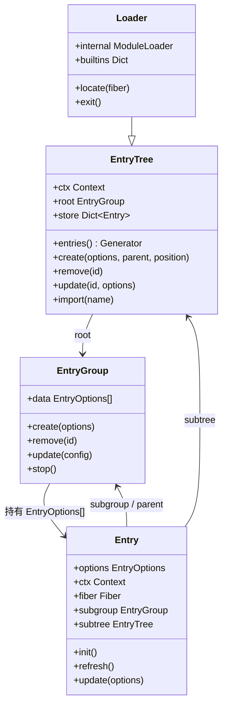

# Cordis — 声明式加载与配置合并

> 一句话摘要：本章讲解 `plugin-loader` 包如何把插件的装配关系声明到 YAML/JSON 配置中，并通过 `Loader`/`Entry`/`EntryGroup`/`EntryTree` 四层结构与 `isolate` 服务隔离机制，实现配置的声明式加载、增量合并与写回。

---

## 1. 声明式装配的核心思想

`plugin-loader`（`packages/loader`）在核心库 `cordis` 之上，提供「**不用写代码也能装配插件**」的能力：插件的装配关系（谁依赖谁、是否禁用、分组、配置）以 YAML/JSON 配置的形式声明，`Loader` 读取解析后，通过 `compute` 找出差异，增量地创建/更新/移除插件实例。

这与「响应式协同效应」一脉相承——装配关系本身也是一种「依赖」，其变化应该被声明式地、增量地应用到运行时。

---

## 2. 四层结构：Loader / EntryTree / EntryGroup / Entry



### 2.1 `Loader`（`src/index.ts`）

`Loader extends EntryTree`，是装配编排的根：

- 提供 `ctx.loader` 服务，供其它包（如 hmr、include）访问。
- `internal`（`ModuleLoader`）通过 `node:module` 内部 API 接入 Node 的 ESM loader，支持跨 Node 22/23/24 版本。
- 监听 `internal/plugin`、`internal/update` 事件，负责把光纤变动与配置 tree 的写回关联起来。

```ts
export class Loader extends EntryTree {
  declare [Service.config]: Loader.Intercept
  public envData = process.env.CORDIS_SHARED ? JSON.parse(process.env.CORDIS_SHARED) : { startTime: Date.now() }
  public name = 'loader'
  public internal = ModuleLoader.fromInternal()
  public builtins: Dict<any> = Object.create(null)
}
```

### 2.2 `EntryTree`（`src/config/tree.ts`）

`EntryTree` 是装配树的根，持有 `root`（根 `EntryGroup`）与 `store`（`id → Entry` 映射）：

- `entries()` 递归 yield 所有 entry（含子树）。
- `create/remove/update` 提供对 entry 的增删改，并触发 `group.tree.write()` 写回。
- `import(name)` 解析模块：支持 `cordis:` 内建前缀、Node 内部 loader，以及普通 `import()`。

### 2.3 `EntryGroup`（`src/config/group.ts`）

`EntryGroup` 持有一组 `EntryOptions[]`，支持分组装配：

```ts
async update(config: EntryOptions[]) {
  const oldMap = Object.fromEntries(oldConfig.map(o => [o.id, o]))
  const newMap = Object.fromEntries(config.map(o => [o.id ?? Symbol('anonymous'), o]))
  const ids = Reflect.ownKeys({ ...oldMap, ...newMap })
  await Promise.all(ids.map(async (id) => {
    if (newMap[id]) await this.create(newMap[id])  // 新增或更新
    else this.remove(id)                            // 移除
  }))
}
```

### 2.4 `Entry`（`src/config/entry.ts`）

`Entry` 是单个插件的装配条目，核心 `EntryOptions`：

```ts
interface EntryOptions {
  id: string
  name: string
  config?: any
  group?: boolean | null      // 是否为分组
  disabled?: boolean | null   // 是否禁用
  inject?: Inject | null
  intercept?: Dict | null     // 服务配置拦截（依赖注入参数化）
  isolate?: Dict<true | string> | null  // 服务隔离
}
```

`Entry.init()` 装配一个插件的完整流程：

```ts
private async _init() {
  exports = await this.parent.tree.import(this.options.name, this.getOuterStack)
  const plugin = this.loader.unwrapExports(exports)
  this._patchContext([])
  this.loader.showLog(this, 'apply')
  this.fiber = this.ctx.registry.plugin(plugin, this._resolveConfig(plugin), this.getOuterStack)
}
```

`Entry.update(options)` 计算 diff，实现**增量合并**：

```ts
async update(options, create = false, force = false) {
  const legacy = { ...this.options }
  // ... 合并 options
  if (this.disabled) { this.fiber?.dispose(); return }
  if (this.fiber?.uid) {
    const diff = Object.keys({ ...this.options, ...legacy })
      .filter(key => !deepEqual(this.options[key], legacy[key]))
    if (!diff.length && !force) return
    this._patchContext(diff)     // diff 不变 → 直接返回，避免无谓重启
  } else {
    await this.init()
  }
}
```

这正是论文「配置合并（Configuration Reconciliation）」的工程化体现：**只有真正变化的配置项才触发重新装配**。

---

## 3. 服务隔离：`isolate`

`isolate`（`src/config/isolate.ts`）解决「同名服务在不同组件间冲突」的问题。它把每个请求的服务名映射为一个 `symbol`，区分不同作用域的实现：

```ts
export abstract class Realm {
  protected store: Dict<symbol> = Object.create(null)
  abstract get suffix(): string
  access(key: string) {
    return this.store[key] ?? Symbol(`${key}${this.suffix}`)
  }
}

export class LocalRealm extends Realm {
  get suffix() { return '#' + this.entry.options.id }   // 每个 entry 独立
}

export class GlobalRealm extends Realm {
  constructor(public label: string) { super() }
  get suffix() { return '@' + this.label }               // 按 label 共享
}
```

- **`isolate: { [name]: true }`** → 使用 `LocalRealm`（该 entry 私有实现）。
- **`isolate: { [name]: 'label' }`** → 使用 `GlobalRealm`（同 label 共享实现）。

`isolate` 插件监听 `loader/patch-context`，在配置变动时计算新旧 symbol 映射的 diff，替换服务的 `reflect.store` 条目并触发 `notify`，实现隔离作用域的增量迁移。

---

## 4. 配置表达式：`interpolate` / `evaluate`

`src/config/utils.ts` 支持在配置中嵌入 **JS 表达式**，实现配置的动态求值：

```ts
export function interpolate(ctx, value) {
  if (isJsExpr(value)) return evaluate(ctx, value.__jsExpr)   // 求值 JS 表达式
  else if (Array.isArray(value)) return value.map(item => interpolate(ctx, item))
  else if (value && typeof value === 'object') return valueMap(value, item => interpolate(ctx, item))
  else return value
}
```

YAML 中通过 `!!js` 标签（由 `include` 包注册）书写表达式，例如被配置字段引用上下文中的服务或变量：

```yaml
plugins:
  - id: greeting
    name: ./greeting
    config:
      prefix: !!js ctx.config.prefix
```

---

## 5. `Include`：配置文件读写（`packages/include`）

`Include extends EntryTree` 把 YAML/JSON 配置文件读取为装配条目，并把运行时变更**写回**文件：

- 支持 `.json` / `.yaml` / `.yml`（可写回）与 `.ts`/`.js`（只读）。
- 通过自定义 YAML `!!js` 类型解析表达式。
- `applyPatches()` 支持在原始配置上打补丁（`insert` 插入、按 `id` 覆盖字段）。
- `write()` 通过「写临时文件再 `rename`」实现原子写回。

```ts
async* [Service.init]() {
  await this.read()                       // 读文件 → this.data
  yield () => this.stop()
  const data = this.applyPatches([...this.data!])
  await this.root.update(data)            // 增量应用到装配树
}

write() {
  this.context.emit('loader/config-update')
  return this.writeFile(this.root.data)   // 写回文件
}
```

---

## 6. `Group`：内部分组插件

`Group`（`packages/group` 只是 re-export `@cordisjs/plugin-loader` 的 `Group`）允许把一组插件作为一个可复用的装配单元：

```ts
export class Group extends EntryGroup {
  static readonly [EntryGroup.key] = true
  constructor(ctx, config) {
    super(ctx, ctx.fiber.entry!.parent.tree)
    ctx.on('internal/update', (config) => this.update(config))
  }
  async* [Service.init]() {
    yield () => this.stop()
    await this.update(this.config)
  }
}
```

---

## 7. Loader 声明模块装配的完整图景


---

- [上一章：生命周期与 Fiber 状态机](06-lifecycle.md) | [下一章：热更新 HMR](08-hmr.md) →