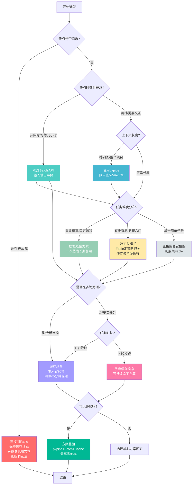

# 场景化选型决策指南

前面三章分别介绍了社区三大开源方案和官方两大优化机制，但"知道有哪些方法"和"知道什么时候用什么方法"是两回事。本章提供实用的if-then决策逻辑，帮助你根据具体场景快速选择最合适的成本优化策略。

## 一、按任务特征选型（三句话指南展开）

社区总结的三句话选型指南看似简单，背后有深刻的成本收益逻辑，下面逐一展开说明。

### 1.1 上下文特别长 → pxpipe

**判断标准**：
- 需要一次性输入整个项目代码库
- 处理大段文档（超过数万字）
- 分析大量日志、JSON数据、配置文件
- 单轮上下文超过10万token

**为什么省得最多**：
pxpipe的核心价值在于利用了图片与文本的计费价差。对于代码、JSON、日志这类高密度内容：
- 文本模式：1个token约装1个字符
- 图片模式：1个token约装3.1个字符

这意味着同样的内容量，通过图片输入可以直接将token消耗压缩到原来的1/3左右，结合Fable 5强大的视觉识别能力，整体账单直降59%~70%。上下文越长、内容越密集，节省比例越高。

**注意事项**：
1. **有损压缩风险**：哈希值、ID、密钥、精确字符串匹配等需要逐字节准确的场景不适用
2. **模型依赖**：专为Fable 5的视觉能力设计（100/100准确率），Opus 4.8误读约7%，其他模型需谨慎测试
3. **高精度场景兜底**：涉及密钥复制、精确ID匹配、配置参数校验时，关键信息仍用文本输入
4. **日常探索任务优先**：代码理解、架构分析、日志排查这类对精度容错较高的探索性任务，放心使用

**典型应用场景**：
- 新接手项目，快速通读整个代码库
- 大规模代码审查，需要理解模块间关系
- 生产环境问题排查，分析数万行日志
- 文档总结，需要处理完整的技术文档

### 1.2 同一类活儿天天重复干 → 技能蒸馏

**判断标准**：
- 固定流程的重复任务（如每日构建、代码格式化、常规CR）
- 批量处理同类问题（如批量重构、批量生成测试用例）
- 项目维护类工作，问题模式高度相似
- 有标准化操作步骤（SOP）的任务

**为什么一次蒸馏长期复用**：
技能蒸馏的本质是知识工程——将Fable 5在解决特定问题时的隐性知识（tacit knowledge）显性化为结构化的skill文件。这个过程：
1. **一次性投入**：订阅期内用Fable 5通读项目、生成skills、评审修复
2. **边际成本递减**：后续同类任务可以用更便宜的模型（Opus甚至更小模型）基于skills完成
3. **知识永久沉淀**：skills保存在项目中，不随模型版本迭代、涨价、退役而消失
4. **团队可复用**：生成的skills团队成员都能使用，不是个人经验

**实施建议**：
1. **抓住订阅窗口**：如果还有订阅额度，优先完成核心项目的技能蒸馏
2. **选择高频场景**：优先蒸馏日常最常用的10-16个场景（调试、构建、架构约定、踩坑记录等）
3. **配合oh-my-fable**：如果需要更工程化的执行框架，考虑使用oh-my-fable获得断点续跑能力
4. **定期更新迭代**：项目演进后，定期用强模型更新skills，保持知识的时效性

**典型应用场景**：
- 新项目启动后，沉淀项目开发规范和常见问题处理手册
- 团队日常开发，统一代码风格和问题解决流程
- 遗留系统维护，将老项目的踩坑经验系统化记录
- CI/CD流程，自动化常规检查和修复任务

### 1.3 团队在用、任务五花八门 → 包工头模式

**判断标准**：
- 多人协作的团队场景
- 任务难度参差不齐（既有架构决策也有简单编码）
- 复杂项目开发，同时存在高价值判断和大量重复性劳动
- 希望将贵模型的token用在"刀刃上"

**为什么按难度派工的成本收益最优**：
Fable 5真正不可替代的是**判断力**——理解复杂需求、做架构决策、识别风险、把控质量。让它亲手敲每一行常规代码、通读几万行日志，等于花天价雇了个打字员，是对高价值能力的严重浪费。

包工头模式通过分层协作实现成本最优：
1. **Fable 5（包工头）**：只做两件事——定策略（写派工单、明确边界和验收标准）、把关（审核结果、判断是否合格）
2. **便宜模型（工人）**：负责具体执行——编码、日志分析、测试用例生成等劳动密集型工作
3. **结果压缩**：工人干完活后压缩成摘要提交，Fable 5只需要看摘要，不需要读完整输出

**安装与使用要点**：
1. **非侵入式安装**：往现有CLAUDE.md追加配置，不替换原有设置，可以随时启用/停用
2. **自带安装器**：项目提供安装脚本，自动复制hooks和skill模板到正确位置
3. **从简单场景开始**：先在低风险任务上试用，熟悉派工-验收流程后再推广
4. **简单任务不要用**：非常简单的单步任务，包工头模式的overhead可能反而增加成本，直接用便宜模型即可

**典型应用场景**：
- 团队开发复杂功能，Fable做架构设计，便宜模型写具体实现
- 大规模重构，Fable制定重构方案和验收标准，便宜模型执行重构
- 生产环境故障排查，Fable判断排查方向，便宜模型查日志找证据
- 代码审查，Fable制定审查标准和重点，便宜模型做初步扫描

## 二、官方技巧适用时机

社区方案需要额外工具或配置，而官方的缓存和批量接口是原生支持的，理解它们的适用时机可以零成本获得显著收益。

### 2.1 缓存续命最佳实践

Prompt Cache是最容易被忽视但ROI极高的优化手段，命中缓存输入直接1折。但缓存机制有其适用边界，用得好省90%，用不好反而多花钱。

#### 什么时候应该保持缓存活跃？

**适用场景**：
1. **子任务间等待时间 < 5分钟**：派子agent执行任务，预计4分钟内能返回，积极保活
2. **连续相似任务**：处理多个短任务，共享同一份系统提示词、工具定义、上下文
3. **交互式编程会话**：边写边调，频繁来回对话，每轮都有大量重复前缀
4. **代码审查多轮反馈**：审查多个文件，上下文基本不变，只是针对不同部分提问

**判断标准**：
- 预计接下来30分钟内会持续有对话
- 重复内容（系统提示词+工具定义+上下文）占比超过50%
- 任务间隙可以通过处理其他工作填充，不需要空等

#### 什么时候应该放弃缓存？

**适用场景**：
1. **长时间运行的大任务 > 30分钟**：单次任务预计跑半小时以上，强行续命不划算
2. **等待期间无其他任务**：派出去的任务需要跑很久，主会话确实没事可干
3. **完全不同的新任务**：上下文完全切换，之前的缓存不再有用
4. **冷启动成本低于续命成本**：计算一下，续命6次空请求的成本 vs 重新冷启动一次的成本，哪个更低

**成本参考计算**：
- 空请求续命：每5分钟一次，每次约100token，半小时6次共600token，按$10/百万token算约$0.006
- 冷启动重付：假设上下文是10万token，1.25倍写入价是$12.5/百万token，一次冷启动约$1.25

看起来续命更便宜？但要注意：
- 如果上下文很大但重复部分少，缓存命中率低，续命收益下降
- 如果任务间隙你需要切换窗口去做别的事，忘了发保活请求，缓存还是会死
- 长时间保持连接可能导致其他稳定性问题

#### 空请求续命的操作要点

如果决定使用空请求续命，注意以下操作要点：

1. **时机精准**：估算子任务完成时间，还差1分钟左右交活时发，不要太早也不要太晚
2. **内容极简**：发"继续"、"等待中"、"保持连接"这类极短请求，几个token就够
3. **频率适度**：间隔4-4.5分钟发一次即可，不要每分钟都发（反而浪费token）
4. **不要机械续命**：如果子任务提前完成了，就不需要发了，灵活调整
5. **结合正事保活**：优先用策略A（顺手处理别的正事），空请求是没有正事时的兜底方案

### 2.2 批量接口适用时机

Batch API将输入输出全部半价，相当于用Fable 5的能力付Opus的价格，但它是异步的，不适合实时场景。

#### 适合使用Batch API的场景

| 场景类型 | 具体例子 | 为什么适合 |
|---------|---------|-----------|
| **离线批处理** | 夜间批量代码重构、批量生成文档 | 不需要即时返回，可以攒到非工作时间处理 |
| **报告生成** | 周报生成、代码覆盖率报告、项目健康度分析 | 结果不需要秒出，可以接受几小时延迟 |
| **大规模代码分析** | 全仓库代码扫描、技术债统计、依赖分析 | 数据量大但时效性要求低 |
| **非紧急任务** | 测试用例批量生成、文档翻译、注释补全 | 什么时候做完什么时候算，不阻塞开发流程 |
| **数据预处理** | 训练数据清洗、日志预处理、数据标注 | 流水线的上游环节，可以异步处理 |

#### 不适合使用Batch API的场景

| 场景类型 | 为什么不适合 |
|---------|-------------|
| **实时对话** | 需要即时响应，交互式沟通无法接受几小时延迟 |
| **交互式编程** | 写代码-看结果-调代码的循环需要快速反馈 |
| **调试过程** | 排查bug需要不断试错、快速迭代，批量处理无法满足 |
| **紧急问题修复** | 生产环境故障需要立即定位解决，等不起批量处理 |
| **需要人工干预** | 任务中途需要人工确认、输入、调整方向的场景 |

#### Batch API使用技巧

1. **攒批量**：把多个能异步的任务攒到一起提交，减少 overhead
2. **错峰执行**：夜间、周末提交，利用空闲时间处理
3. **配合缓存**：批量任务如果有共同前缀，也能享受到缓存优惠，叠加后0.5折
4. **结果回调**：配置好结果通知，任务完成后及时处理，不要让结果堆积

## 三、方案组合建议

单个方案能解决一部分问题，实际使用中往往需要组合多个方案才能达到最优成本效果。以下是针对不同场景的推荐组合策略。

### 3.1 日常开发场景：缓存续命 + 包工头模式

**场景特征**：
- 日常编码、调试、代码审查
- 任务有大有小，持续多轮交互
- 单人开发为主，偶尔处理复杂问题

**组合策略**：
1. **默认开启缓存保活**：所有交互式会话，任务间隙控制在5分钟内，没事也发个空请求续命
2. **复杂任务启用包工头**：遇到需要深度思考的架构问题、复杂bug，让Fable定方案，便宜模型做具体执行
3. **简单任务直接用便宜模型**：一眼就能看明白的简单任务，不要麻烦Fable，直接用Opus或更小模型
4. **pxpipe按需启用**：当需要读大段代码或日志时，临时开启pxpipe，用完可以关掉

**预期效果**：
- 缓存命中带来90%输入成本节省
- 包工头模式减少Fable输出token消耗
- 整体成本降低60%~80%，同时保持开发体验流畅

### 3.2 大型项目分析场景：pxpipe + 批量接口

**场景特征**：
- 需要理解整个代码库架构
- 大规模代码审查、技术债清理
- 项目迁移、重构的前期分析
- 不需要实时交互，可以慢慢来

**组合策略**：
1. **pxpipe处理长上下文**：整个代码库渲染成图片喂入，token消耗直接砍到1/3
2. **分析任务走Batch API**：代码扫描、依赖分析、问题定位这类非实时任务，全部走批量通道，再省50%
3. **缓存能叠则叠**：如果批量任务有共同的系统提示词和上下文前缀，确保缓存命中，叠加0.5折
4. **结果汇总用包工头**：批量分析完拿到一堆结果后，让Fable当包工头，便宜模型整理摘要，Fable做最终总结和建议

**预期效果**：
- pxpipe省70% + Batch省50% + 缓存再省90%，三重折扣叠加
- 整体成本可以降低到原价的10%~15%
- 适合"一次性吃透项目"的场景

### 3.3 项目启动期场景：技能蒸馏 + 缓存

**场景特征**：
- 新项目刚开始搭建
- 还在订阅期（如果有的话）
- 需要快速建立项目规范和最佳实践
- 团队成员需要统一工作方式

**组合策略**：
1. **优先完成技能蒸馏**：趁Fable 5还"在任"，让它通读项目、生成10-16份核心skills
2. **蒸馏过程积极保活**：蒸馏过程是多轮对话，保持缓存活跃，避免反复冷启动
3. **skills评审用包工头**：生成完skills后，让Fable当评审员，派便宜模型做初步校验
4. **建立持续更新机制**：项目开发过程中，定期用强模型更新skills，沉淀新知识

**预期效果**：
- 一次性投入，长期受益
- skills成为团队永久资产，不依赖特定模型
- 后续开发可以用更便宜的模型，边际成本极低

### 3.4 夜间/周末批量处理：包工头 + 批量接口 + 缓存叠加

**场景特征**：
- 下班前攒了一堆非紧急任务
- 周末有时间可以跑大批量处理
- 任务类型多样，有难有易
- 不需要即时看到结果

**组合策略**：
1. **Fable做任务拆分**：下班前让Fable把所有任务梳理一遍，分成"需要判断"和"纯执行"两类
2. **派工单交给Batch**：把拆分好的派工单和具体执行任务，全部打包走Batch API
3. **共享上下文缓存**：所有批量任务共享同一份系统提示词、项目上下文，确保缓存命中
4. **周一早上验收**：周一上班来，Fable统一审核批量处理的结果，不合格的打回重做

**预期效果**：
- Batch 5折 + 缓存1折，输入低至$0.5/百万token
- 利用非工作时间，不占用白天开发资源
- 睡一觉起来任务做完了，成本还极低

### 3.5 紧急故障排查：纯Fable + 谨慎保活，其他都别加

**场景特征**：
- 生产环境出问题了，十万火急
- 需要最快速度定位和解决
- 成本是次要考虑，先解决问题

**组合策略**：
1. **不要折腾花活**：这个时候不要想着pxpipe、包工头、批量接口，直接用Fable
2. **保持缓存活跃**：排查过程是多轮快速对话，保持缓存命中，别因为等日志过期了
3. **关键信息用文本**：报错信息、日志ID、关键配置，直接复制文本，不要用图片，保证准确性
4. **问题解决后再复盘优化**：故障解决后，再考虑怎么优化，战时不要想着省钱

**原则**：紧急情况下，**速度和准确性第一，成本第二**。优化是日常的事，不是救火的时候该考虑的。

## 四、决策流程图

为了帮助快速决策，下面提供一个Mermaid决策树，从任务特征出发，一步步引导到最合适的方案组合。

### 决策树使用说明

1. **从"任务是否紧急"开始判断**：生产故障优先级最高，直接用最稳妥的方式，别想省钱
2. **非紧急任务先看时效性**：能等的走Batch，半价不香吗
3. **实时任务看上下文长度**：特别长的先上pxpipe，这是省得最多的单项
4. **再看任务特征**：重复任务蒸馏，混合任务包工头，简单任务直接用便宜模型
5. **多轮对话一定记得缓存**：这是零成本的90%折扣，不用白不用
6. **长任务（>30分钟）放弃缓存**：续命成本可能高于重开，别折腾
7. **最后检查是否可以叠加**：pxpipe+Batch+Cache三重叠加，能到0.5折，用出比小模型还便宜的价格

## 五、常见选型误区

最后提醒几个容易踩的坑：

1. **"All in One"误区**：不是所有方案都要用上，根据场景选2-3个组合即可，用多了反而增加复杂度
2. **"唯成本论"误区**：成本不是唯一考量，准确性、速度、开发体验同样重要，该花的钱要花
3. **"缓存万能论"误区**：缓存不是银弹，长任务、任务切换频繁的场景收益不大，该放弃就放弃
4. **"pxpipe全场景用"误区**：pxpipe是有损压缩，高精度场景不要为了省钱冒出错的风险
5. **"包工头模式过度使用"误区**：非常简单的单步任务，包工头的overhead反而增加成本，直接干更划算

下一章[核心工程洞察](05-core-insights.md)将超越具体技巧，从方法论层面提炼本次Fable 5定价转型带来的深层启示。

---

## Changelog

<!-- changelog -->
- 2026-07-09 | docs | 初始版本创建，完成场景化选型决策指南章节编写（任务特征选型、官方技巧时机、组合建议、决策流程图、常见误区）
