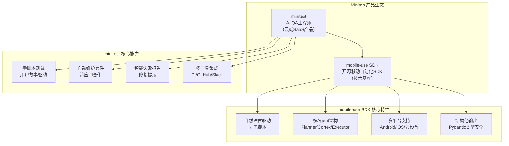

# Minitest & Mobile Use SDK 官方文档完整教程

> **官方文档**: https://www.minitap.ai/docs
> **核心产品**: minitest - 完全自主的AI QA工程师
> **开源SDK**: mobile-use - 开源移动自动化SDK
> **GitHub仓库**: https://github.com/minitap-ai/mobile-use
> **教程生成日期**: 2026-07-07

---

## 教程简介

本教程是 [Minitap.ai](https://www.minitap.ai/) 官方文档的系统化中文翻译与整理，涵盖两大核心模块：

1. **minitest** - Minitap推出的完全自主AI QA工程师产品，实现零脚本、零维护、零flake的移动端自动化测试，在AndroidWorld基准测试中达到100%任务成功率（全球第一）。

2. **mobile-use SDK** - Minitap开源的移动自动化SDK，允许开发者使用自然语言指令控制Android和iOS设备，是minitest产品的技术基础，支持本地部署、平台部署、云设备和BrowserStack等多种运行方式。

本教程将官方文档的零散内容组织为结构化的学习路径，帮助开发者从入门到精通掌握AI驱动的移动端测试技术。

---

## 两大模块概览

---

## 前置知识要求

### minitest 部分
- 基础的移动端应用开发概念（iOS/Android）
- 了解软件测试基本概念（测试用例、回归测试、CI/CD）
- 熟悉GitHub等代码托管平台的基本使用

### mobile-use SDK 部分
- Python 3.12+ 编程基础
- 了解LLM（大语言模型）基本概念和API使用
- 移动端自动化基本概念（ADB、模拟器等）
- 异步编程（async/await）基础

---

## 学习路径建议

### 路径一：minitest 产品使用者（推荐QA/产品/项目经理）

如果您主要使用minitest云端产品进行移动端测试，按以下顺序学习：

1. **第一阶段：入门了解**
   - [minitest入门指南](minitest-mobile-use-wiki/minitest-docs/01-getting-started/00-overview.md)
   - [什么是minitest](minitest-mobile-use-wiki/minitest-docs/01-getting-started/01-what-is-minitest.md)
   - [认识Mini代理](minitest-mobile-use-wiki/minitest-docs/01-getting-started/02-meet-mini.md)
   - [快速开始](minitest-mobile-use-wiki/minitest-docs/01-getting-started/03-quickstart.md)

2. **第二阶段：套件管理**
   - [套件管理总览](minitest-mobile-use-wiki/minitest-docs/02-suite-management/00-overview.md)
   - [用户故事解析](minitest-mobile-use-wiki/minitest-docs/02-suite-management/01-anatomy-of-user-story.md)
   - [编写用户故事](minitest-mobile-use-wiki/minitest-docs/02-suite-management/02-authoring-stories.md)
   - [Mini自动维护套件](minitest-mobile-use-wiki/minitest-docs/02-suite-management/03-mini-maintains-suite.md)

3. **第三阶段：运行与分类**
   - [运行测试总览](minitest-mobile-use-wiki/minitest-docs/03-running-tests/00-overview.md)
   - [提供应用构建](minitest-mobile-use-wiki/minitest-docs/03-running-tests/01-providing-builds.md)
   - [触发运行](minitest-mobile-use-wiki/minitest-docs/03-running-tests/02-triggering-runs.md)
   - [阅读运行报告](minitest-mobile-use-wiki/minitest-docs/03-running-tests/03-reading-run-report.md)
   - [问题分类](minitest-mobile-use-wiki/minitest-docs/04-triage-and-integrations/01-triaging-issues.md)

4. **第四阶段：集成与参考**
   - [集成总览](minitest-mobile-use-wiki/minitest-docs/04-triage-and-integrations/00-overview.md)
   - [Cursor/Claude集成](minitest-mobile-use-wiki/minitest-docs/04-triage-and-integrations/03-cursor-claude-integration.md)
   - [GitHub集成](minitest-mobile-use-wiki/minitest-docs/04-triage-and-integrations/04-github-integration.md)
   - [参考手册](minitest-mobile-use-wiki/minitest-docs/05-reference/00-overview.md)

### 路径二：mobile-use SDK 开发者（推荐开发者/研究员）

如果您希望基于mobile-use SDK进行二次开发或研究，按以下顺序学习：

1. **第一阶段：环境准备**
   - [SDK介绍与安装总览](minitest-mobile-use-wiki/mobile-use-sdk-docs/01-introduction-installation/00-overview.md)
   - [SDK介绍](minitest-mobile-use-wiki/mobile-use-sdk-docs/01-introduction-installation/01-introduction.md)
   - [安装指南](minitest-mobile-use-wiki/mobile-use-sdk-docs/01-introduction-installation/02-installation.md)

2. **第二阶段：快速上手**
   - [快速开始总览](minitest-mobile-use-wiki/mobile-use-sdk-docs/02-quickstarts/00-overview.md)
   - [本地快速开始](minitest-mobile-use-wiki/mobile-use-sdk-docs/02-quickstarts/01-local-quickstart.md)
   - [平台快速开始](minitest-mobile-use-wiki/mobile-use-sdk-docs/02-quickstarts/02-platform-quickstart.md)
   - [云设备快速开始](minitest-mobile-use-wiki/mobile-use-sdk-docs/02-quickstarts/03-cloud-quickstart.md)

3. **第三阶段：核心概念**
   - [核心概念总览](minitest-mobile-use-wiki/mobile-use-sdk-docs/03-core-concepts/00-overview.md)
   - [架构概览](minitest-mobile-use-wiki/mobile-use-sdk-docs/03-core-concepts/01-architecture-overview.md)
   - [Agent核心类](minitest-mobile-use-wiki/mobile-use-sdk-docs/03-core-concepts/02-agent.md)
   - [Builder模式](minitest-mobile-use-wiki/mobile-use-sdk-docs/03-core-concepts/03-builder-pattern.md)
   - [可观测性](minitest-mobile-use-wiki/mobile-use-sdk-docs/03-core-concepts/04-observability.md)
   - [Agent配置](minitest-mobile-use-wiki/mobile-use-sdk-docs/03-core-concepts/05-agent-profiles.md)
   - [任务定义](minitest-mobile-use-wiki/mobile-use-sdk-docs/03-core-concepts/06-tasks.md)

4. **第四阶段：实战与参考**
   - [示例总览](minitest-mobile-use-wiki/mobile-use-sdk-docs/04-examples/00-overview.md)
   - [SDK参考总览](minitest-mobile-use-wiki/mobile-use-sdk-docs/05-sdk-reference/00-overview.md)
   - [故障排除](minitest-mobile-use-wiki/mobile-use-sdk-docs/06-troubleshooting/00-overview.md)

### 路径三：完整学习（推荐技术负责人/架构师）

建议先学习minitest产品理解产品理念和应用场景，再深入mobile-use SDK理解技术实现，最后阅读综合章节：

1. 完成路径一的全部内容
2. 完成路径二的全部内容
3. 阅读综合章节：
   - [常见问题解答](minitest-mobile-use-wiki/faq.md)
   - [最佳实践](minitest-mobile-use-wiki/best-practices.md)
   - [综合术语表](minitest-mobile-use-wiki/glossary.md)
   - [资源链接](minitest-mobile-use-wiki/resources.md)

---

## 完整目录导航

### 第一部分：minitest 官方文档

| 章节 | 子章节 | 标题 | 文件 |
|---|---|---|---|
| 1 | 入门指南 | 入门指南总览 | [minitest-docs/01-getting-started/00-overview.md](minitest-mobile-use-wiki/minitest-docs/01-getting-started/00-overview.md) |
| 1 | 入门指南 | 什么是minitest | [minitest-docs/01-getting-started/01-what-is-minitest.md](minitest-mobile-use-wiki/minitest-docs/01-getting-started/01-what-is-minitest.md) |
| 1 | 入门指南 | 认识Mini代理 | [minitest-docs/01-getting-started/02-meet-mini.md](minitest-mobile-use-wiki/minitest-docs/01-getting-started/02-meet-mini.md) |
| 1 | 入门指南 | 快速开始 | [minitest-docs/01-getting-started/03-quickstart.md](minitest-mobile-use-wiki/minitest-docs/01-getting-started/03-quickstart.md) |
| 2 | 套件管理 | 套件管理总览 | [minitest-docs/02-suite-management/00-overview.md](minitest-mobile-use-wiki/minitest-docs/02-suite-management/00-overview.md) |
| 2 | 套件管理 | 用户故事解析 | [minitest-docs/02-suite-management/01-anatomy-of-user-story.md](minitest-mobile-use-wiki/minitest-docs/02-suite-management/01-anatomy-of-user-story.md) |
| 2 | 套件管理 | 编写用户故事 | [minitest-docs/02-suite-management/02-authoring-stories.md](minitest-mobile-use-wiki/minitest-docs/02-suite-management/02-authoring-stories.md) |
| 2 | 套件管理 | Mini自动维护套件 | [minitest-docs/02-suite-management/03-mini-maintains-suite.md](minitest-mobile-use-wiki/minitest-docs/02-suite-management/03-mini-maintains-suite.md) |
| 3 | 运行测试 | 运行测试总览 | [minitest-docs/03-running-tests/00-overview.md](minitest-mobile-use-wiki/minitest-docs/03-running-tests/00-overview.md) |
| 3 | 运行测试 | 提供应用构建 | [minitest-docs/03-running-tests/01-providing-builds.md](minitest-mobile-use-wiki/minitest-docs/03-running-tests/01-providing-builds.md) |
| 3 | 运行测试 | 触发运行 | [minitest-docs/03-running-tests/02-triggering-runs.md](minitest-mobile-use-wiki/minitest-docs/03-running-tests/02-triggering-runs.md) |
| 3 | 运行测试 | 阅读运行报告 | [minitest-docs/03-running-tests/03-reading-run-report.md](minitest-mobile-use-wiki/minitest-docs/03-running-tests/03-reading-run-report.md) |
| 4 | 分类与集成 | 分类与集成总览 | [minitest-docs/04-triage-and-integrations/00-overview.md](minitest-mobile-use-wiki/minitest-docs/04-triage-and-integrations/00-overview.md) |
| 4 | 分类与集成 | 问题分类 | [minitest-docs/04-triage-and-integrations/01-triaging-issues.md](minitest-mobile-use-wiki/minitest-docs/04-triage-and-integrations/01-triaging-issues.md) |
| 4 | 分类与集成 | Mini建议 | [minitest-docs/04-triage-and-integrations/02-mini-suggestions.md](minitest-mobile-use-wiki/minitest-docs/04-triage-and-integrations/02-mini-suggestions.md) |
| 4 | 分类与集成 | Cursor/Claude集成 | [minitest-docs/04-triage-and-integrations/03-cursor-claude-integration.md](minitest-mobile-use-wiki/minitest-docs/04-triage-and-integrations/03-cursor-claude-integration.md) |
| 4 | 分类与集成 | GitHub集成 | [minitest-docs/04-triage-and-integrations/04-github-integration.md](minitest-mobile-use-wiki/minitest-docs/04-triage-and-integrations/04-github-integration.md) |
| 4 | 分类与集成 | Slack集成 | [minitest-docs/04-triage-and-integrations/05-slack-integration.md](minitest-mobile-use-wiki/minitest-docs/04-triage-and-integrations/05-slack-integration.md) |
| 5 | 参考手册 | 参考手册总览 | [minitest-docs/05-reference/00-overview.md](minitest-mobile-use-wiki/minitest-docs/05-reference/00-overview.md) |
| 5 | 参考手册 | 能力范围 | [minitest-docs/05-reference/01-capabilities.md](minitest-mobile-use-wiki/minitest-docs/05-reference/01-capabilities.md) |
| 5 | 参考手册 | CLI命令 | [minitest-docs/05-reference/02-cli-commands.md](minitest-mobile-use-wiki/minitest-docs/05-reference/02-cli-commands.md) |
| 5 | 参考手册 | 术语表 | [minitest-docs/05-reference/03-glossary.md](minitest-mobile-use-wiki/minitest-docs/05-reference/03-glossary.md) |
| 5 | 参考手册 | MCP工具 | [minitest-docs/05-reference/04-mcp-tools.md](minitest-mobile-use-wiki/minitest-docs/05-reference/04-mcp-tools.md) |
| 5 | 参考手册 | Mini命令 | [minitest-docs/05-reference/05-mini-commands.md](minitest-mobile-use-wiki/minitest-docs/05-reference/05-mini-commands.md) |
| 5 | 参考手册 | GitHub Action | [minitest-docs/05-reference/06-github-action.md](minitest-mobile-use-wiki/minitest-docs/05-reference/06-github-action.md) |

### 第二部分：Mobile Use SDK 官方文档

| 章节 | 子章节 | 标题 | 文件 |
|---|---|---|---|
| 1 | 介绍与安装 | 介绍与安装总览 | [mobile-use-sdk-docs/01-introduction-installation/00-overview.md](minitest-mobile-use-wiki/mobile-use-sdk-docs/01-introduction-installation/00-overview.md) |
| 1 | 介绍与安装 | SDK介绍 | [mobile-use-sdk-docs/01-introduction-installation/01-introduction.md](minitest-mobile-use-wiki/mobile-use-sdk-docs/01-introduction-installation/01-introduction.md) |
| 1 | 介绍与安装 | 安装指南 | [mobile-use-sdk-docs/01-introduction-installation/02-installation.md](minitest-mobile-use-wiki/mobile-use-sdk-docs/01-introduction-installation/02-installation.md) |
| 2 | 快速开始 | 快速开始总览 | [mobile-use-sdk-docs/02-quickstarts/00-overview.md](minitest-mobile-use-wiki/mobile-use-sdk-docs/02-quickstarts/00-overview.md) |
| 2 | 快速开始 | 本地快速开始 | [mobile-use-sdk-docs/02-quickstarts/01-local-quickstart.md](minitest-mobile-use-wiki/mobile-use-sdk-docs/02-quickstarts/01-local-quickstart.md) |
| 2 | 快速开始 | 平台快速开始 | [mobile-use-sdk-docs/02-quickstarts/02-platform-quickstart.md](minitest-mobile-use-wiki/mobile-use-sdk-docs/02-quickstarts/02-platform-quickstart.md) |
| 2 | 快速开始 | 云设备快速开始 | [mobile-use-sdk-docs/02-quickstarts/03-cloud-quickstart.md](minitest-mobile-use-wiki/mobile-use-sdk-docs/02-quickstarts/03-cloud-quickstart.md) |
| 2 | 快速开始 | BrowserStack快速开始 | [mobile-use-sdk-docs/02-quickstarts/04-browserstack-quickstart.md](minitest-mobile-use-wiki/mobile-use-sdk-docs/02-quickstarts/04-browserstack-quickstart.md) |
| 2 | 快速开始 | iOS真机设置 | [mobile-use-sdk-docs/02-quickstarts/05-physical-ios-setup.md](minitest-mobile-use-wiki/mobile-use-sdk-docs/02-quickstarts/05-physical-ios-setup.md) |
| 3 | 核心概念 | 核心概念总览 | [mobile-use-sdk-docs/03-core-concepts/00-overview.md](minitest-mobile-use-wiki/mobile-use-sdk-docs/03-core-concepts/00-overview.md) |
| 3 | 核心概念 | 架构概览 | [mobile-use-sdk-docs/03-core-concepts/01-architecture-overview.md](minitest-mobile-use-wiki/mobile-use-sdk-docs/03-core-concepts/01-architecture-overview.md) |
| 3 | 核心概念 | Agent核心类 | [mobile-use-sdk-docs/03-core-concepts/02-agent.md](minitest-mobile-use-wiki/mobile-use-sdk-docs/03-core-concepts/02-agent.md) |
| 3 | 核心概念 | Builder模式 | [mobile-use-sdk-docs/03-core-concepts/03-builder-pattern.md](minitest-mobile-use-wiki/mobile-use-sdk-docs/03-core-concepts/03-builder-pattern.md) |
| 3 | 核心概念 | 可观测性 | [mobile-use-sdk-docs/03-core-concepts/04-observability.md](minitest-mobile-use-wiki/mobile-use-sdk-docs/03-core-concepts/04-observability.md) |
| 3 | 核心概念 | Agent配置 | [mobile-use-sdk-docs/03-core-concepts/05-agent-profiles.md](minitest-mobile-use-wiki/mobile-use-sdk-docs/03-core-concepts/05-agent-profiles.md) |
| 3 | 核心概念 | 任务定义 | [mobile-use-sdk-docs/03-core-concepts/06-tasks.md](minitest-mobile-use-wiki/mobile-use-sdk-docs/03-core-concepts/06-tasks.md) |
| 4 | 示例 | 示例总览 | [mobile-use-sdk-docs/04-examples/00-overview.md](minitest-mobile-use-wiki/mobile-use-sdk-docs/04-examples/00-overview.md) |
| 4 | 示例 | 简单照片整理器 | [mobile-use-sdk-docs/04-examples/01-simple-photo-organizer.md](minitest-mobile-use-wiki/mobile-use-sdk-docs/04-examples/01-simple-photo-organizer.md) |
| 4 | 示例 | 智能通知助手 | [mobile-use-sdk-docs/04-examples/02-smart-notification-assistant.md](minitest-mobile-use-wiki/mobile-use-sdk-docs/04-examples/02-smart-notification-assistant.md) |
| 4 | 示例 | 应用锁消息处理 | [mobile-use-sdk-docs/04-examples/03-app-lock-messaging.md](minitest-mobile-use-wiki/mobile-use-sdk-docs/04-examples/03-app-lock-messaging.md) |
| 4 | 示例 | 平台任务示例 | [mobile-use-sdk-docs/04-examples/04-platform-task-example.md](minitest-mobile-use-wiki/mobile-use-sdk-docs/04-examples/04-platform-task-example.md) |
| 4 | 示例 | 视频录制分析 | [mobile-use-sdk-docs/04-examples/05-video-recording-analysis.md](minitest-mobile-use-wiki/mobile-use-sdk-docs/04-examples/05-video-recording-analysis.md) |
| 5 | SDK参考 | SDK参考总览 | [mobile-use-sdk-docs/05-sdk-reference/00-overview.md](minitest-mobile-use-wiki/mobile-use-sdk-docs/05-sdk-reference/00-overview.md) |
| 5 | SDK参考 | Agent类 | [mobile-use-sdk-docs/05-sdk-reference/01-agent-class.md](minitest-mobile-use-wiki/mobile-use-sdk-docs/05-sdk-reference/01-agent-class.md) |
| 5 | SDK参考 | AgentConfigBuilder | [mobile-use-sdk-docs/05-sdk-reference/02-agent-config-builder.md](minitest-mobile-use-wiki/mobile-use-sdk-docs/05-sdk-reference/02-agent-config-builder.md) |
| 5 | SDK参考 | TaskRequestBuilder | [mobile-use-sdk-docs/05-sdk-reference/03-task-request-builder.md](minitest-mobile-use-wiki/mobile-use-sdk-docs/05-sdk-reference/03-task-request-builder.md) |
| 5 | SDK参考 | 类型定义 | [mobile-use-sdk-docs/05-sdk-reference/04-types.md](minitest-mobile-use-wiki/mobile-use-sdk-docs/05-sdk-reference/04-types.md) |
| 5 | SDK参考 | 异常类 | [mobile-use-sdk-docs/05-sdk-reference/05-exceptions.md](minitest-mobile-use-wiki/mobile-use-sdk-docs/05-sdk-reference/05-exceptions.md) |
| 6 | 故障排除 | 故障排除总览 | [mobile-use-sdk-docs/06-troubleshooting/00-overview.md](minitest-mobile-use-wiki/mobile-use-sdk-docs/06-troubleshooting/00-overview.md) |
| 6 | 故障排除 | 常见问题排查 | [mobile-use-sdk-docs/06-troubleshooting/01-troubleshooting.md](minitest-mobile-use-wiki/mobile-use-sdk-docs/06-troubleshooting/01-troubleshooting.md) |
| 6 | 故障排除 | 反馈指南 | [mobile-use-sdk-docs/06-troubleshooting/02-providing-feedback.md](minitest-mobile-use-wiki/mobile-use-sdk-docs/06-troubleshooting/02-providing-feedback.md) |

### 第三部分：综合章节

| 章节 | 标题 | 文件 |
|---|---|---|
| 附录A | 常见问题解答（FAQ） | [faq.md](minitest-mobile-use-wiki/faq.md) |
| 附录B | 最佳实践 | [best-practices.md](minitest-mobile-use-wiki/best-practices.md) |
| 附录C | 综合术语表 | [glossary.md](minitest-mobile-use-wiki/glossary.md) |
| 附录D | 资源链接 | [resources.md](minitest-mobile-use-wiki/resources.md) |

---

## 相关资源交叉引用

本教程与项目内其他Wiki文档形成知识体系：

| 文档 | 内容说明 | 链接 |
|---|---|---|
| Minitap.ai官方Wiki完整学习教程 | 产品深度解析、AndroidWorld基准、客户案例、融资报道 | [minitap-official-wiki.md](minitap-official-wiki.md) |
| mobile-use深度学习分析 | SDK技术架构、核心模块深度解析 | [mobile-use-deep-learning-analysis.md](mobile-use-deep-learning-analysis.md) |
| 多代理闭环执行架构 | 架构模式复用参考 | [multi-agent-closed-loop-execution.md](../../../retrospective/patterns/architecture-patterns/multi-agent-closed-loop-execution.md) |
| 规范化坐标抽象 | 跨平台坐标系统一技术 | [normalized-coordinate-abstraction.md](../../../retrospective/patterns/architecture-patterns/normalized-coordinate-abstraction.md) |

---

> **开始阅读**：[minitest入门指南 →](minitest-mobile-use-wiki/minitest-docs/01-getting-started/00-overview.md)
>
> 或者直接从 [Mobile Use SDK介绍开始 →](minitest-mobile-use-wiki/mobile-use-sdk-docs/01-introduction-installation/00-overview.md)
