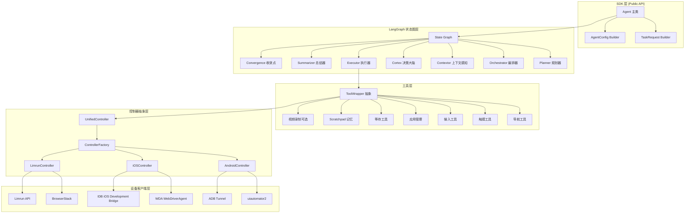
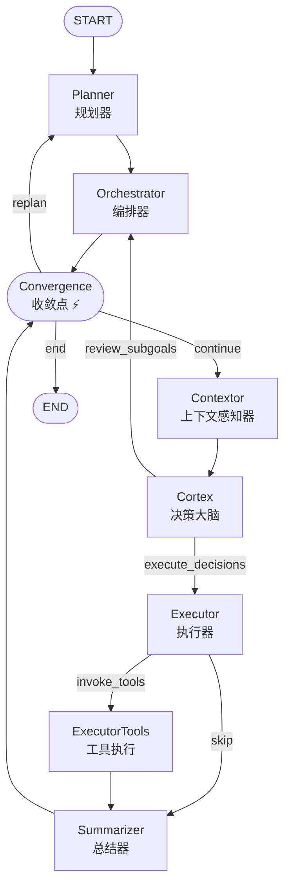
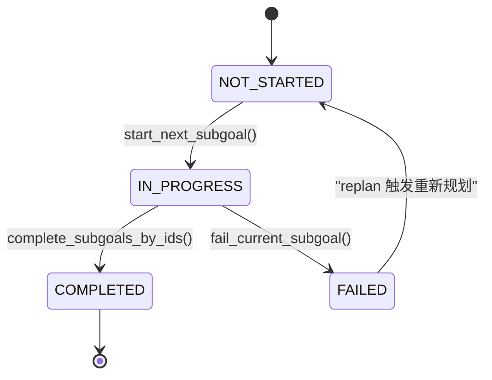
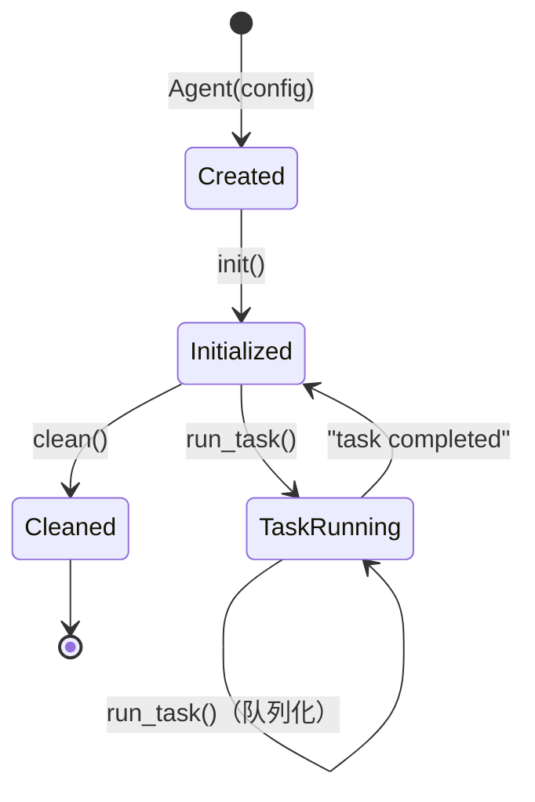

# mobile-use 深度分析：首个 AndroidWorld 100% 准确率的多智能体移动自动化框架架构解析

> **项目地址**: https://github.com/minitap-ai/mobile-use
> **版本**: v3.6.3 (PyPI: minitap-mobile-use)
> **论文**: arXiv:2602.07787 *Do Multi-Agents Dream of Electric Screens?*
> **核心成就**: AndroidWorld 基准测试首个 100% 准确率框架

---

## 📋 目录导航

- [一、执行摘要](#一执行摘要)
- [二、系统架构总览](#二系统架构总览)
- [三、LangGraph 多智能体状态图深度解析](#三langgraph-多智能体状态图深度解析)
- [四、State 状态模型设计](#四state-状态模型设计)
- [五、六大核心智能体职责与协作机制](#五六大核心智能体职责与协作机制)
- [六、设备控制器抽象层设计](#六设备控制器抽象层设计)
- [七、工具系统与包装器模式](#七工具系统与包装器模式)
- [八、SDK 架构与 API 设计](#八sdk-架构与-api-设计)
- [九、LLM 配置体系与多模型策略](#九llm-配置体系与多模型策略)
- [十、关键架构洞察：12 个可复用设计模式](#十关键架构洞察12-个可复用设计模式)
- [十一、AndroidWorld 100% 准确率关键成功因素](#十一androidworld-100-准确率关键成功因素)
- [十二、经验总结与启示](#十二经验总结与启示)
- [十三、Minitap商业产品与开源生态](#十三minitap商业产品与开源生态)
- [十四、待研究问题（Open Questions）](#十四待研究问题open-questions)

---

## 一、执行摘要

### 1.1 项目定位

mobile-use 是由 Minitap 团队开发的开源 AI 移动自动化框架，它通过自然语言指令控制 Android 和 iOS 设备执行复杂任务。该项目最引人注目的成就是：**它是全球首个在 AndroidWorld 基准测试中达到 100% 准确率的框架**，这一里程碑在 arXiv 论文 2602.07787 中正式发表。

### 1.2 技术栈概览

| 层级 | 技术选型 | 用途 |
|------|----------|------|
| **语言** | Python 3.12+ | 主开发语言 |
| **智能体框架** | LangGraph 1.0+ | 多智能体状态图编排 |
| **LLM 框架** | LangChain 1.0+ | LLM 调用抽象层 |
| **数据模型** | Pydantic v2 | 状态结构化与验证 |
| **CLI 框架** | Typer | 命令行接口 |
| **Android 控制** | uiautomator2 + adbutils | UI 层级获取与操作 |
| **iOS 控制** | fb-idb + facebook-wda + Appium | 模拟器/真机双支持 |
| **云真机** | limrun-api + BrowserStack | 云端设备农场集成 |
| **包管理** | uv | 快速 Python 包管理 |
| **Web 服务** | FastAPI + Uvicorn | API 服务 |
| **遥测** | PostHog | 匿名使用数据收集 |

### 1.3 核心能力矩阵

| 能力 | 说明 | 成熟度 |
|------|------|--------|
| 🗣️ 自然语言控制 | 用自然语言描述任务，无需编程 | 生产级 |
| 📱 UI 感知自动化 | 智能识别 UI 元素并导航 | 生产级（游戏除外） |
| 📊 数据抓取 | 从任意 App 提取结构化数据（JSON） | 生产级 |
| 🔧 LLM 可配置 | 支持 OpenAI/Google/Anthropic/MiniMax 等 | 生产级 |
| ☁️ 云真机支持 | Limrun/BrowserStack 云设备集成 | 生产级 |
| 🎥 视频录制分析 | 可选视频录制 + 多模态分析 | Beta |
| 📱 iOS 真机 | WDA 物理设备支持 | 开发中 |

---

## 二、系统架构总览

mobile-use 采用**分层架构设计**，从底层设备控制到上层智能体决策形成清晰的职责划分：



### 2.1 分层设计原则

1. **关注点分离**：每层只负责一个维度的问题
2. **依赖倒置**：上层依赖抽象（UnifiedController），不依赖具体实现
3. **策略模式**：同一接口多种实现（Android/iOS/Limrun 可互换）
4. **工厂模式**：ControllerFactory 根据运行时环境创建正确的控制器实例

---

## 三、LangGraph 多智能体状态图深度解析

mobile-use 的核心是基于 LangGraph 构建的**有向循环图**，实现了"观察-思考-行动-观察"的闭环执行。

### 3.1 执行流程拓扑

基于 `graph.py` 的分析，完整执行流程如下：



### 3.2 八个图节点详解

| 节点 | 类型 | 核心职责 | LLM 调用 |
|------|------|----------|----------|
| **Planner** | Agent 节点 | 将用户目标分解为原子化子目标序列，失败时触发重规划 | ✅ 结构化输出 |
| **Orchestrator** | Agent 节点 | 子目标状态机管理，启动下一个子目标，验证子目标完成 | ✅ 结构化输出 |
| **Convergence** | 函数节点 | 并行执行屏障，defer=True 等待所有入边完成 | ❌ 纯逻辑 |
| **Contextor** | Agent 节点 | 获取 UI 层级树、屏幕截图、前台应用信息、设备时间 | ✅ |
| **Cortex** | Agent 节点 | 核心决策大脑，分析当前状态，生成结构化动作指令 | ✅ 最强模型 |
| **Executor** | Agent 节点 | 将 Cortex 的决策转换为工具调用，处理工具参数 | ✅ |
| **ExecutorTools** | ToolNode | 实际执行工具调用（点击、滑动、输入等） | ❌ 工具执行 |
| **Summarizer** | Agent 节点 | 总结工具执行结果，提取反馈供 Cortex 下一步决策 | ✅ |

### 3.3 三个条件路由函数

#### post_cortex_gate (`graph.py#L60-L74`)

Cortex 执行后的分支决策：

```python
def post_cortex_gate(state: State) -> Sequence[str]:
    node_sequence = []
    if len(state.complete_subgoals_by_ids) > 0 or not state.structured_decisions:
        node_sequence.append("review_subgoals")  # 返回 Orchestrator 审核
    if state.structured_decisions:
        node_sequence.append("execute_decisions")  # 执行动作
    return node_sequence
```

**设计洞察**：这是一个**扇出（fan-out）**模式，可以同时返回两个路径——既审核子目标完成情况，又执行新决策，两者并行。

#### post_executor_gate (`graph.py#L77-L97`)

Executor 执行后的分支：
- 如果生成了 tool_calls → 进入 ExecutorTools 执行工具
- 如果没有工具调用 → 直接进入 Summarizer（可能是认为任务完成或需要重新观察）

#### convergence_gate (`graph.py#L39-L57`)

收敛点的决策逻辑：

| 条件 | 结果 | 含义 |
|------|------|------|
| 任意子目标 FAILURE | replan | 返回 Planner 重新规划 |
| 所有子目标 COMPLETED | end | 任务完成，退出循环 |
| 无运行中子目标 | end | 异常终止保护 |
| 其他情况 | continue | 继续执行循环 |

### 3.4 Convergence 节点的 defer=True 设计

`graph.py#L126` 中 `convergence` 节点设置了 `defer=True`：

```python
graph_builder.add_node(node="convergence", action=convergence_node, defer=True)
```

**设计解析**：
- `defer=True` 是 LangGraph 的高级特性，表示这是一个**屏障节点（barrier）**
- 当有多条入边时，它会等待所有入边的执行都到达后才执行
- 在 mobile-use 中，Orchestrator 和 Summarizer 都会到达 Convergence
- 这确保了在做出 continue/replan/end 决策前，所有并行工作都已完成
- `convergence_node` 本身是一个空函数（返回 `{}`），仅作为同步点使用

---

## 四、State 状态模型设计

State 是整个系统的**唯一真相来源（Single Source of Truth）**，定义在 `state.py`，使用 Pydantic BaseModel 构建。

### 4.1 State 字段五分类

| 分类 | 字段 | Reducer | 用途 |
|------|------|---------|------|
| **规划相关** | `initial_goal` | 默认覆盖 | 用户原始目标描述 |
| | `subgoal_plan` | 默认覆盖 | 当前子目标计划列表 |
| **上下文相关** | `latest_ui_hierarchy` | take_last | 最新 UI 层级树 |
| | `latest_screenshot` | take_last | 最新截图 base64 |
| | `focused_app_info` | take_last | 当前前台应用信息 |
| | `device_date` | take_last | 设备当前时间 |
| **决策相关** | `structured_decisions` | take_last | Cortex 生成的结构化动作 |
| | `complete_subgoals_by_ids` | take_last | 待标记完成的子目标 ID 列表 |
| **执行相关** | `messages` | add_messages | 全局对话历史 |
| | `executor_messages` | add_messages | Executor 独立消息链 |
| | `cortex_last_thought` | take_last | Cortex 给 Executor 的思考 |
| **公共记忆** | `agents_thoughts` | 自定义 | 所有智能体思考链（带前缀） |
| | `remaining_steps` | take_last | 剩余步数限制 |
| | `scratchpad` | take_last | 持久化键值存储 |

### 4.2 Reducer 机制深度解析

LangGraph 通过 `Annotated` 类型注解指定字段的**合并策略（reducer）**：

#### add_messages：消息列表追加

```python
messages: Annotated[list[AnyMessage], "Sequential messages", add_messages]
executor_messages: Annotated[list[AnyMessage], "Sequential Executor messages", add_messages]
```

- 专门用于消息列表，支持消息追加、ID 去重、更新
- Executor 使用独立的消息链而非全局 messages，这是一个关键设计——避免消息历史过长影响推理

#### take_last：覆盖最新值

```python
def take_last(a, b):
    return b
```

- 最简单也是最常用的 reducer：直接用新值覆盖旧值
- 适用于 UI 层级、截图、决策等"只关心最新状态"的字段
- 避免状态无限膨胀

### 4.3 agents_thoughts 思考链可观测性

`state.py#L55-L59` 定义了思考链字段：

```python
agents_thoughts: Annotated[
    list[str],
    "All thoughts and reasons that led to actions",
    take_last,
]
```

思考链通过 `asanitize_update` 方法处理，自动添加智能体名称前缀：

```python
named_thoughts = [f"[{agent}] {thought}" for thought in new]
```

这产生类似这样的输出：
```
[planner] Generated 3 subgoals: Open Gmail → Find unread emails → Extract sender and subject
[cortex] Analyzing UI hierarchy: Gmail inbox is visible, first 3 emails show unread badges
[executor] Tapping on first email to view details
```

### 4.4 Scratchpad：跨应用数据传递机制

`state.py#L62-L66` 的 scratchpad 是一个简单但强大的设计：

```python
scratchpad: Annotated[
    dict[str, str],
    "Persistent key-value storage for notes",
    take_last,
] = {}
```

配合三个工具（save_note/read_note/list_notes），智能体可以：
1. 在 App A 中保存提取的数据（如配方食材）
2. 切换到 App B
3. 读取保存的数据并使用（如添加到购物清单）

**这解决了多智能体系统中跨上下文信息丢失的经典问题。**

---

## 五、六大核心智能体职责与协作机制

### 5.1 Planner：任务规划器

**文件**: `planner.py` | `planner.md`

#### 核心职责

将用户的高层目标分解为**顺序执行的原子化子目标序列**。

#### 子目标分解原则（来自 planner.md）

1. **目的驱动而非操作驱动**：写"打开与 Alice 的对话发送消息"，而非"点击聊天按钮"
2. **顺序依赖**：每个子目标为下一个做准备
3. **避免过度细粒度**：是里程碑级别，不是逐按钮操作
4. **无循环**：不写"重复3次"，而是拆分为3个独立子目标
5. **自校正**：如果有格式要求，最后加一个"验证结果并修正"的子目标

#### 输入输出

| 输入 | 来源 | 输出 |
|------|------|------|
| initial_goal | State | Subgoal 列表（id, description, status） |
| previous_plan | State（replan时） | |
| agent_thoughts | State | |
| 当前前台应用 | 运行时检测 | |

#### 重规划（Replan）机制

当 convergence_gate 检测到失败时：
1. 保留已完成的子目标
2. 将失败的子目标标记为 FAILED
3. 基于 agent_thoughts 中的历史信息重新规划
4. 从当前状态继续，而非从头开始

### 5.2 Orchestrator：子目标编排器

**文件**: `orchestrator.py`

#### 核心职责

管理子目标的生命周期状态机，调度子目标的启动和完成。

#### 子目标状态机



#### 智能决策逻辑

Orchestrator 不是简单的状态机，它本身也是 LLM 调用：
- 当有子目标被 Cortex 标记为待完成时，Orchestrator 会审核完成理由是否充分
- 如果认为理由不充分，可以拒绝完成，让当前子目标继续
- 如果发现计划不可行，可以触发 replan
- 温度设置为 1.0（更高创造性），处理边界情况

### 5.3 Contextor：上下文感知器

**文件**: `contextor.py`

#### 核心职责

作为系统的"眼睛"，在每次决策前收集环境信息：

1. **UI 层级树获取**：通过 uiautomator2/WDA 获取无障碍树
2. **屏幕截图**：base64 编码的截图（用于视觉验证）
3. **前台应用检测**：判断当前在哪个 App
4. **设备时间**：用于时间相关任务（如设置闹钟）
5. **App 锁定守护**：如果配置了 locked_app_package，检测是否离开锁定 App，自动返回

#### 双模态感知设计

Contextor 提供两种互补的感知方式：

| 感知方式 | 优势 | 劣势 |
|----------|------|------|
| **UI 层级树** | 精确的 resource-id、text、bounds 坐标 | 无视觉信息（颜色、图标、遮挡） |
| **截图** | 完整视觉信息，可识别图标/颜色/角标 | 无法精确提取坐标 |

Cortex 被提示必须**结合使用两者**来抵消各自的局限性。

### 5.4 Cortex：决策大脑

**文件**: `cortex.py` | `cortex.md`

#### 核心职责

这是系统的核心大脑，负责：
1. 分析当前 UI 状态
2. 回顾历史思考和失败经验
3. 决定下一步动作
4. 输出结构化的 JSON 决策

Cortex 使用**最强的模型**（默认 GPT-5，recommended 配置用 Gemini-3-Pro）。

#### 五条铁律（CRITICAL RULES）

来自 cortex.md 开头的强制规则：

1. **先回顾思考历史**：检测重复失败→改变策略，发现矛盾，从成功/失败中学习
2. **绝不重复失败动作**：失败后先理解原因，思考"人类会换什么方式解决"
3. **不可预测操作隔离**：back/launch_app/stop_app/open_link 等导航类动作必须单步执行，等待屏幕更新后再决定下一步
4. **只基于观察到的证据完成目标**：绝不"提前"标记完成，必须有 Executor 的反馈确认成功
5. **数据保真优先**：数据抓取任务中精确转录，除非明确要求修改

#### 元素定位 Fallback 链

Cortex 被要求在定位元素时提供**所有可用信息**：

```json
{
  "target": {
    "resource_id": "com.app:id/button",
    "resource_id_index": 0,
    "bounds": {"x": 100, "y": 200, "width": 50, "height": 50},
    "text": "Submit",
    "text_index": 0
  }
}
```

这形成了多级降级策略：
- ID 查找失败 → 尝试 bounds 坐标点击
- bounds 越界（屏幕已变化）→ 尝试 text 文本查找
- 全部失败 → 重新观察，不盲目重试

#### 输出格式

| 字段 | 必填 | 说明 |
|------|------|------|
| complete_subgoals_by_ids | 可选 | 基于观察证据标记完成的子目标 ID |
| structured_decisions | 可选 | 要执行的动作 JSON 数组 |
| decisions_reason | 必填 | 2-4 句话：分析历史→解释决策→说明策略调整 |
| goals_completion_reason | 必填 | 完成子目标的理由，或"None" |

### 5.5 Executor：动作执行器

**文件**: `executor.py` | `tool_node.py`

#### 核心职责

将 Cortex 的结构化决策转换为具体的 LangChain ToolCall，处理参数验证和工具调用。

#### 独立消息链设计

Executor 使用 `executor_messages` 而非全局 `messages`，这是一个重要设计：
- Executor 的历史相对较短（主要是最近的工具调用和结果）
- 避免全局消息链过长导致的上下文污染和成本增加
- 专注于"执行"这一单一职责

### 5.6 Summarizer：结果总结器

**文件**: `summarizer.py`

#### 核心职责

工具执行后，总结执行结果，提取关键反馈信息：
- 工具调用是否成功
- 屏幕发生了什么变化
- 是否达到了预期效果
- 是否需要调整策略

这是循环的最后一步，输出的反馈将供下一轮 Cortex 决策使用。

### 5.7 智能体数据流

```
Initial Goal
    ↓
[Planner] → subgoal_plan
    ↓
[Orchestrator] → 启动第一个子目标
    ↓
┌─────────────────────────────────┐
│  [Contextor] → UI + Screenshot  │ ← 观察
│       ↓                         │
│  [Cortex] → decisions           │ ← 思考
│       ↓                         │
│  [Executor] → tool_calls        │ ← 决策
│       ↓                         │
│  [ExecutorTools] → 执行结果     │ ← 行动
│       ↓                         │
│  [Summarizer] → feedback        │ ← 反思
└─────────────────────────────────┘
    ↓
[Convergence] → 检查所有子目标
    ↓ (continue)
回到 Contextor 开始下一轮
```

---

## 六、设备控制器抽象层设计

控制器层是 mobile-use 实现**跨平台兼容**的关键。

### 6.1 UnifiedController：统一门面

**文件**: `unified_controller.py`

UnifiedController 对外暴露**统一的 15+ 方法**，内部委托给具体的 DeviceController 实现：

| 分类 | 方法 | 说明 |
|------|------|------|
| **点击** | `tap_at(x, y)` | 绝对坐标点击 |
| | `tap_percentage(x%, y%)` | 百分比坐标点击 |
| | `tap_element(resource_id, text, index)` | 元素查找+点击组合 |
| | `long_press` variants | 长按支持 |
| **滑动** | `swipe_coords(start, end, duration)` | 坐标滑动 |
| | `swipe_percentage(...)` | 百分比滑动 |
| | `swipe_request(request)` | 统一滑动请求 |
| **输入** | `type_text(text)` | 输入文本 |
| | `erase_text(nb_chars)` | 删除字符 |
| **导航** | `go_back()` | 返回键 |
| | `go_home()` | Home 键 |
| | `press_enter()` | 回车键 |
| **应用** | `launch_app(package)` | 启动应用 |
| | `terminate_app(package)` | 停止应用 |
| | `open_url(url)` | 打开链接 |
| **查询** | `take_screenshot()` | 截图 |
| | `get_ui_elements()` | 获取 UI 层级 |
| | `find_element(...)` | 查找元素 |

### 6.2 坐标系统：双模式设计

#### CoordinatesSelectorRequest：绝对坐标

```python
@dataclass
class CoordinatesSelectorRequest:
    x: int
    y: int
```

适用于已知精确位置的场景。

#### PercentagesSelectorRequest：百分比坐标

```python
@dataclass
class PercentagesSelectorRequest:
    x_percent: int  # 0-100
    y_percent: int  # 0-100

    def to_coords(self, width: int, height: int) -> CoordinatesSelectorRequest:
        return CoordinatesSelectorRequest(
            x=int(self.x_percent / 100 * width),
            y=int(self.y_percent / 100 * height),
        )
```

**设计洞察**：百分比坐标是**跨设备适配**的关键。无论设备分辨率是 720p 还是 1440p，"点击屏幕中间"始终是 (50%, 50%)。这也是为什么 Cortex 被提示默认使用百分比滑动。

### 6.3 ControllerFactory：工厂模式

**文件**: `controller_factory.py`

根据 MobileUseContext 中的设备信息自动创建正确的控制器：

```python
def get_controller(ctx: MobileUseContext) -> MobileDeviceController:
    if ctx.limrun_android_controller is not None:
        return LimrunAndroidController(ctx)
    if ctx.device.mobile_platform == DevicePlatform.ANDROID:
        return AndroidController(ctx)
    elif ctx.device.mobile_platform == DevicePlatform.IOS:
        return IOSController(ctx)
```

### 6.4 多后端对比

| 特性 | AndroidController | IOSController | LimrunController |
|------|-------------------|---------------|------------------|
| **底层库** | uiautomator2 | WDA/IDB | WebSocket API |
| **连接方式** | USB ADB | USB/网络 | 云端 WebSocket |
| **坐标系统** | ✅ 百分比+绝对 | ✅ 百分比+绝对 | ✅ 百分比+绝对 |
| **UI 层级** | ✅ 完整支持 | ✅ 完整支持 | ✅ 完整支持 |
| **截图** | ✅ | ✅ | ✅ |
| **物理设备** | ✅ USB | ⚠️ WDA 开发中 | ✅ 云端提供 |
| **模拟器** | ✅ Android Studio | ✅ Xcode 模拟器 | N/A |

---

## 七、工具系统与包装器模式

### 7.1 ToolWrapper：延迟初始化+上下文注入

**文件**: `tool_wrapper.py` | [index.py](../../../../../external/tools/scikit-build-core/src/scikit_build_core/file_api/model/index.py#L1-L67)

mobile-use 没有直接创建 LangChain BaseTool 实例，而是使用 **ToolWrapper 模式**：

```python
class ToolWrapper:
    name: str
    tool_fn_getter: Callable[[MobileUseContext], BaseTool]

class CompositeToolWrapper:
    composite_tools_fn_getter: Callable[[MobileUseContext], list[BaseTool]]
```

**为什么这样设计？**

1. **延迟实例化**：Wrapper 是轻量级描述符，实际工具在图构建时通过 `get_tools_from_wrappers(ctx)` 才创建
2. **上下文注入**：工具需要访问 ctx 中的控制器、配置等，Wrapper 允许在创建时注入 ctx
3. **条件启用**：VIDEO_RECORDING_WRAPPERS 根据 `ctx.video_recording_enabled` 决定是否加入
4. **组合工具**：CompositeToolWrapper 允许一个包装器生成多个相关工具

### 7.2 工具注册中心

[index.py#L27-L49](../../../../../external/tools/scikit-build-core/src/scikit_build_core/file_api/model/index.py#L27-L49) 定义了所有可用工具：

```python
EXECUTOR_WRAPPERS_TOOLS = [
    # 导航类
    back_wrapper,
    open_link_wrapper,
    # 触摸类
    tap_wrapper,
    long_press_on_wrapper,
    swipe_wrapper,
    # 输入类
    focus_and_input_text_wrapper,
    erase_one_char_wrapper,
    focus_and_clear_text_wrapper,
    press_key_wrapper,
    # 应用类
    launch_app_wrapper,
    stop_app_wrapper,
    # 等待类
    wait_for_delay_wrapper,
    # 记忆类（Scratchpad）
    save_note_wrapper,
    read_note_wrapper,
    list_notes_wrapper,
]

VIDEO_RECORDING_WRAPPERS = [
    start_video_recording_wrapper,
    stop_video_recording_wrapper,
]
```

### 7.3 工具分类详解

| 分类 | 工具 | 关键设计 |
|------|------|----------|
| **导航** | back | 返回键，被归类为"不可预测操作" |
| | open_link | 处理深度链接（deep link） |
| **触摸** | tap | 支持元素定位+坐标双模式 |
| | long_press_on | 长按，可配置时长（默认 1000ms） |
| | swipe | 支持百分比/坐标，方向记忆口诀（右滑→左页） |
| **输入** | focus_and_input_text | 先聚焦再输入，验证输入反馈 |
| | focus_and_clear_text | 聚焦+清空，失败时 fallback 到长按→全选→删除 |
| | erase_one_char | 逐字符删除 |
| | press_key | 按键事件（Enter/Back/Home 等） |
| **应用** | launch_app | 优先使用 launch_app 而非手动导航到应用 |
| | stop_app | 终止应用 |
| **等待** | wait_for_delay | 固定时长等待，用于页面加载/动画 |
| **记忆** | save_note | 保存键值对到 scratchpad |
| | read_note | 读取保存的笔记 |
| | list_notes | 列出所有笔记 |
| **视频** | start_video_recording | 开始录屏（需 ffmpeg） |
| | stop_video_recording | 停止录屏并分析 |

### 7.4 Scratchpad 记忆工具的设计价值

三个 note 工具实现了一个简单但强大的**跨应用数据传递模式**：

**场景**："从 RecipeApp 复制食材添加到 ShoppingApp 购物清单"

1. Planner 生成子目标：
   - 打开 RecipeApp 找到配方
   - 使用 save_note 保存食材列表
   - 打开 ShoppingApp
   - 使用 read_note 读取并添加到购物清单

2. 即使切换 App 导致 UI 上下文完全改变，数据仍保存在 State.scratchpad 中

---

## 八、SDK 架构与 API 设计

SDK 层定义在 `sdk/` 目录，提供简洁的对外 API。

### 8.1 Agent 生命周期

[agent.py](../../../../../external/anthropics/agent-sdk-workshop/01-guided-demo/agent.py#L88-L1241) 中的 Agent 类遵循清晰的生命周期：



#### 生命周期各阶段

| 阶段 | 方法 | 主要工作 |
|------|------|----------|
| **创建** | `__init__(config)` | 保存配置，初始化平台服务（如有 API key） |
| **初始化** | `init(retry_count, retry_wait)` | 检测设备、初始化客户端、启动服务、健康检查 |
| **任务创建** | `new_task(goal)` | 返回 TaskRequestBuilder（链式配置） |
| **任务执行** | `run_task(request)` | 构建 Context → 构建 Graph → astream 流式执行 → 提取输出 |
| **清理** | `clean()` | 断开设备连接、停止服务、清理临时文件 |

### 8.2 Builder 模式链式配置

SDK 大量使用 Builder 模式提供流畅的 API：

```python
# Agent 配置
config = Builders.AgentConfig.with_default_profile(profile=agent_profile)
    .with_video_recording_tools()
    .with_adb_server(host="localhost", port=5037)
    .with_ios_client_config(ios_config)
    .build()

# Task 配置
task = agent.new_task("打开 Gmail 列出未读邮件")
    .with_output_description("JSON 列表，包含 sender 和 subject")
    .with_locked_app_package("com.google.android.gm")
    .with_max_steps(50)
    .with_trace_recording(path="traces/")
    .with_name("gmail-unread-check")
    .build()
```

### 8.3 双执行路径：本地 vs 云

Agent.run_task() 根据配置自动选择执行路径：

#### 本地执行路径（_run_task）

```
构建 MobileUseContext
    ↓
_prepare_tracing / _prepare_app_lock
    ↓
get_graph(context).astream()  ← LangGraph 流式执行
    ↓
监听四种 stream_mode：
  - values: 完整状态快照
  - updates: 节点增量更新
  - messages: 消息流
  - custom: 自定义事件
    ↓
_extract_output() → outputter 格式化
```

#### 云执行路径（_run_cloud_mobile_task）

```
启动云手机并等待就绪
    ↓
通过 WebSocket 发送任务请求
    ↓
轮询状态更新（on_status_update 回调）
    ↓
接收日志（on_log 回调）
    ↓
返回最终结果
```

### 8.4 异步流式执行

[agent.py#L927-L934](../../../../../external/anthropics/agent-sdk-workshop/01-guided-demo/agent.py#L927-L934) 使用 astream 实现流式输出：

```python
async for chunk in (await get_graph(context)).astream(
    input=graph_input,
    config={"recursion_limit": task.request.max_steps, ...},
    stream_mode=["messages", "custom", "updates", "values"],
):
    stream_mode, payload = chunk
    if stream_mode == "values":
        last_state = State(**payload)
    elif stream_mode == "updates":
        for node_name, node_output in payload.items():
            if "agents_thoughts" in node_output:
                log_agent_thought(node_output["agents_thoughts"][-1])
```

这允许调用方实时观察智能体的思考过程和动作执行。

### 8.5 任务取消与并发控制

```python
async with self._task_lock:
    if self._current_task and not self._current_task.done():
        self.stop_current_task()  # 取消旧任务
        await self._current_task
    self._current_task = asyncio.create_task(_execute_task_logic())
    return await self._current_task
```

- `_task_lock` (asyncio.Lock) 保证同时只有一个任务执行
- `stop_current_task()` 调用 `cancel()` 请求取消
- 支持超时和 KeyboardInterrupt 优雅退出

---

## 九、LLM 配置体系与多模型策略

### 9.1 按智能体分级分配模型

`llm-config.defaults.jsonc` 定义了三套预设配置，核心思想是**按智能体职责分配不同能力等级的模型**：

| 智能体 | 默认模型 (default) | 推荐模型 (recommended) | 设计理由 |
|--------|-------------------|----------------------|----------|
| **Cortex** | GPT-5 (最强) | Gemini-3-Pro Preview | 核心决策需要最强推理能力 |
| **Planner** | GPT-5-nano | Llama-4-Scout | 任务分解相对简单，快速即可 |
| **Orchestrator** | GPT-5-nano | GPT-OSS-120B | 状态管理+审核，中等能力 |
| **Executor** | GPT-5-nano | Llama-3.1-70B | 工具调用，不需要复杂推理 |
| **Contextor** | GPT-5-nano | Llama-3.1-8B | UI 分析，轻量级即可 |
| **Hopper** | GPT-5-nano | GPT-5-nano | 需要 256K 长上下文 |
| **Outputter** | GPT-5-nano | GPT-5-nano | 格式化输出，简单任务 |
| **Video Analyzer** | - (可选) | Gemini-3-Flash | 需要多模态视频理解 |

**成本优化洞察**：只有 Cortex 使用最昂贵的强模型，其他 5 个智能体使用 nano/mini/8B/70B 级别的模型，大幅降低推理成本。这是一个精心设计的**成本-性能权衡**。

### 9.2 Fallback 降级机制

每个智能体都配置了 fallback 模型：

```json
{
  "cortex": {
    "provider": "openai",
    "model": "gpt-5",
    "fallback": {
      "provider": "openai",
      "model": "o4-mini"
    }
  }
}
```

[with_fallback](../../../../../external/anthropics/claude-plugins-official/plugins/security-guidance/hooks/llm.py) 装饰器实现：
1. 先尝试主模型调用
2. 如果失败（超时/错误/速率限制），自动降级到 fallback 模型
3. 保证系统在主模型不可用时仍能运行

### 9.3 多 Provider 抽象层

支持的 LLM Provider：

| Provider | 依赖包 | 特点 |
|----------|--------|------|
| OpenAI | langchain-openai | GPT-5/o4-mini 系列，默认配置 |
| Google | langchain-google-genai, langchain-google-vertexai | Gemini 系列，支持视频分析 |
| Anthropic | langchain-anthropic | Claude 系列 |
| MiniMax | 自定义适配 | MiniMax-M2.7，200K 上下文，国产高性价比 |
| Cerebras | langchain-cerebras | 超快推理速度 |
| Azure AI | langchain-azure-ai | Azure OpenAI 企业部署 |
| OpenRouter (minitap) | OpenAI 兼容接口 | 统一路由到最优开源/闭源模型 |
| 本地模型 | OPENAI_BASE_URL | 任何兼容 OpenAI API 的本地模型 |

---

## 十、关键架构洞察：12 个可复用设计模式

### 洞察 1：任务分解 + 自校正子目标

**模式**：Planner 不只分解任务，还包含"验证结果并修正"的收尾子目标

**解决问题**：AI 执行经常出现"以为成功但实际未成功"的情况。增加自校正步骤让智能体自我审查。

**权衡**：增加了额外的 LLM 调用和步数，但大幅提升准确率。这是 AndroidWorld 100% 的关键因素之一。

### 洞察 2：闭环执行 + 自动重规划

**模式**：convergence_gate 检测失败 → 自动返回 Planner 重新规划

**解决问题**：现实世界充满意外（弹窗、网络错误、UI 变化），不能假设计划一次成功。

**关键设计**：重规划不是从零开始——保留已完成子目标，从失败点继续。agent_thoughts 历史让 Planner 理解之前发生了什么。

### 洞察 3：双模态感知融合

**模式**：UI 层级树（精确坐标）+ 截图（视觉验证）双输入

**解决问题**：单一感知渠道有缺陷——UI 树可能看不到遮挡/弹窗，截图无法提取精确坐标。两者结合互补。

**提示词工程**：Cortex 被明确教导"结合两种感官抵消各自局限"。

### 洞察 4：多级 Fallback 元素定位

**模式**：resource_id → bounds → text → index 四级降级查找

**解决问题**：移动 App UI 动态变化快，单一定位策略容易失败。提供尽可能多的定位信息，运行时逐级尝试。

**提示词强制**：Cortex 被要求每次都提供所有可用字段（resource_id + bounds + text），不能只给一个。

### 洞察 5：不可预测操作隔离原则

**模式**：back/launch_app/open_link/stop_app 等导航操作必须单步执行

**解决问题**：这些操作会彻底改变屏幕内容，如果在同一步做其他事情，后续决策基于过时的观察。

**执行规则**：Cortex 的规则第 3 条明确要求——如果决策包含这些动作之一，它必须是该轮唯一动作。

### 洞察 6：App 锁定沙箱模式

**模式**：locked_app_package 参数限制智能体在指定 App 内活动

**解决问题**：自动化测试和数据抓取任务通常不希望智能体跳出目标 App。Contextor 充当守护进程，检测到离开自动返回。

**用户价值**：防止"智能体走丢"，提高任务可靠性。

### 洞察 7：Scratchpad 轻量级持久记忆

**模式**：dict[str, str] 键值存储 + save/read/list 三个工具

**解决问题**：跨 App 数据传递、中间结果保存、跨步骤信息共享。

**设计简洁性**：没有用复杂的向量数据库或知识图谱，简单的键值对就够用了。这是**简单性优先**原则的体现。

### 洞察 8：控制器抽象 + 多后端无缝切换

**模式**：UnifiedController 统一接口 + ControllerFactory 运行时选择

**解决问题**：Android/iOS/云真机 API 完全不同，上层智能体不应该感知这些差异。

**扩展性**：新增 BrowserStack 或其他云平台只需要添加新的 Controller 实现，无需修改上层代码。

### 洞察 9：工具包装器模式（延迟初始化+上下文注入）

**模式**：ToolWrapper 描述符 → 运行时 get_tools_from_wrappers(ctx) 创建实际工具

**解决问题**：工具需要 ctx（控制器、配置等），但工具列表定义时 ctx 尚不存在。Wrapper 延迟了实例化时机。

**条件启用**：VIDEO_RECORDING_WRAPPERS 根据配置动态加入，不需要的工具不加载。

### 洞察 10：Executor 独立消息链

**模式**：Executor 使用 executor_messages 而非全局 messages

**解决问题**：全局消息历史会越来越长，污染上下文、增加成本。Executor 只需要最近的工具交互历史。

**架构原则**：关注点分离——每个智能体只看到它需要的信息。

### 洞察 11：遥测可观测性设计

**模式**：PostHog 匿名事件收集 + session_id 问题追踪

**解决问题**：开源项目开发者很难知道用户遇到什么问题。匿名遥测收集：
- 任务成功/失败
- 平台类型（Android/iOS）
- 执行步数和时长
- 错误类型

**用户尊重**：首次运行时显式询问同意，可通过环境变量随时关闭。

### 洞察 12：模型分级成本优化策略

**模式**：核心决策用强模型（GPT-5/Gemini-Pro），其他用轻量模型

**解决问题**：如果所有智能体都用 GPT-5，成本会高 5-10 倍。大部分步骤不需要最强推理能力。

**实际配置比**：1 个强模型 : 5 个轻量模型。这是一个经过 benchmark 验证的优化配比。

---

## 十一、AndroidWorld 100% 准确率关键成功因素

基于架构分析，AndroidWorld 基准测试达到完美准确率的关键因素包括：

| 因素 | 贡献度 | 具体实现 |
|------|--------|----------|
| **任务分解策略** | ⭐⭐⭐⭐⭐ | 原子化子目标 + 自校正验证子目标 |
| **自动重规划** | ⭐⭐⭐⭐⭐ | 失败检测→重新规划→从失败点继续 |
| **双模态感知** | ⭐⭐⭐⭐ | UI层级+截图互补，减少观察错误 |
| **元素定位Fallback链** | ⭐⭐⭐⭐ | 四级降级查找应对UI变化 |
| **不可预测操作隔离** | ⭐⭐⭐⭐ | 导航单步执行防级联错误 |
| **思考链历史回顾** | ⭐⭐⭐ | Cortex 先看历史再决策，避免重复错误 |
| **强模型用于核心决策** | ⭐⭐⭐ | Cortex 用 GPT-5/Gemini-Pro |
| **App 锁定机制** | ⭐⭐ | 防止智能体走丢 |
| **结构化输出约束** | ⭐⭐ | with_structured_output 保证 JSON 格式正确 |

---

## 十二、经验总结与启示

### 12.1 多智能体系统设计原则

1. **职责单一原则**：每个 Agent 只做一件事并做好——Planner 只规划，Executor 只执行，不混合职责
2. **闭环优于开环**：永远要有观察→行动→观察的反馈循环，不能假设动作成功
3. **成本意识**：不是所有步骤都需要最强模型，分级使用显著降低成本
4. **失败是常态**：设计时假设每个动作都可能失败，提供降级和重试机制
5. **可观测性优先**：agents_thoughts 思考链让系统行为可追溯、可调试

### 12.2 抽象层设计经验

1. **面向接口编程**：UnifiedController 接口让上层不关心底层是 Android 还是 iOS
2. **工厂模式运行时选择**：ControllerFactory 根据环境自动选择正确实现
3. **延迟初始化**：ToolWrapper 模式解决了"定义时无上下文，执行时有上下文"的矛盾
4. **简单胜于复杂**：Scratchpad 用 dict 而非向量数据库，够用就好

### 12.3 LLM 应用工程实践

1. **结构化输出必选**：with_structured_output() 让 LLM 输出可预测的 JSON，大幅降低解析错误
2. **Fallback 必不可少**：任何 LLM 调用都可能失败，降级策略保证系统鲁棒性
3. **系统提示词是核心资产**：cortex.md 的 5 条 CRITICAL RULES 是无数次试错总结的经验
4. **温度参数因角色而异**：Orchestrator 用 temperature=1.0 处理创造性决策，其他用低温保证确定性

---

## 十三、Minitap商业产品与开源生态

### 13.1 mobile-use开源项目与Minitap公司的关系

mobile-use（minitap-ai/mobile-use）是**Minitap公司**主导开发的开源核心框架，采用开源+商业双轮驱动模式：

| 维度 | mobile-use（开源） | Minitap商业产品 |
|------|-------------------|----------------|
| **定位** | 通用移动自动化引擎 | 企业级QA测试解决方案 |
| **核心能力** | 多智能体架构、设备控制、基础工具集 | 零脚本测试、测试套件自维护、云真机集群、企业级SLA |
| **协议** | Apache 2.0开源协议 | 商业SaaS订阅 |
| **目标用户** | 开发者、研究者、技术爱好者 | 企业QA团队、移动应用开发商 |
| **代码关系** | 基础能力完全开源 | 在开源框架之上构建企业级增值功能 |

开源项目作为技术底座展示了Minitap团队的核心技术实力，通过社区反馈持续迭代核心引擎；商业产品则面向企业真实场景，将前沿技术转化为可落地的生产力工具。

### 13.2 Minitest商业产品简介

基于mobile-use的成熟技术，Minitap推出了旗舰商业产品**Minitest**——AI驱动的零脚本QA Agent平台。

#### 核心价值主张

> "Write zero test scripts. Let AI maintain your test suite."（无需编写测试脚本，让AI自主维护您的测试套件）

#### 两大核心能力

**1. 零脚本QA Agent（Zero-Script QA Agent）**
- 测试人员只需用自然语言描述测试场景（如"验证登录流程：输入正确账号密码后应跳转到首页"）
- AI Agent自动理解需求、探索UI、执行测试、验证结果、报告Bug
- 无需编写Appium/UI Automator等传统自动化脚本，测试用例创建效率提升10倍以上
- 支持回归测试、冒烟测试、兼容性测试等多种测试类型

**2. 自主维护测试套件（Autonomous Test Suite Maintenance）**
- 传统自动化测试的最大痛点：App UI改版后大量测试用例失效，维护成本极高
- Minitest通过AI视觉+UI层级双模态感知，自动适应UI变化
- 元素定位采用多级Fallback策略（与mobile-use同源技术），大幅降低因UI迭代导致的测试失效
- 测试套件自我修复能力，减少80%以上的测试维护工作量

#### 产品架构补充

Minitest在开源mobile-use基础上增加了：
- 企业级测试管理平台（用例管理、报告、仪表盘）
- 大规模云真机集群调度（数千台设备并行测试）
- CI/CD深度集成（Jenkins/GitLab CI/GitHub Actions）
- 团队协作与权限管理
- 企业级SLA保障与技术支持

### 13.3 AndroidWorld 100%基准测试的产品化意义

mobile-use在AndroidWorld基准测试中达到100%准确率，这一里程碑具有深远的商业意义：

**技术可信度背书**
- AndroidWorld是学术界和工业界公认的移动Agent能力基准，涵盖118项真实世界任务
- 100%准确率证明了多智能体架构的鲁棒性，而非实验室条件下的过拟合
- arXiv论文（arXiv:2602.07787）经过同行评审，为技术先进性提供了学术背书

**产品化转化路径**
- 基准测试中的能力（任务分解、失败恢复、跨应用操作）直接对应商业产品的核心需求
- 12个可复用架构模式（见第十章）经过benchmark验证，可直接复用到企业级场景
- 从"能在基准测试中完成任务"到"能在企业App中稳定执行测试"，mobile-use的架构设计预留了足够的扩展空间

**市场竞争壁垒**
- 在Forbes等媒体报道中，Minitap被视为"AI测试领域的OpenAI时刻"
- 先发优势：首个达到100%准确率的框架建立了技术品牌认知
- 开源社区的活跃度持续吸引开发者，形成"开源获客→商业转化"的漏斗

**Forbes报道核心观点**
> Minitap的AI Agent不需要人工标注或脚本维护，能够像人类测试员一样"看"屏幕并操作App，这标志着移动应用测试从"脚本自动化"进入"AI自主测试"的新阶段。

### 13.4 延伸阅读与官方资源

更详细的Minitap公司、产品、融资信息及媒体报道，请参考官方Wiki文档：

📖 **[Minitap官方资料汇总](minitap-official-wiki.md)**

### 13.5 关键来源引用

| 来源类型 | 链接 | 说明 |
|----------|------|------|
| **官方网站** | https://minitap.ai | Minitap公司官网，Minitest产品介绍 |
| **Forbes报道** | （见minitap-official-wiki.md收录） | AI测试领域的商业化报道 |
| **arXiv论文** | https://arxiv.org/abs/2602.07787 | *Do Multi-Agents Dream of Electric Screens?* 技术论文 |
| **GitHub开源仓库** | https://github.com/minitap-ai/mobile-use | mobile-use开源核心框架 |
| **官方文档** | https://docs.minitap.ai | 完整API文档与使用指南 |
| **云平台** | https://platform.mobile-use.ai | 云真机服务控制台 |

---

## 十四、待研究问题（Open Questions）

### 已解答（2026-07-07 补充分析）

1. **~~Hopper 智能体的作用~~** ✅ 已解答
   - Hopper 是一个**工具型智能体**（非主循环节点），用于从批量数据中精确提取特定信息
   - 典型场景：应用包名查找（在数百条应用列表中匹配目标应用）
   - 需要 256K 长上下文（配置中 Hopper 单独指定长上下文模型）
   - 输出结构化：`found: bool, output: str|null, reason: str`
   - 规则：精确匹配优先、不猜测、歧义时返回null

2. **~~Video Analyzer 工作机制~~** ✅ 已解答
   - Video Analyzer 是可选的多模态分析模块，需通过 `with_video_recording_tools()` 启用
   - 工作流程：ffmpeg 录屏 → 视频切片 → Gemini 多模态模型分析
   - 关注内容：UI元素状态、文本内容、动作序列、弹窗通知、界面变化、音频内容
   - 使用时间戳描述事件序列，支持转录/描述/问答/提取四种响应格式
   - 需要支持视频的多模态模型（如 Gemini 系列）

3. **~~MCP 适配器集成~~** ✅ 已解答
   - 通过 `langchain-mcp-adapters>=0.2.0` 依赖集成 Model Context Protocol
   - 允许将外部 MCP Server 提供的工具加载到 mobile-use 的工具系统中
   - 官方文档有专门的 MCP Server 介绍：https://docs.minitap.ai/v2/mcp-server/introduction
   - 这意味着 mobile-use 本身也可以作为 MCP Server 对外暴露移动控制能力

### 待深入研究

4. **Accessibility 服务**：services/accessibility.py 的具体使用场景（Android 无障碍服务增强？）
5. **AndroidWorld 评估方法论**：具体的测试用例设计、评分标准、失败模式分类等细节
6. **outputter 智能体**：最终输出生成的具体 prompt 和格式化逻辑

---

## 参考资源

- **GitHub 仓库**: https://github.com/minitap-ai/mobile-use
- **官方文档**: https://docs.minitap.ai/v2/mcp-server/introduction
- **云平台**: https://platform.mobile-use.ai
- **论文**: arXiv:2602.07787 *Do Multi-Agents Dream of Electric Screens?*
- **Benchmark**: https://minitap.ai/benchmark
- **PyPI**: https://pypi.org/project/minitap-mobile-use/

---

*分析完成日期：2026-07-07（初始版本）*
*补充更新：2026-07-07（解答Hopper/Video Analyzer/MCP集成3个Open Questions，沉淀2个架构模式到patterns库）*
*补充更新：2026-07-07（新增第十三章：Minitap商业产品与开源生态，补充开源-商业双轮模式、Minitest零脚本QA Agent、AndroidWorld产品化意义等商业视角）*
*分析方法：GitHub 网页内容分析 + 本地代码库静态分析（graph/agents/controllers/tools/sdk 核心模块深度阅读）*
*模式沉淀：[normalized-coordinate-abstraction.md](../../../retrospective/patterns/architecture-patterns/normalized-coordinate-abstraction.md)（L2双重验证）、[multi-agent-closed-loop-execution.md](../../../retrospective/patterns/architecture-patterns/multi-agent-closed-loop-execution.md)（L1首次萃取）*
