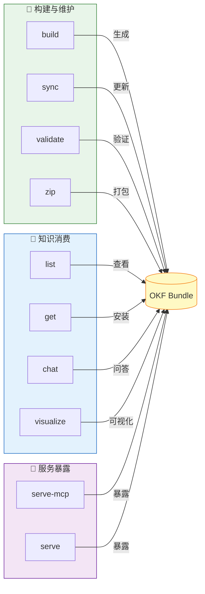

# okf-kit 完全指南 — CLI 命令参考

> 一句话摘要：okf-kit 使用 Python 标准库 argparse 提供 10 个 CLI 子命令，分为构建维护（build/validate/zip/sync）、知识消费（list/get/chat/visualize）和服务暴露（serve-mcp/serve）三类，`okf build --enrich` 可选调用 LLM 为 frontmatter 补充描述和标签。

---

## 1. 命令总览



---

## 2. 全局选项

| 选项 | 说明 |
|------|------|
| `--version` | 显示版本号并退出 |
| `--help` | 显示帮助信息 |
| `<command> --help` | 显示特定子命令的帮助 |

```bash
okf --version          # okf 0.3.3
okf --help             # 显示所有子命令列表
okf build --help       # 显示 build 命令帮助
```

---

## 3. build — 构建知识包

### 用途

从一个 seed URL 开始 BFS 爬取网站，生成符合 OKF 规范的知识包（bundle）。

### 语法

```bash
okf build <URL> [OPTIONS]
```

### 参数

| 参数 | 必需 | 说明 |
|------|------|------|
| `URL` | ✅ | 爬取起始页面 URL（seed URL） |

### 选项

| 选项 | 默认值 | 说明 |
|------|--------|------|
| `-o, --output <DIR>` | 自动从 URL 派生（`<host>-okf`） | 输出目录路径 |
| `--max-depth <n>` | 3 | BFS 最大爬取深度（0=仅 seed 页面） |
| `--max-pages <n>` | 200 | 最大爬取页面数 |
| `--js` | off | 使用 JavaScript 渲染（需要 `okf-kit[js]` extra） |
| `--no-robots` | off（默认遵守 robots.txt） | 忽略 robots.txt |
| `--path-prefix <PATH>` | 自动从 seed 路径推导 | 只爬取该路径前缀下的 URL |
| `--all-paths` | off | 爬取同域所有路径（忽略路径前缀限制） |
| `--enrich` | off | 使用 LLM 补充 frontmatter 的描述和标签（需要 `okf-kit[enrich]` + OPENAI_API_KEY） |
| `--enrich-model <model>` | gpt-4o-mini | `--enrich` 使用的模型 |
| `-v, --verbose` | off | 显示详细爬取日志 |

### 使用示例

**基础用法：**

```bash
# 最小化爬取（默认3层深度、200页）
okf build https://docs.example.com -o my-docs

# 控制爬取范围
okf build https://docs.example.com/guide/ -o guide-bundle \
    --max-depth 2 \
    --max-pages 50
```

**爬取 JS 渲染站点（SPA）：**

```bash
pip install 'okf-kit[js]'
okf build https://spa-docs.example.com -o spa-docs --js
```

**爬取同域所有路径：**

```bash
okf build https://example.com -o full-site --all-paths --max-pages 500
```

**自定义路径前缀：**

```bash
okf build https://docs.example.com/index.html -o api-docs \
    --path-prefix /api/ \
    --max-depth 3
```

**构建后 LLM 富化：**

```bash
export OPENAI_API_KEY=sk-...
okf build https://docs.example.com -o my-docs --enrich
```

### 输出

构建完成后输出摘要（与 validate 合并）。使用 `-v` 可看到每页爬取详情。

### 工作流程

1. 根据 seed URL 推导输出名称和路径前缀（如未显式指定）
2. 创建输出目录和 `.okf-kit/` 状态目录
3. 根据是否指定 `--js` 选择 HttpFetcher 或 BrowserFetcher
4. BFS 爬取：同域+路径前缀限制，遵守 robots.txt（除非 `--no-robots`）
5. 对每个页面：提取正文→转换 Markdown→计算 content hash→写入文件
6. 爬取完成后，为每个目录生成/更新 index.md
7. 写入构建日志 log.md
8. 保存 state.json（含 URL 映射、content hash、链接边等）
9. 运行 OKF 规范验证
10. 如果指定 `--enrich`，调用 LLM 为每页补充 description 和 tags

### 注意事项

- 爬取深度从 seed URL 开始计算（seed 页面为深度 0）
- 默认只爬取 seed URL 同路径前缀下的页面（防止漫游到整站）
- 默认遵守 robots.txt，使用 `--no-robots` 可绕过（请注意合规性）
- 短页面会自动检测 JS 渲染需求并提示安装 `[js]` extra
- `--enrich` 需要 OPENAI_API_KEY 环境变量

---

## 4. validate — 验证规范

### 用途

验证 bundle 是否符合 OKF v0.1 规范。

### 语法

```bash
okf validate <DIRECTORY> [OPTIONS]
```

### 参数

| 参数 | 必需 | 说明 |
|------|------|------|
| `DIRECTORY` | ✅ | bundle 目录路径或名称 |

### 选项

| 选项 | 默认值 | 说明 |
|------|--------|------|
| `--quiet` | off | 静默模式，仅通过退出码表示结果 |

### 使用示例

```bash
# 验证 bundle
okf validate my-docs

# 在脚本中使用（静默模式）
okf validate my-docs --quiet && echo "Valid" || echo "Invalid"
```

### 退出码

| 退出码 | 含义 |
|--------|------|
| 0 | 验证通过 |
| 3 | 验证失败（存在 Error） |

---

## 5. zip — 打包分发

### 用途

将 bundle 打包为 zip 文件，用于分享或发布到 Registry。

### 语法

```bash
okf zip <DIRECTORY> [OPTIONS]
```

### 参数

| 参数 | 必需 | 说明 |
|------|------|------|
| `DIRECTORY` | ✅ | bundle 目录路径或名称 |

### 选项

| 选项 | 默认值 | 说明 |
|------|--------|------|
| `-o, --output <FILE>` | `<name>.zip` | zip 输出路径 |

### 使用示例

```bash
# 打包（输出 my-docs.zip）
okf zip my-docs

# 指定输出路径
okf zip my-docs -o ./dist/my-docs-v1.0.zip
```

---

## 6. sync — 增量同步

### 用途

对已构建的 bundle 执行增量更新，仅重新爬取变更页面。

### 语法

```bash
okf sync <DIRECTORY> [OPTIONS]
```

### 参数

| 参数 | 必需 | 说明 |
|------|------|------|
| `DIRECTORY` | ✅ | bundle 目录路径或名称 |

### 选项

| 选项 | 默认值 | 说明 |
|------|--------|------|
| `--max-depth <n>` | 沿用构建时设置 | 覆盖爬取深度 |
| `--max-pages <n>` | 沿用构建时设置 | 覆盖页面数上限 |
| `--force` | off | 即使重新爬取页面数不足原来的一半也强制执行 |

### 使用示例

```bash
# 增量同步
okf sync my-docs

# 覆盖页面数限制
okf sync my-docs --max-pages 500

# 强制同步（页面大幅减少时也执行）
okf sync my-docs --force
```

### 增量判断逻辑

sync 为每个页面计算 Markdown 内容的 SHA-256 hash，与 state.json 中存储的旧 hash 比较：

| 情况 | hash 对比 | 操作 |
|------|----------|------|
| **Added** | 新 URL（不在旧映射中） | 写入新文件 |
| **Changed** | hash 不同 | 重写文件 |
| **Removed** | 旧 URL 不再出现在爬取结果中 | 删除概念文件 |
| **Unchanged** | hash 相同 | 保持字节级不变 |

### 安全阈值

默认情况下，如果重新爬取的页面数少于原来的 50%（且原 bundle > 4 页），sync 会中止并报错。这是为了防止网络故障导致误删所有页面。使用 `--force` 可覆盖此保护。

---

## 7. list — 列出 bundle

### 用途

列出本地已安装的 bundle，或查看 Registry 中可用的 bundle。

### 语法

```bash
okf list [OPTIONS]
```

### 选项

| 选项 | 默认值 | 说明 |
|------|--------|------|
| `--remote` | off | 列出 Registry 中的可用 bundle（而非本地） |
| `--registry <URL>` | 默认 awesome-okf-kit | 指定自定义 registry.yaml 的 URL 或路径 |

### 使用示例

```bash
# 列出本地已安装的 bundle
okf list

# 查看 Registry 中可安装的 bundle
okf list --remote
```

---

## 8. get — 从 Registry 安装

### 用途

从 Registry 下载并安装预构建的 bundle。

### 语法

```bash
okf get <NAME> [OPTIONS]
```

### 参数

| 参数 | 必需 | 说明 |
|------|------|------|
| `NAME` | ✅ | Registry 中的 bundle 名称 |

### 选项

| 选项 | 默认值 | 说明 |
|------|--------|------|
| `--registry <URL>` | 默认 awesome-okf-kit | 指定自定义 registry.yaml URL 或路径 |
| `-y, --yes` | off | 跳过下载确认提示 |

### 使用示例

```bash
# 安装一个 bundle（会有确认提示）
okf get react-docs

# 跳过确认直接安装
okf get react-docs -y
```

### 安装流程

1. 从 Registry 获取 registry.yaml
2. 查找指定 bundle 的下载 URL
3. 显示 bundle 信息并等待确认（除非 `-y`）
4. 下载 zip 文件
5. 解压到 `~/.okf/bundles/<name>/`
6. 运行 validate 验证
7. 报告安装结果

---

## 9. chat — 对话问答

### 用途

基于 bundle 内容进行问答对话。无 LLM Provider 配置时使用关键词检索回退模式；配置 Provider 后使用 Agent 式导航问答。

### 语法

```bash
okf chat <BUNDLE> [OPTIONS]
```

### 参数

| 参数 | 必需 | 说明 |
|------|------|------|
| `BUNDLE` | ✅ | bundle 名称或目录路径 |

### 选项

| 选项 | 默认值 | 说明 |
|------|--------|------|
| `--provider <name>` | none（零Key检索） | LLM 提供商：openai / ollama / openrouter / anthropic / custom |
| `--model <name>` | 提供商默认 | 模型名称 |
| `--base-url <url>` | 提供商默认 | 自定义 OpenAI 兼容端点 URL |
| `--trace` | off | 显示 Agent 的导航轨迹（工具调用过程） |
| `--resume` | off | 恢复最近一次对话会话 |
| `--history` | off | 列出已保存的会话并退出 |

### 使用示例

**零 Key 检索（无需任何配置）：**

```bash
okf chat my-docs
# 进入交互模式，直接输入问题
```

**使用 Ollama（完全离线）：**

```bash
okf chat my-docs --provider ollama --model llama3.1
```

**使用 OpenAI：**

```bash
okf chat my-docs --provider openai --model gpt-4o-mini
```

**使用自定义端点：**

```bash
okf chat my-docs --provider custom \
    --base-url http://localhost:8000/v1 \
    --model my-model
```

**追踪 Agent 导航过程：**

```bash
okf chat my-docs --provider ollama --trace
```

**恢复上次对话：**

```bash
okf chat my-docs --resume
```

**查看历史会话：**

```bash
okf chat my-docs --history
```

### API Key 配置

API Key 通过环境变量提供：
- `OPENAI_API_KEY` — OpenAI
- `ANTHROPIC_API_KEY` — Anthropic
- `OPENROUTER_API_KEY` — OpenRouter
- Ollama 无需 API Key

也可通过 `okf serve` 的设置界面（keyring 存储）配置 Key。

### 对话模式

| 模式 | 触发条件 | 行为 |
|------|---------|------|
| **零 Key 检索** | 无 Provider（默认） | 关键词搜索 bundle，返回最相关段落及引用来源 |
| **Agent 导航** | 配置了 LLM Provider | LLM 通过 list_directory/read_concept 工具逐级导航后回答 |

---

## 10. visualize — 知识图谱可视化

### 用途

生成自包含的 HTML 知识图谱文件，可视化 bundle 中的概念页面和页面间链接关系。

### 语法

```bash
okf visualize <DIRECTORY> [OPTIONS]
```

### 参数

| 参数 | 必需 | 说明 |
|------|------|------|
| `DIRECTORY` | ✅ | bundle 目录路径或名称 |

### 选项

| 选项 | 默认值 | 说明 |
|------|--------|------|
| `-o, --output <FILE>` | `<bundle>/graph.html` | HTML 输出路径 |

### 使用示例

```bash
# 生成可视化（输出到 bundle/graph.html）
okf visualize my-docs

# 指定输出路径
okf visualize my-docs -o ./graph.html

# 在浏览器中打开
# Windows: start my-docs\graph.html
# macOS: open my-docs/graph.html
```

---

## 11. serve-mcp — MCP 服务器

### 用途

启动 stdio MCP（Model Context Protocol）服务器，向 Claude Code/Claude Desktop/Cursor 等支持 MCP 的 AI 客户端暴露 bundle 读取工具。

### 语法

```bash
okf serve-mcp [NAMES...] [OPTIONS]
```

### 参数

| 参数 | 必需 | 说明 |
|------|------|------|
| `NAMES...` | 可选 | 要服务的 bundle 名称或目录（不指定则服务所有本地 bundle） |

### 选项

| 选项 | 默认值 | 说明 |
|------|--------|------|
| `--all` | off | 服务所有本地 bundle |

### 使用示例

```bash
# 服务单个 bundle
okf serve-mcp my-docs

# 服务多个 bundle
okf serve-mcp react-docs python-docs

# 服务所有本地 bundle
okf serve-mcp --all
```

> 需要安装 `[mcp]` extra：`pip install 'okf-kit[mcp]'`

### MCP 工具

启动后暴露 4 个工具：

| 工具 | 功能 |
|------|------|
| `list_bundles` | 列出可用 bundle |
| `list_directory` | 列出 bundle 内目录 |
| `read_concept` | 读取概念文件 |
| `search_bundle` | 关键词搜索 |

### 配置到 Claude Code

```bash
claude mcp add okf-docs -- okf serve-mcp my-docs
```

或编辑配置文件：

```json
{
  "mcpServers": {
    "okf-docs": {
      "command": "okf",
      "args": ["serve-mcp", "my-docs"]
    }
  }
}
```

---

## 12. serve — HTTP API 服务

### 用途

启动本地 loopback-only HTTP API 服务器，提供 REST API 和 SSE 流式输出，供桌面 GUI（如 okf-desktop）使用。

### 语法

```bash
okf serve [OPTIONS]
```

### 选项

| 选项 | 默认值 | 说明 |
|------|--------|------|
| `--host <host>` | 127.0.0.1 | 绑定地址 |
| `--port <n>` | 0（自动选择空闲端口） | 监听端口 |
| `--token <str>` | auto（随机生成） | Bearer 认证 token |
| `--ui <dir>` | 无 | 挂载静态 UI 文件目录到根路径 |
| `--parent-pid <n>` | 无 | 父进程 PID（父进程退出时自动关闭服务） |

### 使用示例

```bash
# 启动服务（自动选择端口和token）
okf serve

# 指定端口和固定token
okf serve --port 8000 --token my-secret-token
```

### 启动输出

```json
{"event": "ready", "url": "http://127.0.0.1:52341", "token": "a1b2c3d4e5f6...", "pid": 12345}
```

所有 `/api/*` 端点需要 Bearer token 认证（`Authorization: Bearer <token>` 头或 `?token=` 查询参数）。

> 需要安装 `[serve]` extra：`pip install 'okf-kit[serve]'`

---

## 13. 命令速查表

| 命令 | 用途 | 核心选项 | 需 Extra |
|------|------|---------|---------|
| `okf build URL` | 爬取网站生成 bundle | `-o`, `--max-depth`, `--max-pages`, `--js`, `--all-paths`, `--path-prefix`, `--enrich` | `--js` 需 `[js]`; `--enrich` 需 `[enrich]` |
| `okf validate DIR` | 验证 OKF 规范 | `--quiet` | 无 |
| `okf zip DIR` | 打包为 zip | `-o` | 无 |
| `okf sync DIR` | 增量更新 | `--max-depth`, `--max-pages`, `--force` | 无 |
| `okf list` | 列出 bundle | `--remote`, `--registry` | 无 |
| `okf get NAME` | 从 Registry 安装 | `--registry`, `-y` | 无 |
| `okf chat BUNDLE` | 对话问答 | `--provider`, `--model`, `--base-url`, `--trace`, `--resume` | LLM 需 `[chat]`/`[anthropic]` |
| `okf visualize DIR` | 生成知识图谱 | `-o` | 无 |
| `okf serve-mcp` | 启动 MCP 服务 | `--all` | `[mcp]` |
| `okf serve` | 启动 HTTP API | `--host`, `--port`, `--token`, `--ui` | `[serve]` |

---

## 14. 退出码约定

| 退出码 | 含义 |
|--------|------|
| 0 | 成功 |
| 2 | 命令未实现或缺少依赖 extra |
| 3 | validate 验证失败 |

---

- [← 上一章：安装与配置](01-installation.md) | [下一章：OKF 格式与 Bundle 结构](03-okf-format.md) →
