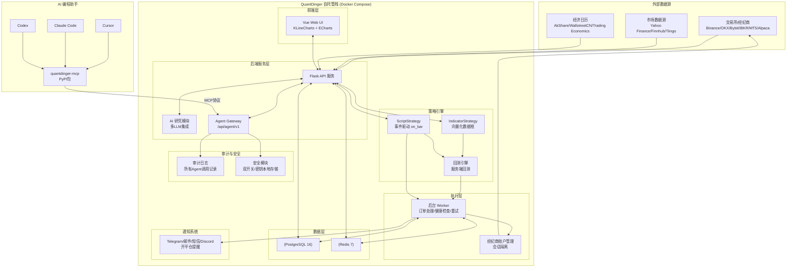

# QuantDinger：开源AI量化交易基础设施层完整教程

> 原文：微信公众号文章《QuantDinger：开源的AI量化交易基础设施层》by 极客之家
> 原文链接：https://mp.weixin.qq.com/s/TGzgit_T5Ul0-Z89D1dFQA
> GitHub仓库：https://github.com/brokermr810/quantdinger
> 创建日期：2026-07-04

---

## 目录导航

- [一、项目概述与定位](#一项目概述与定位)
- [二、快速上手](#二快速上手)
- [三、系统架构](#三系统架构)
- [四、核心功能一：AI研究集成](#四核心功能一ai研究集成)
- [五、核心功能二：双轨策略开发](#五核心功能二双轨策略开发)
- [六、核心功能三：回测与实盘执行](#六核心功能三回测与实盘执行)
- [七、核心功能四：多市场支持](#七核心功能四多市场支持)
- [八、【重点章节】MCP Agent Gateway深度解析](#八重点章节mcp-agent-gateway深度解析)
- [九、【重点章节】安全模型与自托管架构](#九重点章节安全模型与自托管架构)
- [十、界面UI概览](#十界面ui概览)
- [十一、项目评价与适用人群](#十一项目评价与适用人群)
- [十二、深度洞察与可复用模式萃取](#十二深度洞察与可复用模式萃取)
- [十三、常见问题FAQ](#十三常见问题faq)
- [十四、术语表](#十四术语表)
- [十五、相关资源链接](#十五相关资源链接)

---

## 一、项目概述与定位

### 1.1 项目简介

QuantDinger是一个**自托管的AI量化交易平台**，作者为brokermr810。它将AI研究、策略编写、回测、模拟盘、实盘执行、监控全链路整合进一个Docker Compose栈中，用户的代码、数据、密钥全部运行在自己的机器上。

项目采用**Apache 2.0**开源协议，后端源码完全开放，前端源码需要单独授权。

### 1.2 核心定位

QuantDinger将自己定位为"**开源的AI量化交易基础设施层**"，它既不是那种只提供API包装的简单库，也不是那种必须将API密钥交给第三方SaaS的黑箱平台。

与传统量化工具链的对比：

| 传统工作流 | QuantDinger |
|-----------|-------------|
| ChatGPT只生成代码 | 在一个栈中运行、回测和执行策略 |
| TradingView + Jupyter + 交易所机器人碎片化 | 从研究到执行的自托管完整栈 |
| SaaS平台持有API密钥 | 用户自有部署——你的基础设施，你的密钥 |
| AI Agent无作用域或审计 | 作用域化的Agent Gateway、默认仅模拟盘、审计日志 |

### 1.3 技术栈概览

- **后端**：Flask/Python
- **前端**：Vue（KLineCharts + ECharts）
- **数据库**：PostgreSQL 16 + Redis 7
- **部署**：Docker Compose（支持amd64/arm64多架构）
- **AI集成**：多LLM支持 + MCP Agent Gateway
- **当前版本**：v4.0.2（截至2026年6月22日）

---

## 二、快速上手

QuantDinger提供两种安装方式：快速安装脚本和手动安装。

### 2.1 前置条件

- 已安装Docker和Docker Compose v2（Windows/macOS使用Docker Desktop即可）
- **不需要Node.js**（默认安装方式从GHCR拉取前端镜像）

### 2.2 快速安装（适合快速体验）

**Linux/macOS：**

```bash
curl -fsSL https://raw.githubusercontent.com/brokermr810/QuantDinger/main/install.sh | bash
```

**Windows PowerShell：**

```powershell
irm https://raw.githubusercontent.com/brokermr810/QuantDinger/main/install.ps1 | iex
```

安装脚本会执行以下操作：
1. 询问管理员账号密码
2. 写入安全密钥
3. 拉取GHCR镜像
4. 启动Docker Compose栈

默认安装目录：
- Linux/macOS：`~/quantdinger`
- Windows：`$HOME\quantdinger`

自定义安装目录：
```bash
# Linux/macOS
curl -fsSL https://raw.githubusercontent.com/brokermr810/QuantDinger/main/install.sh | bash -s -- /opt/quantdinger

# Windows PowerShell
$env:QUANTDINGER_INSTALL_DIR="C:\QuantDinger"
irm https://raw.githubusercontent.com/brokermr810/QuantDinger/main/install.ps1 | iex
```

### 2.3 手动安装（适合生产环境）

**标准克隆方式（macOS/Linux）：**

```bash
git clone https://github.com/brokermr810/QuantDinger.git
cd QuantDinger
cp backend_api_python/env.example backend_api_python/.env
./scripts/generate-secret-key.sh
# 编辑 backend_api_python/.env，配置：
# ADMIN_USER=your_admin_user
# ADMIN_PASSWORD=your_secure_password
docker compose pull
docker compose up -d
```

**Windows PowerShell手动安装：**

```powershell
git clone https://github.com/brokermr810/QuantDinger.git
Set-Location QuantDinger
Copy-Item backend_api_python\env.example -Destination backend_api_python\.env
$key = & python -c "import secrets; print(secrets.token_hex(32))" 2>$null
if (-not $key) { $key = & py -c "import secrets; print(secrets.token_hex(32))" 2>$null }
(Get-Content backend_api_python\.env) -replace '^SECRET_KEY=.*$', "SECRET_KEY=$key" | Set-Content backend_api_python\.env -Encoding utf8
# 编辑 backend_api_python\.env 配置管理员账号密码
docker compose pull
docker compose up -d
```

**最轻量安装（仅两个文件，无需git clone）：**

```bash
curl -O https://raw.githubusercontent.com/brokermr810/QuantDinger/main/docker-compose.ghcr.yml
curl -o backend.env https://raw.githubusercontent.com/brokermr810/QuantDinger/main/backend_api_python/env.example
# 编辑 backend.env 配置管理员账号密码
docker compose -f docker-compose.ghcr.yml pull
docker compose -f docker-compose.ghcr.yml up -d
```

### 2.4 国内镜像加速配置

如果Docker拉取镜像缓慢，在仓库根目录创建`.env`文件，添加：

```
IMAGE_PREFIX=docker.m.daocloud.io/library/
```

或者配置Docker Desktop → Proxies设置代理。

### 2.5 首次登录

启动后，打开浏览器访问：

```
http://localhost:8888
```

使用安装时设置的管理员账号密码登录。如果使用默认配置，初始账号密码为`admin`/`admin`，**请第一时间修改默认密码**。

> **提示**：如果只想体验AI研究功能，可以先不配置交易所API，直接使用模拟数据跑回测。QuantDinger自带示例策略库，可以直接加载运行。

### 2.6 重要注意事项

- **不要使用** `docker compose up --build` 进行常规安装——主compose文件只为后端声明`image:`；修改后端代码后重建使用：`docker compose up -d --build backend`
- Vue前端源码构建使用`docker-compose.build.yml`
- 默认拒绝使用默认`SECRET_KEY`，必须生成安全密钥

---

## 三、系统架构

### 3.1 全链路数据流

QuantDinger构建了一条完整的量化交易闭环数据流：

```
交易所/经纪商数据源
    ↓
指标计算层（Indicators）
    ↓
信号生成层（Signals）
    ↓
策略层（Strategies）
    ↓
┌─────────────┬─────────────┐
│  回测引擎    │  实盘执行    │
│ (Backtest)  │  (Live)     │
└─────────────┴─────────────┘
    ↓
监控与通知层（Monitoring）
```

### 3.2 系统架构图



### 3.3 核心技术特性

| 特性 | 说明 |
|------|------|
| 全栈量化操作系统 | 图表、指标IDE、AI研究、回测、实盘机器人、快速交易、经纪商账户管理——一个产品，一个Postgres状态存储 |
| Agent原生设计 | 一等公民Agent Gateway (`/api/agent/v1`) + PyPI包`quantdinger-mcp`，Cursor/Claude Code/Codex可读取市场、跑回测、交易（默认模拟盘），带完整审计日志 |
| 双策略运行时 | `IndicatorStrategy`（向量化数据框信号+图表叠加）和`ScriptStrategy`（事件驱动`on_bar`、显式订单）——同一代码库支持研究和生产 |
| 多场所执行 | CCXT加密货币、IBKR股票、MT5外汇、Alpaca美股/ETF/加密货币——统一经纪商账户页面，多租户会话隔离 |
| 生产级基础设施 | PostgreSQL 16 + Redis 7、连接池、后台Worker（订单、投资组合监控、反思）、幂等模式引导、GHCR多架构镜像(amd64/arm64) |
| 默认安全 | 拒绝默认SECRET_KEY、Agent Token哈希存储、**默认仅模拟盘交易**除非服务端显式解锁、每个Agent调用审计日志 |
| 运营商就绪 | OAuth、多用户角色、积分/会员/USDT计费开关、AWS Marketplace AMI、11语言Web UI、多语言文档 |

---

## 四、核心功能一：AI研究集成

### 4.1 多LLM集成

QuantDinger将AI研究作为一等公民，内置多LLM集成，支持以下提供商：

- **OpenAI**
- **OpenRouter**
- **AtlasCloud**

配置好对应的API密钥后，即可在界面中使用AI功能。

### 4.2 核心AI功能

#### （1）机会雷达（Opportunity Radar）

AI驱动的市场机会扫描功能，可以自动识别潜在的交易机会。

#### （2）自然语言转代码（NL→代码转换）

用户可以用自然语言描述策略想法，例如：

> "当RSI低于30且成交量放大时买入"

AI会尝试生成对应的Python指标代码。虽然不是100%准确，但能帮助用户快速将想法转化为代码原型，大幅减少手动编码工作量。

#### （3）AI资产分析

对选定资产进行AI驱动的多维度分析。

#### （4）回测后AI提示

回测完成后，AI会给出优化建议和改进提示。

#### （5）可选置信度校准

支持对AI输出进行置信度校准，提升分析可靠性。

### 4.3 前端技术

- 界面采用**Vue**框架开发
- 图表使用**KLineCharts**和**ECharts**
- 专业的交易图表界面，而非花哨的Dashboard

> **注意**：如果只想体验AI研究功能，可以先不配置任何交易所API，直接使用模拟数据进行探索。

---

## 五、核心功能二：双轨策略开发

QuantDinger支持两种策略编写模式，共享同一个回测引擎和实盘执行层，实现从研究到生产的无缝迁移。

### 5.1 IndicatorStrategy（指标策略）

**定位**：基于数据框的向量化信号，适合快速研究和可视化。

**特点**：
- 输入是OHLC（开盘价、最高价、最低价、收盘价）数据框
- 输出是买卖信号和图表叠加层
- 向量化运算，回测速度快
- 适合快速验证想法和可视化分析

**适用场景**：
- 策略原型快速验证
- 技术指标研究
- 信号可视化
- 初期策略探索

### 5.2 ScriptStrategy（脚本策略）

**定位**：事件驱动策略，更接近实盘交易的状态管理。

**核心回调方法**：
- `on_init`：策略初始化回调
- `on_bar`：每根K线/每个Tick回调

**订单操作**：
- `ctx.buy()`：买入
- `ctx.sell()`：卖出
- 直接控制订单执行，支持精细的状态管理

**适用场景**：
- 生产环境实盘交易
- 复杂状态管理
- 精细订单控制
- 高级策略逻辑

### 5.3 两种模式对比

| 维度 | IndicatorStrategy | ScriptStrategy |
|------|-------------------|----------------|
| 编程范式 | 向量化数据框运算 | 事件驱动回调 |
| 核心方法 | Python函数接收数据框返回信号 | `on_init` / `on_bar` 回调 |
| 订单操作 | 输出buy/sell信号 | `ctx.buy()` / `ctx.sell()` 直接下单 |
| 回测速度 | 快（向量化） | 相对较慢（逐Bar执行） |
| 状态管理 | 简单（无状态/弱状态） | 丰富（完整状态管理） |
| 学习曲线 | 较低 | 较高 |
| 适用阶段 | 研究/原型/快速验证 | 生产/实盘/精细控制 |
| 图表叠加 | 原生支持 | 需要额外配置 |

### 5.4 研究→生产迁移模式

QuantDinger设计了一套流畅的迁移路径：

```
研究阶段（IndicatorStrategy）
    ↓ 快速验证想法
    ↓ 可视化信号
    ↓ 确认策略逻辑有效
生产阶段（ScriptStrategy）
    ↓ 精细状态管理
    ↓ 实盘级订单控制
    ↓ 部署为交易机器人
```

**设计哲学**：用IndicatorStrategy快速迭代验证想法，确认有效后迁移到ScriptStrategy进行生产级实现，两种模式共享同一套回测引擎和执行层，避免"研究-生产鸿沟"。

---

## 六、核心功能三：回测与实盘执行

### 6.1 服务端回测

QuantDinger的回测在**服务端运行**，而非前端模拟：

**回测输出指标**：
- **资金曲线**（Equity Curve）：账户资金随时间变化
- **最大回撤**（Maximum Drawdown）：衡量策略风险
- **交易日志**（Trade Log）：每笔交易的详细记录
- 其他绩效指标

**回测优势**：
- 服务端计算性能更强
- 回测结果可复现
- 支持大规模历史数据
- 回测完成后可直接部署为实盘机器人

### 6.2 实盘执行

回测验证通过后，可一键将策略部署为实盘交易机器人。

**订单处理机制**：
- 后台Worker处理订单
- 健康检查机制
- 自动重试机制
- 幂等性保证

**经纪商账户管理**：
- 统一页面管理所有经纪商账户
- 每个用户会话隔离，不会互相踢下线
- 支持多交易所/多账户并行

### 6.3 通知系统

支持多渠道通知，策略开平仓都能及时收到提醒：

- **Telegram** 机器人通知
- **邮件** 通知
- **短信** 通知
- **Discord** 通知

### 6.4 从回测到实盘的无缝衔接

```
策略编写 → 服务端回测 → 绩效分析 → 参数优化 → 模拟盘验证 → 实盘部署 → 实时监控
   ↑                                                                    ↓
   └──────────────────── 反馈迭代 ───────────────────────────────────────┘
```

---

## 七、核心功能四：多市场支持

QuantDinger覆盖全球主流交易市场，提供统一的接入层。

### 7.1 加密货币市场

通过**CCXT**库支持大量加密货币交易所，主要包括：

- **Binance**（币安）
- **OKX**（欧易）
- **Bybit**
- 以及CCXT支持的其他10+加密货币交易所

### 7.2 股票市场

- **IBKR**（Interactive Brokers）：支持全球股票、ETF等
- **Alpaca**：支持美股股票、ETF、加密货币

### 7.3 外汇市场

- **MT5**（MetaTrader 5）：外汇交易接入

### 7.4 数据源

- **Yahoo Finance**：免费市场数据
- **Finnhub**：金融数据API
- **Tiingo**：金融市场数据

### 7.5 经济日历

- **AkShare**：免费开源财经数据接口（默认）
- **WallstreetCN**：免费财经数据源（默认）
- **Trading Economics**：需要配置API密钥

> **注意**：实盘交易所支持以海外平台为主，国内用户如需对接国内交易商，需要进行二次开发。

---

## 八、【重点章节】MCP Agent Gateway深度解析

Agent Gateway是QuantDinger最具创新性的特性之一，它通过MCP（Model Context Protocol）协议让AI编程助手直接与量化交易平台对话。

### 8.1 MCP协议概述

MCP（Model Context Protocol）是一种开放协议，允许AI模型与外部工具和服务进行标准化交互。QuantDinger是MCP协议在垂直领域（量化交易）的典型落地案例。

### 8.2 Agent Gateway核心端点

- **端点路径**：`/api/agent/v1`
- **MCP服务器包**：`quantdinger-mcp`（发布在PyPI）
- **传输协议**：支持本地stdio和远程HTTP两种传输方式

### 8.3 Token权限模型

Agent Gateway采用精细化的权限控制：

#### 双开关安全设计

Agent Token要进行实盘交易，必须**同时满足两个条件**：

1. **Token级别开关**：Token的`paper_only=false`
2. **服务器级别开关**：服务器环境变量`AGENT_LIVE_TRADING_ENABLED=true`

这种"双开关"设计确保了即使Token泄露，也无法在未显式开启实盘的服务器上进行真实交易。

#### Token作用域（Scopes）

Token支持细粒度的权限控制，包括：
- 市场数据读取
- 策略管理
- 回测执行
- 模拟盘交易
- 实盘交易（需单独开启）
- IP白名单
- 速率限制

### 8.4 审计日志

**每个Agent调用都被审计日志记录**，包括：
- 调用者身份
- 调用时间
- 调用的工具/方法
- 参数
- 返回结果
- 交易操作详情

审计日志是**只追加（append-only）**的，为自动化操作和合规审查提供完整追踪。

### 8.5 支持的AI编程助手

QuantDinger的MCP服务器可与以下AI编程助手集成：

- **Cursor**
- **Claude Code**
- **Codex**
- 其他支持MCP协议的AI客户端

### 8.6 集成配置流程

#### 步骤1：获取Agent Token

两种部署方式获取Token的路径：

**自托管部署**：
1. Docker启动完成后登录
2. 进入 **Profile → My Agent Token**
3. 或管理员页面 `/agent-tokens`（跨租户审计）
4. 点击"Issue Token"生成Token
5. 可自行配置作用域、白名单、速率限制、实盘开关

**SaaS托管（快速体验）**：
1. 注册 https://ai.quantdinger.com/
2. 进入 **Profile → My Agent Token**
3. 签发Token（默认仅模拟盘权限）

#### 步骤2：配置MCP客户端

以Cursor为例，在项目根目录创建/编辑 `.cursor/mcp.json`：

```json
{
  "mcpServers": {
    "quantdinger": {
      "command": "uvx",
      "args": ["quantdinger-mcp"],
      "env": {
        "QUANTDINGER_BASE_URL": "http://localhost:8888",
        "QUANTDINGER_AGENT_TOKEN": "qd_agent_xxxxxxxx"
      }
    }
  }
}
```

> **两种后端，相同客户端配置**：仅`QUANTDINGER_BASE_URL`不同，自托管用`http://localhost:8888`，SaaS用`https://ai.quantdinger.com`。

#### 步骤3：使用AI助手操作量化平台

配置完成后，即可用自然语言让AI助手执行操作，例如：

- 
- "external: 不存在-帮我读取BTC/USDT最近30天的K线数据"
- - "运行一下我的RSI策略回测，参数设置为14周期"
- - "调整我的均线策略参数，把快线周期改成5"
- - "检查一下当前模拟盘持仓情况"
- - "external: 不存在-在模拟盘开一个BTC/USDT的多单，仓位10%"

### 8.7 典型使用场景

1. **自然语言策略调整**：用自然语言让AI调整策略参数，无需手动改代码
2. **定期持仓检查**：让AI定期检查持仓状态并报告
3. **回测批量运行**：让AI批量运行不同参数组合的回测
4. **市场监控提醒**：结合通知系统，AI监测到特定条件时发送提醒
5. **代码生成辅助**：AI读取市场数据上下文后，更精准地生成策略代码

### 8.8 垂直领域MCP Server设计范式

QuantDinger的MCP实现为垂直领域MCP Server设计提供了一个优秀范式：

| 设计原则 | QuantDinger实现 |
|---------|----------------|
| **安全默认** | 默认仅模拟盘，实盘需双开关显式开启 |
| **审计追踪** | 所有调用append-only审计日志 |
| **细粒度权限** | Token级别作用域、白名单、速率限制 |
| **无密钥暴露** | AI客户端永远看不到交易所密钥和管理员JWT |
| **部署灵活** | 支持本地stdio和远程HTTP两种传输 |
| **SDK便捷** | PyPI一键安装`uvx quantdinger-mcp` |
| **SaaS兼容** | 自托管和SaaS使用相同客户端配置 |

---

## 九、【重点章节】安全模型与自托管架构

金融交易系统对安全性要求极高，QuantDinger在安全设计上做了深度考量。

### 9.1 自托管 vs SaaS对比

| 维度 | 自托管部署 | SaaS平台 |
|------|-----------|---------|
| 数据控制权 | 完全自有，数据留在自己服务器 | 数据在服务商服务器 |
| API密钥存储 | 永远留在自己部署中，不发给QuantDinger运营商 | 需将密钥交给SaaS平台 |
| 定制化 | 完全可定制，可二次开发 | 受平台限制 |
| 运维责任 | 用户自行负责运维 | 服务商负责运维 |
| 成本 | 服务器成本 | 可能有订阅费用 |
| 安全责任 | 用户与平台共同负责 | 平台主要负责 |

QuantDinger同时支持两种模式：
- **自托管**：完全控制，适合有技术能力的用户和团队
- **SaaS**：https://ai.quantdinger.com/，30秒快速体验

### 9.2 "默认模拟盘、显式开启实盘"双开关设计

这是QuantDinger安全设计的核心哲学——**Fail-Closed（故障时关闭）**：

```
┌─────────────────────────────────────────────────────────┐
│                    实盘交易开启条件                       │
├─────────────────────────────────────────────────────────┤
│                                                         │
│   条件1: Token级别 paper_only = false                    │
│   AND（必须同时满足）                                     │
│   条件2: 服务器级别 AGENT_LIVE_TRADING_ENABLED = true    │
│                                                         │
│   任一条件不满足 → 只能进行模拟盘交易                      │
│                                                         │
└─────────────────────────────────────────────────────────┘
```

**设计意图**：
- 默认状态下，即使AI助手被误导、Token泄露、配置错误，也只能进行模拟盘交易
- 要开启实盘，必须人在两个独立位置主动进行显式配置
- 防止意外操作导致真实资金损失

### 9.3 密钥本地存储

- **交易所API密钥**：永远留在用户自己的部署中，不会发送给QuantDinger SaaS运营商（自托管模式下）
- **Agent Token**：在数据库中哈希存储（类似密码存储方式）
- **SECRET_KEY**：安装时自动生成安全密钥，拒绝使用默认密钥
- **管理员JWT**：AI客户端无法看到管理员JWT，只能使用Agent Token

### 9.4 审计日志

- **每一个Agent调用都被记录**：谁、在什么时候、做了什么操作
- **只追加（Append-only）**：日志不可篡改删除
- **用途**：
  - 事后复盘分析
  - 合规审查
  - 异常行为检测
  - 操作追溯

### 9.5 会话隔离

- 多用户环境下，每个用户的经纪商会话完全隔离
- 不会出现多用户登录互相踢下线的情况
- 支持多租户架构

### 9.6 安全哲学

QuantDinger的安全设计体现了三大核心原则：

#### （1）深度防御（Defense in Depth）

不依赖单一安全机制，而是多层防护：
- 双开关设计（Token级 + 服务器级）
- 细粒度Token作用域
- 审计日志
- 密钥哈希存储
- IP白名单
- 速率限制

#### （2）最小权限（Least Privilege）

- Agent Token默认只有最小必要权限
- 默认只能模拟盘交易
- 每个Token可单独配置权限范围
- AI客户端拿不到交易所密钥和管理员凭证

#### （3）Fail-Closed（故障时关闭）

- 默认状态是安全的（仅模拟盘）
- 要开启危险操作（实盘）必须显式配置
- 任何配置错误、Token泄露、AI误操作，最坏情况也只影响模拟盘
- 与"Fail-Open"（故障时开放）相反，金融场景必须Fail-Closed

> **重要声明**：QuantDinger不提供投资建议，仅用于合法研究和执行的软件；用户需自行承担合规和风险责任。

---

## 十、界面UI概览

QuantDinger前端采用Vue开发，使用KLineCharts和ECharts图表库，界面专业精美。前端源码需要单独授权，默认安装使用预构建的Docker镜像。

界面主要分为四大功能区：

### 10.1 功能区一：指标集成开发与图表

**功能**：
- 专业K线图表展示
- 指标IDE（集成开发环境）
- 自定义指标编写
- 图表叠加绘制
- 回测结果可视化
- 快速交易面板

**特点**：
- KLineCharts提供专业的交易图表体验
- 支持指标在图表上直接叠加显示
- 回测结果买卖点在图表上标注

### 10.2 功能区二：AI资产分析与机会雷达

**功能**：
- AI驱动的资产分析面板
- 机会雷达扫描结果展示
- 自然语言交互界面
- AI生成策略代码预览
- 自选股/自选币观察列表
- 市场热点追踪

### 10.3 功能区三：交易机器人工作区

**功能**：
- 策略管理面板
- 自动化模板库
- 机器人启动/停止控制
- 策略参数配置
- 实时运行状态
- 示例策略库加载

### 10.4 功能区四：战略实时运营监控

**功能**：
- 实盘策略运行状态
- 投资组合绩效监控
- 资金曲线实时更新
- 持仓明细
- 交易历史
- 通知配置
- 系统健康状态

> **提示**：前端目前为全英文界面，未做国际化。如果需要二次开发或自定义界面，也可以考虑使用AI重新搭建前端。

---

## 十一、项目评价与适用人群

### 11.1 优点

1. **全链路闭环**：把AI研究、策略开发、回测、实盘执行这些碎片化工具链打包成一个完整的自托管栈，解决了量化交易者"工具拼凑"的痛点
2. **MCP Agent Gateway创新**：让AI编程助手直接对接量化平台，是AI Agent在垂直领域落地的优秀案例
3. **安全设计扎实**：双开关、默认模拟盘、审计日志、密钥本地存储，金融级安全考虑
4. **部署便捷**：Docker Compose一键部署，快速安装脚本体验好
5. **双轨策略模式**：IndicatorStrategy适合快速研究，ScriptStrategy适合生产，研究到生产迁移顺畅
6. **多市场覆盖**：加密货币、美股、外汇都支持，数据源丰富
7. **后端完全开源**：Apache 2.0协议，后端代码可审计、可二次开发
8. **生产级架构**：PostgreSQL + Redis + 后台Worker + 健康检查 + 重试机制，不是玩具项目
9. **文档详细**：作者明显是老手，从一键安装到生产部署都有详细步骤
10. **多租户/运营商就绪**：支持OAuth、多用户角色、计费系统，甚至有AWS Marketplace AMI，可以在此基础上构建商业量化产品

### 11.2 缺点与局限

1. **前端源码不开放**：商用需要单独授权，开源版前端只能用预构建镜像
2. **学习曲线不低**：需要懂Docker、Python、量化交易基本概念，不是开箱即用的产品
3. **非开箱即用**：需要一定的技术背景和量化知识储备才能真正用起来
4. **海外交易所为主**：实盘支持的交易所主要是海外平台（Binance、OKX、Bybit、IBKR、Alpaca、MT5），国内用户对接国内交易商需要二次开发
5. **英文界面**：前端没有国际化，全英文页面
6. **AI生成代码非100%准确**：自然语言转代码功能可以辅助，但不能完全依赖，仍需人工审查修改
7. **需要自己运维**：自托管模式下，服务器运维、数据备份、系统升级都需要自己负责

### 11.3 适用人群

#### ✅ 适合的人群

1. **独立量化交易者**：懂Python和Docker，想搭建自己的量化交易系统，不想把API密钥交给第三方SaaS
2. **小型量化团队/Prop交易团队**：需要一个完整的量化基础设施，不想从零开始拼凑工具链
3. **AI+金融的探索者**：对MCP、AI Agent在金融领域落地感兴趣的开发者和研究者
4. **量化交易学习者**：想系统学习量化交易全流程（研究→回测→实盘），有一定编程基础
5. **白标签产品创业者**：想在私有基础设施上构建自己的量化产品，QuantDinger提供了运营商就绪的架构
6. **MCP协议研究者**：学习垂直领域MCP Server设计范式的优秀参考案例

#### ❌ 不适合的人群

1. **纯小白用户**：不懂编程、不懂Docker、不懂量化交易基本概念，这个项目上手门槛较高
2. **想要"无脑躺赚"的人**：QuantDinger只是工具，不提供投资建议，更不会自动赚钱
3. **只做国内A股/期货的用户**：需要大量二次开发对接国内交易商
4. **不想运维的用户**：自托管需要自己负责服务器运维，嫌麻烦的话可能更适合用成熟SaaS
5. **需要完全开源前端的用户**：前端源码需授权，对前端定制化需求高的需要考虑

### 11.4 总体评价

QuantDinger不是一个完美的产品，也不是开箱即用的"傻瓜式"工具。但它做了一件非常有价值的事：**把AI时代量化交易的完整工具链，以自托管开源的方式整合在一起，同时在安全模型和AI Agent集成上做了前瞻性的设计**。

对于想要打造自己的量化交易系统、又对数据安全和控制权有要求的开发者来说，这个项目非常有参考价值。特别是它的MCP Agent Gateway设计和双开关安全模型，值得所有做金融类AI应用的开发者学习借鉴。

---

## 十二、深度洞察与可复用模式萃取

> 本章超越原文复述，从QuantDinger的设计中萃取可复用的架构模式和方法论，为AI Agent垂直行业落地提供参考。

### 模式一：自托管垂直领域AI基础设施模式

**问题**：SaaS化的AI垂直应用存在三个核心痛点——（1）用户数据和敏感凭证（如API密钥）需要交给第三方；（2）定制化能力受平台限制；（3）对于金融、医疗等高合规领域，数据外流风险不可接受。

**解决方案**：构建"自托管优先"的垂直领域AI基础设施：
- 核心能力全部打包在Docker Compose/Kubernetes栈中，一键部署
- 用户数据、密钥、模型配置完全留在用户侧
- 后端开源（Apache 2.0等宽松协议），建立信任
- 提供SaaS版本作为"快速体验"入口，但自托管是一等公民
- 预构建前端镜像降低部署门槛，前端源码可选择商业授权
- 同时支持AMD64/ARM64多架构，兼容从x86服务器到Mac/ARM开发板的各种环境

**适用场景**：
- 金融交易（如QuantDinger）
- 医疗健康数据处理
- 企业内部知识库/AI助手
- 法律文档分析
- 任何涉及敏感数据、用户对控制权有要求的垂直领域

**架构要素**：
```
┌─────────────────────────────────────────┐
│          自托管垂直AI基础设施            │
├─────────────────────────────────────────┤
│  前端（预构建镜像/源码授权可选）          │
├─────────────────────────────────────────┤
│  后端API（开源）                         │
│  ├─ 垂直领域核心逻辑                     │
│  ├─ AI/LLM集成层                         │
│  └─ Agent Gateway（MCP/API）             │
├─────────────────────────────────────────┤
│  数据层（PostgreSQL + Redis等）          │
├─────────────────────────────────────────┤
│  一键部署（Docker Compose/Helm Chart）   │
└─────────────────────────────────────────┘
```

---

### 模式二：MCP垂直领域集成范式

**问题**：通用AI助手（Cursor、Claude Code等）能力很强，但缺乏垂直领域的上下文和工具。如何让通用AI安全、可控地操作垂直领域系统？

**解决方案**：基于MCP（Model Context Protocol）构建垂直领域Gateway，参考QuantDinger的设计范式：

1. **独立端点**：`/api/agent/v1`专门为Agent设计的API，不同于人类用户使用的Web API
2. **独立Token体系**：Agent使用专用Token，而非用户JWT，可单独吊销、单独控权
3. **PyPI/npm SDK**：发布标准包（如`quantdinger-mcp`），让MCP客户端零配置接入（`uvx quantdinger-mcp`一键运行）
4. **细粒度权限模型**：Token可配置作用域（读数据/跑回测/模拟交易/实盘交易）、IP白名单、速率限制
5. **双开关危险操作**：涉及真实风险的操作（如实盘交易）必须Token级+服务器级双开关同时开启
6. **全链路审计**：所有Agent调用append-only审计日志，谁在什么时间做了什么一清二楚
7. **凭证隔离**：Agent Token永远看不到底层敏感凭证（如交易所API密钥）
8. **SaaS/自托管统一配置**：仅`BASE_URL`不同，客户端配置完全一致

**适用场景**：
- 交易平台对接AI助手
- 云基础设施管理（AI运维）
- CRM/ERP系统AI操作
- 数据库自然语言查询
- 任何需要让AI安全操作内部系统的场景

**MCP Server最小实现checklist**：
- [ ] 独立于用户Web API的Agent端点
- [ ] 独立的Agent Token体系（哈希存储）
- [ ] 细粒度Token作用域控制
- [ ] 危险操作多开关设计
- [ ] 全链路append-only审计日志
- [ ] 发布到标准包管理（PyPI/npm）
- [ ] 提供一键运行命令（`uvx`/`npx`）
- [ ] 支持stdio和HTTP两种传输方式
- [ ] 敏感凭证对Agent不可见

---

### 模式三：研究→生产双轨迁移模式

**问题**：量化交易（以及很多数据科学领域）普遍存在"研究-生产鸿沟"——在Jupyter里快速验证的原型代码，要重写成生产级代码需要大量工作，两套代码维护成本高，迁移容易出bug。

**解决方案**：设计双轨运行时，共享底层引擎：
- **研究轨（Research Track）**：向量化、数据框风格，快速迭代、可视化友好、回测快，适合探索想法
- **生产轨（Production Track）**：事件驱动、状态ful、精细控制，适合实盘运行
- **共享层**：同一回测引擎、同一订单执行层、同一数据访问层
- **渐进式迁移路径**：研究轨验证有效后，平滑迁移到生产轨，无需完全重写

**QuantDinger的实现**：
| 层级 | IndicatorStrategy（研究轨） | ScriptStrategy（生产轨） |
|------|----------------------------|-------------------------|
| 范式 | 向量化数据框 | 事件驱动回调 |
| 状态 | 弱状态/无状态 | 完整状态管理 |
| 速度 | 快 | 逐Bar执行 |
| 回测引擎 | 共享 | 共享 |
| 执行层 | 共享 | 共享 |

**适用场景**：
- 量化交易策略开发
- 机器学习模型从实验到生产
- 数据分析从探索到自动化报表
- 算法开发从原型到生产系统
- 任何"快速实验→稳定生产"有鸿沟的领域

**核心设计原则**：
1. 不要强迫用户一开始就写生产级代码——那会扼杀探索效率
2. 不要让研究代码完全无法上生产——那会造成重复劳动
3. 底层引擎必须共享——避免"回测有效实盘亏"的问题
4. 提供清晰的迁移路径——研究轨和生产轨不是割裂的两个世界

---

### 模式四：金融级安全双开关设计

**问题**：AI Agent操作金融系统（或其他高风险系统）时，如何防止：（1）AI产生幻觉误操作；（2）Token泄露被恶意利用；（3）用户配置错误导致意外损失？单一权限检查容易被绕过。

**解决方案**："默认拒绝 + 多开关显式开启 + 纵深防御"的安全模型：

1. **默认安全状态**：系统默认处于最安全状态（QuantDinger默认只能模拟盘交易）
2. **双开关/多开关设计**：危险操作必须在多个独立位置显式开启，任一位置关闭则操作无法执行
   - Token级别：`paper_only=false`
   - 服务器级别：`AGENT_LIVE_TRADING_ENABLED=true`
   - 必须同时满足，缺一不可
3. **细粒度权限**：不是"要么全开要么全关"，每个操作类别可单独授权
4. **Fail-Closed哲学**：任何不确定、任何错误、任何异常，都默认回到安全状态（拒绝危险操作）
5. **全链路审计**：所有操作留下不可篡改的记录，可追溯可复盘
6. **凭证最小暴露**：Agent能做什么就给什么权限，能不给凭证就不给（如Agent看不到交易所密钥）

**双开关状态机**：
```
Token.paper_only=true  →  模拟盘（安全）
Token.paper_only=false AND 服务器开关=false  →  模拟盘（安全）
Token.paper_only=false AND 服务器开关=true  →  允许实盘（危险）
```

**适用场景**：
- 金融交易系统（实盘开关）
- 云基础设施（生产环境删除/修改操作）
- 用户数据删除操作
- 资金转账/支付操作
- 任何AI Agent可能执行的高风险操作

**设计反模式**：
- ❌ 默认开启危险功能，需要手动"开安全模式"
- ❌ 单一开关控制所有危险操作
- ❌ Token直接持有根权限/所有凭证
- ❌ 没有审计日志或审计日志可删除
- ❌ 出错时Fail-Open（继续执行）而非Fail-Closed（停止执行）

---

### 模式五：全链路闭环工具链模式

**问题**：很多AI应用只解决了单点问题——比如"AI写策略代码"，但写完代码之后呢？回测怎么办？实盘部署怎么办？监控怎么办？用户需要在N个工具之间切换，数据格式不统一，上下文断裂。

**解决方案**：构建"想法→生产→监控"的全链路闭环工具链：

```
AI研究（想法生成/代码生成）
    ↓
策略开发（双轨模式）
    ↓
回测验证（服务端回测/绩效分析）
    ↓
模拟盘验证（纸上交易/小资金测试）
    ↓
实盘执行（Worker处理/健康检查/重试）
    ↓
监控通知（多渠道告警/实时绩效）
    ↓
反馈迭代（审计日志/AI复盘优化）
    ↓
回到AI研究（循环）
```

**QuantDinger的闭环特点**：
1. **同一套系统**：不是5个不同的工具拼凑，是一个统一的Docker栈
2. **同一套数据**：PostgreSQL统一状态存储，数据不需要在工具间导入导出
3. **同一套代码**：策略代码从回测到实盘无需重写
4. **无缝衔接**：回测完一键部署为机器人，不需要迁移配置
5. **反馈回路**：实盘数据回流，可用于AI分析和策略优化
6. **AI贯穿始终**：不是只有"写代码"用AI，研究、回测分析、监控都有AI辅助

**适用场景**：
- 量化交易（QuantDinger）
- 机器学习全流程（数据标注→训练→部署→监控→重训练）
- 内容生产（选题→写作→编辑→发布→数据分析→选题优化）
- 营销自动化（受众分析→创意生成→投放→效果分析→优化）
- 任何需要"想法→执行→反馈→优化"循环的领域

**闭环设计三要素**：
1. **状态统一**：一个"真相源"（Single Source of Truth），避免多系统数据不一致
2. **无摩擦流转**：从一个环节到下一个环节不需要手动导出导入、不需要切换工具、不需要重写代码
3. **反馈闭环**：后端数据必须能回流到前端，用于优化和迭代，而不是线性的"做完就结束"

---

### AI Agent垂直行业落地启示

从QuantDinger的设计中，我们可以总结出AI Agent在垂直行业落地的7个关键启示：

1. **不要做"加个聊天框"的伪AI**：AI不是界面上的聊天机器人，而是深度集成到领域工作流中的能力——从研究到执行到监控，AI在每个环节提供价值
2. **协议优先，而非SDK优先**：用标准协议（如MCP）做集成，比自研SDK更有生命力，能自动兼容所有支持该协议的AI客户端
3. **安全不是功能，是地基**：尤其是高风险行业，安全设计必须从第一天就做，而不是事后补丁。双开关、Fail-Closed、审计日志是标配
4. **自托管是信任的基础**：对于B端/高价值用户，"你能部署在自己机器上"比"SaaS有多好用"更重要——尤其是涉及敏感数据和资金时
5. **给AI"安全 playground"**：默认给Agent一个模拟环境（如模拟盘），让它可以试错、可以探索，而不是一上来就碰真实资源
6. **人类保留最终控制权**：危险操作必须有人类显式确认的环节，而且确认要在多个独立位置进行（双开关）。AI是助手，不是决策者
7. **全链路闭环才有复利**：单点AI能力价值有限，把AI嵌入从研究到生产到监控的完整闭环，才能产生复利效应——用得越多，数据越多，系统越好

---

## 十三、常见问题FAQ

### Q1：QuantDinger完全开源免费吗？

**A**：后端采用Apache 2.0协议完全开源免费；前端源码需要单独授权，但预构建的Docker镜像可以免费使用。对于个人学习和研究，免费使用预构建镜像即可；如果需要二次开发前端或商用，需要联系作者获取前端授权。

### Q2：部署QuantDinger需要什么环境？

**A**：只需要Docker和Docker Compose v2（Windows/macOS安装Docker Desktop即可）。**不需要Node.js**——默认安装方式从GHCR拉取预构建前端镜像。支持amd64和arm64架构，可以在x86服务器、Mac、甚至ARM开发板上运行。

### Q3：国内网络环境Docker拉取镜像慢怎么办？

**A**：在仓库根目录创建`.env`文件，添加`IMAGE_PREFIX=docker.m.daocloud.io/library/`使用国内镜像加速。或者配置Docker Desktop的代理设置。

### Q4：默认端口是什么？默认账号密码是什么？

**A**：默认访问端口是`8888`，即`http://localhost:8888`。快速安装脚本会在安装时询问并设置管理员账号密码；手动安装时需要在`.env`文件中配置`ADMIN_USER`和`ADMIN_PASSWORD`。默认初始账号密码是`admin`/`admin`，**请第一时间修改**。

### Q5：一定要配置交易所API密钥才能用吗？

**A**：不需要。如果只是想体验AI研究、策略编写、回测功能，可以完全不配置任何交易所API，直接使用模拟数据和模拟盘。QuantDinger自带示例策略库，可以直接加载运行。等你熟悉系统后再根据需要配置实盘API。

### Q6：AI生成的策略代码可以直接实盘吗？

**A**：**强烈不建议**。AI生成代码是很好的起点和辅助，可以帮你快速把想法变成原型，但不是100%准确，可能有bug、可能有逻辑错误。所有AI生成的代码都必须经过人工审查、回测验证、模拟盘测试，确认无误后才能考虑小资金实盘。记住：QuantDinger不提供投资建议，所有交易决策和风险由你自己承担。

### Q7：Agent Token安全吗？泄露了怎么办？

**A**：QuantDinger做了多层防护：
1. **默认仅模拟盘**：Token默认只能下模拟单，不能进行实盘交易
2. **双开关设计**：即使Token设置了`paper_only=false`，还需要服务器环境变量开启`AGENT_LIVE_TRADING_ENABLED=true`才能实盘
3. **可随时吊销**：Token泄露后立即在界面吊销即可
4. **IP白名单**：可配置Token只允许特定IP使用
5. **速率限制**：可配置Token调用频率限制
6. **审计日志**：所有Token调用都有日志记录，可排查异常
7. **凭证隔离**：Token看不到你的交易所API密钥

最坏情况下，Token泄露+双开关都被错误开启，才会有实盘风险。但即使如此，你也可以通过审计日志追溯，立即吊销Token并平仓。

### Q8：支持国内A股/期货吗？

**A**：官方原生支持的交易所以海外为主（加密货币：Binance/OKX/Bybit；美股：IBKR/Alpaca；外汇：MT5）。如果需要对接国内A股、期货等交易商，需要进行二次开发对接相应API。数据源方面，经济日历默认集成了AkShare（国内开源财经数据接口），可以获取国内部分数据。

### Q9：MCP是什么？怎么配置Cursor/Claude Code集成？

**A**：MCP（Model Context Protocol）是让AI模型与外部工具标准化交互的开放协议。配置步骤：
1. 在QuantDinger界面生成Agent Token（Profile → My Agent Token）
2. 在AI客户端（如Cursor）的MCP配置中添加quantdinger-mcp服务器
3. 配置`QUANTDINGER_BASE_URL`和`QUANTDINGER_AGENT_TOKEN`环境变量
4. 重启AI客户端，即可用自然语言让AI助手读取市场数据、跑回测、下模拟单

详细配置模板见项目中`docs/agent/cursor-mcp.example.json`，完整指南见`docs/agent/MCP_SETUP.md`。

### Q10：策略如何从IndicatorStrategy迁移到ScriptStrategy？

**A**：两种模式共享同一个回测引擎和执行层，核心逻辑可以复用。迁移路径：
1. 先用IndicatorStrategy快速验证策略逻辑，确认信号有效
2. 将信号逻辑提取出来，在ScriptStrategy的`on_bar`回调中实现
3. 添加状态管理、订单控制逻辑（这是ScriptStrategy的优势）
4. 在回测中验证两种模式的绩效一致性
5. 模拟盘运行ScriptStrategy验证
6. 确认无误后部署实盘

没有自动化迁移工具，但因为Python代码和核心逻辑可以复用，迁移成本相对较低。

### Q11：系统要求是什么？需要什么配置的服务器？

**A**：对于个人使用，普通配置即可：
- 最低：2核4GB内存，可以跑Docker就行
- 推荐：4核8GB内存，运行更流畅
- 如果要跑大量回测、多策略并行，建议更高配置

支持Windows、macOS、Linux操作系统，因为都是Docker容器化运行，跨平台兼容性好。

### Q12：实盘交易有什么风险？需要注意什么？

**A**：实盘交易涉及真实资金，风险极高，必须注意：
1. **永远先用模拟盘充分测试**：不要跳过模拟盘直接上实盘
2. **从小资金开始**：即使回测很好，实盘也可能有滑点、流动性等问题，先用小资金验证
3. **不要完全依赖AI**：AI是辅助工具，所有交易决策你自己负责
4. **设置好通知**：开仓平仓及时收到通知，发现异常立即处理
5. **定期检查**：不要放任机器人跑了就不管，定期查看运行状态和持仓
6. **理解双开关**：确认你真的要开实盘再去配置两个开关，平时保持模拟盘默认状态
7. **自己承担风险**：QuantDinger是软件工具，不提供投资建议，盈亏自负

---

## 十四、术语表

### 量化交易相关术语

| 术语 | 英文 | 解释 |
|------|------|------|
| 量化交易 | Quantitative Trading | 用数学模型和计算机程序执行交易决策，而非人工主观判断 |
| 回测 | Backtesting | 用历史数据测试策略表现，验证策略在过去是否有效 |
| 模拟盘 | Paper Trading | 用虚拟资金进行模拟交易，测试策略在实时行情下的表现，不涉及真实资金 |
| 实盘 | Live Trading | 用真实资金进行实际交易 |
| 资金曲线 | Equity Curve | 账户资金随时间变化的曲线图，反映策略整体收益情况 |
| 最大回撤 | Maximum Drawdown | 策略从资金峰值到谷值的最大跌幅，衡量策略风险的重要指标 |
| K线/OHLC | K-Line / OHLC | 包含开盘价(Open)、最高价(High)、最低价(Low)、收盘价(Close)的价格数据，是技术分析基础 |
| 技术指标 | Technical Indicator | 根据价格、成交量等数据计算得出的分析指标，如RSI、MACD、均线等 |
| RSI | Relative Strength Index | 相对强弱指数，衡量价格变动速度和变化的技术指标，0-100区间，通常30以下超卖，70以上超买 |
| 事件驱动 | Event-Driven | 程序架构模式，代码在特定事件发生时执行（如新K线到来、订单成交），而非按固定流程批量执行 |
| 向量化 | Vectorization | 利用数组/数据框批量运算替代循环，大幅提升计算速度，是pandas等库的核心优势 |
| CCXT | CryptoCurrency eXchange Trading | 一个统一加密货币交易所API的JavaScript/Python/PHP库，支持上百个交易所 |
| 滑点 | Slippage | 下单价格与实际成交价格的差异，实盘交易中常见的成本来源 |
| 流动性 | Liquidity | 资产能够以合理价格快速成交的程度，流动性差的市场滑点大、成交难 |

### MCP与AI相关术语

| 术语 | 英文 | 解释 |
|------|------|------|
| MCP | Model Context Protocol | 模型上下文协议，让AI模型与外部工具/服务标准化交互的开放协议 |
| Agent Gateway | Agent Gateway | QuantDinger中专门为AI Agent设计的API网关，是AI与量化平台交互的入口 |
| Agent Token | Agent Token | AI Agent访问系统使用的专用令牌，与用户JWT分离，可单独控权、单独吊销 |
| LLM | Large Language Model | 大语言模型，如GPT、Claude等，QuantDinger支持多LLM集成 |
| NL→代码 | Natural Language to Code | 自然语言转代码，用户用自然语言描述需求，AI生成对应代码 |
| 双开关 | Dual Switch | QuantDinger的实盘安全设计，Token级别和服务器级别两个开关必须同时开启才能实盘交易 |
| Fail-Closed | Fail-Closed | 故障安全设计哲学，任何错误、异常、配置不确定时，系统默认进入安全状态（拒绝危险操作） |
| 审计日志 | Audit Log | 记录所有关键操作的只追加日志，用于追溯、合规和问题排查 |
| 多租户 | Multi-Tenancy | 系统架构支持多个用户/组织独立使用，数据和会话互相隔离 |
| 作用域 | Scope | 权限控制概念，Token可被限制只能执行特定类别操作 |
| stdio | Standard Input/Output | 标准输入输出，MCP的一种本地传输方式，通过进程间标准流通信 |
| PyPI | Python Package Index | Python官方包索引，`quantdinger-mcp`发布在此，可通过`pip`/`uvx`安装 |
| uvx | uvx | uv工具的一部分，用于一键运行Python包，无需手动安装虚拟环境 |
| SaaS | Software as a Service | 软件即服务，用户通过互联网使用软件，无需自己部署运维 |

---

## 十五、相关资源链接

### 官方资源

- **GitHub仓库**：https://github.com/brokermr810/quantdinger
- **SaaS体验版**：https://ai.quantdinger.com/
- **官方网站**：https://www.quantdinger.com/
- **视频演示**：https://www.youtube.com/watch?v=tNAZ9uMiUUw
- **AWS Marketplace**：https://aws.amazon.com/marketplace/pp/prodview-naanrb7d2mbc6

### 文档资源

- **中文README**：https://github.com/brokermr810/QuantDinger/blob/main/docs/README_CN.md
- **API文档（OpenAPI）**：https://github.com/brokermr810/QuantDinger/blob/main/docs/api/openapi.yaml
- **API约定**：https://github.com/brokermr810/QuantDinger/blob/main/docs/API_CONVENTIONS.md
- **Agent Gateway OpenAPI**：https://github.com/brokermr810/QuantDinger/blob/main/docs/agent/agent-openapi.json
- **MCP设置指南**：https://github.com/brokermr810/QuantDinger/blob/main/docs/agent/MCP_SETUP.md
- **AI集成设计文档**：https://github.com/brokermr810/QuantDinger/blob/main/docs/agent/AI_INTEGRATION_DESIGN.md
- **Agent快速入门（curl）**：https://github.com/brokermr810/QuantDinger/blob/main/docs/agent/AGENT_QUICKSTART.md
- **Cursor MCP配置示例**：https://github.com/brokermr810/QuantDinger/blob/main/docs/agent/cursor-mcp.example.json
- **MCP服务器README**：https://github.com/brokermr810/QuantDinger/blob/main/mcp_server/README.md
- **开发指南**：https://github.com/brokermr810/QuantDinger/blob/main/DEVELOPMENT.md
- **安全政策**：https://github.com/brokermr810/QuantDinger/blob/main/SECURITY.md

### 相关仓库

- **QuantDinger-Vue（前端源码）**：https://github.com/brokermr810/QuantDinger-Vue
- **QuantDinger-Mobile（开源移动端）**：https://github.com/brokermr810/QuantDinger-Mobile
- **quantdinger-mcp PyPI包**：https://pypi.org/project/quantdinger-mcp/

### 数据源与交易所

- **CCXT（加密货币统一API）**：https://github.com/ccxt/ccxt
- **IBKR（Interactive Brokers）**：https://www.interactivebrokers.com/
- **Alpaca**：https://alpaca.markets/
- **MetaTrader 5**：https://www.metatrader5.com/
- **Yahoo Finance**：https://finance.yahoo.com/
- **Finnhub**：https://finnhub.io/
- **Tiingo**：https://www.tiingo.com/
- **AkShare**：https://github.com/akfamily/akshare
- **Trading Economics**：https://tradingeconomics.com/

### 原文与参考

- **微信公众号原文**：《QuantDinger：开源的AI量化交易基础设施层》by 极客之家
  - 链接：https://mp.weixin.qq.com/s/TGzgit_T5Ul0-Z89D1dFQA
- **MCP协议官方信息**：Model Context Protocol（可搜索了解更多）

### 本项目相关学习资源

- **知识库首页**：[../README.md](../../README.md)

---

> **免责声明**：本文仅作技术学习和研究用途，不构成任何投资建议。量化交易有风险，实盘交易需谨慎。使用QuantDinger进行任何交易行为，盈亏由使用者自行承担。

---

## Changelog

<!-- changelog -->
- 2026-07-04 | create | 基于极客之家微信公众号文章和GitHub官方文档创建QuantDinger开源AI量化交易平台完整Wiki教程，涵盖15个完整章节，包括项目概述、快速上手、系统架构、四大核心功能、MCP Agent Gateway深度解析、安全模型、UI概览、项目评价、5个可复用模式萃取、12个FAQ、28个术语表和相关资源链接
