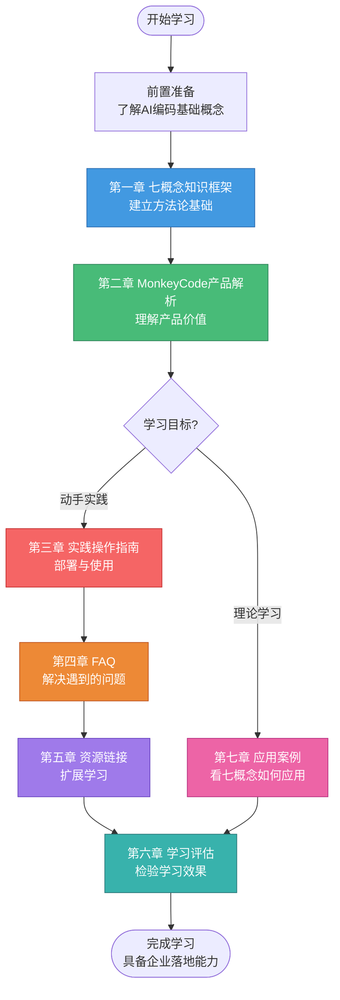

# 七概念方法论解析MonkeyCode开源Vibe Coding平台

## 📖 教程概述

本教程基于七概念方法论体系（R-I-E-C-A-F-V），系统解析 MonkeyCode 开源 Vibe Coding 平台的技术架构、核心能力与实践应用。

随着 AI 编码工具的普及，越来越多企业面临代码数据安全的核心痛点——代码作为企业核心资产，无法上传至公有云 AI 服务。MonkeyCode 作为一款开源可私有化部署的 Vibe Coding 平台，正是为解决这一痛点而生。它让企业能够在本地环境中享受 AI 编码带来的效率提升，同时确保代码数据不出内网。

本教程将带你深入理解 MonkeyCode 的设计理念与技术实现，帮助你快速上手并构建企业级 AI 编码解决方案。

## 🎯 教程目标

完成本教程后，你将能够：

- 理解 Vibe Coding 的核心理念与 MonkeyCode 的产品定位
- 掌握 MonkeyCode 的技术架构与部署方式
- 学会使用七概念方法论分析 AI 编码平台的设计逻辑
- 具备在企业环境中私有化部署 MonkeyCode 的能力
- 了解 Vibe Coding 场景下的最佳实践与常见问题解决方案

## 👥 适用人群

本教程适合以下读者：

| 人群 | 学习价值 |
|------|----------|
| **AI开发者** | 了解 AI 编码平台的架构设计，学习如何构建本地 AI 编码工具 |
| **企业技术负责人** | 评估私有化 AI 编码方案，规划企业 AI 辅助编码落地路径 |
| **DevOps工程师** | 掌握 MonkeyCode 的私有化部署、运维与监控方法 |
| **Vibe Coding爱好者** | 深入理解 Vibe Coding 理念，提升 AI 辅助编程效率 |
| **七概念方法论学习者** | 通过实战案例掌握 R-I-E-C-A-F-V 分析框架的应用 |
| **开源项目贡献者** | 了解 MonkeyCode 代码结构，参与开源社区贡献 |
| **安全合规工程师** | 评估 AI 编码工具的数据安全与合规性方案 |

## 📚 章节导航

本教程共分为七章，完整覆盖七概念方法论与MonkeyCode实践应用：

| 章节 | 标题 | 核心内容 |
|------|------|----------|
| **第一章** | [七概念知识框架](./01-seven-concepts-framework.md) | R-I-E-C-A-F-V七概念详解、五层认知模型、触发决策树 |
| **第二章** | [MonkeyCode产品深度解析](./02-monkeycode-deep-analysis.md) | 产品背景、核心特性、技术架构、开源策略、差异化优势 |
| **第三章** | [实践操作指南](./03-practice-guide.md) | 系统要求、私有化部署步骤、基础使用、模型配置 |
| **第四章** | [常见问题解答（FAQ）](./04-faq.md) | 部署、使用、模型配置、安全、故障排查等常见问题解答 |
| **第五章** | [资源扩展链接](./05-resources.md) | 官方资源、开源社区、Vibe Coding相关、私有化部署资源 |
| **第六章** | [学习效果评估方法](./06-assessment.md) | 四级评估体系、知识测试、实践项目、持续改进机制 |
| **第七章** | [附录：七概念应用案例](./07-seven-concepts-applied.md) | 七概念方法论在MonkeyCode分析中的完整应用案例 |

## 🗺️ 学习路径

### 学习路径建议

1. **管理者快速路径**：第一章 → 第二章 → 第六章
   - 适合希望快速了解产品价值和评估方法的技术负责人与决策者

2. **开发者实践路径**：第一章 → 第二章 → 第三章 → 第四章 → 第五章 → 第六章
   - 适合需要动手部署和使用的开发者、DevOps工程师

3. **方法论完整路径**：按章节顺序依次学习（含第七章）
   - 希望掌握七概念分析框架并能应用到其他开源产品分析的学习者

## ⚡ 核心要点速览

### MonkeyCode 核心优势

- **🔒 私有化部署**：代码数据完全留在企业内网，解决数据安全顾虑
- **🆓 开源免费**：基于开源协议，可自由使用、修改与分发
- **⚡ Vibe Coding 理念**：通过自然语言交互实现"氛围感编程"，降低编码门槛
- **🔌 多模型支持**：可对接本地大模型与多种 AI 服务提供商
- **🛠️ 扩展性强**：模块化架构，支持自定义插件与能力扩展

### 七概念方法论回顾

| 概念 | 全称 | 应用在本教程的核心问题 |
|------|------|------------------------|
| **R** | Concept Repository（概念库存） | MonkeyCode 涉及哪些核心概念？如何定义？ |
| **I** | Intent Analysis（意图分析） | 产品为解决什么问题而设计？目标用户是谁？ |
| **E** | Essence Abstraction（本质抽象） | 技术架构的核心是什么？关键抽象有哪些？ |
| **C** | Composition Innovation（组合创新） | 功能模块如何组合？交互流程如何设计？ |
| **A** | Action Guide（行动指南） | 如何部署、配置和使用？最佳实践是什么？ |
| **F** | Feedback Optimization（反馈优化） | 如何收集反馈？如何持续改进与调优？ |
| **V** | Value Verification（价值验证） | 带来了什么价值？如何度量效果？ |

---

**下一步**：开始阅读 [第一章 七概念知识框架](./01-seven-concepts-framework.md)，系统学习R-I-E-C-A-F-V方法论体系。
