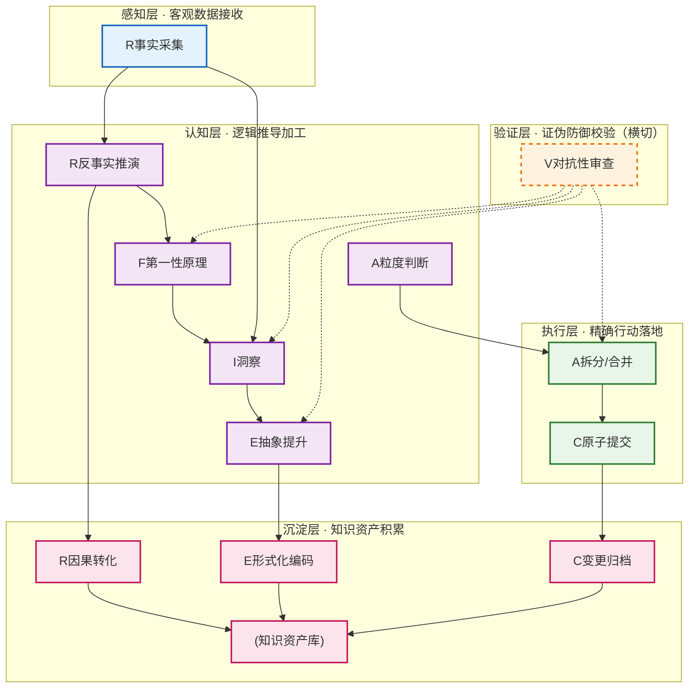
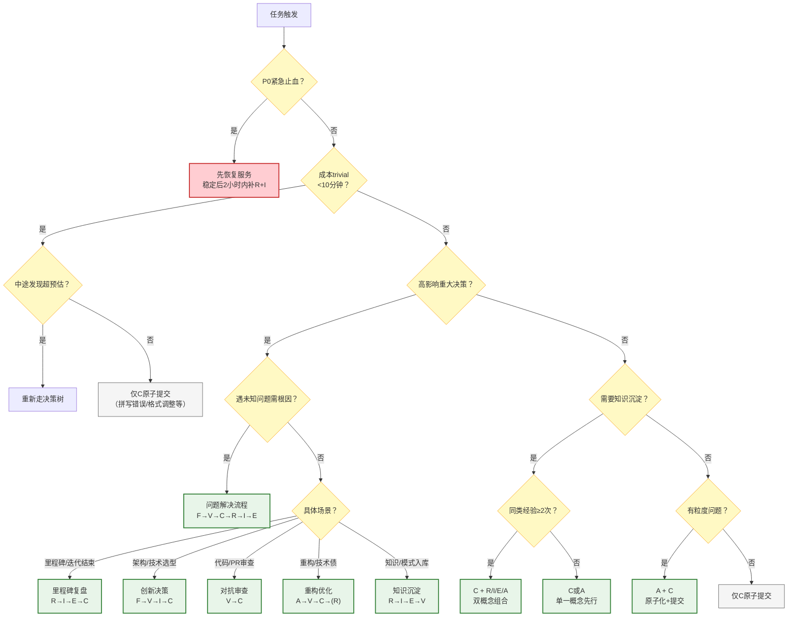

# 第一章 - 七概念知识框架

> **R=复盘 | I=洞察 | E=萃取 | C=原子提交 | A=原子化 | F=第一性原理 | V=对抗性审查**
>
> 七概念是一套逻辑严密、经1258次提交实战验证的项目管理与认知方法论体系。它通过七个核心概念的组合应用，帮助我们系统化地从经验中学习、从问题中发现本质、从实践中沉淀可复用知识。

---

## 一、七概念总览

七概念方法论体系（R-I-E-C-A-F-V）是一套闭环的认知与行动框架，覆盖了从信息感知、逻辑加工、质量验证、执行落地到知识沉淀的完整流程。它不是七个孤立的工具，而是一个有机的整体——每个概念都有明确的层级定位和上下游依赖，组合使用时能发挥最大价值。

**核心设计理念**：
- **顺序不可颠倒**：事实→洞察→行动，违反顺序会导致确认偏误
- **质量门控**：每个关键节点都有明确的质量检查标准
- **场景驱动**：不同任务类型对应不同的概念组合链路
- **可裁剪但不可破坏核心闭环**：即使是30分钟的迷你复盘，也要走完R→I→C最小闭环

---

## 二、七个核心概念详解

### 1. R - 复盘（Retrospective）

#### 定义
复盘是对已发生事件的结构化反事实推理，将时序经验转化为因果知识的过程。它不是简单的"总结"，而是通过客观采集事实、结构化时间线、反事实推演，最终将"发生了什么"转化为"为什么会发生"以及"下次怎么做"。

#### 核心要素
1. **事实采集**：只列可验证的客观事实，禁止因果判断词（"因为""所以""导致""错误"）
2. **时序结构化**：按时间线组织事件，标注时间、参与者、具体动作
3. **反事实推演**：思考"如果当时做了X，会发生什么"
4. **因果转化**：从事实中提炼可复用的因果关系

#### 应用场景
- 项目里程碑/迭代结束后的总结
- 线上故障/问题发生后的事后回顾
- 跨项目经验收集与对比
- 个人学习与工作复盘

> **关键质量标准**：事实清单中因果判断词出现次数=0，每条事实都可通过日志/记录/参与者验证。

---

### 2. I - 洞察（Insight）

#### 定义
洞察是跨情境可迁移的规律，最小形式为「C→M→A→B」四元组：在**条件C**下，因为**机制M**，做**行动A**会导致**结果B**。洞察不是"感悟"或"金句"，而是可证伪、可验证、可迁移的结构化知识单元。

#### 核心要素
1. **条件识别**：明确洞察适用的边界条件（什么情况下成立）
2. **机制揭示**：说明背后的因果机制（为什么会这样，不是表面原因）
3. **结论生成**：给出具体可执行的行动建议
4. **迁移验证**：至少举出1个非当前领域的适用场景证明可迁移性

#### 应用场景
- 从复盘中提炼核心发现
- 从问题分析中找到根本原因对应的行动方向
- 跨案例对比中发现共性规律
- 产品分析中识别用户行为背后的驱动因素

> **洞察四元组示例**：
> [当一个提交包含>10个文件跨模块变更时(C)] → 因为[reviewer认知负荷过载，无法逐行审查(M)] → 应该[按单一职责拆分为多次原子提交(A)] → 导致[review质量提升30%，回滚影响范围缩小(B)]

---

### 3. E - 萃取（Extraction）

#### 定义
萃取是知识从隐性经验到显性模式的形式化转换过程，通过四层漏斗（事件→洞察→模式→原则）逐级精炼，最终产出可复用、可传播、可验证的结构化模式文档。

#### 核心要素
1. **显化转换**：将只可意会的隐性经验转化为文字/图表
2. **抽象提升**：从具体案例中提升抽象层级，剥离项目特定细节
3. **漏斗过滤**：四层精炼：原始事件→可证伪洞察→通用模式→跨领域原则
4. **形式化编码**：按标准模板记录模式，包含触发场景、操作步骤、反模式、迁移验证

#### 应用场景
- 同类经验出现≥2次后的方法论沉淀
- 从多个洞察中提炼可复用模式
- 最佳实践入库与文档化
- 构建团队/项目知识库

> **模式成熟度要求**：L2级模式必须包含≥2个独立案例+≥1个反模式，经过对抗性审查验证。

---

### 4. C - 原子提交（Atomic Commit）

#### 定义
原子提交是变更集的不可分割单一职责单元，满足：同因同果、可独立回滚、review无认知跳跃。每个提交只做一件事，且这件事完整做完。

#### 核心要素
1. **职责内聚**：一个提交只解决一个问题/实现一个功能/修复一个Bug
2. **因果闭合**：提交的变更有完整的因果链（问题→修复→验证）
3. **独立回滚**：revert这个提交不会破坏其他功能
4. **认知平滑**：reviewer阅读提交diff时不需要在多个不相关主题间跳跃

#### 应用场景
- 代码版本控制中的Git提交
- 文档变更的归档
- 知识库更新的入库操作
- 任何需要可追溯、可回滚的变更操作

> **提交信息规范**：遵循Conventional Commits格式，如`fix(auth): 修复token过期未刷新问题`，说明"做了什么"和"为什么做"。

---

### 5. A - 原子化（Atomization）

#### 定义
原子化是复杂系统向最优信息粒度的收敛过程，平衡认知负荷与导航成本。不是拆得越细越好，而是找到"单一职责、独立可理解、导航成本适中"的最优粒度。

#### 核心要素
1. **粒度寻优**：通过U型曲线找到最优拆分粒度（认知负荷=4-6，导航成本=4-6，差值≤2）
2. **单元独立**：拆分后的每个单元单一职责，可独立理解
3. **链接完整**：拆分后所有引用/链接100%修复，无断链
4. **双向收敛**：既支持自顶向下理解整体，也支持自底向上组合

#### 应用场景
- 大文件/大模块的拆分重构
- 长文档的章节化整理
- 复杂任务的WBS分解
- 知识体系的结构化组织

> **粒度评分公式**：`score = 100 - |cognitive_load - navigation_cost|×10 - max(0, cognitive_load+navigation_cost-10)×5`，合格≥70分。

---

### 6. F - 第一性原理（First Principles）

#### 定义
第一性原理是从不可证伪的公理出发，自下而上重构方案的思维方式。不是类比推理（"别人怎么做我也怎么做"），而是回到问题最基本的组成要素，从公理重新推导。

#### 核心要素
1. **假设剥离**：层层剥开"理所当然"的假设，找到最底层的公理
2. **要素拆解**：将问题分解为不可再分的基本要素
3. **公理自洽**：确认公理之间不矛盾、不可证伪
4. **重构推导**：从公理出发重新构建解决方案，而非在现有方案上修修补补

#### 应用场景
- 根因分析（5Why追问到系统性根因）
- 创新方案设计/新架构探索
- 技术选型与重大决策论证
- 质疑"一直以来都是这么做的"的惯性思维

> **经典案例**：埃隆·马斯克用第一性原理思考电池成本——不是问"电池为什么这么贵"，而是拆解电池的原材料组成（锂、钴、镍、铝、碳、聚合物、钢壳），发现从伦敦金属交易所采购原材料成本只有$80/kWh，从而重构电池生产方式。

---

### 7. V - 对抗性审查（Adversarial Review）

#### 定义
对抗性审查是主动寻找证伪证据的认知防御机制，通过构造反例、多视角攻击、寻找逻辑漏洞，暴露确认偏误，确保产出质量。它不是"挑错"，而是以"魔鬼代言人"的身份系统性地攻击结论，找到薄弱环节。

#### 核心要素
1. **证伪导向**：以"证明这个结论是错的"为目标，而非"证明它是对的"
2. **多角攻击**：从逻辑、数据、边界、反例、替代方案等多个视角攻击
3. **偏差防御**：主动防御确认偏误、锚定效应、经验主义等认知偏差
4. **审计可溯**：审查意见和修正记录完整保留，可追溯

#### 应用场景
- 根因分析后的根因验证（错误根因=错误修复）
- 模式入库前的质量审查
- 重大决策的论证
- 架构设计/方案评审
- PR/MR代码审查

> **审查质量标准**：≥5条具体审查意见（不接受"写得很好"类客套话），至少采纳2条进行修正，必须构造≥1个反例。

---

## 三、五层认知定位模型

七个概念不是平行并列的，而是分布在五个认知层级上，形成完整的信息处理链条。V（对抗性审查）作为横切关注点，作用于认知层和执行层的输出，提供质量保障。

### 各层级职能说明

| 层级 | 核心职能 | 包含概念 | 关键产出 |
|------|---------|---------|---------|
| **感知层** | 信息采集、现象观察，只记录事实不带判断 | R（事实采集） | 客观事实清单、时间线 |
| **认知层** | 思维推理、本质洞察、方案生成、粒度决策 | F、R（反事实推演）、I、E（抽象提升）、A（粒度判断） | 根因分析、洞察四元组、模式抽象、拆分方案 |
| **验证层** | 证伪防御、质量保障、偏差修正（横切作用） | V（对抗性审查） | 审查意见、修正记录、反例清单 |
| **执行层** | 操作落地、变更实施、粒度控制 | A（拆分/合并）、C（原子提交） | 原子化拆分结果、原子提交 |
| **沉淀层** | 知识归档、模式复用、资产积累 | R（因果转化）、E（形式化编码）、C（变更归档） | 知识库、模式文档、提交历史 |

---

## 四、触发决策树：什么时候用哪些概念？

不是所有任务都需要用上全部七个概念，根据任务类型和复杂度选择合适的组合是关键。下面的决策树帮你快速判断应该激活哪些概念、按什么顺序执行。

### 五种标准流程速查

| 场景类型 | 概念组合链路 | 触发关键词 | 核心产出 |
|---------|-------------|-----------|---------|
| **里程碑复盘** | R→I→E→C | 复盘、总结、回顾、Sprint结束、版本交付 | 复盘报告+3条洞察+1-2个模式+3-5个原子行动项 |
| **问题解决** | F→V→C→R→I→E | Bug、故障、问题、根因、为什么会发生 | 根因分析+修复提交+事后复盘+1个预防模式 |
| **重构优化** | A→V→C→(R) | 重构、优化、技术债、拆分、文件太大 | 拆分方案+等价性验证+原子提交+小复盘 |
| **知识沉淀** | R→I→E→V→入库 | 总结方法、沉淀模式、经验、最佳实践 | 案例集+结构化模式文档+索引更新 |
| **创新突破** | F→V→I→C | 新方案、创新、架构设计、从零开始 | 公理体系+假设攻击报告+洞察方案+PoC |

---

## 五、七概念在MonkeyCode产品分析中的应用

MonkeyCode是一款AI驱动的Vibe Coding编程工具，它通过自然语言交互让开发者快速生成代码。用七概念方法论分析MonkeyCode产品，可以帮助我们系统化地理解其产品逻辑、核心价值和潜在机会。

### 分析思路框架

在MonkeyCode产品深度分析中，我们将这样应用七概念：

| 概念 | 在MonkeyCode分析中的应用 |
|------|------------------------|
| **R 复盘** | 收集MonkeyCode公开信息、用户反馈、使用案例，形成客观事实清单（不预设立场） |
| **F 第一性原理** | 回到"编程的本质是什么""AI辅助编程要解决的根本问题"等基本公理，不被现有产品形态束缚 |
| **I 洞察** | 从事实和第一性原理中提炼洞察：MonkeyCode的核心竞争力是什么？Vibe Coding的本质是什么？ |
| **V 对抗性审查** | 主动攻击我们的洞察："MonkeyCode真的有护城河吗？""Vibe Coding是不是伪需求？" |
| **E 萃取** | 从洞察中提炼AI编程工具的通用模式，总结可迁移到SpecWeave的经验 |
| **A 原子化** | 将分析内容拆分为独立章节，每个章节单一职责，链接完整 |
| **C 原子提交** | 每完成一个分析章节就原子化提交，保证可追溯、可回滚 |

### 核心分析链路

我们将按**R→F→I→V→E**的链路进行MonkeyCode产品分析：

1. **R（事实采集）**：收集MonkeyCode的产品功能、定价、用户评价、技术路线等客观信息
2. **F（第一性原理）**：拆解编程活动的本质要素，AI在编程中的真正角色
3. **I（洞察生成）**：形成关于MonkeyCode产品定位、Vibe Coding模式、AI编程未来的结构化洞察
4. **V（对抗审查）**：对每个洞察进行证伪攻击，验证其边界和适用条件
5. **E（模式萃取）**：提炼可复用的AI编程产品分析模式，为后续产品分析提供参考

---

## 六、继续阅读

本章介绍了七概念方法论的整体框架。下一章我们将应用这个框架对MonkeyCode进行深度分析：

→ [第二章 - MonkeyCode深度分析](./02-monkeycode-deep-analysis.md)
