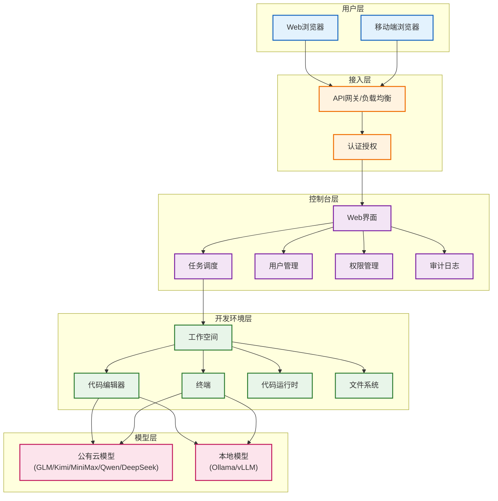

# 第二章 - MonkeyCode产品深度解析

在第一章中，我们系统学习了七概念方法论体系。本章将应用这套框架，对MonkeyCode进行深度产品解析，理解其设计背景、核心特性与技术架构。

---

## 一、产品背景

MonkeyCode是由长亭科技出品的开源Vibe Coding平台。长亭科技作为网络安全领域的技术公司，将安全领域的实践经验融入到AI编码工具的设计中。

产品采用GNU AGPL v3.0开源协议发布，这意味着：

- 代码完全开源，可自由查看、修改和分发
- 修改后的版本也需要保持开源并采用相同协议
- 支持私有化部署和商业使用
- 社区可以共同参与产品迭代

---

## 二、核心痛点

MonkeyCode瞄准的是企业级AI编码落地中的核心矛盾：

**团队想用AI提升编码效率，但核心代码资产又不能离开企业内网。**

这一痛点具体体现在：

| 痛点维度 | 具体表现 |
|---------|---------|
| **数据安全** | 核心业务代码、敏感配置信息不能上传至公有云AI服务 |
| **合规要求** | 金融、政府、安全等行业有严格的数据不出境、不出内网要求 |
| **代码资产** | 代码是企业核心知识产权，存在泄露风险顾虑 |
| **网络限制** | 部分企业内网无法直接访问外部AI服务 |

公有云AI编码工具虽然使用方便，但在企业场景下面临数据安全的硬约束。MonkeyCode的私有化部署方案正是为解决这一矛盾而生。

---

## 三、六大核心特性

### 1. 开源策略

MonkeyCode采用GNU AGPL v3.0开源协议，代码完全公开在GitHub上。开源策略带来的优势包括：

- 代码透明，可审计，无后门风险
- 企业可根据自身需求进行二次开发
- 社区共同贡献功能和修复问题
- 避免厂商锁定，技术栈自主可控

### 2. 私有化部署

支持完全在企业内网环境部署，所有代码数据和交互记录都留在本地：

- 代码文件不上传公网
- 模型推理可在内网完成（配合本地模型）
- 所有操作日志可审计
- 符合企业数据安全合规要求

### 3. 远程服务器运行环境

与传统本地IDE插件不同，MonkeyCode的开发环境运行在远程服务器上，不依赖开发者本地主机：

- 统一的开发环境配置，避免"在我机器上能跑"问题
- 环境资源弹性可扩展，不受本地硬件限制
- 支持随时随地通过浏览器访问
- 开发环境与运行环境一致

### 4. 多模型支持

MonkeyCode支持接入多种大语言模型，企业可根据需求灵活选择：

| 模型类型 | 支持的模型/服务 |
|---------|----------------|
| **公有云API** | GLM、Kimi、MiniMax、Qwen、DeepSeek |
| **本地部署模型** | Ollama、vLLM |

这种多模型架构的设计让企业可以：
- 根据任务类型选择最适合的模型
- 在成本和效果之间灵活平衡
- 支持模型服务的热切换
- 保护已有模型投资

### 5. 团队协作与权限管理

面向企业团队协作场景设计：

- 多用户账户体系
- 细粒度权限控制
- 团队项目空间
- 操作审计日志
- 协作开发支持

### 6. 移动端支持

支持移动端访问，满足多场景使用需求：

- 手机浏览器即可使用
- 随时随地查看和修改代码
- 碎片化时间编码
- 外出时响应紧急问题

---

## 四、系统要求

MonkeyCode采用分层架构，不同组件有不同的硬件要求：

### 控制台（Console）

控制台是用户访问和管理的入口，负责用户认证、任务调度、权限管理等功能。

| 资源 | 最低配置 |
|------|---------|
| CPU | 2核 |
| 内存 | 4GB |
| 磁盘 | 40GB |

### 开发环境（Development Environment）

开发环境是实际运行代码、执行AI生成任务的计算节点，资源需求更高。

| 资源 | 最低配置 |
|------|---------|
| CPU | 8核 |
| 内存 | 16GB |
| 磁盘 | 100GB |

> 注意：如果要在开发环境本地运行大语言模型（如通过Ollama或vLLM），还需要额外配置GPU资源，具体要求视所使用的模型规模而定。

---

## 五、快速体验与资源链接

### 在线版体验

官方提供在线体验版本，可直接试用：

- 地址：https://monkeycode-ai.com/console/tasks
- 额度：每天3000万免费Token额度
- 用途：产品功能体验、效果评估

### 开源地址

项目开源仓库：

- GitHub：https://github.com/chaitin/MonkeyCode/
- 可获取源代码、部署文档、Issue跟踪

---

## 六、产品架构

MonkeyCode采用分层架构设计，从用户接入到模型服务形成完整链路。

### 架构说明

1. **用户层**：提供Web端和移动端两种接入方式，用户通过浏览器即可使用，无需安装本地客户端
2. **接入层**：负责流量路由、用户认证、安全防护，是系统的统一入口
3. **控制台层**：系统的管控平面，负责任务调度、用户权限管理、操作审计等管理功能
4. **开发环境层**：实际执行编码任务的工作平面，提供代码编辑、终端访问、代码运行等完整开发能力
5. **模型层**：提供AI能力支持，可灵活对接公有云模型服务或本地部署模型，形成混合模型架构

这种分层架构的优势在于各层职责清晰，可独立扩展和升级。例如，当用户量增长时可以扩展控制台节点，当计算任务增多时可以扩展开发环境节点，模型层也可以根据需要增减模型服务实例。

---

## 七、七概念方法论分析

在理解了MonkeyCode的产品事实后，我们应用七概念方法论（特别是第一性原理）进行深度分析，提炼核心洞察。

### F - 第一性原理分析：回到编程的本质

我们先剥离"AI编码工具""Vibe Coding"这些表层概念，回到最基本的问题：**企业编程活动的本质是什么？AI在其中真正要解决什么问题？**

编程活动的基本要素：
1. **目标**：将业务需求转化为可执行代码
2. **约束**：代码质量、安全合规、交付时间、可维护性
3. **资产**：代码是企业核心知识产权，数据安全是红线
4. **协作**：现代软件开发是团队协作活动
5. **流程**：编码需要嵌入到企业现有研发流程中

从第一性原理出发，我们可以得出：

> **Vibe Coding进入企业市场，模型能力只是起点，数据安全、可审计性、研发流程接入才是关键。**

### I - 核心洞察

基于第一性原理分析，我们提炼以下洞察：

#### 洞察1：安全是企业AI编码的入场券，不是加分项

[当AI编码工具进入企业市场(C)] → 因为[代码是企业核心资产，数据安全是硬性合规要求(M)] → 必须[提供私有化部署方案，确保代码不出内网(A)] → 导致[只有解决数据安全问题的产品才能获得企业采购准入(B)]

MonkeyCode来自长亭科技的安全背景，让其从一开始就将安全和私有化作为核心设计，而非后期附加功能。这是其差异化定位的关键。

#### 洞察2：远程开发环境是企业级部署的自然选择

[当为企业团队提供AI编码服务(C)] → 因为[本地部署存在环境不一致、管理困难、硬件资源受限等问题(M)] → 应该[采用远程服务器运行环境，统一配置、集中管理(A)] → 导致[运维成本降低，开发环境一致性得到保障，支持弹性扩展(B)]

MonkeyCode不做IDE插件、不依赖本地主机的设计，虽然与个人开发者习惯的工具形态不同，但更符合企业集中管理的需求。

#### 洞察3：多模型支持是务实的架构决策

[当企业部署AI编码平台(C)] → 因为[不同模型各有所长，企业已有模型投资需要保护，单一模型存在厂商锁定风险(M)] → 应该[支持多模型接入，让企业灵活选择和切换(A)] → 导致[企业可根据场景选择最合适的模型，在成本和效果间平衡，降低锁定风险(B)]

支持GLM/Kimi/MiniMax/Qwen/DeepSeek/Ollama/vLLM等多种模型，不是功能堆砌，而是企业现实需求的体现。

#### 洞察4：Vibe Coding的企业价值在于降低门槛而非取代开发者

[当Vibe Coding进入企业(C)] → 因为[企业研发团队有不同技能层级的成员，大量重复性编码工作占用资深开发者时间(M)] → [通过自然语言交互降低编码门槛，让初级开发者也能完成任务，让资深开发者专注于架构和复杂问题(A)] → 导致[整体研发效率提升，人力资源得到更优配置(B)]

Vibe Coding不是要"取代程序员"，而是要重新分配编程工作中人机协作的边界。

#### 洞察5：开源是建立信任的最佳方式

[当企业选择私有化部署的软件(C)] → 因为[闭源软件无法审计代码，存在后门和数据泄露顾虑(M)] → 应该[采用开源策略，让代码可审查、可修改(A)] → 导致[企业信任度提升，社区参与共同改进，避免厂商锁定(B)]

在安全敏感领域，"不公开即不安全"的理念被广泛接受。GNU AGPL v3.0开源协议让MonkeyCode的代码完全透明，这是获得安全敏感客户信任的基础。

### V - 对抗性审查

我们对上述洞察进行证伪攻击，验证其边界条件：

| 洞察 | 反例攻击 | 边界条件 |
|------|---------|---------|
| 安全是入场券 | 个人开发者和小团队可能不在乎数据安全，优先选择易用性 | 洞察适用于中大型企业、金融/政府/安全等合规敏感行业，个人市场不一定成立 |
| 远程开发环境 | 对网络依赖强，离线场景无法使用，有网络延迟问题 | 适合网络稳定的企业内网环境，离线/弱网场景需要本地方案补充 |
| 多模型支持 | 多模型接入增加架构复杂度，维护成本上升 | 需要在灵活性和复杂度间平衡，初期可支持主流模型，后续按需扩展 |
| Vibe Coding降低门槛 | 生成的代码可能质量参差不齐，需要审核，反而增加资深开发者负担 | 需要配套代码审查、测试、安全扫描机制，不能完全依赖AI生成 |
| 开源建立信任 | 开源也可能有漏洞，企业没有能力审计所有代码 | 开源的价值是"可以审计"，而非"天然安全"，仍需安全团队审查和社区持续改进 |

### E - 模式萃取

从MonkeyCode的产品设计中，我们可以提炼出**企业级AI编码平台的通用设计模式**：

| 模式要素 | 具体内容 |
|---------|---------|
| **核心矛盾** | AI效率提升与数据安全的平衡 |
| **必要特性** | 私有化部署、开源可审计、多模型支持、远程环境、团队权限、审计日志 |
| **部署形态** | 分层架构（接入/管控/执行/模型），各层独立扩展 |
| **成功关键** | 安全是基础，模型能力是核心，流程接入是落地保障 |

这个模式可以迁移到其他企业级AI应用的分析中：当AI产品从个人用户走向企业客户时，都需要回答数据安全、可审计、团队协作、现有系统集成这几个关键问题。

---

## 八、本章小结

本章我们从事实出发，系统梳理了MonkeyCode的产品背景、核心痛点、六大特性、系统要求，并通过架构图理解了其技术实现，最后应用七概念方法论进行了深度分析。

核心要点回顾：

1. **产品定位**：长亭科技出品，GNU AGPL v3.0开源，面向企业的私有化Vibe Coding平台
2. **解决痛点**：企业想用AI提升效率但核心代码不能出内网的矛盾
3. **核心特性**：开源、私有化部署、远程开发环境、多模型支持、团队协作、移动端
4. **架构设计**：用户层→接入层→控制台→开发环境层→模型层的五层架构
5. **核心洞察**：Vibe Coding进入企业，模型能力只是起点，数据安全、可审计性、研发流程接入才是关键

---

## 九、继续阅读

上一章：[第一章 - 七概念知识框架](./01-seven-concepts-framework.md)

下一章：[第三章 - 实践操作指南](./03-practice-guide.md)
