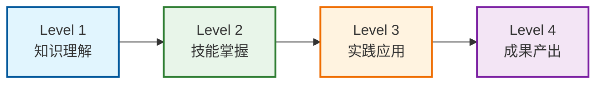
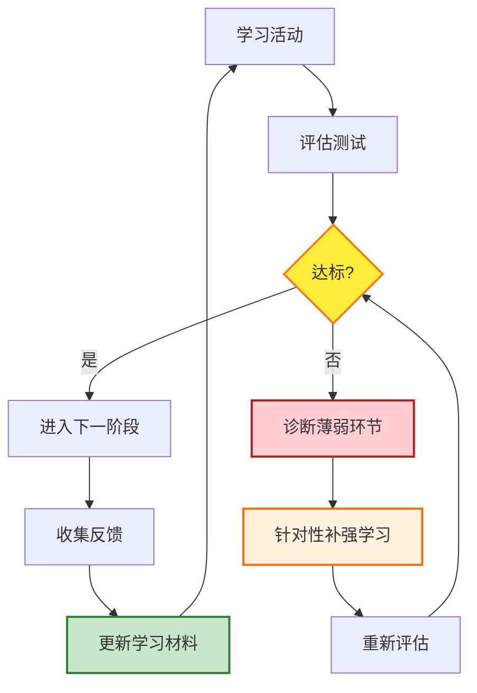

# 第六章 - 学习效果评估方法

本章建立基于柯氏四级评估模型的学习效果检验体系，从知识理解到成果产出全链路评估学习成效，配套量化评分标准、进度跟踪工具和持续改进机制，确保学习目标可达成、可衡量、可验证。

---

## 一、四级评估体系概览

基于柯克帕特里克（Kirkpatrick）四级评估模型，结合七概念方法论特点，设计四层递进式评估体系：



| 评估级别 | 评估维度 | 权重占比 | 达标阈值 | 评估方式 |
|---------|---------|---------|---------|---------|
| Level 1 | 知识理解 | 20% | ≥80分 | 客观题测试 |
| Level 2 | 技能掌握 | 25% | ≥75分 | 案例分析+操作描述 |
| Level 3 | 实践应用 | 30% | ≥70分 | 项目实操+问题解决 |
| Level 4 | 成果产出 | 25% | ≥75分 | 文档评审+同行评价 |
| **综合** | **整体达标** | **100%** | **≥75分** | **加权汇总** |

---

## 二、Level 1 - 知识理解评估

### 2.1 评估目标

检验学习者对七概念方法论核心定义、MonkeyCode基础知识、Vibe Coding理念的记忆和理解程度，是后续技能和实践评估的基础。

### 2.2 评估内容

#### （1）七概念定义测试（50分）
- R（Reality 事实）：定义、核心要素、应用场景（10分）
- I（Insight 洞察）：本质抽象、根因分析方法（10分）
- E（Experiment 实验）：验证方法、迭代流程（8分）
- C（Concept 概念）：模式提炼、知识沉淀（8分）
- A（Atomization 原子化）：拆分原则、单一职责（7分）
- F（Flow 流程）：工作流编排、最佳实践（4分）
- V（Verification 验证）：质量门禁、验收标准（3分）

#### （2）MonkeyCode核心知识测试（50分）
- 产品定位与核心功能（10分）
- 技术架构与组件构成（15分）
- 部署方式与配置要求（15分）
- 开源协议与合规要求（10分）

### 2.3 题型设计

| 题型 | 题量 | 单题分值 | 总分 | 考察重点 |
|-----|-----|---------|-----|---------|
| 单项选择题 | 20题 | 2分 | 40分 | 基础概念记忆、事实性知识 |
| 多项选择题 | 10题 | 3分 | 30分 | 知识关联、综合理解 |
| 填空题 | 10题 | 3分 | 30分 | 关键术语、核心参数记忆 |
| **合计** | **40题** | - | **100分** | - |

### 2.4 评分标准与达标阈值

| 得分区间 | 等级 | 评价 | 后续要求 |
|---------|-----|-----|---------|
| 90-100分 | 优秀 | 知识掌握扎实，概念清晰 | 直接进入Level 2 |
| 80-89分 | 良好 | 核心知识掌握， minor知识点有遗漏 | 复习错题后进入Level 2 |
| 70-79分 | 及格 | 基本概念理解，但存在知识盲区 | 针对性重学相关章节，重测 |
| ＜70分 | 不及格 | 知识掌握不系统，核心概念混淆 | 完整重学前三章，重新测试 |

**达标阈值：≥80分**

### 2.5 样题示例

**单项选择题示例：**
> MonkeyCode采用的开源协议是？
> A. MIT License
> B. Apache License 2.0
> C. GNU AGPL v3.0
> D. BSD 3-Clause
> （正确答案：C）

**多项选择题示例：**
> 下列哪些属于R-I-E-C-A-F-V七概念的核心组成？（多选）
> A. Reality（事实）
> B. Insight（洞察）
> C. Deploy（部署）
> D. Atomization（原子化）
> （正确答案：ABD）

**填空题示例：**
> MonkeyCode默认使用________进行多容器服务编排。
> （正确答案：Docker Compose）

---

## 三、Level 2 - 技能掌握评估

### 3.1 评估目标

检验学习者运用七概念方法论分析问题的能力，以及对MonkeyCode部署流程、操作流程的理解和掌握程度。

### 3.2 评估内容

#### （1）案例分析（60分）
**任务要求**：选择另一个开源AI编码工具（如OpenHands、Continue、Aider等），使用七概念方法论进行结构化分析。

**评分维度**：

| 评估项 | 分值 | 评分标准 |
|-------|-----|---------|
| R（事实采集） | 10分 | 信息完整准确，覆盖架构、功能、部署、社区各维度（8-10分）<br/>信息较完整，核心事实基本正确（5-7分）<br/>信息有遗漏或错误（0-4分） |
| I（洞察分析） | 12分 | 能提炼本质差异，指出设计优劣势，洞察深刻（10-12分）<br/>能做基本分析，但深度不足（6-9分）<br/>仅罗列现象，缺乏分析（0-5分） |
| E（实验验证） | 8分 | 设计合理验证方案，有明确验证指标（6-8分）<br/>提到验证但方案不具体（3-5分）<br/>未涉及验证环节（0-2分） |
| C（概念提炼） | 10分 | 提炼可复用模式，对比MonkeyCode异同准确（8-10分）<br/>有对比但模式提炼不足（5-7分）<br/>无概念提炼（0-4分） |
| A（原子拆分） | 8分 | 功能模块拆分合理，单一职责清晰（6-8分）<br/>有拆分但粒度不当（3-5分）<br/>未做拆分分析（0-2分） |
| F（流程梳理） | 7分 | 使用流程、工作流梳理清晰完整（5-7分）<br/>流程描述有缺失（3-4分）<br/>流程混乱（0-2分） |
| V（验证标准） | 5分 | 提出明确验收标准、质量门禁（4-5分）<br/>有标准但不具体（2-3分）<br/>无验证标准（0-1分） |

#### （2）流程操作描述（40分）
**任务要求**：详细描述MonkeyCode私有化部署的完整流程，从环境准备到服务验证。

**评分维度**：

| 评估项 | 分值 | 评分标准 |
|-------|-----|---------|
| 环境准备 | 8分 | 硬件/软件/网络要求描述完整准确（7-8分）<br/>主要要求提及但有遗漏（4-6分）<br/>环境要求描述错误多（0-3分） |
| 部署步骤 | 15分 | 步骤完整顺序正确，命令准确，关键配置说明清晰（12-15分）<br/>步骤基本完整，有少量错误或遗漏（8-11分）<br/>步骤混乱或关键步骤缺失（0-7分） |
| 配置说明 | 8分 | 模型配置、端口配置、环境变量说明正确（6-8分）<br/>主要配置说明但不完整（3-5分）<br/>配置说明错误（0-2分） |
| 验证方法 | 5分 | 服务可用性验证方法明确可操作（4-5分）<br/>提到验证但方法模糊（2-3分）<br/>无验证方法（0-1分） |
| 常见问题预判 | 4分 | 能预判部署中可能遇到的问题及解决方向（3-4分）<br/>提到1-2个问题（1-2分）<br/>未涉及（0分） |

### 3.3 评分标准与达标阈值

| 得分区间 | 等级 | 评价 | 后续要求 |
|---------|-----|-----|---------|
| 90-100分 | 优秀 | 分析深入，流程熟练，能灵活运用方法论 | 直接进入Level 3 |
| 75-89分 | 良好 | 技能基本掌握，分析和描述有提升空间 | 修改完善作业后进入Level 3 |
| 60-74分 | 及格 | 技能初步掌握，但应用不够熟练 | 针对薄弱环节练习，重新提交 |
| ＜60分 | 不及格 | 技能未掌握，方法论应用存在明显问题 | 重学相关章节，重新完成评估 |

**达标阈值：≥75分**

### 3.4 提交要求
- 案例分析报告：1500-2500字，Markdown格式
- 流程描述：800-1200字，可配流程图
- 提交格式：单个Markdown文件或压缩包

---

## 四、Level 3 - 实践应用评估

### 4.1 评估目标

检验学习者实际动手能力，能否独立完成MonkeyCode部署、解决实际问题、在真实场景中应用所学知识。

### 4.2 评估内容（二选一）

#### 选项A：私有化部署实践（推荐）
**任务要求**：实际完成MonkeyCode私有化部署，接入至少1个大模型，实现可对外提供服务的编码环境。

**交付物**：
- 部署过程记录（截图+文字说明）
- 服务访问验证截图
- 模型配置说明
- 遇到的问题及解决过程记录

#### 选项B：在线版深度使用项目
**任务要求**：使用MonkeyCode在线版完成一个实际开发项目（代码量≥500行），完整记录Vibe Coding实践过程。

**交付物**：
- 项目代码仓库链接
- 开发过程记录（提示词迭代、AI对话摘要）
- 项目功能说明
- Vibe Coding实践心得

### 4.3 评分维度（100分）

| 评估项 | 分值 | 评分标准（选项A） | 评分标准（选项B） |
|-------|-----|------------------|------------------|
| 任务完成度 | 30分 | 服务成功启动，模型接入正常，可正常生成代码（25-30分）<br/>基本部署成功但存在小问题（18-24分）<br/>部署未完成（0-17分） | 项目功能完整可运行，达到预期目标（25-30分）<br/>核心功能完成但有瑕疵（18-24分）<br/>项目未完成（0-17分） |
| 过程规范性 | 25分 | 部署步骤规范，配置合理，遵循最佳实践（20-25分）<br/>过程基本规范但有改进空间（15-19分）<br/>过程混乱存在明显不合理（0-14分） | Vibe Coding流程合理，提示词质量高（20-25分）<br/>使用AI辅助但过程不系统（15-19分）<br/>未有效运用Vibe Coding（0-14分） |
| 问题解决能力 | 25分 | 独立排查并解决部署中遇到的≥2个实际问题，记录详细（20-25分）<br/>在指导下解决问题（13-19分）<br/>遇到问题无法解决（0-12分） | 独立解决开发中遇到的≥3个技术问题（20-25分）<br/>解决部分问题（13-19分）<br/>问题解决能力不足（0-12分） |
| 七概念应用 | 20分 | 部署过程中自觉运用R-I-E-C-A-F-V指导（16-20分）<br/>部分运用七概念方法（10-15分）<br/>未体现七概念应用（0-9分） | 开发过程中系统应用七概念方法论（16-20分）<br/>部分环节体现方法论（10-15分）<br/>未体现方法论指导（0-9分） |

### 4.4 评分标准与达标阈值

| 得分区间 | 等级 | 评价 | 后续要求 |
|---------|-----|-----|---------|
| 85-100分 | 优秀 | 实践能力强，能独立解决问题，方法论应用熟练 | 直接进入Level 4 |
| 70-84分 | 良好 | 能完成实践任务，有一定问题解决能力 | 补充完善实践记录后进入Level 4 |
| 60-69分 | 及格 | 基本完成任务，但独立性和规范性不足 | 针对问题点重新实践，再次评估 |
| ＜60分 | 不及格 | 实践能力不足，无法独立完成任务 | 重新学习实践指南，在指导下完成实践 |

**达标阈值：≥70分**

### 4.5 问题解决专项评估
实践过程中需要解决至少2个非 trivial 问题，每个问题按以下标准评分：

| 评分项 | 分值 | 标准 |
|-------|-----|-----|
| 问题描述 | 5分 | 准确描述问题现象、复现条件、错误信息 |
| 根因分析 | 10分 | 使用I（洞察）方法定位根本原因，而非表面现象 |
| 方案验证 | 8分 | 提出解决方案，通过E（实验）验证有效 |
| 经验沉淀 | 7分 | 总结经验，提炼可复用的问题解决模式 |
| **单项合计** | **30分** | - |

---

## 五、Level 4 - 成果产出评估

### 5.1 评估目标

检验学习者能否将学习成果沉淀为可复用的知识资产，通过评审和反馈持续优化，形成完整学习闭环。

### 5.2 评估内容

#### （1）成果文档评审（70分）
**任务要求**：产出完整的学习成果文档，二选一：

**选项A：部署文档/运维手册**
- 面向企业内部使用的MonkeyCode私有化部署运维手册
- 包含安装、配置、运维、故障排查全流程
- 字数要求：3000-5000字

**选项B：七概念分析报告**
- 使用七概念方法论深度分析MonkeyCode或同类工具
- 提炼可复用的AI工具评估框架和方法论
- 字数要求：2500-4000字

**评分维度**：

| 评估项 | 分值 | 评分标准 |
|-------|-----|---------|
| 结构完整性 | 12分 | 结构清晰，逻辑连贯，章节安排合理（10-12分）<br/>结构基本完整（7-9分）<br/>结构混乱（0-6分） |
| 内容准确性 | 18分 | 技术内容准确无误，可操作性强（15-18分）<br/>主要内容正确，有少量不准确（10-14分）<br/>存在明显技术错误（0-9分） |
| 七概念融合 | 20分 | 自然融合七概念方法论，体现系统性思维（16-20分）<br/>部分体现方法论（10-15分）<br/>未体现方法论（0-9分） |
| 实用价值 | 12分 | 文档有实际参考价值，可指导他人实践（10-12分）<br/>有一定参考价值（6-9分）<br/>实用价值低（0-5分） |
| 格式规范 | 8分 | Markdown格式规范，图表清晰，链接有效（6-8分）<br/>格式基本规范（3-5分）<br/>格式混乱（0-2分） |

#### （2）反馈评价（30分）
- **同行评审**（15分）：至少2位其他学习者评审，按评审表打分
- **专家/导师评审**（15分）：由熟悉七概念和MonkeyCode的评审者打分

### 5.3 评审反馈表

| 评审维度 | 评分（1-5分） | 具体意见 |
|---------|-------------|---------|
| 内容完整性 | | |
| 技术准确性 | | |
| 方法论应用 | | |
| 实用价值 | | |
| 表达清晰度 | | |
| **改进建议** | | |
| **亮点/收获** | | |

评分换算：5分=15分，4分=12分，3分=9分，2分=5分，1分=0分

### 5.4 评分标准与达标阈值

| 得分区间 | 等级 | 评价 |
|---------|-----|-----|
| 90-100分 | 优秀 | 成果质量高，可作为标杆案例分享 |
| 75-89分 | 良好 | 成果达到预期，可通过小幅修改完善 |
| 60-74分 | 及格 | 基本完成成果要求，但质量有待提升 |
| ＜60分 | 不及格 | 成果未达到要求，需要大幅修改 |

**达标阈值：≥75分**

---

## 六、学习进度跟踪表

### 6.1 个人学习进度跟踪模板

| 章节 | 计划完成时间 | 实际完成时间 | Level 1测试分 | Level 2作业分 | Level 3实践分 | Level 4成果分 | 状态 | 备注 |
|-----|------------|------------|--------------|--------------|--------------|--------------|-----|-----|
| 01-七概念框架 | | | | - | - | - | 未开始/进行中/已完成 | |
| 02-MonkeyCode深度分析 | | | | - | - | - | | |
| 03-实践指南 | | | | | - | - | | |
| 04-FAQ | | | | - | - | - | | |
| 05-资源链接 | | | | - | - | - | | |
| **Level 1综合测试** | - | | | - | - | - | | |
| **Level 2技能评估** | - | | - | | - | - | | |
| **Level 3实践评估** | - | | - | - | | - | | |
| **Level 4成果评估** | - | | - | - | - | | |
| **综合认证** | - | | | | | | | |

### 6.2 关键节点检查清单

- [ ] 完成所有章节阅读（预计8-12小时）
- [ ] Level 1测试≥80分（预计1小时）
- [ ] Level 2作业提交并通过（预计3-5小时）
- [ ] Level 3实践完成并通过（预计8-16小时）
- [ ] Level 4成果产出并通过评审（预计4-8小时）
- [ ] 总学习时长：24-42小时

---

## 七、学习成果档案模板

### 7.1 学习成果档案结构

```
learning-portfolio-[姓名]-[日期]/
├── 01-test-results/           # 测试结果
│   ├── level1-test.md         # Level 1答题纸+得分
│   └── test-score.json        # 得分详情
├── 02-skill-assessment/       # 技能评估
│   ├── case-analysis.md       # 案例分析报告
│   ├── process-description.md # 流程描述
│   └── level2-score.md        # 评分结果+反馈
├── 03-practice/               # 实践应用
│   ├── deployment-log.md      # 部署/实践日志
│   ├── screenshots/           # 截图目录
│   ├── problems-record.md     # 问题解决记录
│   └── level3-score.md        # 评分结果+反馈
├── 04-output/                 # 成果产出
│   ├── final-document.md      # 最终成果文档
│   ├── peer-reviews/          # 同行评审意见
│   ├── expert-review.md       # 专家评审意见
│   └── level4-score.md        # 评分结果+反馈
└── portfolio-summary.md       # 学习总结
```

### 7.2 学习总结模板（portfolio-summary.md）

```markdown
# 学习成果总结

## 基本信息
- 姓名：
- 学习周期：YYYY-MM-DD 至 YYYY-MM-DD
- 总学习时长：XX小时
- 综合得分：XX/100

## 各级别评估结果
| 评估级别 | 得分 | 等级 | 完成时间 |
|---------|-----|-----|---------|
| Level 1 知识理解 | | | |
| Level 2 技能掌握 | | | |
| Level 3 实践应用 | | | |
| Level 4 成果产出 | | | |
| **综合** | | | |

## 主要收获
1. 知识层面：
2. 技能层面：
3. 方法论层面：
4. 实践层面：

## 遇到的主要问题及解决
（列举3-5个关键问题及解决过程）

## 七概念应用心得
（结合实际经历谈对七概念的理解和应用体会）

## 后续学习计划
1. 深化方向：
2. 待加强领域：
3. 实践计划：

## 成果链接
- 代码仓库：
- 部署文档：
- 分析报告：
```

---

## 八、持续改进机制

### 8.1 评估反馈循环



### 8.2 薄弱环节诊断矩阵

| 评估不通过级别 | 可能薄弱环节 | 针对性改进策略 |
|--------------|------------|--------------|
| Level 1＜80分 | 核心概念记忆不牢、知识体系零散 | 1. 重学对应章节，制作思维导图<br/>2. 用Anki制作闪卡强化记忆<br/>3. 用自己的话复述每个概念 |
| Level 2＜75分 | 方法论应用生硬、分析不深入 | 1. 研读优秀案例分析范文<br/>2. 从模仿开始，先套用框架再逐步灵活运用<br/>3. 多做2-3个案例练习 |
| Level 3＜70分 | 动手能力不足、问题解决能力弱 | 1. 先在预配置环境中练习，减少环境障碍<br/>2. 遇到问题先独立排查30分钟再求助<br/>3. 记录问题解决日志，积累模式库 |
| Level 4＜75分 | 知识沉淀能力不足、文档质量差 | 1. 参考优秀技术文档模板<br/>2. 写完后先自我评审按评分表打分<br/>3. 寻求他人提前反馈修改 |

### 8.3 学习材料迭代机制

评估过程中收集的反馈用于持续优化学习材料：

| 反馈类型 | 处理方式 | 更新频率 |
|---------|---------|---------|
| 知识点错误/表述不清 | 立即修正 | 随时 |
| 题目歧义/答案有误 | 修正题库，补充解析 | 每周 |
| 实践步骤过时/不适用 | 更新实践指南，适配最新版本 | 每月 |
| 建议补充内容 | 评估后纳入后续版本规划 | 每季度 |

---

## 九、认证标准

完成全部四级评估且综合得分≥75分，可视为完成本Wiki的系统学习，具备以下能力：

- ✅ 理解R-I-E-C-A-F-V七概念方法论核心要义
- ✅ 掌握MonkeyCode产品功能、技术架构和部署方法
- ✅ 能独立完成MonkeyCode私有化部署或深度使用
- ✅ 能运用七概念方法论分析和评估其他AI工具
- ✅ 能产出高质量的技术文档和分析报告

| 综合得分 | 认证等级 |
|---------|---------|
| 90-100分 | 优秀学习者（可担任导师/评审） |
| 80-89分 | 良好掌握 |
| 75-79分 | 合格通过 |
| ＜75分 | 需要继续学习 |

---

## 继续阅读

上一章：[第五章 - 资源扩展链接](./05-resources.md)

下一章：[第七章 - 七概念综合应用](./07-seven-concepts-applied.md)

返回首页：[MonkeyCode Vibe Coding Wiki 总览](./00-overview.md)
