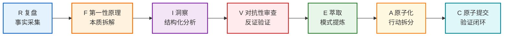
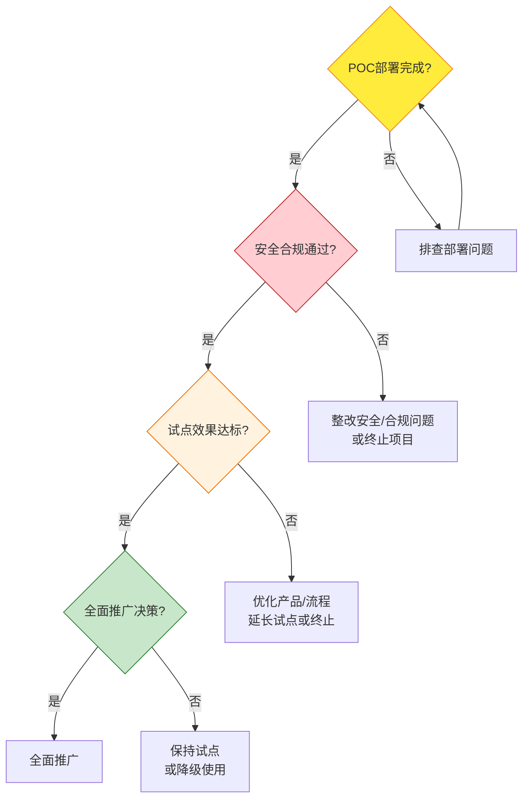

# 第七章 - 附录：七概念方法论在MonkeyCode分析中的完整应用案例

前面的章节我们分别学习了七概念框架和MonkeyCode产品，本章将完整展示R→F→I→V→E→A→C七概念分析链路在MonkeyCode上的实际应用。通过这个实战案例，你可以看到方法论如何一步步引导我们从事实走向行动，形成完整的分析闭环。

---

## 七概念应用流程图

---

## 一、R（复盘）：事实清单

**R = Reality/Retrospective（事实/复盘）**：从客观信息中提取可验证的事实，不添加主观判断，不使用因果词。

以下是从MonkeyCode产品资料中提取的10条客观事实：

| 编号 | 事实内容 |
|------|---------|
| F1 | MonkeyCode由长亭科技出品，采用GNU AGPL v3.0开源协议发布 |
| F2 | 代码开源在GitHub仓库：https://github.com/chaitin/MonkeyCode/ |
| F3 | 官方提供在线体验版，地址为https://monkeycode-ai.com/console/tasks，每天提供3000万免费Token额度 |
| F4 | 支持私有化部署，所有代码数据和交互记录可保留在企业内网 |
| F5 | 开发环境运行在远程服务器上，通过浏览器访问，不依赖本地主机 |
| F6 | 支持接入多种公有云模型：GLM、Kimi、MiniMax、Qwen、DeepSeek |
| F7 | 支持接入本地部署模型：Ollama、vLLM |
| F8 | 控制台最低配置要求：2核CPU、4GB内存、40GB磁盘 |
| F9 | 开发环境最低配置要求：8核CPU、16GB内存、100GB磁盘 |
| F10 | 提供多用户账户体系、细粒度权限控制、操作审计日志、移动端访问支持 |

> **R阶段要点**：只陈述"是什么"，不解释"为什么"，不评价"好不好"。事实必须是可验证、可证伪的。

---

## 二、F（第一性原理）：本质拆解

**F = First Principles（第一性原理）**：剥离表层概念，回到问题最基本的构成要素，从本质出发重新思考。

我们不被"Vibe Coding""AI编码工具"这些热词迷惑，回到最根本的问题：

### 企业AI编码活动的本质要素

| 本质要素 | 具体说明 |
|---------|---------|
| **目标** | 将业务需求转化为可执行代码，提升研发效率 |
| **约束** | 代码质量、安全合规、交付周期、可维护性 |
| **资产** | 代码是企业核心知识产权，数据安全是红线 |
| **协作** | 现代软件开发是团队协作，不是个人行为 |
| **流程** | 编码必须嵌入企业现有研发流程（CI/CD、代码审查等） |
| **成本** | 包含工具成本、硬件成本、学习成本、运维成本 |
| **信任** | 企业必须相信工具不会泄露代码、不会引入安全风险 |

### 第一性原理结论

> **Vibe Coding进入企业市场，模型能力只是入场的基础门槛，数据安全、可审计性、团队协作、研发流程融入才是决定能否落地的关键。**

MonkeyCode的设计选择——开源、私有化、远程环境、多模型、权限审计——都可以从这个本质结论中找到依据。

> **F阶段要点**：不断追问"这个问题最基本的构成是什么？""如果从零开始设计，我会怎么做？"剥离经验假设，回归本质。

---

## 三、I（洞察）：结构化分析

**I = Insight（洞察）**：基于事实和第一性原理，提炼出结构化的洞察，采用C→M→A→B四元组格式：
- **C**（Context/场景）：在什么场景下
- **M**（Motivation/动因）：因为什么根本原因
- **A**（Action/行动）：应该采取什么策略
- **B**（Benefit/结果）：从而带来什么结果

### 洞察1：安全是企业AI编码的入场券

> [当AI编码工具进入企业市场(C)] → 因为[代码是企业核心资产，数据安全是硬性合规要求(M)] → 必须[提供私有化部署方案，确保代码不出内网(A)] → 导致[只有解决数据安全问题的产品才能获得企业采购准入(B)]

MonkeyCode来自长亭科技的安全背景，让其从一开始就将安全和私有化作为核心设计，而非后期附加功能。

### 洞察2：远程开发环境是企业级部署的自然选择

> [当为企业团队提供AI编码服务(C)] → 因为[本地部署存在环境不一致、管理困难、硬件资源受限等问题(M)] → 应该[采用远程服务器运行环境，统一配置、集中管理(A)] → 导致[运维成本降低，开发环境一致性得到保障，支持弹性扩展(B)]

不做IDE插件、不依赖本地主机的设计，虽然与个人开发者习惯不同，但更符合企业集中管理的需求。

### 洞察3：多模型支持是务实的架构决策

> [当企业部署AI编码平台(C)] → 因为[不同模型各有所长，企业已有模型投资需要保护，单一模型存在厂商锁定风险(M)] → 应该[支持多模型接入，让企业灵活选择和切换(A)] → 导致[企业可根据场景选择最合适的模型，在成本和效果间平衡，降低锁定风险(B)]

支持GLM/Kimi/MiniMax/Qwen/DeepSeek/Ollama/vLLM，不是功能堆砌，而是企业现实需求的体现。

### 洞察4：Vibe Coding的企业价值在于重新分配人机边界

> [当Vibe Coding进入企业(C)] → 因为[企业研发团队有不同技能层级，大量重复性编码占用资深开发者时间(M)] → [通过自然语言交互降低编码门槛，让初级开发者完成任务，让资深开发者专注架构和复杂问题(A)] → 导致[整体研发效率提升，人力资源得到更优配置(B)]

Vibe Coding不是"取代程序员"，而是重新分配编程工作中人机协作的边界。

### 洞察5：开源是建立企业信任的最佳方式

> [当企业选择私有化部署的软件(C)] → 因为[闭源软件无法审计代码，存在后门和数据泄露顾虑(M)] → 应该[采用开源策略，让代码可审查、可修改(A)] → 导致[企业信任度提升，社区参与共同改进，避免厂商锁定(B)]

在安全敏感领域，"不公开即不安全"是共识。AGPL协议让代码完全透明，是获得安全敏感客户信任的基础。

> **I阶段要点**：每个洞察必须清晰回答"为什么"，并且逻辑链条完整。C→M→A→B四元组确保洞察不是空泛的观点，而是可指导行动的判断。

---

## 四、V（对抗性审查）：反证验证

**V = Adversarial Review（对抗性审查）**：对每个洞察进行"魔鬼代言人"式的攻击，寻找反例、漏洞和边界条件，避免过度自信和认知偏差。

我们对上述5条洞察逐一进行证伪：

| 洞察编号 | 反例攻击 | 边界条件（洞察在什么情况下成立/不成立） |
|---------|---------|--------------------------------------|
| **洞察1** 安全是入场券 | **反例**：个人开发者和初创团队可能完全不在乎数据安全，优先选择易用性好的公有云工具（如GitHub Copilot）；部分小型企业觉得代码价值不高，不值得为私有化部署付出成本 | **成立边界**：中大型企业（50人以上研发团队）、金融/政府/安全/军工等合规敏感行业、核心业务系统开发场景 **不成立边界**：个人开发者、小团队、非核心业务/外包项目、快速原型验证 |
| **洞察2** 远程开发环境 | **反例**：远程环境对网络依赖极强，断网就无法工作；有网络延迟时编码体验差；部分开发者习惯本地工具链，迁移有成本；离线/差旅场景无法使用 | **成立边界**：网络稳定的企业内网环境、团队集中办公场景、需要统一环境管控的项目 **不成立边界**：网络不稳定场景、经常离线工作的开发者、对延迟极度敏感的场景（需要本地缓存/离线模式补充） |
| **洞察3** 多模型支持 | **反例**：多模型接入增加架构复杂度，维护成本上升；模型间能力差异导致体验不一致；初期支持太多模型分散开发精力，反而核心体验做不好 | **成立边界**：有一定规模的企业、已有模型投资、需要灵活调度的场景 **不成立边界**：小型团队/初期试点、已确定单一模型供应商、团队技术能力不足以维护多模型架构（建议初期支持2-3个主流模型，后续按需扩展） |
| **洞察4** Vibe Coding重新分配边界 | **反例**：AI生成的代码可能质量参差不齐，存在安全漏洞，反而需要资深开发者花更多时间审核；初级开发者可能过度依赖AI，不理解代码原理，成长变慢 | **成立边界**：有完善的代码审查、测试、安全扫描机制配套；有明确的编码规范和最佳实践指导 **不成立边界**：缺乏质量管控流程、团队技术能力差距过大、对代码质量要求极高的核心模块（建议核心模块仍由资深开发者主导） |
| **洞察5** 开源建立信任 | **反例**：开源不等于安全，代码公开但企业没有能力审计所有代码；开源项目可能停更，社区维护不可靠；AGPL协议有传染性，可能影响企业自有代码的知识产权 | **成立边界**：安全敏感行业、有自主技术能力的企业、需要避免厂商锁定的场景 **不成立边界**：没有技术能力审计代码的小企业、需要商业支持和SLA保障的场景（建议选择有商业公司背书的开源项目，或购买商业服务） |

### 对抗性审查后的调整结论

经过V阶段的审查，我们发现所有洞察都有其适用边界，不是放之四海而皆准的真理。在实际应用中，需要根据企业具体情况判断哪些洞察适用，哪些需要调整。

> **V阶段要点**：主动寻找自己观点的漏洞，问"如果这个洞察是错的，会是因为什么？""什么情况下这个结论不成立？"好的分析不是证明自己永远正确，而是清楚知道结论的边界在哪里。

---

## 五、E（萃取）：模式提炼

**E = Extraction（萃取）**：从具体案例中提炼出可迁移、可复用的通用模式，让经验可以复制到其他场景。

从MonkeyCode的分析中，我们提炼出**企业级开源AI工具设计模式**：

### 企业级开源AI工具通用设计模式

| 模式维度 | 核心原则 | MonkeyCode中的体现 | 可迁移到其他场景 |
|---------|---------|-------------------|----------------|
| **价值主张** | 解决企业"想用AI但不敢用"的矛盾 | AI效率提升 + 数据安全保障 | 所有面向企业的AI工具（AI客服、AI数据分析、AI文档处理等） |
| **信任基础** | 开源建立透明信任，安全背景加分 | AGPL开源、长亭科技安全基因 | 安全敏感领域的企业软件（身份认证、数据加密、运维监控等） |
| **部署架构** | 分层解耦，各层独立扩展 | 用户层→接入层→控制台→开发环境→模型层 | 企业级SaaS/私有化软件的通用架构 |
| **模型策略** | 不绑定单一模型，给客户选择权 | 支持6+公有云模型 + 本地模型 | 所有接入大模型的应用（RAG系统、AI Agent、内容生成工具等） |
| **企业特性** | 团队协作、权限管控、操作审计是标配 | 多用户、细粒度权限、审计日志、移动端 | 从个人工具升级为企业平台的必备功能 |
| **落地路径** | 先在线试用建立认知，再私有化部署 | 在线体验版（每天3000万免费Token）→ 私有化部署 | 企业软件的常见转化路径 |

### 模式迁移应用示例

这个模式不仅适用于AI编码工具，还可以迁移到：
- **企业级AI客服系统**：需要私有化部署确保对话数据不出内网、开源可审计、支持多种大模型、客服团队权限管理
- **企业内部AI知识库**：需要文档数据安全、多模型支持、权限分级、操作审计
- **AI辅助运维平台**：需要运维数据安全、开源可审计、多环境支持、操作日志可追溯

> **E阶段要点**：问"这个案例背后的通用结构是什么？""如果换一个行业/产品，哪些经验仍然适用？"好的模式应该是"抽象但有用"的——既不能太具体（只能用在这一个产品），也不能太抽象（正确的废话）。

---

## 六、A（原子化）：行动项拆分

**A = Atomization（原子化）**：将大的目标拆分为独立、可执行、可验证的原子行动项，每个行动项单一职责、边界清晰。

以"企业评估并部署MonkeyCode"为目标，我们拆分为以下原子步骤：

### 阶段一：评估准备（3个行动项）

| 行动项ID | 行动内容 | 前置依赖 | 预计耗时 | 负责角色 |
|---------|---------|---------|---------|---------|
| A1 | 成立MonkeyCode评估小组，明确评估目标和决策标准 | 无 | 0.5天 | 技术负责人 |
| A2 | 梳理企业AI编码需求：使用人数、代码敏感度、网络环境、现有模型资源 | A1 | 1天 | 技术负责人+研发代表 |
| A3 | 准备评估环境：申请测试服务器、开通网络策略、准备测试账号 | A1 | 1天 | DevOps工程师 |

### 阶段二：在线体验与功能验证（4个行动项）

| 行动项ID | 行动内容 | 前置依赖 | 预计耗时 | 负责角色 |
|---------|---------|---------|---------|---------|
| A4 | 团队成员注册在线体验版，完成基础功能试用（创建任务、生成代码、运行调试） | A2 | 2天 | 全体评估小组成员 |
| A5 | 测试Vibe Coding效果：选择2-3个真实开发场景，评估代码生成质量 | A4 | 3天 | 资深开发工程师 |
| A6 | 对比现有工具/流程：与当前编码方式对比，评估效率提升和体验差异 | A5 | 1天 | 技术负责人 |
| A7 | 收集试用反馈：填写试用反馈表，汇总功能问题和体验问题 | A4-A6 | 0.5天 | 全体评估小组成员 |

### 阶段三：私有化部署POC（5个行动项）

| 行动项ID | 行动内容 | 前置依赖 | 预计耗时 | 负责角色 |
|---------|---------|---------|---------|---------|
| A8 | 准备私有化部署环境：按最低/推荐配置准备服务器、安装Docker/Docker Compose | A3 | 1天 | DevOps工程师 |
| A9 | 下载MonkeyCode代码，按照部署文档完成基础部署 | A8 | 1天 | DevOps工程师 |
| A10 | 配置模型接入：至少配置1个公有云模型+1个本地模型（如有条件） | A9 | 1天 | DevOps工程师+算法工程师 |
| A11 | 配置用户权限：创建测试用户、设置角色权限、验证审计日志功能 | A9 | 0.5天 | 系统管理员 |
| A12 | POC环境功能验证：重复在线体验阶段的测试场景，验证私有化部署功能完整性 | A10-A11 | 2天 | 全体评估小组成员 |

### 阶段四：安全与合规评估（3个行动项）

| 行动项ID | 行动内容 | 前置依赖 | 预计耗时 | 负责角色 |
|---------|---------|---------|---------|---------|
| A13 | 数据安全验证：抓包验证代码数据是否不出内网，检查数据传输/存储加密 | A12 | 1天 | 安全工程师 |
| A14 | 代码审计：对核心代码进行安全审计，检查是否有后门/漏洞（或依赖社区审计报告） | A9 | 3天 | 安全工程师 |
| A15 | 合规性评估：评估AGPL协议对企业的影响，检查是否符合行业合规要求 | A9 | 1天 | 法务+安全负责人 |

### 阶段五：试点推广（3个行动项）

| 行动项ID | 行动内容 | 前置依赖 | 预计耗时 | 负责角色 |
|---------|---------|---------|---------|---------|
| A16 | 制定试点方案：选择1-2个非核心项目组作为试点，明确试点周期和成功指标 | A13-A15 | 0.5天 | 技术负责人 |
| A17 | 小范围试点：试点团队使用MonkeyCode进行日常开发，收集使用数据和反馈 | A16 | 2-4周 | 试点团队 |
| A18 | 试点评估：根据试点数据评估是否全面推广，制定推广计划和培训方案 | A17 | 1天 | 技术负责人+管理层 |

> **A阶段要点**：原子化拆分的标准是——每个行动项完成后应该有明确的交付物，失败了可以独立回滚，不会影响其他已完成的项。

---

## 七、C（原子提交）：验证闭环

**C = Atomic Commit（原子提交）**：为每个原子行动项定义明确的验证标准（Definition of Done）和回滚方案，确保每一步都可验证、可回退，形成质量闭环。

我们选取关键行动项，定义验证标准和回滚方案：

### 关键行动项的验证与回滚

| 行动项ID | 验证标准（DoD） | 回滚方案 | 风险等级 |
|---------|----------------|---------|---------|
| **A9 基础部署** | ✅ Docker Compose所有服务启动成功 ✅ 能通过浏览器访问控制台 ✅ 健康检查接口返回正常 ✅ 部署文档记录完整 | 执行`docker-compose down`停止并删除所有容器，删除部署目录 | 低 |
| **A10 模型接入** | ✅ 至少1个模型配置成功 ✅ 能成功发送prompt并收到回复 ✅ 模型切换功能正常 ✅ 本地模型（如有）推理速度可接受 | 删除对应模型配置，回退到部署完成状态 | 低 |
| **A11 权限配置** | ✅ 能创建/删除用户 ✅ 不同角色权限隔离有效 ✅ 操作日志完整记录（登录、代码生成、配置修改等） ✅ 管理员能查看所有审计日志 | 删除测试用户和自定义角色，回退到默认管理员账户状态 | 低 |
| **A13 数据安全验证** | ✅ 网络抓包显示无代码数据传输到公网（除配置的模型API外） ✅ 数据传输使用HTTPS/TLS加密 ✅ 本地存储的代码数据有访问控制 ✅ 安全工程师签字确认 | 立即停止POC环境，隔离服务器，排查数据泄露风险 | 高 |
| **A14 代码审计** | ✅ 核心模块代码审计完成 ✅ 未发现高危安全漏洞 ✅ 中低危漏洞有修复计划或风险接受 ✅ 审计报告归档 | 如发现高危后门/漏洞，停止评估流程，上报安全委员会 | 高 |
| **A15 合规评估** | ✅ 法务确认AGPL协议使用合规 ✅ 符合所在行业数据安全法规要求 ✅ 有明确的开源使用合规指南 ✅ 管理层审批通过 | 如合规不通过，终止私有化部署计划，考虑替代方案 | 高 |
| **A17 小范围试点** | ✅ 试点团队使用率≥80% ✅ 代码生成接受率≥50%（可根据实际调整） ✅ 试点团队反馈满意度≥3.5/5 ✅ 无重大安全事故/数据泄露 | 停止试点，收回访问权限，总结试点失败原因，调整方案后再评估 | 中 |

### C阶段质量门禁

在每个关键节点设置质量门禁，不通过则不能进入下一阶段：

> **C阶段要点**：每个行动项都要回答"怎么算做完了？""做坏了怎么退回来？"。没有验证标准的行动项等于没定义，没有回滚方案的行动项是在冒险。

---

## 八、七概念方法论价值总结与使用建议

### 8.1 七概念方法论的核心价值

通过MonkeyCode这个完整案例，我们可以看到R→F→I→V→E→A→C七概念链路的价值：

| 价值维度 | 具体体现 |
|---------|---------|
| **避免拍脑袋决策** | R阶段强制收集事实，避免在信息不足时下结论；V阶段强制对抗性审查，避免认知偏差 |
| **从现象到本质** | F阶段第一性原理思考帮助我们穿透热词和表象，抓住问题核心 |
| **从观点到洞察** | I阶段C→M→A→B四元组让洞察结构化、可追溯，不是空泛的"我觉得" |
| **从案例到模式** | E阶段萃取可迁移模式，让一次分析的收益可以复用在多个场景 |
| **从分析到行动** | A阶段原子化拆分和C阶段验证闭环，让分析不只是纸上谈兵，能落地执行 |
| **完整闭环** | 从事实采集→本质思考→洞察提炼→反证验证→模式萃取→行动拆分→验证闭环，形成完整的认知和行动链路 |

### 8.2 七概念使用场景建议

七概念方法论不是银弹，在以下场景中使用效果最佳：

| 适用场景 | 推荐用法 |
|---------|---------|
| **新产品/技术评估** | 完整走R→F→I→V→E→A→C全链路，从事实到决策 |
| **复杂问题分析** | R+F+I+V：搞清楚问题是什么、本质是什么、有哪些可能方案、风险边界在哪里 |
| **方案设计/架构评审** | F+I+E+V：从本质出发设计方案，提炼模式，主动寻找漏洞 |
| **项目复盘** | R+I+E+C：收集事实，提炼洞察，萃取经验，明确改进的验证标准 |
| **行动规划** | A+C：目标拆解，明确每个步骤的验证和回滚 |

### 8.3 使用七概念的注意事项

1. **不要僵化套用**：七概念是思考框架，不是必须严格遵守的流程。简单问题可以跳过某些步骤，复杂问题可能需要反复迭代。

2. **顺序可以调整**：R→F→I→V→E→A→C是推荐顺序，但实际应用中可以根据需要回溯。例如在V阶段发现事实不足，可以回到R阶段补充信息。

3. **V阶段最重要也最容易被忽略**：人天然倾向于证明自己正确，而不是找自己的漏洞。刻意练习对抗性审查，是提升分析质量的关键。

4. **E阶段是区分"经验"和"经验主义"的关键**：做过一件事不代表有经验，能从具体事情中提炼出可迁移模式才是真正的经验。

5. **A+C让分析落地**：很多分析报告止于E阶段，看起来很有道理但无法执行。一定要走到A和C，把洞察转化为行动，并且验证行动效果。

### 8.4 练习建议

如果你想掌握七概念方法论，建议从以下练习开始：

1. **入门练习**：找一个你熟悉的产品（比如你常用的APP），尝试写出10条客观事实（R阶段），注意不要加主观判断。
2. **进阶练习**：对这个产品做F（第一性原理）和I（洞察）分析，尝试用C→M→A→B格式写3条洞察。
3. **挑战练习**：对你写的洞察做V（对抗性审查），主动找反例，明确边界条件。
4. **实战练习**：选择一个你工作中真实面临的决策（比如技术选型、方案设计），完整走一遍七概念链路。

---

## 九、本教程小结

到这里，我们完成了MonkeyCode Vibe Coding Wiki的全部学习：

1. **第一章**：学习了R-I-E-C-A-F-V七概念方法论框架
2. **第二章**：深入解析了MonkeyCode产品，并初步应用方法论进行分析
3. **第三章**：学习了私有化部署的实践操作步骤
4. **第四章**：解答了常见问题
5. **第五章**：提供了扩展资源链接
6. **第六章**：建立了学习效果评估体系
7. **第七章（本章）**：完整展示了七概念在MonkeyCode分析中的全链路应用

希望这套方法论不仅能帮助你理解MonkeyCode，更能成为你分析问题、做出决策的有力工具。

---

## 继续阅读

上一章：[第六章 - 学习效果评估方法](./06-assessment.md)

返回首页：[MonkeyCode Vibe Coding Wiki 总览](./00-overview.md)
