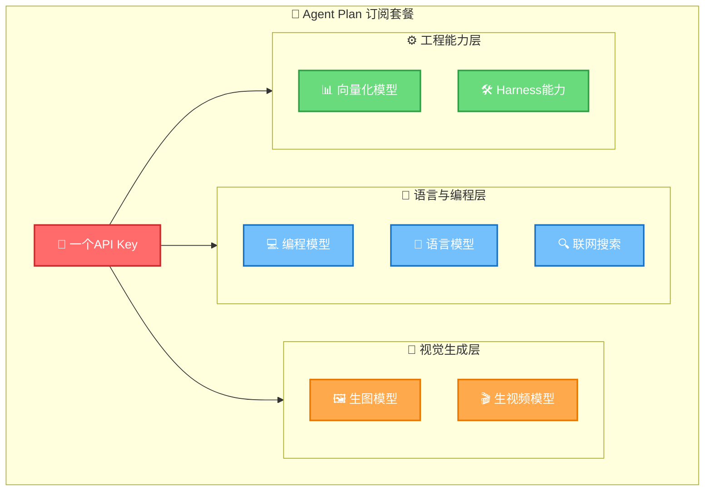

# Agent Plan 共创计划：概述与学习目标

> **单模态解决问题，跨模态创造可能**

## 背景介绍

火山引擎方舟（Ark）分享倡议第一期优质开发者实践已收录于方舟开发者Cookbook，获得社区广泛关注与好评。第二期共创计划正式从语言模型单模态场景扩展到跨模态场景，覆盖语言+生图+生视频+向量化+Harness能力的全栈Agent开发实践。

Agent Plan作为方舟面向Agent时代推出的全新订阅产品，为开发者提供了"一个订阅套餐、一个API Key"的统一接入方式，覆盖主流编程模型、生图生视频模型、向量化模型、联网搜索等核心能力，且更多能力持续更新中。

## 核心定义

> **Agent Plan**是火山引擎方舟面向Agent时代推出的全新订阅产品。通过一个订阅套餐、一个API Key，即可覆盖主流编程模型、生图生视频模型、向量化模型、联网搜索等多模态能力，为跨模态Agent开发提供统一、便捷、高性价比的接入方案。

**核心价值主张**：

| 维度 | 传统接入方式 | Agent Plan |
|------|-------------|-----------|
| API Key管理 | 多个服务多个Key | 一个API Key统一接入 |
| 计费模式 | 按服务分别计费 | 一个订阅套餐覆盖多能力 |
| 能力覆盖 | 单模态为主 | 语言+生图+生视频+向量化+Harness |
| 更新频率 | 需单独开通新服务 | 能力持续更新，订阅即可用 |

## 跨模态能力全景图

## 学习目标

通过本文档，你将能够：

1. 理解Agent Plan产品定位与订阅模式核心特点
2. 掌握五大征集方向的内容要求与创作建议
3. 了解参与流程、标签使用与发布渠道
4. 明确回报激励机制与Cookbook收录标准
5. 获取官方订阅、控制台与文档资源链接
6. 理解从单模态到跨模态的Agent开发范式演进
7. 建立跨模态协同Agent的典型链路认知

## 前置知识要求

- 了解AI Agent基本概念与开发流程
- 有大语言模型使用经验（API调用或应用开发）
- 对多模态模型（生图/生视频）有初步认知更佳
- 无特定技术栈要求，适合产品经理、开发者、创作者共同参与

## 文档导航表

| 章节 | 文件 | 内容概要 |
|------|------|----------|
| 01 | [01-product-overview.md](01-product-overview.md) | 产品详解：Agent Plan定义、订阅模式特点、一个API Key覆盖的能力清单 |
| 02 | [02-contribution-directions.md](02-contribution-directions.md) | 贡献方向详解：五大类征集方向的详细解读与内容建议 |
| 03 | [03-participation-guide.md](03-participation-guide.md) | 参与指南：参与流程、内容要求、标签使用、发布渠道 |
| 04 | [04-rewards-recognition.md](04-rewards-recognition.md) | 回报与激励：套餐奖励机制、Cookbook收录标准、按周收录流程 |
| 05 | [05-quickstart-resources.md](05-quickstart-resources.md) | 快速开始与资源：订阅链接、控制台入口、官方文档合集 |
| 06 | [06-crossmodal-paradigm.md](06-crossmodal-paradigm.md) | 跨模态范式洞察：单模态到跨模态的演进、跨模态协同链路、与Harness方法论关联 |
| 07 | [07-faq.md](07-faq.md) | 常见问题FAQ：参与门槛、内容形式、评审标准、套餐奖励等10个问题 |

## 征集方向总览

| 序号 | 方向 | 图标 | 核心内容 |
|------|------|------|---------|
| 1 | 评测与方法类 | 🔬 | Doubao-Seed-Evolving测评、模型选型、踩坑避坑 |
| 2 | Agent落地类 | 🤖 | 多步骤Agent模型组合、跨模态协同案例 |
| 3 | 应用与产品类 | 🎨 | 网页/应用/工具/脚本、一人全栈产品、效率工具 |
| 4 | 编程协同类 | 💻 | AI编程工具工程化实践、多模型编程心得、Prompt/Skill沉淀 |
| 5 | 探索性实验类 | 🌱 | 创新玩法尝试、不成功的实验同样欢迎 |

## 术语表

| 术语 | 定义 |
|------|------|
| **Agent Plan** | 方舟面向Agent时代推出的全新订阅产品，一个Key覆盖多模态能力 |
| **方舟（Ark）** | 火山引擎大模型服务平台，提供模型推理、Agent开发等能力 |
| **Doubao-Seed-Evolving** | 方舟持续迭代的主力模型系列，欢迎开发者持续测评 |
| **Cookbook** | 方舟开发者实践食谱，收录优质开发者实践内容 |
| **跨模态协同** | 语言模型规划+生图出素材+生视频成片的多模型协作模式 |
| **Harness** | AI Agent业务运行底座，组织模型、工具、知识、记忆等组件的工程框架 |
| **#AgentPlan共创** | 参与共创计划的指定社群标签 |
| **Small套餐** | Agent Plan中小档位月套餐，优质分享可获得 |
| **Medium套餐** | Agent Plan中档位月套餐，超优质分享可获得 |

---

[➡️ 开始学习：产品详解——什么是Agent Plan](01-product-overview.md)
