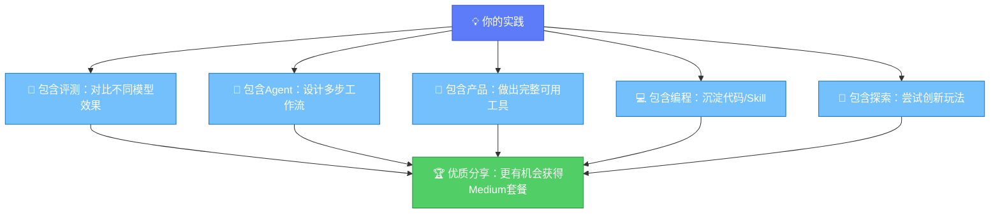

# 贡献方向详解：五大类征集方向

Agent Plan共创计划**不限内容形式**，图文、文档、视频、代码仓库均可接受。以下是五大征集方向的详细解读，每类方向包含方向说明、适合人群、内容建议、示例想法。

---

## 🔬 方向一：评测与方法类

### 方向说明

围绕方舟模型的性能评测、选型方法论、踩坑经验进行分享。Doubao-Seed-Evolving作为持续迭代的模型，特别欢迎持续跟踪测评。

### 适合人群

- 模型研究者、算法工程师
- 有丰富Prompt Engineering经验的开发者
- 注重成本效益的技术负责人
- 喜欢对比测试的极客用户

### 内容建议

| 子方向 | 核心内容 | 价值点 |
|--------|---------|--------|
| **Doubao-Seed-Evolving测评** | 新旧版本对比、特定任务表现、长上下文能力、代码生成质量等 | 帮助社区了解模型迭代效果，为官方优化提供反馈 |
| **模型选型指南** | "什么任务用什么模型最划算"——从效果、成本、速度三个维度给出选型建议 | 解决开发者最关心的选型问题，降低试错成本 |
| **踩坑与避坑笔记** | API调用坑、参数配置坑、Prompt设计坑、多模态协同坑等真实踩坑记录 | 帮助其他开发者少走弯路，避坑内容社区价值极高 |

### 示例想法

- 《Doubao-Seed-Evolving vX vs vY：10项编程任务横向对比》
- 《Agent Plan模型选型决策树：根据任务类型一键选择最优模型》
- 《我用Agent Plan踩过的7个坑——从API报错到生成质量问题全记录》
- 《成本优化实战：如何用Agent Plan用1/3成本达到90%效果》

---

## 🤖 方向二：Agent落地类

### 方向说明

聚焦Agent在真实场景中的落地实践，特别是多步骤Agent的模型组合策略、跨模态协同案例。

### 适合人群

- Agent应用开发者
- 做复杂工作流自动化的工程师
- 探索多模态协同的创作者
- 企业AI落地负责人

### 内容建议

| 子方向 | 核心内容 | 价值点 |
|--------|---------|--------|
| **多步骤Agent模型组合策略** | 复杂任务如何拆分为多个步骤、每一步用什么模型、如何串联、错误处理机制 | 为Agent开发者提供可复用的架构模式 |
| **跨模态协同案例** | 语言模型规划→生图模型出素材→生视频模型成片的完整链路实践 | 展示跨模态Agent的实际效果和实现方法 |

### 跨模态协同典型链路

```mermaid
flowchart LR
    START["🤔 需求理解"] --> LLM_PLAN["🧠 语言模型<br/>任务规划+脚本生成"]
    LLM_PLAN --> SEARCH["🔍 联网搜索<br/>参考资料收集"]
    SEARCH --> IMG_PROMPT["📝 生图Prompt工程"]
    IMG_PROMPT --> IMG_GEN["🖼️ 生图模型<br/>素材生成"]
    IMG_GEN --> IMG_FEEDBACK{"🔄 素材满意？"}
    IMG_FEEDBACK|"否"| IMG_PROMPT
    IMG_FEEDBACK|"是"| VID_GEN["🎬 生视频模型<br/>视频合成"]
    VID_GEN --> LLM_FINAL["📝 语言模型<br/>文案+字幕"]
    LLM_FINAL --> DONE["✅ 成品交付"]
    classDef start fill:#5C7CFA,stroke:#364FC7,color:#fff
    classDef lang fill:#74C0FC,stroke:#1971C2,color:#fff
    classDef search fill:#FFA94D,stroke:#E67700,color:#fff
    classDef vision fill:#FF6B6B,stroke:#C92A2A,color:#fff
    classDef decision fill:#FFD43B,stroke:#F08C00,color:#000
    classDef done fill:#51CF66,stroke:#2B8A3E,color:#fff
    class START start
    class LLM_PLAN,LLM_FINAL lang
    class SEARCH search
    class IMG_PROMPT,IMG_GEN,VID_GEN vision
    class IMG_FEEDBACK decision
    class DONE done
```

### 示例想法

- 《从零构建跨模态内容生产Agent：从文案到视频全链路》
- 《多步骤Agent的模型路由策略：什么时候用强模型，什么时候用快模型》
- 《电商产品短视频生成Agent实战：脚本→分镜→视频三步自动化》
- 《Agent错误处理与重试机制设计：跨模态链路如何保证稳定性》

---

## 🎨 方向三：应用与产品类

### 方向说明

用Agent Plan实际创作的网页、应用、工具、自动化脚本等作品展示。特别欢迎"一人全栈"型产品——从内容到视觉到动效全部由Agent Plan完成。

### 适合人群

- 独立开发者、产品经理
- 设计师转行做开发的跨界创作者
- 需要效率工具的职场人
- 黑客马拉松爱好者

### 内容建议

| 子方向 | 核心内容 | 价值点 |
|--------|---------|--------|
| **网页/应用/工具展示** | 用Agent Plan辅助开发的完整产品，附代码、Demo、开发过程记录 | 展示AI辅助开发的实际生产力，提供可复用的项目模板 |
| **一人全栈型产品** | 从需求分析、代码编写、UI设计、素材生成到部署上线，全流程用Agent Plan完成 | 极致展示一人公司/超级个体的可能性 |
| **效率工具** | 团队周报自动化、设计稿自动化、数据报表自动生成等实际提效工具 | 解决真实工作场景痛点，可直接复用 |

### 示例想法

- 《我用Agent Plan花3小时做了一个完整的个人作品集网站》
- 《一人全栈实战：从0到1做一个AI表情包生成器（代码+素材全由AI完成）》
- 《团队周报自动化工具：用Agent Plan每周帮团队节省5小时》
- 《设计稿自动转代码：Figma→HTML/CSS一键实现》
- 《AI播客生成器：输入主题自动生成脚本+配图+音频剪辑建议》

---

## 💻 方向四：编程协同类

### 方向说明

分享不同模型在Claude Code、OpenCode、Codex等AI编程工具上的工程化实践，多模型编程心得，以及针对编程场景的Prompt/Skill/工作流沉淀。

### 适合人群

- 日常使用AI编程工具的开发者
- 团队AI编程工具推动者
- Prompt/Skill沉淀爱好者
- 多模型对比使用者

### 内容建议

| 子方向 | 核心内容 | 价值点 |
|--------|---------|--------|
| **AI编程工具工程化实践** | Claude Code/OpenCode/Codex等工具接入Agent Plan的配置方法、最佳实践、团队推广经验 | 降低其他开发者接入门槛，提供团队落地经验 |
| **多模型编程心得** | 同一任务在不同模型上的表现差异、什么类型的编程任务适合什么模型 | 帮助开发者选择最适合自己编程场景的模型 |
| **Prompt/Skill/工作流沉淀** | 针对编程场景优化的Prompt模板、可复用的Skill配置、高效工作流 | 可直接复用的生产力资产，社区价值极高 |

### 编程场景模型选择参考

| 编程场景 | 模型选择建议 | 理由 |
|---------|-------------|------|
| 复杂系统设计、架构评审 | 强推理能力模型 | 需要深度理解业务和技术权衡 |
| 日常业务代码编写 | 性价比高的主力模型 | 速度快、成本低、质量稳定 |
| Debug/错误排查 | 长上下文模型 | 需要理解大量上下文和错误信息 |
| 单元测试生成 | 快模型 | 任务相对明确，不需要极强推理 |
| 代码重构/优化 | 强模型 | 需要理解代码坏味道和优化方向 |
| 注释/文档生成 | 便宜模型 | 任务简单，控制成本 |

### 示例想法

- 《Claude Code + Agent Plan 配置最佳实践：团队50人推广经验总结》
- 《5个编程模型横向对比：同样的LeetCode题目，谁写得又快又好？》
- 《我沉淀的20个编程Prompt模板：从需求分析到代码Review全覆盖》
- 《Agent Plan编程Skill库：可直接导入的自动化工作流配置》
- 《AI编程工作流：从需求到PR的四步自动化实践》

---

## 🌱 方向五：探索性实验类

### 方向说明

任何"我没见过别人这么用过"的尝试都欢迎。**特别说明：不成功的实验同样欢迎**，失败的经验同样有价值。

### 适合人群

- 好奇心强的探索者
- 喜欢折腾的技术极客
- 学术研究者
- 跨界创作者
- 所有想尝试新鲜事物的人

### 内容建议

| 子方向 | 核心内容 | 价值点 |
|--------|---------|--------|
| **创新玩法尝试** | 非常规的模型组合、意想不到的应用场景、脑洞大开的实验 | 拓展社区想象力边界，启发更多创新 |
| **失败的实验** | 尝试了但没成功的想法、遇到的无法解决的问题、为什么失败的分析 | 失败经验同样宝贵，避免其他人重复踩坑 |

### 实验记录建议模板

> **实验名称**：给你的实验起个名字
> 
> **实验想法**：我想尝试什么？为什么觉得可能可行？
> 
> **实验过程**：具体怎么做的？用了哪些模型和能力？
> 
> **实验结果**：成功了？还是失败了？结果是什么样的？
> 
> **经验总结**：有什么发现？如果再做一次会怎么改进？

### 示例想法

- 《我尝试让AI自己写代码自己部署，结果服务器被玩坏了……》
>
> **实验想法**：用Agent Plan给AI完整的服务器权限，看它能不能自己部署一个服务
>
> **实验过程**：......
>
> **实验结果**：......
>
> **经验总结**：......
- 《用生图模型生成UI设计稿，再让编程模型直接转代码——效果如何？》
- 《让5个AI模型互相评审代码，结果会比单个模型更好吗？》
- 《一个失败的实验：我尝试做全自动股票交易Agent，结果……》
- 《把生视频模型当动画引擎用，做个AI版短篇动画可行性测试》

---

## 跨方向组合建议

很多优秀的分享会同时覆盖多个方向，鼓励跨方向创作：



---

[🏠 返回总览](00-overview.md) | [⬅️ 上一章：产品详解](01-product-overview.md) | [➡️ 下一章：参与指南](03-participation-guide.md)
