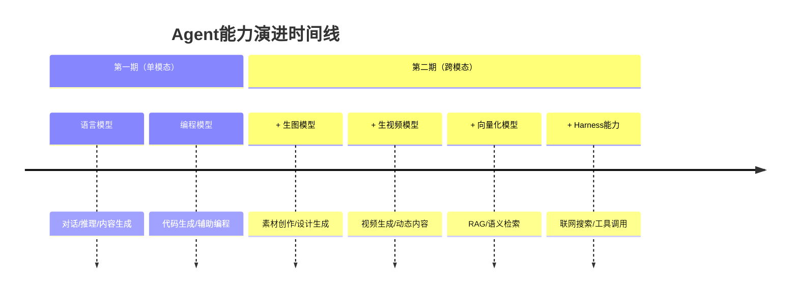
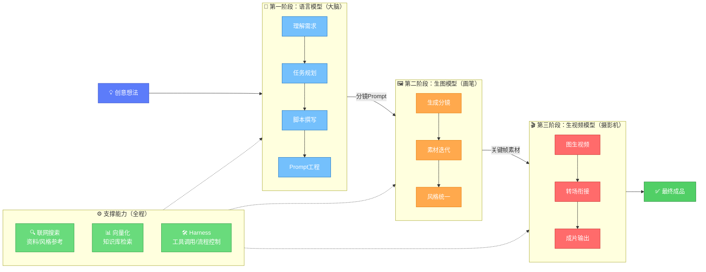
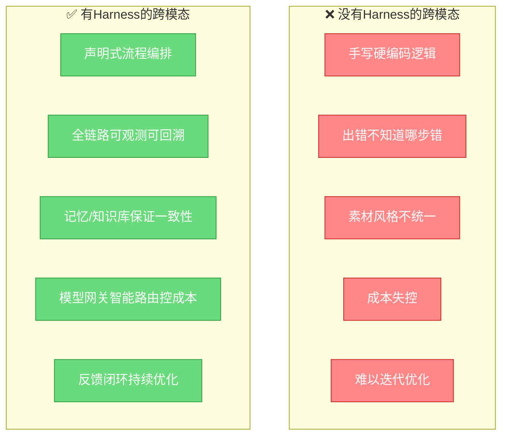

# 跨模态范式洞察：从单模态解决问题到跨模态创造可能

> **单模态解决问题，跨模态创造可能**

本章是对Agent Plan共创计划主题口号的深度解读，帮助理解从第一期到第二期的范式演进意义，以及跨模态协同Agent的典型链路。

> **📌 内容说明**：飞书原文仅包含主题口号"单模态解决问题，跨模态创造可能"和"语言规划→生图→生视频"的例子。本章其余内容（演进时间线、范式对比表、Harness映射、6种链路范式、给探索者的建议）均为💡知识拓展——基于本wiki知识库的衍生分析，非原文内容。

## 一、从第一期到第二期：范式演进

> 💡 **知识拓展**：以下演进分析（1.1-1.3）基于原文"第一期→第二期跨模态扩展"的表述进行结构化解读。

### 1.1 第一期：单模态时代

方舟分享倡议第一期聚焦于**语言模型单模态场景**，核心是：

- 用大语言模型解决对话、推理、代码生成问题
- 开发者实践集中在Prompt Engineering、RAG、Agent框架等
- Cookbook收录的主要是语言模型应用案例

**第一期的核心命题**：如何用好语言模型，让它更好地解决问题。

### 1.2 第二期：跨模态时代

第二期正式扩展到**跨模态场景**，覆盖：

**第二期的核心命题**：如何组合多种模态模型，创造出单模态无法实现的全新可能。

### 1.3 演进意义

| 维度 | 第一期（单模态） | 第二期（跨模态） |
|------|----------------|----------------|
| **输入模态** | 以文本为主 | 文本+图像+视频+... |
| **输出模态** | 以文本/代码为主 | 文本+图像+视频+... |
| **能力边界** | 解决"想"和"写"的问题 | 解决"想+写+画+动"的全链路 |
| **创作门槛** | 需要专业设计/视频能力 | 一人即可完成多模态内容生产 |
| **Agent形态** | 对话助手、代码助手 | 内容生产Agent、全栈创作Agent |
| **典型用户** | 开发者、产品经理 | 开发者+创作者+设计师+运营 |

## 二、跨模态协同Agent的典型链路

> 💡 **知识拓展**：飞书原文仅一句提及"语言模型规划→生图模型出素材→生视频模型成片"作为例子。以下详细的三段式链路拆解、mermaid流程图、各阶段说明、6种额外链路范式表均为衍生分析。

### 2.1 经典三段式链路：语言规划→生图→生视频

这是第二期共创计划重点鼓励探索的范式：

### 2.2 各阶段详细说明

**第一阶段：语言模型（大脑）——规划与创作**

语言模型在跨模态链路中承担"大脑"角色：
- 理解用户的创意需求
- 将模糊想法拆解为可执行的任务步骤
- 撰写视频脚本、分镜描述
- 为下一阶段（生图）编写精确的Prompt
- 决定整体风格、节奏、叙事逻辑

**第二阶段：生图模型（画笔）——视觉素材生产**

生图模型承担"画笔"角色：
- 根据语言模型生成的分镜描述，生成关键帧画面
- 支持多轮迭代调整，直到视觉效果满意
- 保证多帧素材的风格一致性
- 产出可用于视频生成的高质量图片素材

**第三阶段：生视频模型（摄影机）——动态成片**

生视频模型承担"摄影机"角色：
- 将静态图片素材转化为动态视频片段
- 处理镜头运动、转场效果
- 生成最终的视频成品
- 后续可由语言模型继续添加字幕、文案

> 💡 **模型落地映射**：跨模态链路中的"生图模型"在方舟生态中对应字节SOTA级多模态模型 **Seedream**（生图）、**Seedance**（生视频）（⚠️ 该功能对应为通用认知推断，具体以控制台为准），可在方舟控制台按模型名直接定位接入（详见[实践指南与项目案例](./08-practice-cases.md)章）。

### 2.3 更多跨模态链路范式

除了经典的"语言→生图→生视频"三段式，还有很多值得探索的链路：

| 链路范式 | 模态组合 | 典型应用场景 |
|---------|---------|-------------|
| **文案→配图→排版** | 语言→生图→设计 | 公众号文章自动配图、海报生成 |
| **需求→原型→代码** | 语言→生图（UI）→编程 | 一句话生成网页/App原型并转代码 |
| **数据→图表→报告** | 数据→可视化（代码+生图）→语言 | 自动化数据报告生成 |
| **剧本→分镜→动画** | 语言→生图→生视频 | AI动画短片制作 |
| **概念→设计→3D** | 语言→生图→（待扩展） | 产品概念设计快速可视化 |
| **笔记→思维导图→演示** | 语言→结构化→生图 | 学习笔记自动转可视化演示 |

## 三、与Harness工程方法论的关联

> 💡 **知识拓展**：以下Harness七组件映射和对比分析为跨wiki知识关联（关联至[Harness七大组件Wiki](../../02-agent-engineering-methodology/harness-seven-components-wiki/00-overview.md)），飞书原文未涉及此内容。

### 3.1 Harness是跨模态Agent的工程底座

跨模态协同不是简单的模型拼接，它需要一整套工程框架来支撑——这正是Harness的价值所在：

> **单模态时代，Prompt可能够用；跨模态时代，必须有Harness。**

### 3.2 Harness七组件在跨模态场景的映射

参考H七大组件理论，在跨模态Agent中各组件承担新的职责：

| Harness组件 | 在跨模态Agent中的角色 | 具体职责 |
|------------|---------------------|---------|
| **🚦 模型网关** | 模态路由器 | 决定哪一步用语言模型、哪一步用生图、哪一步用生视频 |
| **🔧 工具注册表** | 模态工具集 | 管理生图、生视频、搜索、向量检索等"工具"的调用方式 |
| **📚 知识库** | 风格/素材库 | 存储风格参考、品牌素材、历史作品，保证输出一致性 |
| **💾 记忆系统** | 创作上下文 | 记住前面生成的脚本、分镜风格，保证跨步骤连贯 |
| **🛡️ 策略引擎** | 质量红线 | 内容安全审核、版权校验、品牌规范约束 |
| **📊 可观测性** | 创作过程追踪 | 记录每一步Prompt、生成结果、人工反馈，用于迭代优化 |
| **⚙️ 配置管理** | 创作参数面板 | 调整风格强度、视频时长、生成质量等参数 |

### 3.3 跨模态Agent需要Harness的原因

1. **模型多了**：不是一个模型，而是多个不同模态的模型需要调度
2. **链路长了**：不是一步到位，而是多步骤串行/并行需要编排
3. **状态复杂了**：前一步的输出是后一步的输入，需要管理上下文状态
4. **失败点多了**：每一步都可能失败，需要错误处理和重试机制
5. **成本高了**：多模态调用成本更高，需要路由策略控制成本
6. **质量要求高了**：跨模态成品需要整体协调，不能各说各话

## 四、给跨模态探索者的建议

> 💡 **知识拓展**：以下实践建议为通用经验总结，非飞书原文内容。

### 4.1 从小链路开始

不要一开始就做"语言→生图→生视频→配音→剪辑"的全链路，建议：

1. **先跑通两段式**：先做"语言→生图"，能生成风格统一的分镜就很棒
2. **再加一段**：分镜稳定后，接入生视频，看动态效果
3. **最后补全链路**：两段式跑顺了，再考虑配音、字幕、剪辑等环节

### 4.2 重视Prompt工程在跨模态中的作用

跨模态场景下，Prompt不只是"写好一句话"，而是：
- 语言模型输出的结构要适合生图模型理解
- 生图的Prompt要精确控制风格、构图、一致性
- 要考虑不同模型对Prompt的偏好差异

### 4.3 记录你的链路设计

跨模态链路设计本身就是宝贵的经验：
- 你怎么拆分步骤的？
- 每一步用什么模型？什么参数？
- 怎么做质量检查和迭代？
- 遇到了什么坑？怎么解决的？

这些都是社区非常需要的实践内容，也是Cookbook欢迎的优质素材。

### 4.4 失败的尝试同样有价值

不要因为最终效果不好就放弃分享：
- "我试了XX方法做视频转场，效果不好"——这可以帮其他人少走弯路
- "生图到生视频的风格丢失问题，我试过这些方法都没完全解决"——这是有价值的问题定义
- "这个链路的成本太高了，不适合XX场景"——这是重要的实践结论

---

[🏠 返回总览](00-overview.md) | [⬅️ 上一章：快速开始与资源](05-quickstart-resources.md) | [➡️ 下一章：常见问题FAQ](07-faq.md)
