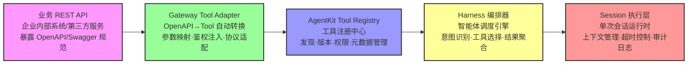
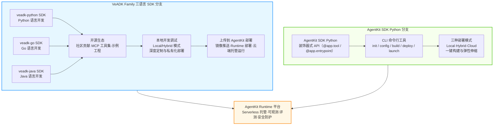

# 04 AgentKit SDK & CLI 工具链

## 装饰器式 API 设计

AgentKit Python SDK 采用**声明式优于命令式**的设计哲学，通过装饰器语法将智能体的组件声明与业务逻辑实现解耦，开发者仅需关注业务代码本身，框架自动承担注册、路由、编排、观测等横切关注点。与传统命令式构造器模式相比，装饰器式 API 可减少 60% 以上的样板代码，同时提升可读性与可维护性。核心装饰器包括：`@app.tool`（工具定义）、`@app.entrypoint`（智能体入口）、`@app.memory`（记忆层配置）、`@app.harness`（编排策略）。

```python
from agentkit import App, Tool, HarnessConfig
from agentkit.types import SessionContext, ToolResult
import os

app = App(
    name="demo-agent",
    description="一个演示装饰器 API 的示例智能体",
    version="1.0.0",
    region="cn-beijing"
)

@app.tool(name="calculate_tax", description="根据收入和税率计算应缴税款")
def calculate_tax(income: float, tax_rate: float = 0.25) -> ToolResult:
    """
    计算个人所得税应缴金额
    :param income: 税前年收入（单位：元）
    :param tax_rate: 适用税率，默认 25%
    :return: 应缴税款与税后收入的结构化结果
    """
    if income < 0:
        return ToolResult(success=False, message="收入不能为负数")
    tax_amount = income * tax_rate
    after_tax = income - tax_amount
    result_data = {
        "income": income,
        "tax_rate": tax_rate,
        "tax_amount": round(tax_amount, 2),
        "after_tax": round(after_tax, 2)
    }
    return ToolResult(success=True, data=result_data, message="计算完成")

@app.tool(name="search_knowledge", description="从企业知识库中检索相关文档")
def search_knowledge(query: str, top_k: int = 5) -> ToolResult:
    """
    调用 AgentKit Knowledge 组件检索文档
    :param query: 用户查询问题
    :param top_k: 返回最相关文档数量
    :return: 检索到的文档片段列表
    """
    from agentkit.services import KnowledgeClient
    client = KnowledgeClient.from_env()
    docs = client.search(query=query, top_k=top_k)
    return ToolResult(success=True, data=docs, message=f"检索到 {len(docs)} 条结果")

@app.entrypoint(name="main_entry", description="智能体默认入口，接收用户问题并调用工具")
def main_entry(user_query: str, context: SessionContext) -> str:
    """
    智能体主入口函数：接收用户问题，按需调用已注册工具并返回回答
    :param user_query: 用户输入的自然语言问题
    :param context: 当前会话上下文，含历史消息与记忆引用
    :return: 智能体生成的最终回答文本
    """
    harness = HarnessConfig(strategy="auto_tool_choice", max_iterations=5)
    result = app.run_harness(
        query=user_query,
        context=context,
        harness_config=harness
    )
    return result.final_answer

if __name__ == "__main__":
    app.launch(mode="local", port=8080, log_level="INFO")
```

**本地运行方式**：保存为 `agent.py`，在终端执行以下命令，服务将监听本地 8080 端口，控制台打印 Swagger UI 访问地址 `http://localhost:8080/docs` 可直接调试：
```bash
python agent.py
```

## 三种部署模式对比表

AgentKit 支持 Local（本地）、Hybrid（混合）、Cloud（云托管）三种部署模式，覆盖从开发调试到生产托管的全生命周期需求，各模式能力对比如下：

| 维度 | Local 本地模式 | Hybrid 混合模式 | Cloud 云托管模式 |
|------|---------------|----------------|-----------------|
| 部署位置 | 开发者本地机器 / 私有服务器 | 控制面云端托管，数据面本地部署 | 全栈火山引擎云端托管 |
| 适用场景 | 开发调试、Demo 验证、功能自测 | 数据敏感、合规要求高、需本地集成遗留系统 | 规模化生产、多租户隔离、高并发弹性需求 |
| 弹性能力 | 无自动弹性，单机资源上限 | 数据面本地扩缩容，控制面云端弹性 | Serverless 秒级弹性，按量付费自动扩缩容 |
| 运维成本 | 完全自运维，需自行部署监控/日志 | 控制面免运维，数据面自运维 | 全托管免运维，内置观测与告警 |
| 可观测能力 | 本地日志输出，无平台级观测 | 控制面云端观测，数据面本地 APM | 全链路追踪 + 指标监控 + 审计日志 + 告警 |
| 上线速度 | 秒级启动，即写即跑 | 控制面分钟级，数据面小时级部署 | 分钟级一键部署，支持灰度发布与回滚 |
| 最佳实践建议 | 开发阶段日常调试与单测集成；不要用于生产环境 | 金融/政企数据不出域场景；需深度集成本地 ERP/CRM 等遗留系统 | 互联网 C 端应用、SaaS 多租户场景、快速投产无基础设施团队的企业 |

## CLI 五连命令

AgentKit CLI 提供完整的开发-部署闭环命令，覆盖从项目初始化到上线运行的核心操作。以下是五个最常用命令的完整使用示例：

### 1. `agentkit init` 脚手架初始化
**功能说明**：根据指定模板一键生成项目骨架，内置目录结构、配置文件、示例代码与依赖声明。支持 `starter`（基础模板）、`stream`（流式输出模板）、`rag`（知识库问答模板）、`multi-agent`（多 Agent 协作模板）四种模板类型。
```bash
agentkit init my-first-agent --template starter --language python --region cn-beijing
```
**预期输出**：
```
√ Project my-first-agent created successfully
√ Template starter applied (Python)
√ Dependencies file generated: requirements.txt
√ Next steps: cd my-first-agent && agentkit config set && agentkit launch
```

### 2. `agentkit config` 环境配置
**功能说明**：引导式配置火山引擎凭据（AK/SK）、区域、镜像仓库、Runtime ID 等环境参数，配置项持久化保存至 `~/.agentkit/config.yaml`，支持多 profile 切换。
```bash
agentkit config set ak=AKLTY2JhNzE5Nxxxx sk=WVdSaFptWm1Oxxxx region=cn-beijing runtime=rt-abc123 profile=prod
```
**预期输出**：
```
√ Profile [prod] saved to ~/.agentkit/config.yaml
  - Access Key: AKLTY2Jh****（已脱敏）
  - Region: cn-beijing
  - Runtime ID: rt-abc123
√ Use `agentkit config use prod` to activate this profile
```

### 3. `agentkit build` 构建打包
**功能说明**：读取项目根目录的 `Dockerfile` 或自动生成标准构建配置，将智能体应用打包为 OCI 标准容器镜像，推送到指定镜像仓库。支持多架构构建（amd64/arm64）与缓存层优化。
```bash
agentkit build --image my-agent:v1.0.0 --registry veadk-cn-beijing.cr.volces.com/myrepo --cache-from latest
```
**预期输出**：
```
√ Build context prepared (12 files, 3.2 MB)
√ Docker build completed: veadk-cn-beijing.cr.volces.com/myrepo/my-agent:v1.0.0
√ Image pushed successfully, digest: sha256:a1b2c3d4...
√ Build finished in 42.3s
```

### 4. `agentkit deploy` 发布部署
**功能说明**：将指定镜像部署到 AgentKit Runtime，支持环境变量注入、资源规格（CPU/内存/并发度）配置、灰度发布比例、健康检查路径等参数。部署过程同步返回实时日志。
```bash
agentkit deploy --image veadk-cn-beijing.cr.volces.com/myrepo/my-agent:v1.0.0 --env prod --replicas 3 --cpu 2 --memory 4Gi --traffic-split v0.9:70,v1.0:30
```
**预期输出**：
```
√ Deployment created: deploy-agent-v1-20260731-1530
√ Rolling update in progress... 2/3 replicas ready
√ Traffic split applied: v0.9=70%, v1.0=30%
√ Health check passed (3/3 replicas healthy)
√ Access URL: https://agent-rt-abc123.cn-beijing.agentkit.volces.com
```

### 5. `agentkit launch` 本地启动运行
**功能说明**：组合 `build`（可选）与 `deploy` 的简化命令，根据模式参数决定执行路径：`--mode local` 直接在本地启动 HTTP 服务器，`--mode hybrid` 本地打包后部署到 Hybrid Runtime，`--mode cloud` 全流程构建推送并云端部署。
```bash
agentkit launch --mode local --port 8080 --env dev --watch
```
**预期输出**：
```
√ Local server started at 0.0.0.0:8080
√ Swagger UI: http://localhost:8080/docs
√ Health endpoint: http://localhost:8080/health
√ Watch mode enabled (auto-reload on file changes)
  Ready for requests...
```

## Tool/Service 接入流程（Mermaid flowchart LR）

企业存量业务 API 接入 AgentKit 工具执行体系遵循标准化流水线，核心流程为：业务 REST API 暴露 OpenAPI 规范 → Gateway Tool Adapter 自动转换为 AgentKit Tool 契约 → 注册至 Tool Registry 供全局发现 → Harness 编排器按需调度 → Session 级执行并返回结果。每个节点的职责与能力说明如下：



**节点能力说明**：
- **业务 REST API**：企业内部 CRM/ERP/订单系统或第三方 SaaS 服务，对外暴露标准化 HTTP 接口与 OpenAPI 3.0+ 规范文档。
- **Gateway Tool Adapter**：AgentKit Gateway 核心组件，读取 OpenAPI 规范自动生成 Tool 定义（函数签名、参数 Schema、描述），注入 IAM 鉴权头，完成 REST 协议与 Tool 调用协议的双向适配。
- **AgentKit Tool Registry**：全局工具注册中心，管理 Tool 的版本迭代、可见范围（租户/项目级）、调用权限控制、标签分类与元数据索引，供 Harness 在编排时实时检索与加载。
- **Harness 编排器**：智能体运行时调度核心，基于用户意图动态选择最匹配的 Tool，处理多轮工具调用（思考→行动→观察循环），聚合多工具返回结果并生成最终回答。
- **Session 执行层**：单次会话的运行上下文容器，负责注入会话历史与记忆引用、执行超时熔断、记录每步调用审计日志，确保工具调用可追踪可回放。

## 与 VeADK 的关系图（Mermaid flowchart）

VeADK Family 与 AgentKit SDK 并非互斥关系，而是面向不同层次的互补技术栈：VeADK 提供三语言底层 SDK 与开源生态，适合需要深度定制、跨语言开发或私有化部署的团队；AgentKit SDK（Python）则提供更高层的装饰器抽象与 CLI 工具链，聚焦于云端托管交付的最佳路径。两者可独立使用，也可组合形成"VeADK 本地开发 + AgentKit 云端部署"的完整闭环。



## 本章小结

本章系统介绍了 AgentKit SDK & CLI 工具链的核心设计与使用方法：装饰器式 API 以声明式语法大幅降低智能体开发的样板代码，完整 Python 代码示例演示了 Tool 定义与 Entrypoint 入口的标准写法；Local/Hybrid/Cloud 三种部署模式覆盖从开发调试到生产托管的全场景需求，七维度对比表为模式选型提供决策参考；CLI 五连命令（init→config→build→deploy→launch）构成完整的开发-部署操作闭环，每个命令均提供完整参数示例与预期输出；两幅 Mermaid 流程图分别描绘了 Tool/Service 从业务 API 到 Session 执行的接入流水线，以及 VeADK Family 与 AgentKit SDK 两条开发路径的互补关系与最终汇聚点。

掌握工具链的使用方法后，下一章将进入快速入门指南，通过 5 步标准 HelloWorld 流程从零构建第一个可运行的智能体应用，并附上典型场景代码片段与常见报错排查方案。

← [03 VeADK](./03-veadk-framework.md) | [README](./README.md) | → [05 快速入门](./05-quickstart.md)
