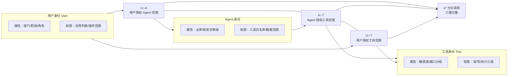
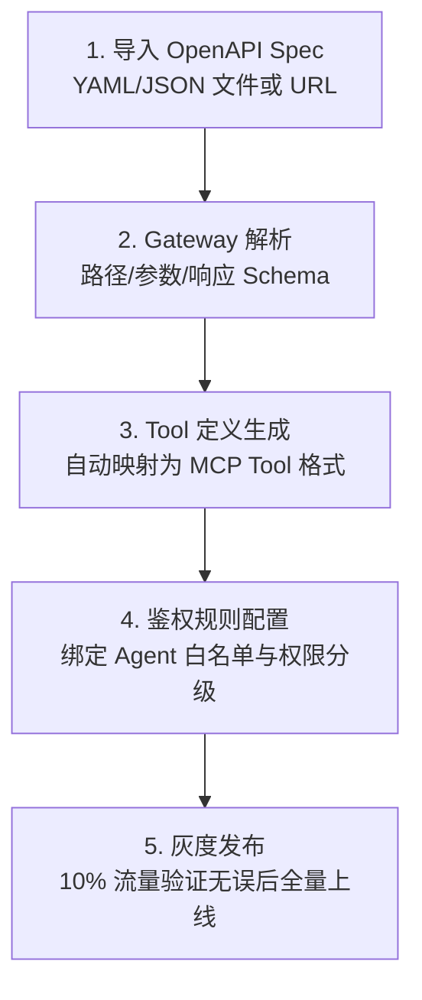
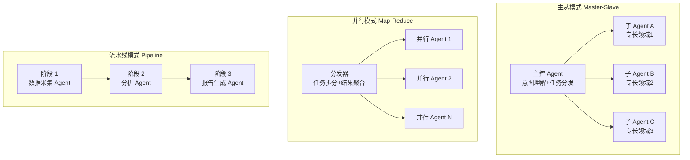
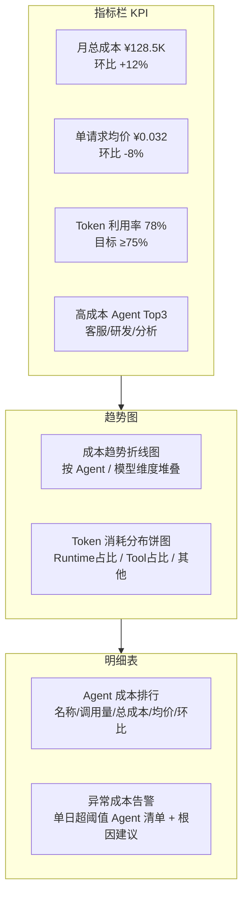
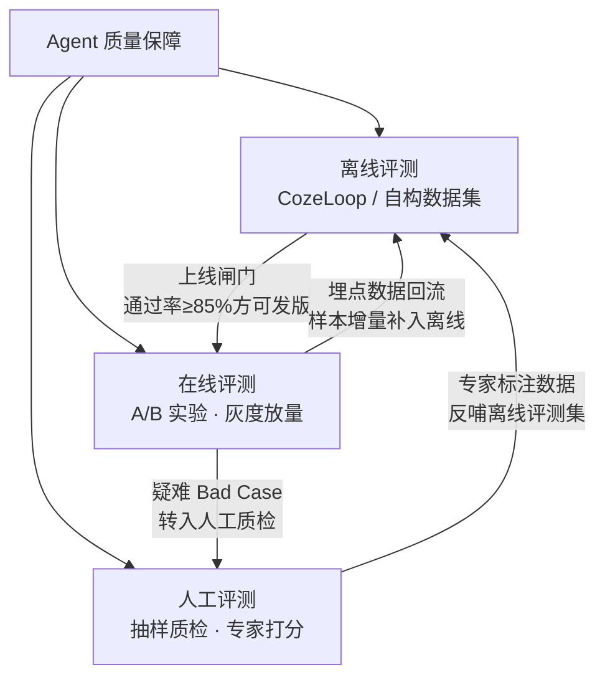
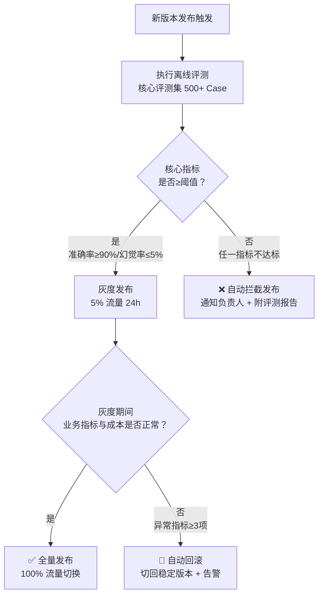

# 07 核心功能深度解析

## 说明：差异化治理能力优先解析原则

如「洞察 2」所揭示，AgentKit 8 大模块的本质架构是「治理外环包裹业务内环」，治理侧的 Identity + Gateway + Observability + Evaluation 组合是区分企业级生产平台与玩具级 Demo 平台的根本标志。本章选取 **Identity、Gateway、A2A、Observability、Evaluation** 5 个最具差异化的模块进行深度解析，其余 Runtime、Session、Memory、Knowledge 4 个业务内环模块可参考 [02 架构章](./02-core-architecture.md) 的架构层说明。

---

## 模块 1：Identity 统一鉴权

### 1. 身份三元模型

AgentKit Identity 模块定义了用户身份、Agent 身份、工具身份三元模型，三者通过属性级鉴权构成交集关系。只有「用户可调用该 Agent ∧ Agent 可调用该工具 ∧ 用户可通过该 Agent 访问该工具」三个条件同时满足，调用链路才会放行。



### 2. IdP 集成流程

企业身份源（IdP）通过标准协议单点登录接入，典型 OIDC 配置分 4 步完成：
1. **IdP 侧创建应用**：在企业 AD / Okta / 飞书身份后台创建 OIDC 应用，获取 Client ID 与 Client Secret
2. **回调地址配置**：将 AgentKit 控制台回调地址 `https://console.volcengine.com/agentkit/sso/callback` 添加到 IdP 白名单
3. **AgentKit 侧配置 IdP**：在 Identity 模块填入 Issuer URL、Client ID、Secret 并完成签名算法配置
4. **属性映射与权限同步**：配置用户属性（部门/角色/邮箱）到 AgentKit 身份标签的映射规则，测试登录验证权限下发正确

### 3. 凭据托管安全架构

业务系统 AK/SK、数据库密码等敏感凭据托管于 Identity 模块的 KMS 加密存储，Agent 调用时通过 IAM Role 动态签发短期 Token，无明文密钥暴露。

```yaml
# 凭据托管典型配置（agent-identity.yaml）
credential_store:
  provider: kms
  encryption: aes-256-gcm
  key_rotation_days: 90

credentials:
  - name: crm-read-only
    type: aksk
    iam_role: agent-crm-reader-role
    allowed_agents: ["customer-service-agent"]
    ttl_seconds: 3600
```

---

## 模块 2：Gateway 工具接入层

### 1. 双模式接入：MCP Server vs REST→Tool 转换

Gateway 同时支持两种接入模式，企业可根据存量系统改造成本与性能要求按需选择。MCP 协议详细原理见知识库的 [MCP 协议深度解析](../../01-agent-protocols-interfaces/agent-communication-protocols/README.md)。

| 对比维度 | MCP Server 模式 | REST→OpenAPI 转换模式 |
|---|---|---|
| 语法标准化 | MCP 协议原生 Tool 定义，结构化程度高 | 从 OpenAPI Spec 自动映射，字段需适配 |
| 调用性能 | 长连接复用，流式响应 P95 延迟 < 500ms | 短连接 HTTP，P95 延迟 1~3s |
| 治理能力 | 细粒度 Tool 级鉴权、错误码、熔断 | 接口级鉴权，治理能力有限 |
| 存量改造成本 | 需重写封装 MCP Server，约 2~5 人日/接口 | 导入 OpenAPI 一键接入，0 代码改造 |
| 流式响应支持 | 原生支持 SSE/WebSocket 流式输出 | 仅支持非流式响应 |
| 错误处理 | MCP 结构化错误码，可自动重试分类 | HTTP 状态码，错误语义需二次解析 |
| 参数校验 | MCP Schema 原生校验，类型安全 | OpenAPI Schema 校验，部分类型丢失 |
| 并发能力 | 连接池复用，单连接支持并发调用 | 每请求独立连接，并发受连接池限制 |
| 协议兼容性 | MCP 标准协议，跨平台互操作性强 | 企业私有 REST 协议，兼容性受限 |
| 适用场景 | 新开发核心接口、高频调用接口 | 存量系统快速接入、低频读操作接口 |

### 2. 自动转换流程：OpenAPI Spec → Tool 定义



转换引擎自动识别 GET 请求映射为只读工具、POST/PUT/DELETE 映射为写操作工具，默认绑定只读权限，防止 Agent 误调用写操作接口引发生产事故。

### 3. 熔断与重试策略

Gateway 内置 4 种弹性治理策略，支持按工具粒度配置：

```yaml
# Gateway 工具级治理策略配置示例
tools:
  - name: crm.order.query
    retry:
      strategy: exponential_backoff    # 指数退避
      max_attempts: 3
      initial_delay_ms: 100
      multiplier: 2.0
    circuit_breaker:
      strategy: failure_rate           # 失败率断路器
      threshold: 0.5                   # 失败率≥50%触发
      window_seconds: 60               # 统计窗口60s
      open_duration_seconds: 30        # 熔断后30s半开试探
    concurrency:
      max_per_agent: 20                # 单Agent并发上限
      global: 500                      # 全局并发上限
  - name: internal.system.write
    retry:
      strategy: fixed_delay            # 固定延迟（幂等写操作慎用）
      max_attempts: 1
```

---

## 模块 3：A2A 多 Agent 协作层

### 1. 三种拓扑模式

A2A（Agent to Agent）协议支持三种协作拓扑，可根据业务场景灵活组合。A2A 协议设计与规范见 [agent-communication-protocols wiki](../../01-agent-protocols-interfaces/agent-communication-protocols/README.md)。



- **主从模式**：适用场景为通用员工助手，主控 Agent 理解用户意图后路由到财务/人力/IT 等子 Agent 处理专业问题
- **并行模式**：适用场景为竞品情报分析，多个并行 Agent 同时抓取不同来源数据，分发器聚合去重生成完整报告
- **流水线模式**：适用场景为营销内容生成，从 Brief → 文案 → 素材 → 投放建议分阶段串行处理，每阶段结果作为下一阶段输入

### 2. 代理分发逻辑

Intent Router 基于意图分类 + 工具能力匹配完成子 Agent 路由，Reduce 阶段按子任务依赖关系聚合结果。

```python
# Intent Router 路由 + Reduce 聚合伪代码
def intent_router(user_request, agent_registry):
    intent = classify_intent(user_request)          # 1. 意图分类
    matched_agents = match_agents(intent, agent_registry)  # 2. 匹配候选 Agent
    selected = select_by_capability(matched_agents, intent) # 3. 能力最佳匹配
    return selected  # 返回目标子 Agent

def reduce_results(sub_results, dependencies):
    final_output = {}
    for stage in topo_sort(dependencies):           # 按拓扑序聚合
        final_output[stage] = merge(
            [sub_results[r] for r in dependencies[stage]]
        )
    return final_output
```

### 3. 错误处理与三级降级流程

子 Agent 执行失败时，A2A 调度器按以下三级降级策略处理：
1. **一级：自动重试**：幂等读操作失败 → 按 Gateway 重试策略自动重试最多 3 次，成功则继续
2. **二级：能力降级**：重试仍失败 → 寻找具备相同能力标签的备选 Agent，切换到备份 Agent 执行
3. **三级：人类介入**：无备选 Agent 或降级后仍失败 → 标记任务为「待人工介入」，通过 IM 消息通知对应业务负责人处理，并附带完整失败链路 TraceID

---

## 模块 4：Observability 可观测性

### 1. 三维信号概览表

| 信号类型 | 子分类 | 关键指标 / 字段 |
|---|---|---|
| **Metrics（15+指标）** | 请求量类 | QPS、日活用户数、Agent 日均调用次数、工具调用 TopN |
|  | 延迟类 | 端到端响应 P50/P95/P99、模型推理延迟、Tool 调用延迟 |
|  | 质量成本类 | Token 消耗总量/人均、成功率/失败率、模型幻觉率估算、单请求平均成本 |
| **Logging（10+结构化字段）** | 通用字段 | trace_id、span_id、timestamp、level、tenant_id、agent_id、user_id |
|  | 业务字段 | intent_type、tool_name、tool_params_masked、model_version、prompt_hash、cost_tokens |
|  | 结果字段 | success_flag、error_code、error_message、answer_confidence_score |
| **Tracing（5个关键Span）** | Harness Span | 编排总耗时、子任务拆分决策、重试次数 |
|  | Tool Span | Gateway 路由决策、熔断/重试触发记录、原始请求/响应摘要 |
|  | Model Span | 模型名称、Token 用量（Prompt/Completion 拆分）、采样提示词 |
|  | Memory Span | 召回条目 ID、相似度得分、写入/更新操作 |
|  | Knowledge Span | 知识库分区、检索 TopK 文档、重排序得分 |

### 2. 成本分析大屏典型布局



### 3. 用户满意度分析（双通道）

1. **显式采集**：用户每次对话后点赞/点踩 + 1~5 星评分，自动关联对应对话 TraceID
2. **隐式语义打分**：未显式评分的对话，使用 NLP 模型分析用户回复语义（如「答非所问」「不对」「谢谢」等关键词），自动打满意度分
3. **告警闭环**：周平均满意度 < 4.0 星的 Agent 自动告警，负责人需在 3 个工作日内提交改进计划，双周版本回归验证达标情况

---

## 模块 5：Evaluation 评测体系

### 1. 评测三角支柱



- **离线评测**：覆盖核心场景的标准化数据集，支持准确率、幻觉率、工具调用成功率、回答相关性 4 维自动打分，每次发版前强制通过
- **在线评测**：新旧版本 Agent 按比例分流 A/B 实验，对比核心业务指标（解决率、满意度、成本），达到统计显著后放量
- **人工评测**：每周随机抽取 200 条对话样本，由 2~3 名业务专家独立盲打分，Kappa 一致性 > 0.75 视为有效

### 2. 自动化评测流水线 5 步

| 步骤 | 动作 | AgentKit 对应能力 |
|---|---|---|
| 1. 数据集构建 | 核心场景用例编写 + 历史 Bad Case 沉淀 + 数据增强扩充 | Evaluation 评测集管理、版本化存储、标签体系 |
| 2. Prompt 冻结 | 记录本次评测使用的 Prompt Hash、模型版本、工具清单快照 | Harness 配置版本管理、配置即部署快照能力 |
| 3. 批量跑分 | 按评测集逐条调用待测 Agent 版本，记录完整输出与 TraceID | Evaluation 批量执行引擎、并发控制、断点续跑 |
| 4. 自动打分 | LLM-as-Judge + 规则引擎 + 向量相似度多维度打分 | Evaluation 评分模型、自定义评分规则、多维聚合报表 |
| 5. 报表导出 | 生成本次评测报告，对比基线版本，标注不达标用例根因 | Evaluation 可视化报表、Bad Case 一键提单、版本对比 |

### 3. 发布闸门与回滚机制



发布闸门绑定 CI/CD 流水线，阈值按业务重要性分级配置。核心交易类要求准确率 ≥ 95%，内部辅助类可放宽至 ≥ 80%。

---

## 其他模块快速导航

| 模块 | 简要说明 | 关联章节 |
|---|---|---|
| **Runtime** | Serverless 运行时，秒级扩缩容 + 多租户隔离 + Tool Executor 调度 | [02 Serverless 底座](./02-core-architecture.md#serverless-弹性运行底座) |
| **Session** | 短期上下文持久化，TTL 自动过期，视为「消耗品」数据 | [02 数据层](./02-core-architecture.md#agent-ready-基础设施分层架构图) |
| **Memory** | 长期记忆分层存储，跨会话沉淀召回，视为「知识资产」需审批 | [02 数据层](./02-core-architecture.md#agent-ready-基础设施分层架构图) |
| **Knowledge** | RAG 检索增强标准组件，多源统一检索 + 向量重排序 | [02 数据层](./02-core-architecture.md#agent-ready-基础设施分层架构图) |

## 本章小结

本章深度解析 AgentKit 治理外环 5 大差异化模块：Identity 以「用户-Agent-工具」三元鉴权模型构建安全边界，凭据托管通过 KMS + IAM Role 实现零明文密钥；Gateway 双轨接入（MCP Server / REST 转换）回应存量改造痛点，10 维对比 + 四策略配置给出选型指南；A2A 支持主从/并行/流水线三种拓扑，三级降级流程保障子 Agent 失败不阻塞；Observability 三维信号覆盖 Metrics/Logging/Tracing，成本大屏 + 双通道满意度量化运营；Evaluation 以离线/在线/人工评测三角支撑质量闭环，发布闸门自动拦截不达标版本。最后以快速导航表链接 Runtime/Session/Memory/Knowledge 业务内环关联章节。

---

| 上一章 | 返回目录 | 下一章 |
|--------|---------|--------|
| ← [06 场景](./06-application-scenarios.md) | [README](./README.md) | → [08 竞品对比](./08-comparison-ecosystem.md) |
