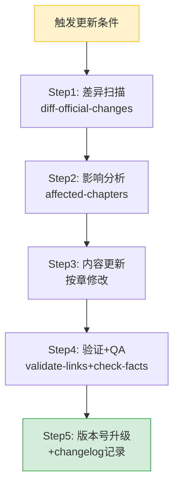

# AgentKit Wiki 版本维护手册

> **本手册定义 AgentKit Wiki 的增量更新触发器、检查清单与SOP**
> 适用人群：Wiki 维护者、需要更新本教程内容的 Agent/人类贡献者
> 最后更新：2026-07-31

---

## 1. 触发器清单（5 类触发条件）

满足以下任一条件时，**必须**执行 Wiki 增量更新：

| 触发器ID | 触发条件 | 检查频率 | 更新优先级 | 涉及章节 |
|---------|----------|----------|-----------|---------|
| **T1: 版本发布** | 火山引擎 AgentKit 官方发布新版本（VeADK/SDK/CLI 大版本号变化） | 事件驱动（发布后 7 天内） | 🔴 P0（必须） | 01/02/03/04/08/10 |
| **T2: 季度体检** | 距上次验证满 90 天（即使无版本发布也需体检） | 每季度（1/4/7/10月1日） | 🟡 P1（建议） | 全量 |
| **T3: 用户反馈** | 收到用户报告的错误/过时内容/链接失效/术语缺失 | 事件驱动（反馈后 3 天内） | 🟠 P0-P1 视严重度 | 涉及章节 |
| **T4: 新功能上线** | AgentKit 新增核心模块/协议支持/重磅功能（如 MCP 3.0、新语言 SDK） | 事件驱动（上线后 14 天内） | 🔴 P0 | 02/03/04/07/10 |
| **T5: 竞品重大变化** | 主要竞品（Dify/LangGraph/Coze/阿里云百炼）发布重大版本或战略转向 | 事件驱动（发布后 30 天内） | 🟢 P2 | 08 |

### 触发器检查命令

```powershell
# 检查距上次验证天数（自动扫描所有文件 frontmatter 中的 last_verified）
python .agents/scripts/check-wiki-staleness.py --wiki volcengine-agentkit-wiki
```

---

## 2. 版本标注规范

参考 [docs-version-annotation 模板](../../../../../templates/shell-snippets/docs-version-annotation.md)：

### 2.1 frontmatter 必填字段

每个 Wiki 文件的 YAML frontmatter 必须包含：

```yaml
---
id: "..."
title: "..."
# ...其他标准字段...
last_verified: "YYYY-MM-DD"      # 最后一次完整验证日期
wiki_version: "1.0"              # Wiki 自身版本号（语义化版本）
agentkit_version_target: "2026Q3"  # 本 Wiki 覆盖的 AgentKit 版本/季度
---
```

### 2.2 版本兼容性章节（10-resources-glossary.md 维护）

版本兼容性矩阵集中维护在 [10-resources-glossary.md](10-resources-glossary.md) 的 Part D 版本历史中，其他章节涉及硬编码版本号时使用 HTML 注释标注：

```markdown
VeADK 支持 Python 3.10+  <!-- verified: 2026-07-31 agentkit:2026Q3 -->
```

---

## 3. 增量更新 SOP（5 步标准流程）



### Step 1：差异扫描

```powershell
# 对比官方文档变化（人工或工具辅助）
# 重点检查源清单见 §4 官方信息源
```

扫描输出：`CHANGES.md`（临时文件，更新完成后可删除或归档到 CHANGELOG）

检查点：
- [ ] 官方文档新增的模块/功能
- [ ] API/CLI 命令的变更（新增/废弃/参数变化）
- [ ] 官方推荐最佳实践的变化
- [ ] 定价/免费额度变化
- [ ] 生态伙伴/集成产品变化

### Step 2：影响分析

根据差异扫描结果，填写影响矩阵：

| 变更类型 | 影响章节 | 更新方式 | 预计工作量 |
|---------|---------|---------|-----------|
| 新增模块 | 01/02/07 | 新增小节 | 中 |
| API 变更 | 03/04/05 | 修改代码示例 | 小 |
| 版本号变化 | 03/04/10 | 更新版本标注 | 小 |
| 功能废弃 | 07/09 | 添加废弃标记 | 小 |
| 定价变化 | 09 | 更新 FAQ | 小 |
| 竞品变化 | 08 | 更新对比矩阵 | 中 |
| 架构变更 | 01/02/07 | 更新 Mermaid 图+文字 | 大 |

### Step 3：按章更新（最小修改原则）

- **增量优于重写**：在现有段落基础上增补/修正，不要整章重写
- **保留历史**：废弃功能使用 `> ⚠️ 已废弃（vX.X 起）` 标注，不要直接删除
- **新增内容标注版本**：新段落末尾加注 `<!-- added: YYYY-MM-DD reason:T1/T2/... -->`
- **Mermaid 图同步**：架构变化时必须更新对应 Mermaid 图（含新增节点）

### Step 4：验证与 QA

```powershell
# 1. 链接检查（无断链）
python .agents/scripts/check-links.py --path .agents/docs/knowledge/learning/03-agent-platforms-tools/volcengine-agentkit-wiki/

# 2. frontmatter 一致性
python .agents/scripts/check-frontmatter.py --path .agents/docs/knowledge/learning/03-agent-platforms-tools/volcengine-agentkit-wiki/

# 3. 行数合规（每文件<300行）
python .agents/scripts/check-file-size.py --path .agents/docs/knowledge/learning/03-agent-platforms-tools/volcengine-agentkit-wiki/ --max-lines 300

# 4. 人工检查清单
#   - [ ] 代码示例可运行（至少语法正确）
#   - [ ] Mermaid 图语法合法
#   - [ ] 术语表已同步新增术语
#   - [ ] FAQ 新增常见问题（如有）
#   - [ ] 交叉引用链接正确
```

### Step 5：版本号升级 + Changelog

1. 更新所有修改文件 frontmatter 中的 `last_verified` 为当前日期
2. 更新 `wiki_version`：
   - 主版本号（X.0.0）：架构级重写/章节大幅重构
   - 次版本号（1.X.0）：新增整章/重大功能补充
   - 修订号（1.0.X）：小修小补/错误修正/版本号更新
3. 在 [10-resources-glossary.md](10-resources-glossary.md) 的「版本历史」表格中追加一行
4. 在本文件末尾的「更新日志」追加摘要

---

## 4. 官方信息源清单（更新时必查）

| 源ID | 名称 | URL | 检查频率 | 关注内容 |
|------|------|-----|---------|---------|
| S1 | 产品主页 | https://www.volcengine.com/product/agentkit | T1/T4触发时 | 产品定位/功能模块变化 |
| S2 | 官方文档中心 | https://www.volcengine.com/docs/...（AgentKit 文档） | T1/T4触发时 | API/SDK/CLI 变更 |
| S3 | VeADK GitHub | https://github.com/volcengine/veadk-* | T1/T4触发时 | Release Notes/Changelog |
| S4 | 火山引擎动态 | https://www.volcengine.com/news | 月度 | 产品发布/功能更新公告 |
| S5 | 定价页面 | https://www.volcengine.com/pricing?product=agentkit | 季度 | 价格/免费额度变化 |
| S6 | 控制台 | https://console.volcengine.com/agentkit | T1/T4触发时 | 新功能入口变化 |
| S7 | 火山引擎开发者社区 | https://developer.volcengine.com/ | 月度 | 最佳实践/案例/教程 |
| S8 | 竞品官网 | Dify/LangGraph/Coze/百炼 官方渠道 | T5触发时 | 竞品重大变化 |

---

## 5. 快速更新命令集

```powershell
# === 一键季度体检（T2触发器）===
# 在项目根目录执行：
python .agents/scripts/check-wiki-staleness.py --wiki volcengine-agentkit-wiki

# === 更新后完整验证 ===
python .agents/scripts/check-links.py --path .agents/docs/knowledge/learning/03-agent-platforms-tools/volcengine-agentkit-wiki/
python .agents/scripts/check-frontmatter.py --path .agents/docs/knowledge/learning/03-agent-platforms-tools/volcengine-agentkit-wiki/

# === 版本号批量更新（替换所有文件的 last_verified）===
# 注意：手动更新每个文件的 last_verified 更安全；批量脚本慎用
```

---

## 6. 反模式（不要这么做）

| 反模式ID | 错误做法 | 为什么错 | 正确做法 |
|---------|---------|---------|---------|
| AM-1 | 一次更新重写所有 12 个文件 | 工作量大、易引入错误、难审查 | 按增量SOP，每次只改涉及的章节 |
| AM-2 | 为了"保持最新"频繁小幅改动 | 造成 changelog 噪音、版本号膨胀 | 按触发器条件更新，T1/T3 P0立即处理；T2季度统一处理 |
| AM-3 | 直接删除"过时"内容 | 老版本用户仍需参考 | 用废弃标注替代删除，保留迁移说明 |
| AM-4 | 更新后不升级 wiki_version | 用户无法判断内容新旧 | 严格按语义化版本升级 |
| AM-5 | 只更新正文不更新术语表/FAQ/CHANGELOG | 教程内部一致性破坏 | Step3 完成后，必须检查术语表和FAQ是否同步 |
| AM-6 | 引用未验证的第三方信息 | 可能引入事实错误 | 所有新事实必须来自§4官方信息源，引用处标注源ID |

---

## 7. 责任与通知

- **日常维护**：知识库自动维护（通过 docgen-cmd 检查链接和frontmatter一致性）
- **季度体检**：建议在每季度首周执行 T2 触发器检查
- **大版本响应**：T1/T4 触发时，建议指派负责人在窗口期内完成更新
- **更新后通知**：更新完成后，在 `[最近更新]` 板块（`.agents/docs/knowledge/README.md`）置顶变更记录

---

## 更新日志

| 版本 | 日期 | 触发器 | 变更摘要 | 维护者 |
|------|------|--------|---------|-------|
| v1.0 | 2026-07-31 | 初版 | 基于七概念方法论生成首版 12 章完整教程，含 60 条事实/5 条洞察/3 个可复用模式 | seven-concepts E-stage |
