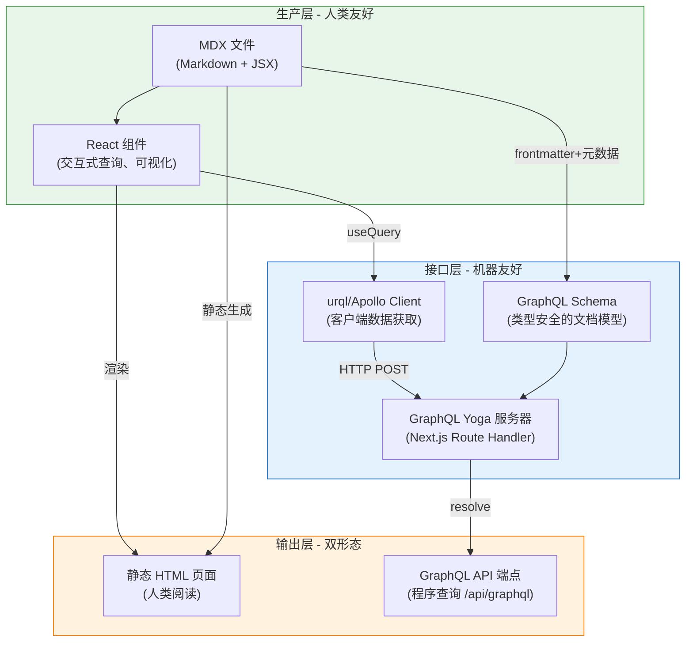
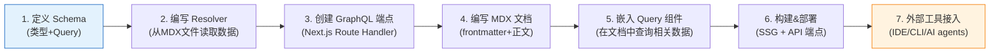

# 00 - 概述与核心概念

> 本章目标：8 分钟理解"可查询文档"是什么、为什么 MDX+GraphQL 是最佳组合、整体架构如何分层。读完本章你应该能向同事解释这个方案的价值。

## 什么是"可查询文档"？

传统文档的工作模式是：

```
作者写 Markdown → 构建工具生成 HTML → 用户浏览网页
```

这个模式下，文档是**给人看的**。程序如果想"查文档里所有返回 User 类型的 API"，只能爬 HTML 然后解析——脆弱、低效、不可靠。

**可查询文档（Queryable Docs）** 在这个基础上增加了一层：

```
作者写 MDX → 构建时提取结构化元数据 → GraphQL Schema →
  ├─ 人读：渲染为 HTML 网页
  └─ 机查：GraphQL API 端点（IDE/CLI/AI agents 直接查询）
```

核心洞察来自一句话：**文档不只是渲染目标（HTML），更是数据源头（Graph）。** HTML 只是 GraphQL 数据的一种"视图"。

## MDX 和 GraphQL 各自的角色



### MDX 的角色：生产层

MDX 在组合中承担**知识创作**职责：

- 用 Markdown 写正文，零学习成本
- 用 JSX 嵌入交互组件（最关键的是 GraphQL 查询组件）
- 通过 frontmatter 定义结构化元数据（API 端点信息、参数、返回类型等）
- 构建时可以提取所有 frontmatter 和内容结构，作为 GraphQL 的数据源

### GraphQL 的角色：接口层

GraphQL 在组合中承担**知识暴露**职责：

- 用 Schema 定义文档的类型系统（`ApiEndpoint`、`Parameter`、`ReturnType` 等）
- 客户端声明需要哪些字段，避免过取/欠取
- Introspection 让工具可以自动发现文档结构
- 同一个端点同时服务于页面渲染和外部工具查询

## 技术栈选型理由

为什么选择本指南中的技术栈？每一层的选型都有明确理由：

### 框架：Next.js 14+ (App Router)

| 选择理由 | 说明 |
|---------|------|
| 原生 MDX 支持 | `@next/mdx` 官方插件，配置简单 |
| Route Handlers | 可以直接在 `app/api/graphql/route.ts` 中运行 GraphQL 服务器 |
| RSC 支持 | React Server Components 减少客户端 JS 体积 |
| 静态生成 | 文档页面可以 SSG 预渲染，性能优秀 |
| 生态成熟 | 2026 年 React 生态最主流的全栈框架 |

**不选 Docusaurus 的原因**：Docusaurus 是优秀的文档框架，但它的插件系统对自定义 GraphQL 服务器支持不如 Next.js 灵活。如果你已经在用 Docusaurus，[03-best-practices.md](03-best-practices.md) 中有迁移/集成建议。

### GraphQL 服务器：GraphQL Yoga

| 选择理由 | 说明 |
|---------|------|
| 零配置 | 开箱即用，无需复杂的 Apollo Server 配置 |
| Next.js 友好 | 天然适配 Route Handler / Edge Runtime |
| 内置 GraphiQL | 开发时直接访问 `/api/graphql` 即可交互式查询 |
| 类型安全 | 与 Pothos 等代码优先 Schema 库配合良好 |

### GraphQL 客户端：urql

| 选择理由 | 说明 |
|---------|------|
| 轻量 | 核心包仅 ~9KB，比 Apollo Client 小很多 |
| 文档场景足够 | 文档站不需要 Apollo 的全功能（缓存策略简单） |
| 快速上手 | `useQuery` hook 简洁直观 |

### Schema 构建：Pothos（代码优先）

| 选择理由 | 说明 |
|---------|------|
| TypeScript 原生 | 全类型推导，无需写 .graphql 文件再生成类型 |
| 插件生态 | 自带 Relay 风格连接、权限、验证等插件 |
| 代码即 Schema | 类型定义和 resolver 写在一起，维护方便 |

**代码优先 vs Schema 优先**：文档 Schema 相对简单，代码优先（Pothos）效率更高。如果你的团队更熟悉 SDL 语法，可以用 `graphql-tools` 的 Schema 优先方式。

## 核心工作流

开发一个可查询文档站的标准流程：



## 什么场景适合/不适合？

### ✅ 适合的场景

- **大型 API 平台文档**：API 端点多、参数复杂，需要多维度检索
- **框架/库文档**：需要在文档中动态展示 API 列表、类型关系
- **开发者门户**：需要为 IDE 插件、CLI 工具提供文档 API
- **AI 原生知识库**：AI agents 需要精确查询文档而非全文搜索

### ❌ 不适合的场景

- **小型项目 README**：用 Markdown 就够了，MDX+GraphQL 是过度工程
- **博客/营销站点**：内容主要是叙述性文章，不需要结构化查询
- **纯静态文档（无交互需求）**：如果只是让人读不需要程序查，传统 SSG 足够

## 与 Sphinx 路径的对比

如果你了解 Python 生态的 Sphinx，这里有一个快速对比：

| 维度 | MDX + GraphQL（本指南） | Sphinx + GraphQL |
|------|------------------------|-----------------|
| 生态 | JS/React | Python |
| GraphQL 集成 | JSX 组件内嵌查询，天然交互式 | 需要自定义扩展/构建器 |
| 多格式输出 | 主要是 HTML，PDF 需额外工具 | HTML/PDF/ePub/man page 等 |
| 交互式组件 | ⭐ React 组件生态丰富 | 通过 directive 有限支持 |
| 学习曲线 | 如果你会 React 就很简单 | 需要学 reST 和 Sphinx 扩展机制 |
| 推荐场景 | JS 项目、交互式文档站 | Python 项目、技术书籍、需要多格式出版 |

## 下一章

→ [01 - 5分钟快速上手](01-quickstart.md)：从零开始，创建你的第一个可查询文档站。

---

← 上一章：[返回目录](README.md) | [目录](README.md) | 下一章：[5分钟快速上手](01-quickstart.md) →
