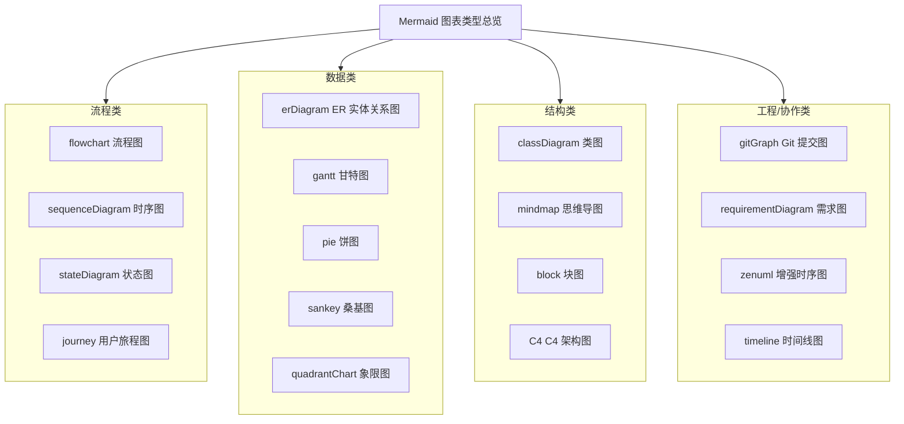

# Mermaid：用文本定义图表的可视化工具

## 教程简介

**Mermaid** 是一个基于 JavaScript 的图表绘制与可视化工具，使用受 Markdown 启发的文本定义和渲染器来创建、修改复杂图表。

它的核心价值在于：**让你用纯文本描述图表结构，由渲染器自动生成高质量的 SVG 图表**。这带来两个直接好处：

- **版本可控**：图表以文本形式纳入版本控制，可 diff、可 review、可追溯变更历史。
- **解决 Doc-Rot**：Mermaid 的核心目的正是「帮助文档跟上开发进度」，解决文档与实际开发脱节（Doc-Rot）的问题——当图表的修改成本低到与修改文字相当，文档就不容易过时。

每个图表类型对应一个图表「关键字」作为起始声明，例如 `flowchart`、`sequenceDiagram`、`classDiagram`、`gantt`、`erDiagram`、`journey`、`quadrantChart`、`xychart-beta`、`gitGraph` 等。

> **关于官方域名**：Mermaid 官方文档实际域名为 **https://mermaid.js.org/**（语法页位于 `/syntax/<图表名>.html`，配置页位于 `/config/<配置名>.html`）。用户/任务清单中提到的 `mermaid.ai` 为其别名或跳转入口，撰写本文档时采集与访问均以 `mermaid.js.org` 为准。在线编辑器独立域名为 **https://mermaid.live/**。

## 图表类型总览

Mermaid 支持十余种图表类型。下图用 flowchart 概括主流类型，按用途划分为「流程类」「数据类」「结构类」「工程/协作类」四组：

各类型官方语法页均在 `https://mermaid.js.org/syntax/<名称>.html`，例如 `flowchart.html`、`sequenceDiagram.html`、`classDiagram.html`、`stateDiagram.html`、`entityRelationshipDiagram.html`、`gantt.html`、`pie.html`、`journey.html`、`timeline.html`、`sankey.html`、`quadrantChart.html`、`gitgraph.html`、`requirementDiagram.html`、`mindmap.html`、`block.html`、`c4.html`、`zenuml.html`。

## 目标读者

本教程适合以下读者：

- **技术文档写作者**：用 Mermaid 在 Markdown 中绘制架构图、流程图、时序图
- **后端/前端开发者**：在项目文档、README、API 文档中嵌入图表的开发者
- **架构师/技术负责人**：绘制 ER 图、C4 架构图、需求图辅助设计评审
- **项目管理者**：用甘特图、用户旅程图、Git 图做计划与协作可视化
- **文档工具链使用者**：希望将 Mermaid 集成到 CI、静态站点、在线编辑器的开发者

**前置知识**：掌握基础 Markdown 语法即可；涉及本地集成章节时需了解基础的 HTML/JavaScript/npm。

## 章节导航（10 章）

| 章节 | 标题 | 内容概要 | 文件 |
|------|------|----------|------|
| 1 | 入门与快速开始 | 核心概念、解决 Doc-Rot、工作原理、mermaid.live 快速上手、本地集成方式 | [01-introduction-quickstart.md](01-introduction-quickstart.md) |
| 2 | 流程图 Flowchart | 节点形状/方向/连线/样式/subgraph/交互，最常用图表类型 | [02-flowchart.md](02-flowchart.md) |
| 3 | 时序图 SequenceDiagram | participant/消息箭头/激活/分组/循环分支块 | [03-sequence-diagram.md](03-sequence-diagram.md) |
| 4 | 结构型图表 | classDiagram 类定义/关系/基数；stateDiagram 状态/转换/复合状态；erDiagram 实体/关系/基数 | [04-class-state-er.md](04-class-state-er.md) |
| 5 | 可视化图表 | gantt 甘特图、pie 饼图、journey 用户旅程、timeline 时间线、sankey 桑基图、quadrantChart 象限图 | [05-aggregate-diagrams.md](05-aggregate-diagrams.md) |
| 6 | 进阶图表 | gitGraph、requirementDiagram、mindmap、block、C4、zenuml | [06-advanced-diagrams.md](06-advanced-diagrams.md) |
| 7 | 配置与主题 | 配置来源、内置主题、themeVariables 自定义、securityLevel、渲染器 | [07-configuration-theming.md](07-configuration-theming.md) |
| 8 | 集成与生态 | mermaid-cli、mermaid.live、CDN/npm 集成、渲染器与生态对比 | [08-integrations-ecosystem.md](08-integrations-ecosystem.md) |
| 9 | 常见问题与最佳实践 | 高频问题排查、最佳实践、与项目安全编码六规则的对接 | [09-faq-best-practices.md](09-faq-best-practices.md) |
| 10 | 命令速查表 | 17 种图表类型语法速查、配置速查、mermaid.live 速查 | [10-cheatsheet.md](10-cheatsheet.md) |

## 阅读路径建议

### 线性阅读（推荐新手）

按章节顺序从 1 到 10 完整阅读，建立从概念到实践的完整知识体系：

1. 先建立**整体认知**（第 1 章）——Mermaid 是什么、解决什么问题、怎么快速上手
2. 掌握**最常用图表**（第 2-4 章）——流程图、时序图、类图/状态图
3. 覆盖**数据与计划类**（第 5-7 章）——ER 图、甘特图、数据可视化
4. 了解**专业与特殊图**（第 8 章）——结构图、特殊图表类型
5. 深入**配置与集成**（第 9-10 章）——主题定制、安全、工具链

### 按需查阅（推荐有经验者）

- 想快速画一张流程图 → [第 1 章快速开始](01-introduction-quickstart.md) + [第 2 章流程图](02-flowchart.md)
- 画接口调用时序 → [第 3 章时序图](03-sequence-diagram.md)
- 做数据库/数据建模/类结构 → [第 4 章结构型图表](04-class-state-er.md)
- 做项目排期/数据可视化 → [第 5 章可视化图表](05-aggregate-diagrams.md)
- 定制图表配色 → [第 7 章配置与主题](07-configuration-theming.md)
- 集成到 CI / 命令行 → [第 8 章集成与生态](08-integrations-ecosystem.md)

## 与项目相关资产的关联

本教程是**面向 Mermaid 官方文档的系统学习教程**（讲清「为什么」与「怎么做」），与项目内已有的操作级资产互补：

| 资产 | 定位 | 与本教程的关系 |
|------|------|----------------|
| [Mermaid 图表操作指南](../../../best-practices/mermaid-guide.md) | SpecWeave 项目内写 Mermaid 的一站式操作手册（安全编码六规则、check-mermaid.py 自动检查、渲染排查流程） | 教程教你「会画」；操作指南教你「在本项目内画得安全、可过 CI」。写图前请先过安全编码六规则（禁止空行、中文加引号、` ` 换行、subgraph 纯英文 ID 等） |
| [mermaid-cmd 指令集](../../../../../skills/mermaid-cmd/SKILL.md) | Mermaid 图表管理命令 Skill（create/check/fix/verify 全生命周期） | 需要在实际任务中创建/检查/修复图表时，调用该 Skill 而非手写 |
| [mermaid 图表管理指令集](../../../../../commands/mermaid.md) | 完整执行流程 / RACI 矩阵 / CMD-LOG 规范 | mermaid-cmd Skill 的 L2 层细节，复杂图表协作时使用 |
| [check-mermaid.py](../../../../../scripts/lib/checks/mermaid.py) | 自动检测 10 类安全编码问题的脚本 | 写完图表后运行，确保符合安全规范 |

> **实践建议**：本教程的示例图表主要面向「学习与理解」，不一定每条都满足项目安全编码规范；在 SpecWeave 项目正式文档中嵌入 Mermaid 图表时，务必以 [mermaid-guide.md](../../../best-practices/mermaid-guide.md) 的安全编码六规则为准，并运行 `check-mermaid.py` 校验。

---

> **开始阅读**：[第 1 章 — 入门与快速开始 →](01-introduction-quickstart.md)