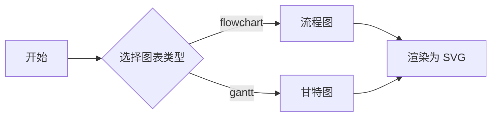

# Mermaid 入门与快速开始

## 1. Mermaid 是什么

**Mermaid** 是一个基于 JavaScript 的图表绘制与可视化工具。它使用**受 Markdown 启发的文本定义和渲染器**来创建、修改复杂图表——也就是说，你不需要拖拽画布，而是用一段接近自然语言的文本描述图表结构，Mermaid 会把它渲染成可视化的 SVG 图表。

每个图表类型对应一个图表「关键字」作为起始声明，例如：

- `flowchart`（流程图）、`sequenceDiagram`（时序图）
- `classDiagram`（类图）、`stateDiagram-v2`（状态图）
- `erDiagram`（ER 图）、`gantt`（甘特图）
- `journey`（用户旅程）、`quadrantChart`（象限图）、`xychart-beta`（XY 散点/柱状图）
- `gitGraph`（Git 提交图）等

## 2. 它解决什么问题：Doc-Rot

Mermaid 的核心目的可以概括为一句话：**「帮助文档跟上开发进度」**，解决文档与实际开发脱节（Doc-Rot）的问题。

传统作图方式（Visio、draw.io、设计稿）的痛点在于：

- 图表是**二进制/私有格式**，无法纳入版本控制做 diff，团队协作困难。
- 修改图表成本高，文档写完即过时，最终与代码脱节（即 Doc-Rot）。

Mermaid 用**纯文本**定义图表，天然具备以下优势：

| 优势 | 说明 |
|------|------|
| 版本可控 | 文本可进入 Git，可 diff、可 review、可追溯 |
| 修改成本低 | 改一行文本即可改图，与改文字成本相当，文档不易过时 |
| 可嵌入 Markdown | 与文档、代码、README 无缝共存 |
| 跨平台 | 一个 `.mmd` 文本在多处渲染一致 |

## 3. 工作原理

Mermaid 的渲染链路非常轻量：

- **输入**：一段 Mermaid 文本定义（如 `flowchart TD` 开头的一段代码）。
- **解析与渲染**：Mermaid 解析器将文本解析为图结构，并在浏览器中**渲染为 SVG**（Gantt 图可渲染为 SVG、PNG 或 Markdown 链接）。
- **底层依赖**：布局与绘制底层依赖 **d3** 与 **dagre-d3**；时序图语法源自 js-sequence-diagram；甘特图渲染思路受 Jessica Peter 项目启发。
- **安全**：对外部用户开放的站点，Mermaid 会尝试净化输入代码，并提供在沙箱 iframe 中渲染图表的更高安全级别（牺牲部分交互功能）。

流程图布局默认使用 `dagre` 渲染器，v9.4+ 也可选用实验性的 `elk` 渲染器（更适合大型/复杂图）。

## 4. 快速开始：用 mermaid.live 画第一张图

零安装的入门方式就是使用官方在线编辑器 **mermaid.live**（<https://mermaid.live/>）。

**三步上手**：

1. 打开 <https://mermaid.live/>，左侧是代码编辑区，右侧是实时渲染区。
2. 在左侧输入下面的最小 flowchart 示例，右侧会**实时渲染**出对应的流程图。
3. 修改左侧代码，右侧立即更新——所见即所得。

最小示例（一个 flowchart，`TD` 表示自上而下）：



> 说明：上面的示例为了让各节点便于阅读，给中文文本加了双引号、节点 ID 使用纯英文。这正是 SpecWeave 项目「Mermaid 安全编码六规则」的推荐写法（详见第 5 节）。

**mermaid.live 在线编辑器核心功能**：

- **语法高亮**：左侧代码自动着色，便于阅读与定位错误。
- **实时预览**：右侧画布随输入即时更新。
- **配置面板**：可切换主题（default/neutral/dark/forest/base）、调整安全级别等。
- **分享**：图表数据在浏览器端处理，可生成可分享链接。
- **导出**：支持导出 **PNG**、**SVG** 图片资产。
- **教程入口**：官方文档 intro 页也推荐通过 Mermaid Live Editor 创建图表入门，并提供视频教程（Ecosystem/Tutorials）。

## 5. 本地集成方式概览

除在线编辑器外，Mermaid 可通过多种方式集成到本地项目或文档系统。

### 方式一：CDN + `class="mermaid"`（无打包器，最简单）

在 HTML 页中引入 CDN 的 ES 模块入口，并调用 `mermaid.initialize({ startOnLoad: true })`。加载后 Mermaid 解析器会自动查找页面中所有 `class="mermaid"` 的 `<div>` 或 `<pre>` 标签，并将其渲染为 SVG。

```html
<script type="module">
  import mermaid from 'https://cdn.jsdelivr.net/npm/mermaid@11/dist/mermaid.esm.min.mjs';
  mermaid.initialize({ startOnLoad: true });
</script>
```

对应在 HTML 中写图：

```html
<div class="mermaid">
  flowchart TD
    A["开始"] --> B["结束"]
</div>
```

CDN 地址格式：`https://cdn.jsdelivr.net/npm/mermaid@<version>/dist/`，当前大版本推荐 **mermaid@11**（ES module 分发）。

### 方式二：npm 安装（前端工程）

在项目里安装依赖：

```bash
npm i mermaid
# 或
yarn add mermaid
# 或
pnpm add mermaid
```

部署运行需要 **Node v16（含 npm）**。安装后在代码中 `import mermaid from 'mermaid'` 并初始化。

### 方式三：`mermaid.initialize` 初始化

无论是 CDN 还是 npm，核心都是调用 `mermaid.initialize(config)`：

- `startOnLoad: true`：页面加载后自动渲染所有 `class="mermaid"` 元素。
- 常用初始化示例：`mermaid.initialize({ startOnLoad: true, theme: 'base', securityLevel: 'loose' })`。
- 配置来源分三层：默认配置 → 站点级 `initialize` 覆盖 → 图前 frontmatter（v10.5.0+）；`directives` 指令已被 frontmatter 取代（弃用）。

### 方式四：mermaid-cli（命令行 / CI）

需要把 `.mmd` 文件批量转成 PNG/SVG 等图片资产用于 CI 时，使用官方命令行工具（已迁移到独立仓库 `mermaid-js/mermaid-cli`）：

```bash
npm install -g @mermaid-js/mermaid-cli
mmdc -i input.mmd -o output.png
```

> 各集成方式的详细参数、主题配置与 CI 实践，见后续章节（第 9 章配置与主题、第 10 章集成与工具链）。

## 6. 在项目中编写 Mermaid 的安全提示

在 SpecWeave 项目（或任何对 Mermaid 渲染容错度要求高的环境）中编写 Mermaid 代码块时，请遵守以下硬性规范，避免渲染失败：

1. **代码块内禁止空行**（含仅空格的行），空行会导致解析中断。
2. **中文/特殊字符/含空格的节点文本、边标签、subgraph 标题一律用双引号包裹**，如 `A["中文节点"]`、`-->|"标签"| B`。
3. **节点 ID 用纯英文**，中文只放标签部分。
4. **subgraph 用 `subgraph EN_ID ["中文标题"]` 格式**。
5. **换行用 `<br/>` 而非 `\n`**。
6. 代码块围栏用全小写 `mermaid`。

详细规则与自动化检查工具见 [Mermaid 图表操作指南](../../../best-practices/mermaid-guide.md)。

---

> **下一章**：[第 2 章 — 流程图 Flowchart →](02-flowchart.md)