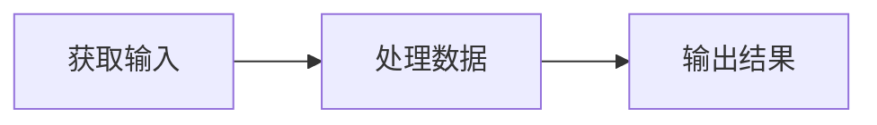
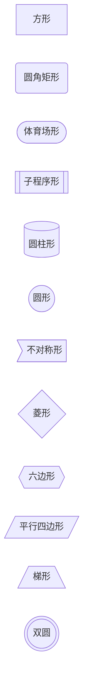
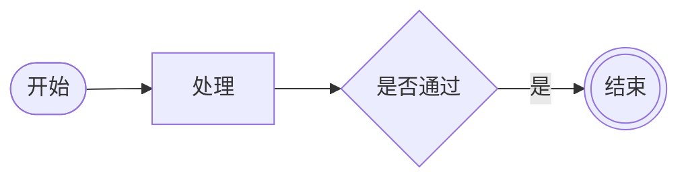
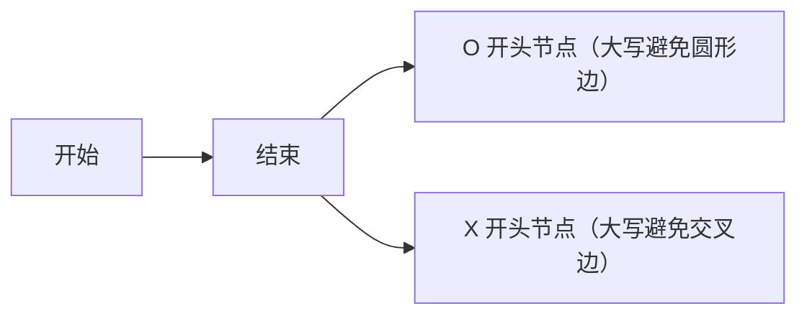
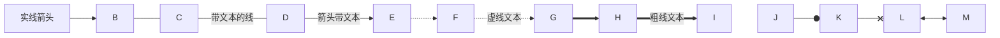
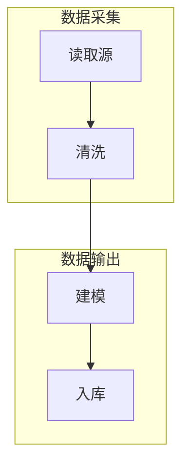
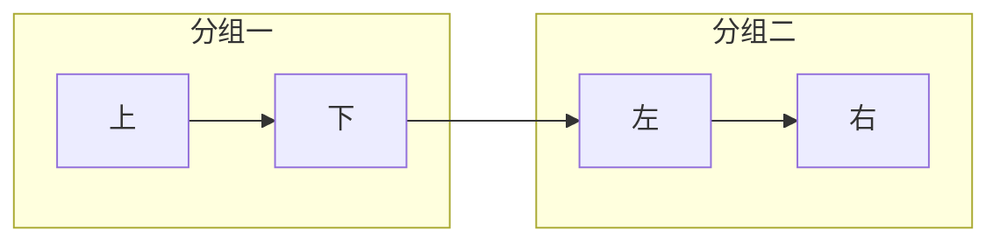
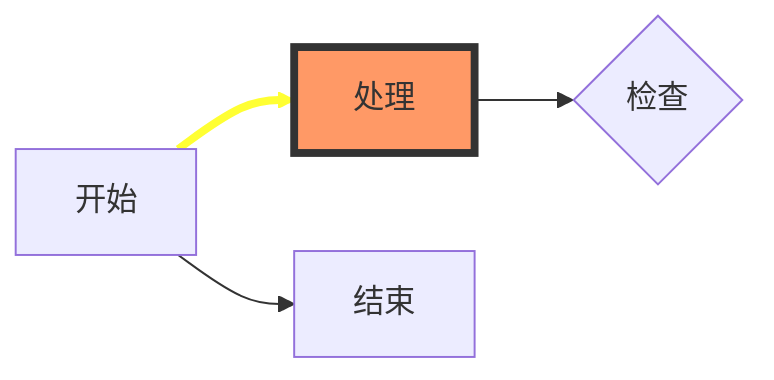
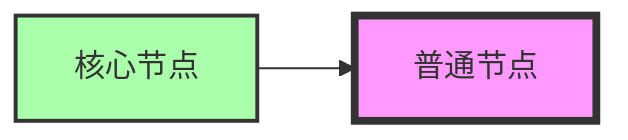

# Mermaid 基础图表：流程图（Flowchart）

**Flowchart（流程图）** 是 Mermaid 中最常用、最直观的图表类型，它由**节点（node，几何形状）** 与**边（edge，箭头/连线）** 组成，用于表达流程、分支、决策与数据流。

本教程所有事实均以 Mermaid 官方文档（<https://mermaid.js.org/>）为准。

## 关键字与方向声明

图表以 `flowchart` 关键字起始（也可使用等价的 `graph`）。方向声明语句紧跟关键字之后，控制图表的整体布局方向：

| 方向 | 含义 |
|------|------|
| `TB` | Top→Bottom，自上而下（`TD` 为 Top-down，与 `TB` 等价） |
| `BT` | Bottom→Top，自下而上 |
| `RL` | Right→Left，从右到左 |
| `LR` | Left→Right，从左到右 |

以下是一个 LR 方向（从左到右）的标准三节点流程图：

## 节点形状

节点是流程图的组成单元。默认写法 `A` 即可生成一个方形节点；通过不同的括号语法可以指定节点文本与几何形状：

| 语法 | 形状 |
|------|------|
| `A` | 默认方形 |
| `A[text]` | 方形（带文本） |
| `A(text)` | 圆角矩形 |
| `A([text])` | 体育场形 |
| `A[[text]]` | 子程序形 |
| `A[(text)]` | 圆柱形 |
| `A((text))` | 圆形 |
| `A>text]` | 不对称形 |
| `A{text}` | 菱形（rhombus） |
| `A{{text}}` | 六边形 |
| `A[/text/]` | 平行四边形（alt 用 `A[\text\]`） |
| `A[/text\]` | 梯形（alt 用 `A[\text/]`） |
| `A(((text)))` | 双圆 |

> **注意**：节点文本若含中文或空格，必须用双引号包裹，例如 `A["开始节点"]`。节点 ID 使用纯英文，中文只放在标签部分。

下面是一个展示多种节点形状的完整示例（`flowchart LR`）：

Mermaid v11.3.0 起还新增了 30 个扩展形状，通用语法为 `A@{ shape: rect }`（等价于 `A["A"]` 或 `A`），短名/别名例如：`rect`（process）、`diam`（decision）、`hex`（hexagon）、`cyl`（database）、`stadium`（terminal）、`circle`（start）、`dbl-circ`（stop）、`bolt`（com-link）、`doc`（document）、`datastore`、`flag`（paper-tape）等。此外还有 `icon`（需先注册图标包）与 `image` 两种特殊形状。例如：

## 特殊字符注意

官方文档对节点文本与节点名有以下 WARNING：

- 若节点文本用到 `end`，必须大写（如 `End`/`END`），否则会破坏整个 flowchart 的解析。
- 若连接节点名以字母 `o` 或 `x` 开头，需加空格或大写，否则 `A---oB` 会生成「circle edge」（圆形边）、`A---xB` 会生成「cross edge」（交叉边）。

正确的写法示例：

## 连线类型

边（edge）用于连接节点，Mermaid 支持多种连线样式：

| 语法 | 类型 |
|------|------|
| `A-->B` | 实线箭头 |
| `A---B` | 开放线（无箭头） |
| `A-- text ---B` 或 `A---|text|B` | 开放线+文本 |
| `A-->|text|B` 或 `A-- text -->B` | 实线箭头+文本 |
| `A-.->B` | 虚线箭头 |
| `A-. text .->B` | 虚线箭头+文本 |
| `A==>B` | 粗线箭头 |
| `A== text ==>B` | 粗线箭头+文本 |
| `A~~~B` | 隐形线 |
| `A--oB` | 圆形边 |
| `A--xB` | 交叉边 |
| `A<-->B` / `A<---B` / `A<==>B` | 多方向箭头 |

> **中文标签**：边标签若含中文或空格，务必用双引号包裹，如 `-->|"标签文本"|B`。

以下是一个覆盖多种连线类型的完整示例：

连线长度可通过多加短横线/等号/点来跨更多层级（如 normal `---`、thick `===`、dotted `-.-`）。另外，特殊字符需用引号包裹或用实体码转义（例如 `#` 编码为 `#35;`，支持 HTML 字符名）。

## Subgraph 分组与方向

`subgraph` 关键字可将节点分组为一个子图，并可为子图设置独立的 `direction`。注意：若 subgraph 节点有外部链接，subgraph 的方向会被忽略，并继承父图方向。

> **项目安全编码约定**：为规避 VS Code 预览布局异常，`direction` 仅在流程图顶层声明，不在 subgraph 内部嵌套。以下示例均遵循此约定，只演示 top-level `direction`。

> **中文标题**：subgraph 使用 `subgraph EN_ID ["中文标题"]` 格式，ID 用纯英文，中文标题放在双引号中。

代码块内注释可用行首 `%%` 表示（以下示例演示多个 subgraph 分组，方向统一在顶层声明）：

## 样式

节点与连线均可自定义样式：

- `classDef className fill:#f9f,stroke:#333,stroke-width:4px;` 定义一个样式类。
- `class nodeId className` 将类应用到节点；简写为 `node:::className`。
- 名为 `default` 的类会应用到所有节点。
- 连线样式用 `linkStyle 序号 属性`，序号为边定义顺序（从 0 开始），如 `linkStyle 3 stroke:#ff3,stroke-width:4px,color:red;`。
- 曲线类型可选：`basis`、`bumpX`、`bumpY`、`cardinal`、`catmullRom`、`linear`、`monotoneX`、`monotoneY`、`natural`、`step`、`stepAfter`、`stepBefore`。
- 外部 CSS 覆盖节点样式不可靠（内部样式带 `!important` 且作用域限于 SVG 元素 ID），推荐统一使用 `classDef`。

使用 `classDef` + `class` 的完整示例：

使用 `:::` 简写与 `default` 类的示例：

## 交互

`click` 关键字可为节点绑定点击行为，支持跳转链接或触发回调：

- `click nodeId callback` / `click nodeId callback() "tooltip"` / `click nodeId href "url"`
- `securityLevel='strict'` 时禁用交互，`loose` 时启用。
- 链接目标支持 `_self`/`_blank`/`_parent`/`_top`。
- tooltip 样式由 `.mermaidTooltip` 类控制。

> **项目安全编码约定**：`click` 回调绑定存在 JavaScript 注入风险，项目中禁止使用 `click` 事件绑定（`check-mermaid.py` 会将其标记为 error）。如需跳转链接，可在流程图外以 Markdown 链接呈现；以上仅作语法识别的文字说明，不提供可运行示例。