# Mermaid 时序图（Sequence Diagram）

**Sequence Diagram（时序图）** 用于描述对象之间按时间顺序交互的消息传递过程，是表达 API 调用、异步通信、系统协作场景的利器。

时序图以 `sequenceDiagram` 关键字起始。本教程所有事实均以 Mermaid 官方文档（<https://mermaid.js.org/>）为准。

## Participant / Actor 声明与别名

参与者（Participant）可**隐式声明**（按消息中出现顺序自动渲染），也可**显式声明**。`actor` 关键字使用 actor 符号（人形图标）绘制参与者。`participant` 与 `actor` 均支持用 `as` 定义别名，也支持在配置对象中用 `"alias"` 字段；外部别名（`as`）优先于内联别名。

> **中文别名**：参与者的中文显示名放在双引号中，ID 用纯英文，例如 `participant A as "前端"`。

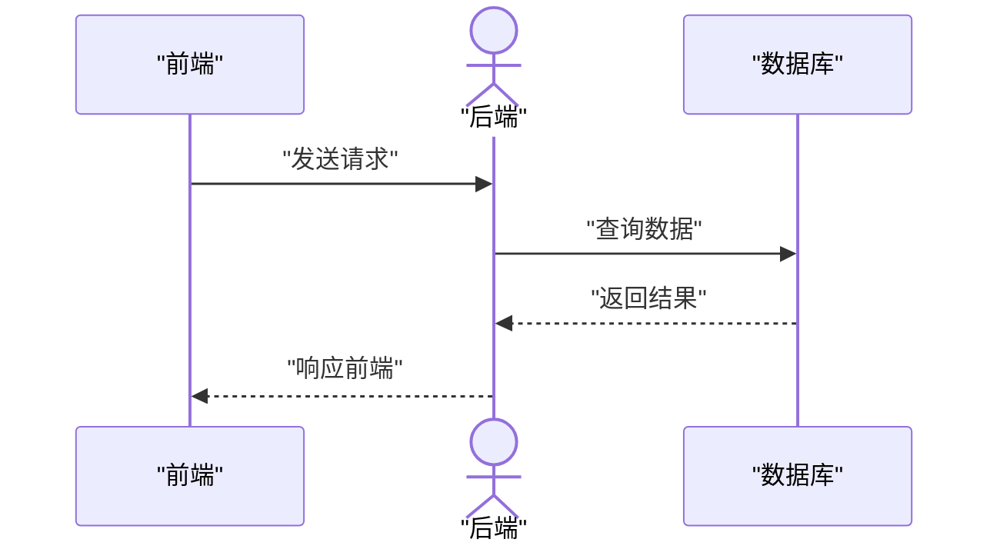

除矩形外，Mermaid 还支持通过 JSON 配置更换参与者符号类型，如 `boundary`、`control`、`entity`、`database`、`collections`、`queue` 等。自 v10.3.0 起还可动态 `create participant B` / `destroy A` 创建与销毁参与者（被销毁的参与者需有对应的销毁消息）。

## 消息箭头类型

消息语法为 `[Actor][Arrow][Actor]:消息文本`。不同的箭头类型表达不同的通信语义：

| 箭头 | 含义 |
|------|------|
| `->` | 实线，无箭头 |
| `-->` | 虚线，无箭头 |
| `->>` | 实线，实心箭头（同步调用） |
| `-->>` | 虚线，实心箭头（异步回复） |
| `-x` | 实线，末端交叉 |
| `--x` | 虚线，末端交叉 |
| `-)` | 实线，开放箭头（异步） |
| `--)` | 虚线，开放箭头（异步） |
| `<<->>` / `<<-->>` | 双向箭头（v11.0.0+） |

> **消息文本**：若消息文本含中文或空格，用双引号包裹，例如 `A->>B: "发送请求"`。

以下完整示例覆盖各类箭头：

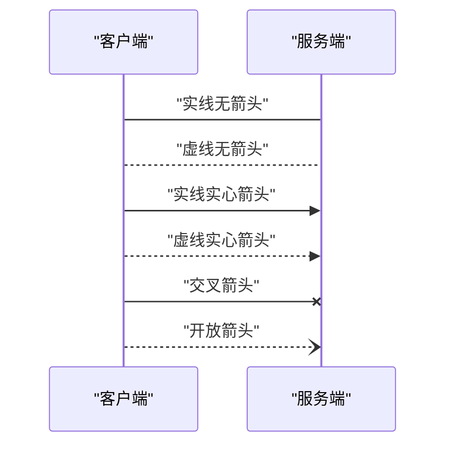

Mermaid v11.12.3 起还支持 16 种半箭头（如 `-\|\\`、`--\|\\`、`-\|/`、`--\|/`）以及中央连接（在箭头语法后追加 `()` 连接到中央生命线），适合表达更精细的交互语义。

## 激活（Activation）

`activate` / `deactivate` 用于在参与者的生命线上绘制激活框（矩形），表达方法调用期间该参与者处于活跃状态。快捷方式是在消息箭头后加 `+`/`-` 后缀：`+` 表示进入激活，`-` 表示退出激活。同一 actor 可叠加多层激活。

使用 `activate` / `deactivate` 的完整示例：

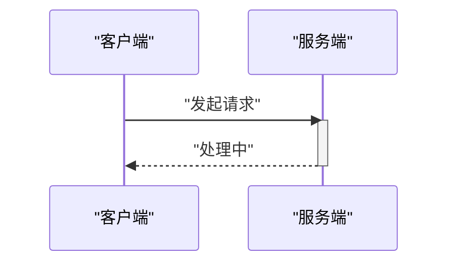

使用 `+` / `-` 后缀的简洁写法：

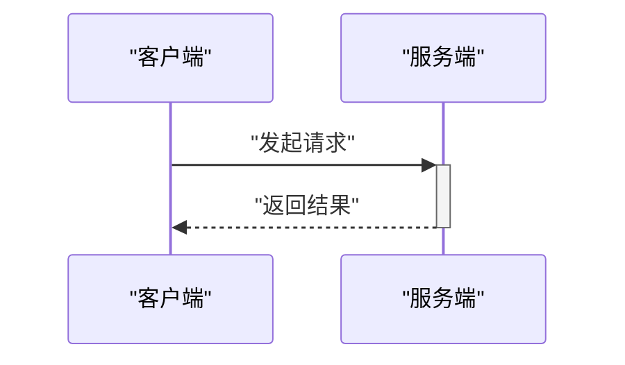

## Note 注释

`Note` 可在参与者旁添加注释，支持 `right of`（右侧）、`left of`（左侧）、`over`（覆盖一个或多个参与者）三种位置。`Note over A,B` 可跨两个参与者。

> **换行**：Note 与 Message 均支持换行；如需多行，请使用 `<br/>` 而非 `\n`。

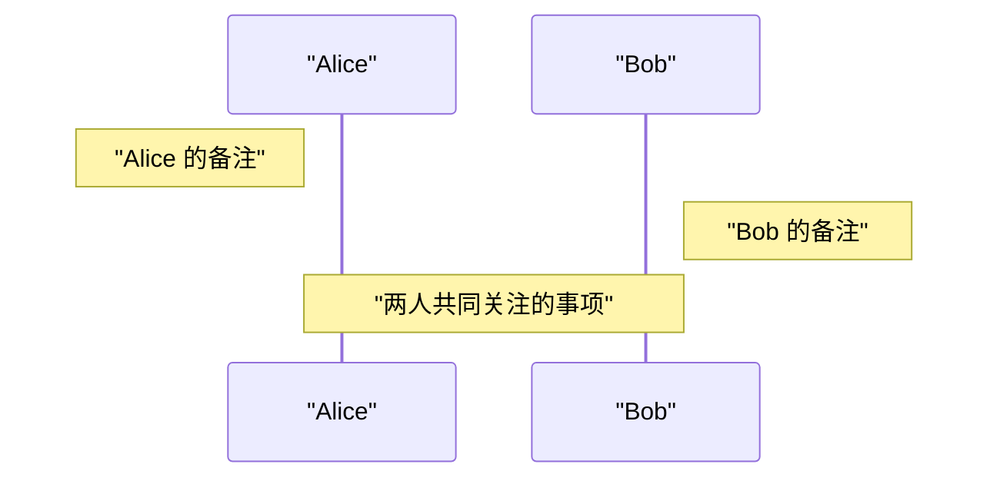

跨多个参与者并含多行文本的示例：

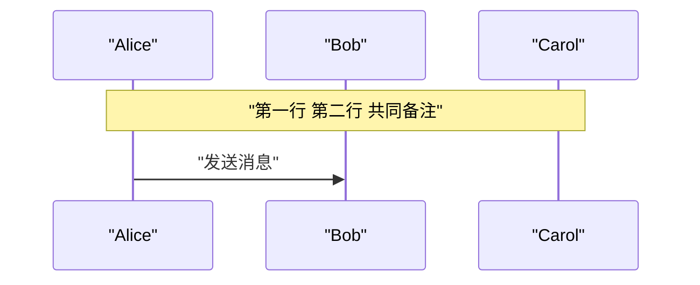

## 循环 / 分支块

Mermaid 时序图支持多种控制块，用 `end` 关键字收尾：

- `loop 文本 ... end`：循环
- `alt 文本 ... else ... end`：条件分支（if/else）
- `opt 文本 ... end`：可选分支（if 无 else）
- `par [Action] ... and [Action] ... end`：并行（可嵌套）
- `break [...] ... end`：跳出循环
- `critical [...] ... option [...] ... end`：临界区（可嵌套）
- 背景高亮：`rect rgb(...) ... end` / `rect rgba(...) ... end`

### loop 与 alt/else

`loop` 循环与 `alt`/`else` 条件分支组合，表达「重试 N 次，成功或失败」的流程：

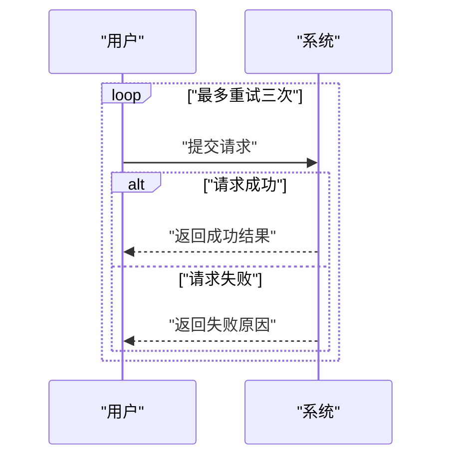

### opt

`opt` 表达可选执行的步骤（无 else 分支）：

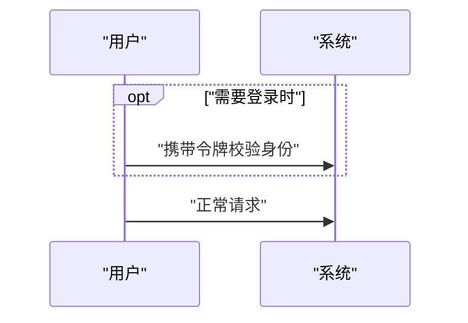

### par

`par ... and ...` 表达并行执行的多条消息：

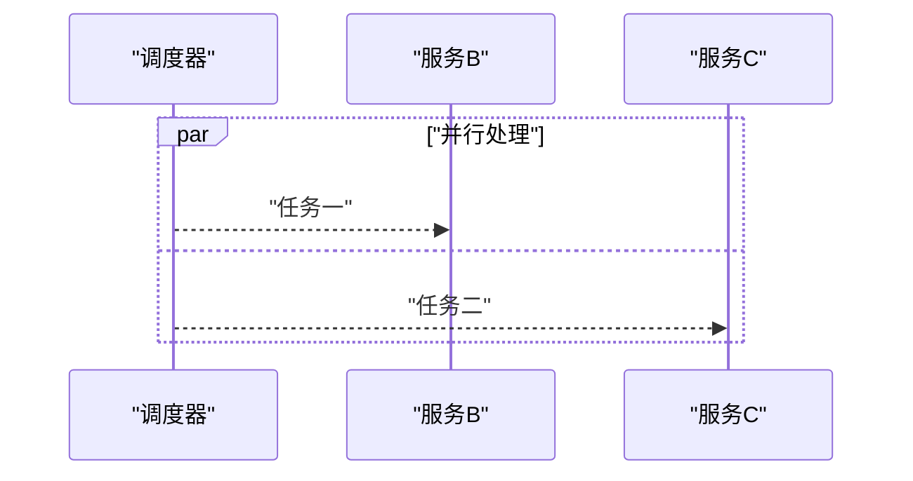

### break

`break` 在满足条件时跳出当前循环：

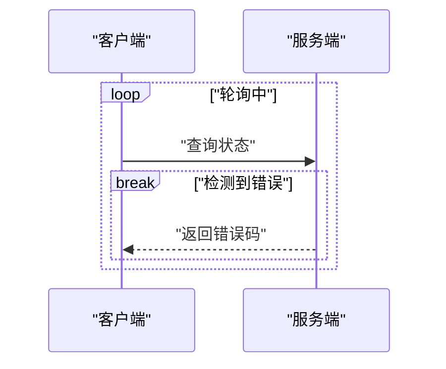

## 自动序号：autonumber 与 showSequenceNumbers

时序图可为每条消息自动添加序号：

- 图内指令 `autonumber`：自动编号。
- v11.15.0 起支持自定义起始值与增量：`autonumber <start> <increment>`。
- 站点级配置 `mermaid.initialize({ sequence: { showSequenceNumbers: true } })` 也可开启序号显示。

使用 `autonumber` 的完整示例：

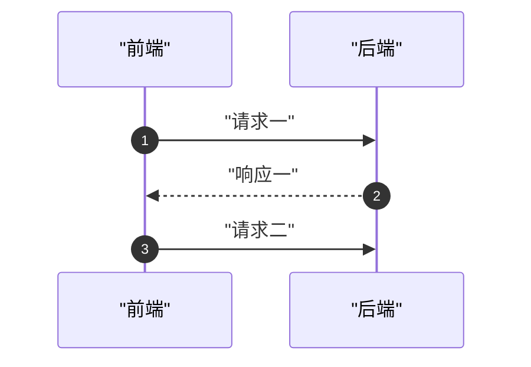

自定义起始值与增量的示例（从 10 开始，每次递增 5）：

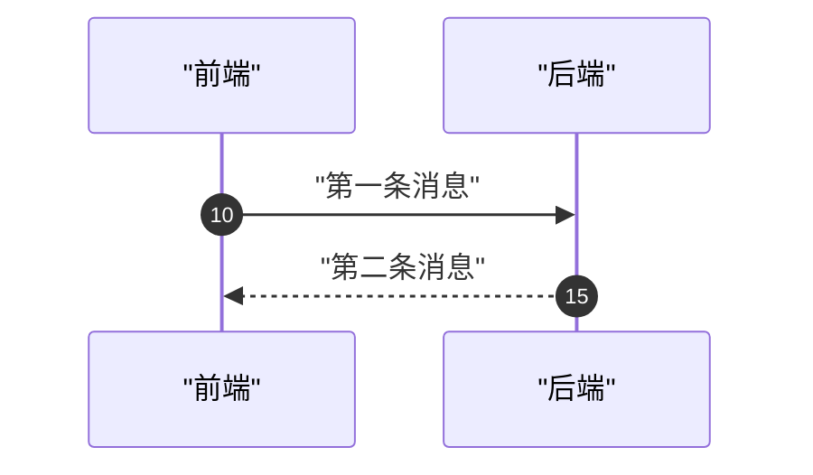

若希望不写 `autonumber` 而在站点级统一开启，可在初始化时通过 `sequence.showSequenceNumbers` 配置实现（此为 JavaScript 配置，非图内语法）：

```js
mermaid.initialize({
  sequence: { showSequenceNumbers: true }
});
```

## 其他能力速览

- **实体码转义**：特殊字符用十进制实体码（`#` → `#35;`），支持 HTML 字符名；分号用 `#59;`。
- **Actor 菜单**：`link <actor>: <label> @ <url>`，进阶 JSON 语法 `links <actor>: ...`。
- **样式**：可通过 CSS 类定制外观，如 `.actor`、`.actor-line`、`.messageLine0/1`、`.messageText`、`.labelBox`、`.labelText`、`.loopText`、`.loopLine`、`.note`、`.noteText` 等。
- **配置**：`mermaid.sequenceConfig`，参数含 `diagramMarginX`、`diagramMarginY`、`boxTextMargin`、`noteMargin`、`messageMargin`、`mirrorActors`（默认 false）、`actorFontSize`(14)、`noteFontSize`(14)、`messageFontSize`(16) 等。