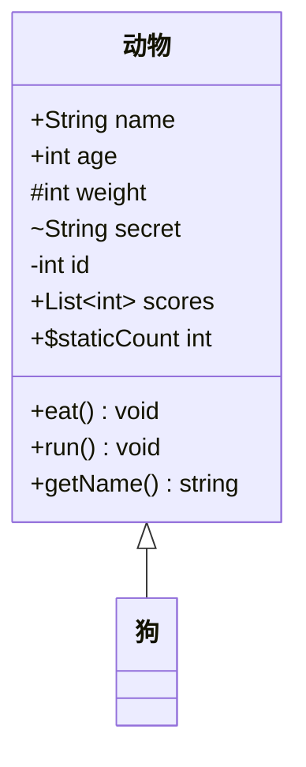
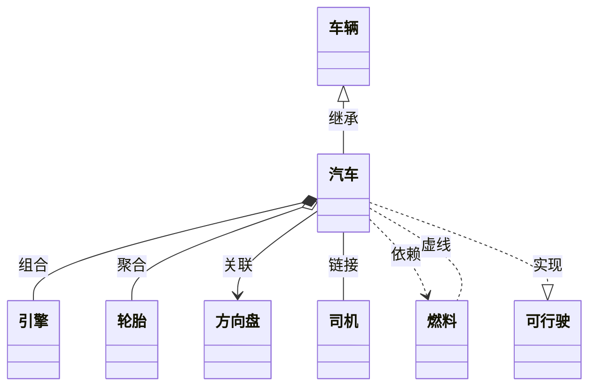
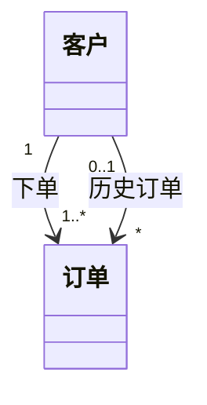
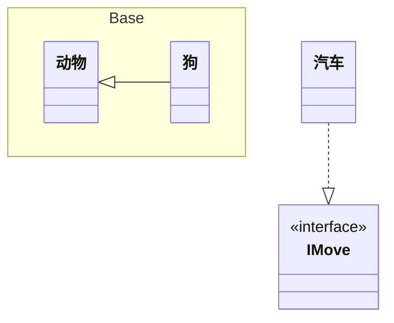
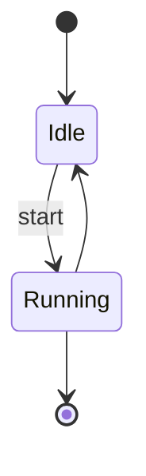
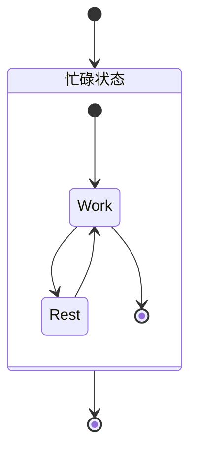
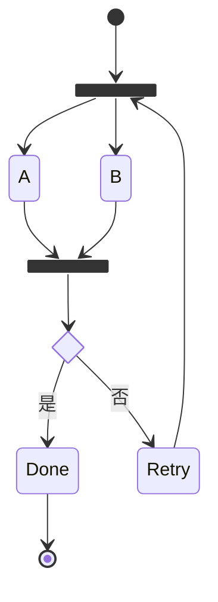
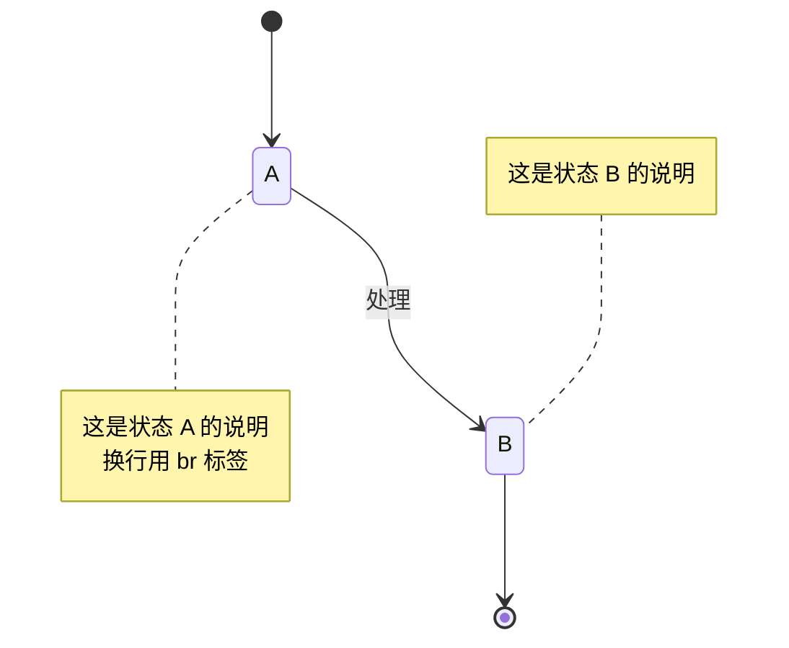
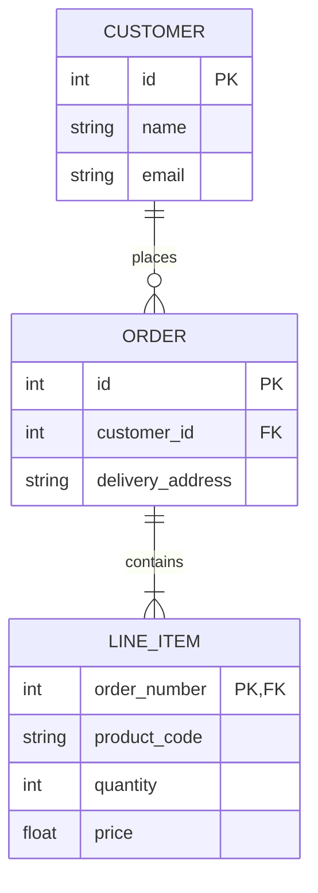
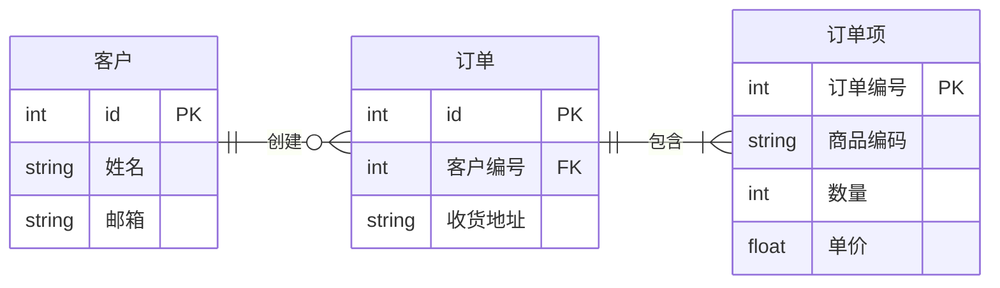

# Mermaid 结构型图表：类图 / 状态图 / ER 图

本章覆盖 Mermaid 的三类**结构型图表**，用于表达静态结构、状态流转与数据模型：

- **classDiagram（类图）**：面向对象结构，类、成员、可见性、关系、基数。
- **stateDiagram-v2（状态图）**：状态机，状态、转换、复合状态、并发、分叉/汇合。
- **erDiagram（ER 图）**：实体-关系建模，实体、属性、关系、基数（crow's foot）。

本教程所有事实均以 Mermaid 官方文档（<https://mermaid.js.org/>）为准。

---

## 1. classDiagram（类图）

### 1.1 关键字与类定义

图表以 `classDiagram` 关键字起始。类定义有两种方式：

- **显式定义**：`class Animal`。
- **隐式定义**：通过关系自动创建，如 `Vehicle <|-- Car`。

类名只能由字母数字（含 unicode）、下划线、短横线组成。若要给类设置自定义标签或含特殊字符的类名，可用方括号语法 `class ID["标签文本"]`，或反引号转义类名。

### 1.2 成员定义

用 `:` 逐个定义成员（有 `()` 视为方法，否则视为属性）；也可用 `{}` 块一次定义多个。要点：

- **返回类型**：方法末尾加类型，如 `name() int`，`()` 与返回类型之间需有空格。
- **泛型**：用 `~` 包裹，如 `List~int~`，支持嵌套如 `List~List~int~~`；含逗号的泛型暂不支持。
- **可见性前缀**：`+` 公开、`-` 私有、`#` 受保护、`~` 包内/内部。
- **方法分类符后缀**：`*` 抽象、`$` 静态；字段可用 `$` 表示静态。

以下是一个展示类定义、成员、可见性、泛型与返回类型的完整示例：

### 1.3 关系类型（8 种）

| 关系 | 含义 | 关系 | 含义 |
|------|------|------|------|
| `<|--` | 继承 | `..>` | 依赖 |
| `*--` | 组合 | `..|>` | 实现 |
| `o--` | 聚合 | `..` | 虚线链接 |
| `-->` | 关联 | `--` | 实线链接 |

关系标签语法为 `[classA][Arrow][ClassB]:LabelText`。双向关系可写成 `[关系类型][连线][关系类型]`，如 `<|`、`*`、`o`、`>`、`<`、`|>` 与 `--`（实线）/`..`（虚线）。Lollipop 接口写法：`bar ()-- foo`。

以下示例覆盖全部 8 种关系类型，关系标签直接跟在冒号后：

### 1.4 基数、注解与命名空间

- **基数/多重性（Cardinality）**：`1`、`0..1`、`1..*`、`*`、`n`、`0..n`、`1..n`；置于箭头两侧引号内，格式 `[classA] "基数1" [Arrow] "基数2" [ClassB]:LabelText`。
- **注解**：`<<interface>>`、`<<abstract>>`、`<<service>>`、`<<enumeration>>` 等（均为小写），可内联、单独行或嵌套结构。
- **命名空间**：`namespace 名称 { ... }`；v11.15.0+ 支持方括号标签与点号嵌套；可用配置 `hierarchicalNamespaces: false` 切换紧凑渲染。

基数示例：

注解与命名空间示例：

> **安全编码提示**：类名/状态名/节点 ID 一律用纯英文；中文只放在标签（方括号语法 `class ID["中文"]`）或关系标签中。代码块内禁止空行。

---

## 2. stateDiagram-v2（状态图）

### 2.1 关键字、状态声明与转换

图表以 `stateDiagram-v2` 关键字起始（另有旧渲染器），语法尽量与 PlantUML 兼容。要点：

- **状态声明**：仅 id（`state` vs 未定义）、`state 描述`、`state id : 描述` 三种方式。
- **转换**：`A --> B`（未定义的状态会自动创建）；带文本 `A --> B : 文本`。
- **开始/结束**：`[*]` 特殊状态，根据转换方向决定是开始或结束。
- **带空格状态名**：先定义 id，再在转换中引用该 id。

基础状态机示例：

### 2.2 复合状态、选择、分叉/汇合、并发

- **复合状态（Composite）**：`state id { ... }`，可多层嵌套，可在复合状态间设转换；**不能在不同复合状态的内部状态之间设转换**。
- **选择（choice）**：`<<choice>>`。
- **分叉/汇合（fork/join）**：`<<fork>>`、`<<join>>`。
- **并发**：用 `--` 符号。
- **方向**：`direction` 语句；注释用 `%%`。

复合状态示例：

选择（choice）+ 分叉/汇合（fork/join）示例：

### 2.3 Note 与样式

- **注释（Note）**：`note right of A` / `note left of A`。
- **样式（classDef）**：`classDef 名称 属性:值,属性:值`；应用方式 `class 状态1,状态2 样式名`，或三冒号 `[state]:::[style name]`。**限制**：classDef 不能应用于开始/结束状态，不能应用于复合状态或其内部（开发中）。

Note 示例：

---

## 3. erDiagram（ER 图）

### 3.1 关键字、实体与属性

图表以 `erDiagram` 关键字起始，语法与 PlantUML 兼容并扩展了关系标签。语句格式：`<first-entity> [<relationship> <second-entity> : <relationship-label>]`。实体名支持任意 unicode，含空格需用双引号。实体别名用方括号 `ENTITY[alias]`。

属性：实体名后跟 `{ type name }` 块；`type` 需以字母开头，可含数字、连字符、下划线、括号、方括号；`name` 可用 `*` 表示主键。可选类型后缀 `?` 表示可空（v11.16.0+）。属性 key 可为 `PK`/`FK`/`UK`，可逗号分隔（如 `PK, FK`）。

经典客户/订单示例：

### 3.2 关系基数（crow's foot）与识别

- **基数标记**：`|o`/`o|` 零或一、`||` 恰好一、`}o`/`o{` 零或多、`}|`/`|{` 一或多。
- **识别（Identification）**：`--` 识别（实线）、`..` 非识别（虚线）；别名 `to`（识别）、`optionally to`（非识别）。
- **方向**：`direction`，取值 `TB`/`BT`/`RL`/`LR`。
- **样式**：`style`、`classDef`、`class`、`:::`（可一次多类）。

含方向与中文字段名的示例（实体名含空格/中文需加引号）：

> **安全编码提示**：ER 实体名若含空格或中文，一律用双引号包裹；属性名中文可直接书写在 `{ }` 块内。

---

> **下一章**：[可视化图表（Gantt / Pie / Journey / Timeline / Sankey / QuadrantChart）→](05-aggregate-diagrams.md)