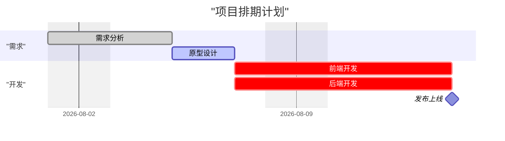
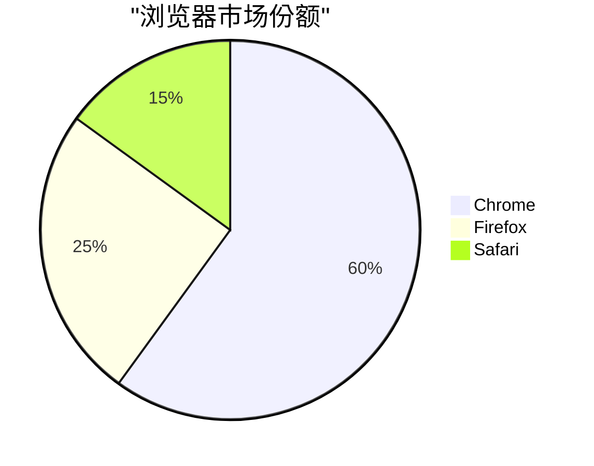
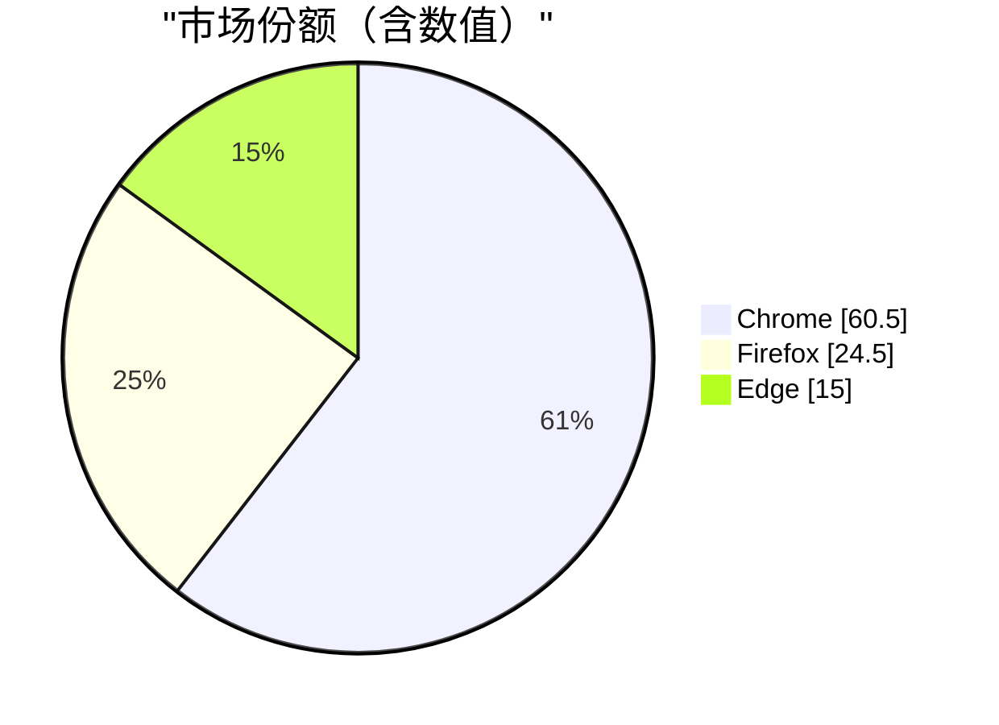
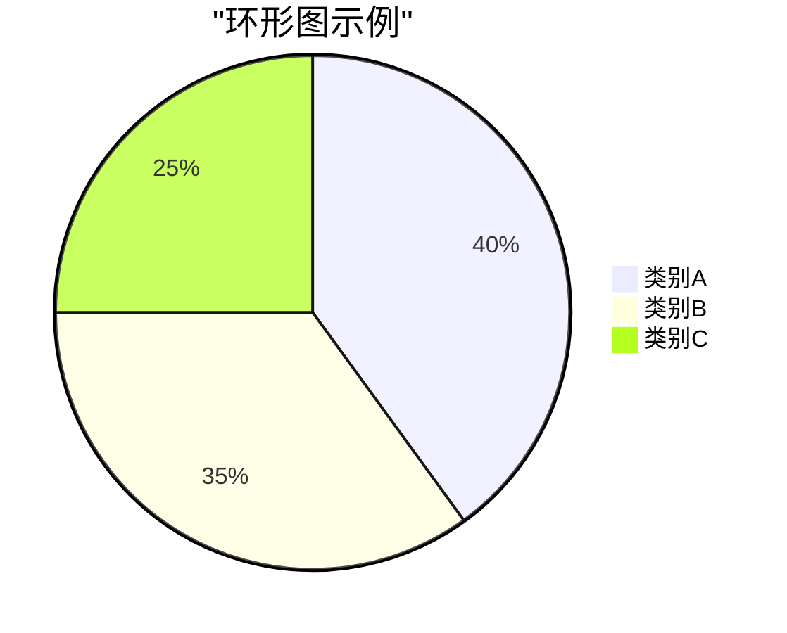
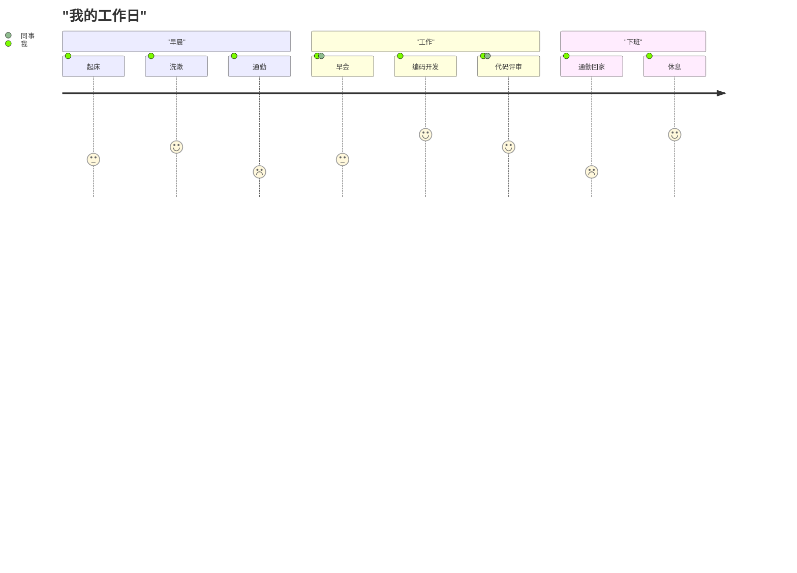
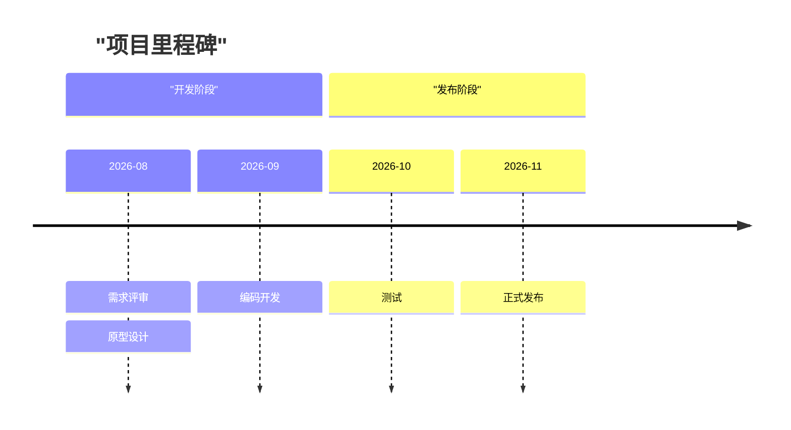
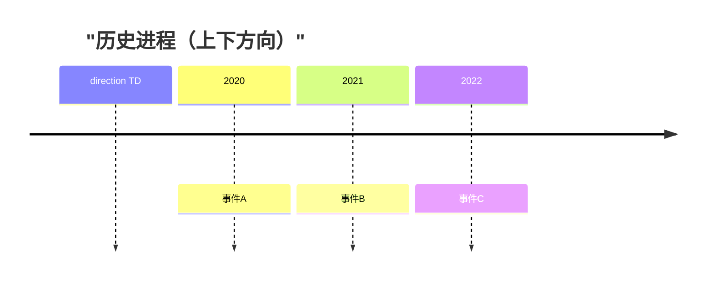
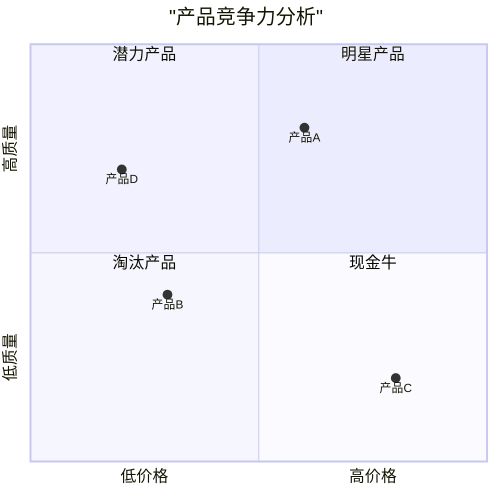

# Mermaid 可视化图表：Gantt / Pie / Journey / Timeline / Sankey / QuadrantChart

本章覆盖 Mermaid 的六种**可视化/数据展示图表**，用于表达项目计划、占比、流程体验、时间线、流量与二维定位：

- **gantt（甘特图）**：项目任务排期与进度。
- **pie（饼图）**：比例构成。
- **journey（用户旅程图）**：任务环节的体验评分。
- **timeline（时间线图）**：时间周期与事件。
- **sankey（桑基图）**：流量/能量的流向分配。
- **quadrantChart（象限图）**：二维定位分类。

本教程所有事实均以 Mermaid 官方文档（<https://mermaid.js.org/>）为准。

---

## 1. gantt（甘特图）

### 1.1 关键字与结构

图表以 `gantt` 关键字起始，可渲染为 SVG、PNG 或 Markdown 链接。任务默认顺序执行，开始日期默认取前一任务结束日期。

- `dateFormat`：输入日期格式（默认 `YYYY-MM-DD`，基于 day.js）。
- `title`：可选图表标题。
- `section`：必需命名，划分部分。
- `excludes`：排除日期，接受 `YYYY-MM-DD`、星期名、`weekends`（不支持 `weekdays`）。
- `weekend`：v11.0.0+ 可设 weekend 为 `friday` 或 `saturday` 起始。
- `axisFormat`：输出轴格式（默认 `YYYY-MM-DD`，基于 d3-time-format，如 `%Y-%m-%d`）。
- `tickInterval`：v10.3.0+ 轴刻度，如 `1day`/`1week`。

### 1.2 任务元数据与时长单位

任务由冒号分隔标题与元数据，元数据用逗号分隔。合法标签 `active`、`done`、`crit`、`milestone`（标签可选，若用须最先写）。元数据组合（开始/结束/ID）如 `<taskID>,<startDate>,<endDate>`、`<taskID>,after <otherTaskID>,<length>`，以及 v10.9.0+ 的 `until`（运行到某任务/里程碑开始）。

**时长单位**：`ms`、`s`、`m`、`h`、`d`、`w`、`M`（月）、`y`（年）；支持小数（如 `1.5d`）；非法 token 忽略并默认零时长。**Milestone**：位置 = 初始日期 + 时长/2。

基本甘特图示例：



> **说明**：`done`/`active`/`crit` 为状态标签，`milestone` 生成里程碑点；`after <taskID>` 声明依赖前置任务。

### 1.3 Vertical Markers 与紧凑模式

- **Vertical Markers（垂直标记线）**：`vert` 关键字，不占行。
- **紧凑模式（多任务同行）**：通过前置 YAML 配置 `displayMode`。
- **Today marker**：`todayMarker` 键设置样式，设为 `off` 隐藏。

```mermaid
gantt
    dateFormat YYYY-MM-DD
    title "带垂直标记线的甘特图"
    todayMarker off
    excludes weekends
    section "任务"
    任务一 : done, t1, 2026-08-01, 2d
    任务二 : active, t2, after t1, 3d
    vert 2026-08-05
```

---

## 2. pie（饼图）

### 2.1 关键字与数据格式

图表以 `pie` 关键字起始，可选 `showData`（在图例后显示实际数值）、可选 `title`。数据格式为 `"label": positive numeric value`（数值支持最多两位小数）。数值必须为**正的、大于零的数**，负值会报错。

基本饼图示例：



带 `showData` 显示实际数值：



### 2.2 Donut 环形图与图例位置

v11.16.0+ 支持以下配置（通过图前 YAML frontmatter 设置）：

- `donutHole`：环形图内孔比例，合法值 0–0.9，默认 0。
- `legendPosition`：图例位置，合法值 `top`/`bottom`/`left`/`right`/`center`（默认 right）。
- `highlightSlice`：按 label 高亮，设 `hover` 悬停高亮。

环形图示例：



---

## 3. journey（用户旅程图）

图表以 `journey` 关键字起始。结构为 `title` + `section 名称` + 任务。任务语法：`Task name: <score>: <逗号分隔的 actor 列表>`。**Score 为 1 到 5 的整数（含端点）**。



> **说明**：`Task: score: actor1, actor2`，score 越高在图中越靠上；同一 section 的任务归入同一色带。

---

## 4. timeline（时间线图）

图表以 `timeline` 关键字起始（实验性图表，语法可随版本变化；除图标集成外语法稳定）。可选 `title`。数据语法：`{时间周期} : {事件}`，可用第二个冒号加更多事件，或换行多行事件。时间周期与事件均为纯文本，不限于数字。分组：`section 名称`，其后续时间周期归入该 section。方向（v11.14.0+）：`LR`（左右，默认）、`TD`（上下）。

基本时间线示例：



`TD` 方向示例：



> **换行**：默认自动换行；可用 `<br>` 强制换行。**配色**：无 section 时每个时间周期默认独立配色；配置 `timeline.disableMulticolor: false` 可让所有周期同色。

---

## 5. sankey（桑基图）

图表以 `sankey` 关键字起始（v10.3.0+，实验性图表）。语法接近纯 CSV：需 3 列（`source`、`target`、`value`）；允许无逗号分隔的空行；逗号需用双引号包裹；双引号用成对双引号转义。

配置项：`width`、`height`、`linkColor`、`nodeAlignment`。`linkColor` 取值 `source`、`target`、`gradient`（渐变）或十六进制颜色；`nodeAlignment` 取值 `justify`、`center`、`left`、`right`。

```mermaid
sankey
    "煤炭", "电力", 100
    "天然气", "电力", 80
    "电力", "居民", 120
    "电力", "工业", 60
    "居民", "损耗", 10
    "工业", "损耗", 15
```

> **说明**：每行三列分别表示 source、target、value；value 为数值，流向从左到右分配，宽度与 value 成比例。

---

## 6. quadrantChart（象限图）

图表以 `quadrantChart` 关键字起始。语法：`title`、`x-axis <text> --> <text>`（可只写左侧）、`y-axis <text> --> <text>`、`quadrant-1..4 <text>`、点 `<text>: [x, y]`。**点坐标 x/y 范围 0–1**。象限布局：quadrant-1 右上、quadrant-2 左上、quadrant-3 左下、quadrant-4 右下。



> **说明**：点样式可用属性 `color`、`radius`、`stroke-width`、`stroke-color`；优先级为 直接样式 > 类样式 > 主题样式。布局细节：有点时 x 轴标签渲染在象限左侧及底部，y 轴标签在象限底部；无点时轴文本与象限位于象限中心。

---

> **下一章**：[进阶图表（GitGraph / Requirement / Mindmap / Block / C4 / Zenuml）→](06-advanced-diagrams.md)