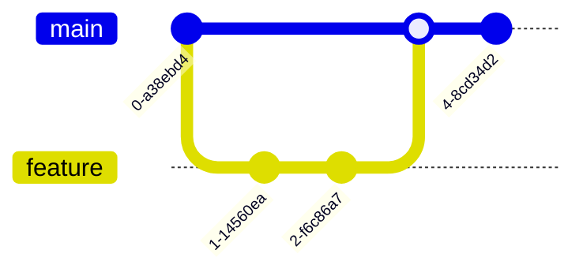
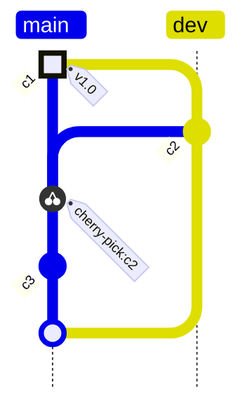
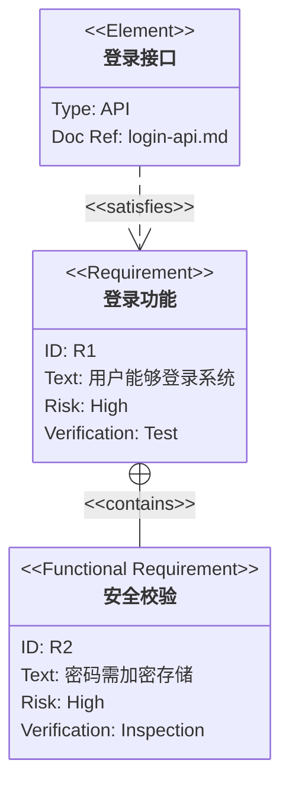
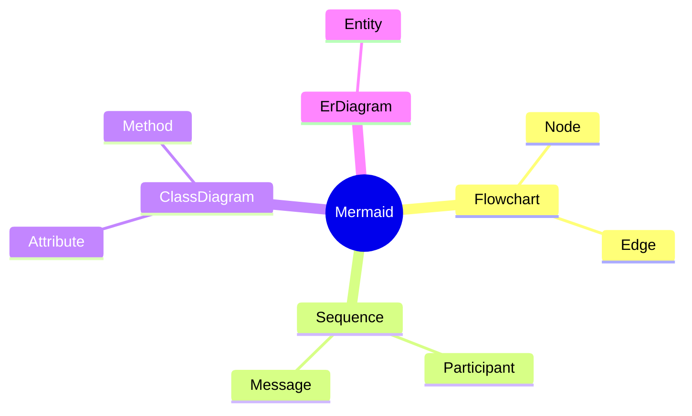
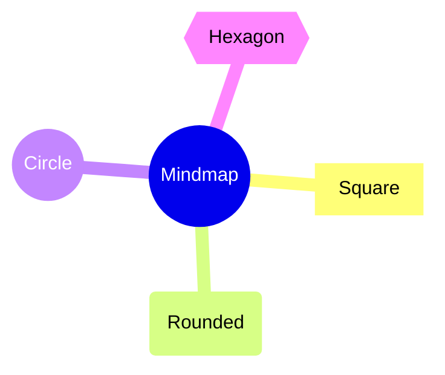
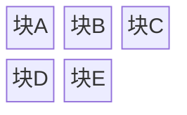
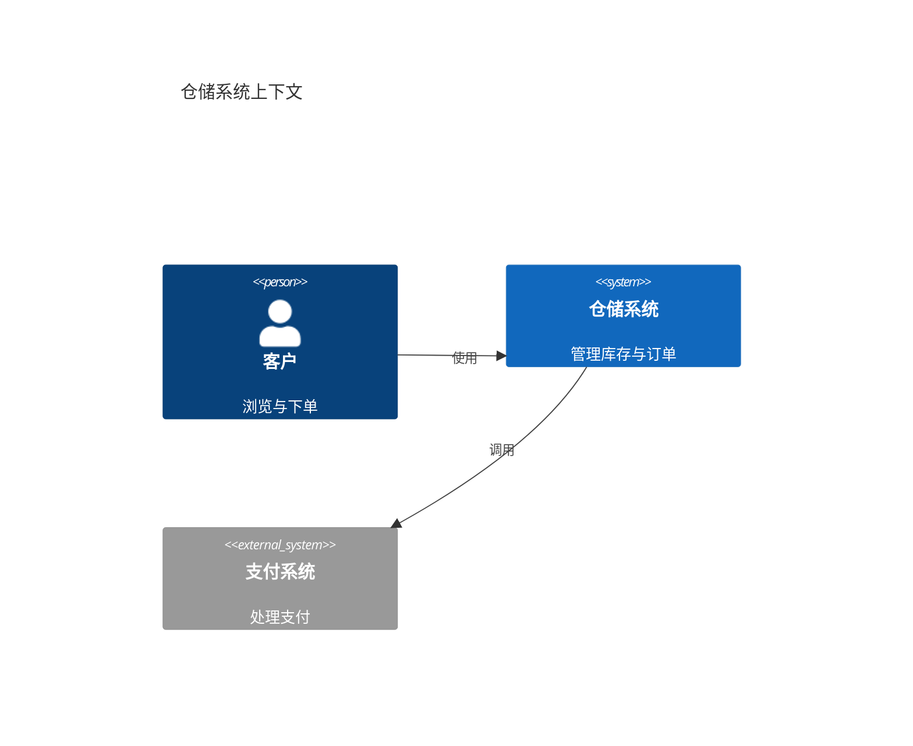
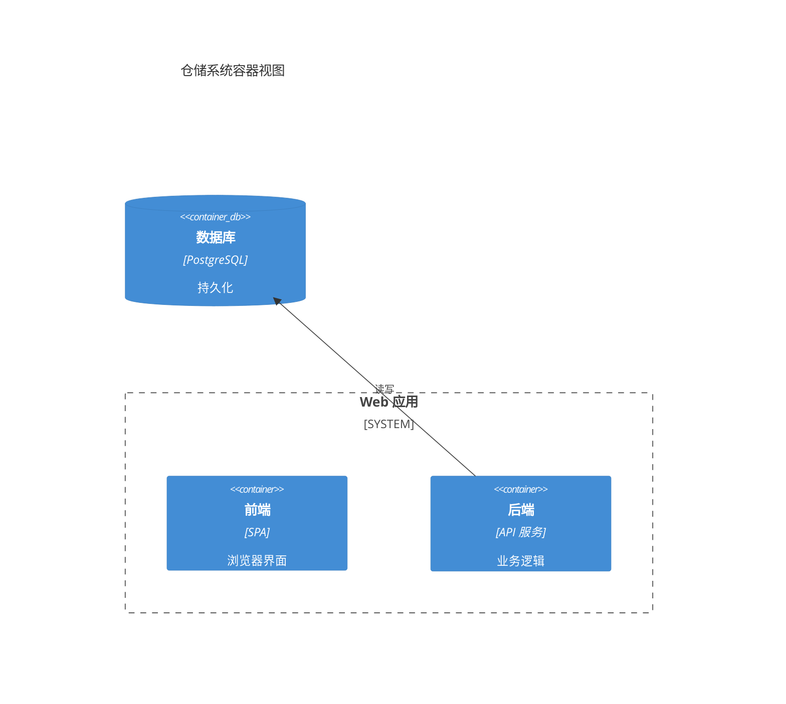
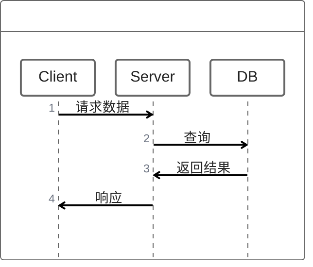
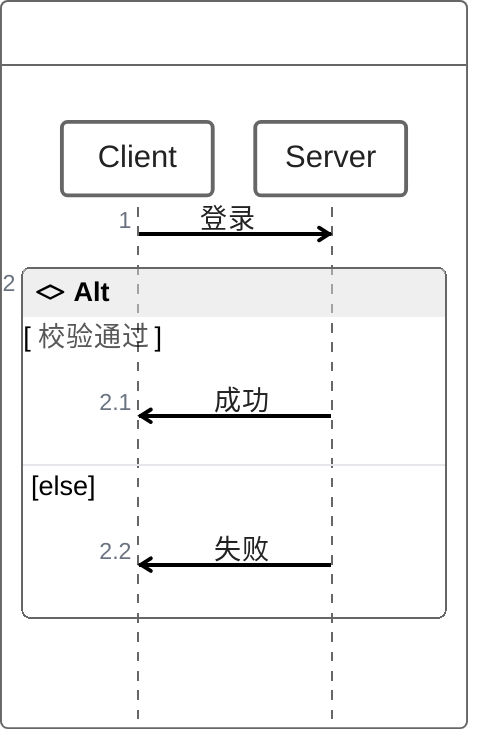

# Mermaid 进阶图表：GitGraph / Requirement / Mindmap / Block / C4 / Zenuml

本章覆盖 Mermaid 的六种**进阶/专业图表**，用于表达版本控制、需求追踪、信息层级、像素级布局、架构视图与增强时序：

- **gitGraph（Git 图）**：提交、分支、合并、挑拣。
- **requirementDiagram（需求图）**：需求/元素/关系建模（基于 SysML）。
- **mindmap（思维导图）**：缩进驱动的层级结构。
- **block（块图）**：完全控制形状位置的布局。
- **C4（C4 架构图）**：系统/容器/组件/动态/部署多视图。
- **zenuml（增强时序图）**：与原生时序图不同的消息/嵌套语法。

本教程所有事实均以 Mermaid 官方文档（<https://mermaid.js.org/>）为准。

---

## 1. gitGraph（Git 图）

### 1.1 关键字与核心命令

图表以 `gitGraph` 关键字起始。支持命令：`commit`、`branch`、`checkout`（与 `switch` 可互换）、`merge`。默认主分支 `main`（初始为当前分支）。

- `commit` 属性：`id: "..."`（自定义 ID）、`type: NORMAL/REVERSE/HIGHLIGHT`（默认 NORMAL）、`tag: "..."`。
- `branch 名称`：创建并切换；名称与关键字冲突需加引号。
- `checkout 名称`：切换已有分支；找不到报错。
- `merge 名称`：合并到当前分支，产生 merge commit（实心双圆）；可带 `id`/`tag`/`type` 属性。
- `cherry-pick id: "..."`：从其他分支挑选提交。

基本 Git 分支合并示例：

带提交属性与方向（`TB:`）的示例：

> **cherry-pick 规则**：须提供存在的提交 ID、被挑提交须在不同分支、当前分支须至少有一个提交、挑 merge commit 须提供父提交 ID 且必须为其直接父提交。

### 1.2 方向与配置

- **方向（Orientation）**：`LR:`（默认，左右）、`TB:`（上下）、`BT:`（下上，v11.0.0+）。
- **并行提交**（v10.8.0+）：`parallelCommits: true`。
- 其他配置：`showBranches`(true)、`showCommitLabel`(true)、`mainBranchName`(main)、`mainBranchOrder`(0)、`rotateCommitLabel`(true)。

---

## 2. requirementDiagram（需求图）

图表以 `requirementDiagram` 关键字起始（需求类型为 `requirement`），建模规格遵循 **SysML v1.6**。三种组件：requirement（需求）、element（元素）、relationship（关系）。

- **Requirement 定义**：`<type> 名称 { id: ...; text: ...; risk: <风险>; verifymethod: <方法> }`。
  - Type 枚举：`requirement`、`functionalRequirement`、`interfaceRequirement`、`performanceRequirement`、`physicalRequirement`、`designConstraint`。
  - Risk 枚举：`Low`、`Medium`、`High`。
  - VerificationMethod 枚举：`Analysis`、`Inspection`、`Test`、`Demonstration`。
- **Element 定义**：`element 名称 { type: ...; docRef: ... }`。
- **Relationship**：`{源} - <类型> -> {目标}`；类型为 `contains`、`copies`、`derives`、`satisfies`、`verifies`、`refines`、`traces`。
- 方向：`direction`，`TB`(默认)/`BT`/`LR`/`RL`。

---

## 3. mindmap（思维导图）

图表以 `mindmap` 关键字起始（实验性图表，语法稳定，除图标集成外）。**依赖缩进定义层级**：缩进决定父子关系，缩进不明确时 Mermaid 依据「第一个更小缩进的父节点」规则选择父级。

- **形状**：Square、Rounded square、Circle、Bang、Cloud、Hexagon、Default（与 flowchart 形状语法相近）。
- **图标**：`::icon()` 语法（图标字体需由站点管理员/集成者注册）。
- **类（CSS classes）**：`:::` 后跟多个以空格分隔的 css 类（类需站点管理员提供）。
- **Markdown Strings**：支持粗体/斜体与自动换行。
- **布局**：支持 `layout: tidy-tree`（Tidy Tree 布局）。

缩进层级与形状的精简示例：

带多种形状的示例：

> **说明**：`root(( ))` 为圆形根节点；后代按缩进自动成为其子节点。为安全起见，示例节点文本使用英文；中文同样可书写于节点文本中。

---

## 4. block（块图）

图表以 `block` 关键字起始。核心特点：**给作者完全控制形状位置**（不同于 flowchart 的自动布局）。

- **简单块**：连续文本标签即生成水平排列的块。
- **列控制**：可指定列数，块按列换行。
- **块宽度**：可跨多列（设置宽度）。
- **复合块**：块内嵌套块；列宽按该列最宽块动态调整。
- **形状**：圆角、体育场形、子程序形、圆柱形、圆形、不对称、菱形、六边形、平行四边形、梯形、双圆，以及块箭头和 space 块（`space` 占用列、`space:num` 指定占用 n 列）。
- **连接**：基本箭头 `A --> B`（注意与 `A - B` 错误的区别，块间距需留空格）；连线可带文本；可加样式。
- **样式**：`style` 关键字、类（`classDef`）；注释用 `%%`。

简单块与列控制示例：

带形状与连接的示例：

> **说明**：`columns 3` 声明 3 列布局，块按书写顺序依次填入列并自动换行；连线箭头 `-->` 连接相邻块。

---

## 5. C4（C4 架构图）

实验性图表，语法与 PlantUML 的 C4-PlantUML 兼容。支持 5 种 C4 图表类型：`C4Context`（系统上下文）、`C4Container`（容器）、`C4Component`（组件）、`C4Dynamic`（动态）、`C4Deployment`（部署）。

常用宏：`Person`、`Person_Ext`、`System`、`System_Ext`、`SystemDb`、`SystemQueue`、`Container`、`ContainerDb`、`ContainerQueue`、`Component`、`Deployment_Node`/`Node`、`Rel`、`BiRel`、`Rel_L/R/U/D`、`Rel_Back`、`Boundary`、`Enterprise_Boundary`、`System_Boundary`、`Container_Boundary`。

要点：
- 固定样式（固定 css 颜色），不同皮肤下不提供不同 css。
- 布局不使用全自动布局算法，靠调整语句书写顺序控制位置；**不支持 Layout 语句**（`Lay_U` 等）。
- 样式更新：`UpdateElementStyle`、`UpdateRelStyle`（可带 `offsetX`/`offsetY` 偏移文本）、`UpdateLayoutConfig`（更新 `c4ShapeInRow`=4、`c4BoundaryInRow`=2）。

C4Context 精简示例：

C4Container 精简示例：

> **说明**：宏基本格式为 `宏名(ID, "标签", "描述")`；`Rel(源, 目标, "文本")` 建关系；`Boundary` 宏配合 `{ }` 包裹分组。参数可命名赋值（名称以 `$` 开头）或按顺序赋值。

---

## 6. zenuml（增强时序图）

图表以 `zenuml` 关键字起始，**语法与 Mermaid 原生时序图不同**。

- **Participant**：可隐式声明/显式排序；`annotator` 可用符号替代矩形；参与者可设别名。
- **消息类型**：同步（sync）、异步（async）、创建（`new` 关键字）、回复（reply，三种写法，`@return` 用于返回上一层）。
- **嵌套**：同步/创建消息可用 `{}` 嵌套。
- **注释**：`// comment`（渲染在消息/片段上方，其他位置忽略），支持 Markdown。
- **循环**：`while`、`for`、`forEach`/`foreach`、`loop`。
- **条件**：`if ... else if ... else ...`；`opt` 片段；`par` 并行；`try ... catch ... finally ...`（异常/中断）。

精简但正确的消息示例：

带 `if` 条件的示例（中文条件需用引号包裹）：

> **说明**：
> - **异步消息**：`A -> B: 消息`（箭头前后有空格），消息文本支持中文。
> - **同步方法调用**：`A.method()` 语法，可用 `{ }` 嵌套；方法名需为英文（中文方法名解析异常）。
> - **条件/循环**：`if`/`while`/`for` 等条件中的中文文本需用双引号包裹（如 `if ("校验通过")`），否则条件文本无法显示。
> - **注释**：`// comment` 渲染在消息/片段上方，支持 Markdown。
> - **插件要求**：zenuml 采用实验性懒加载/异步渲染，**需额外注册外部插件**才能使用（通过 `mermaid.registerExternalDiagrams([zenuml])` 注册 `@mermaid-js/mermaid-zenuml`）。未注册插件时预览环境会显示"渲染失败"，这是正常现象，不代表语法错误。

---

> **本系列教程**：完整 10 章见 [Mermaid 教程总览](00-overview.md)。下一章为 [配置、主题与安全 →](07-configuration-theming.md)