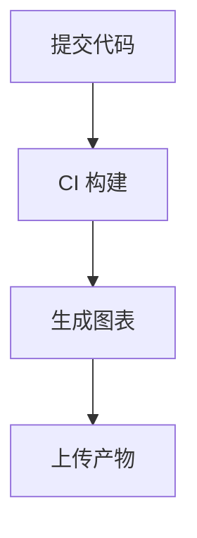
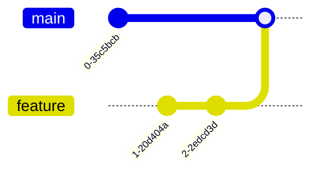

# Mermaid 集成与生态（Integrations & Ecosystem）

Mermaid 的生态覆盖**命令行批处理**（mermaid-cli）、**在线编辑器**（mermaid.live）、**前端库集成**（CDN/npm）以及**各类 Markdown 渲染器**（GitHub、飞书、VS Code 等）。本教程所有事实均以 Mermaid 官方文档（https://mermaid.js.org/）为准。

## mermaid-cli 命令行工具

Mermaid 官方命令行工具用于将 `.mmd` 文件批量转换为 PNG 等图片资产，尤其适合 **CI 集成**。

### 仓库迁移

> **注意**：官方文档（`/config/mermaidCLI.html`）已声明 mermaid CLI **已迁移到独立仓库** `https://github.com/mermaid-js/mermaid-cli`。相关使用文档请以该独立仓库为准。

### 安装

通过 npm 全局安装：

```bash
npm install -g @mermaid-js/mermaid-cli
```

安装后提供 `mmdc` 命令。

### 基本用法

将 `input.mmd` 转换为 PNG：

```bash
mmdc -i input.mmd -o output.png
```

可指定宽度（如 1200 像素）：

```bash
mmdc -i input.mmd -o output.png -w 1200
```

一个 `input.mmd` 文件示例：



### 配置文件（JSON）

mermaid-cli 使用 **JSON 格式**的配置文件，可配置主题、字体、日志级别等。例如：

```json
{
    "theme": "forest",
    "logLevel": "info"
}
```

## mermaid.live 在线编辑器

**mermaid.live** 是官方线上实时编辑器，即时上手、无需安装。

- **地址**：https://mermaid.live/
- **仓库**：`mermaid-js/mermaid-live-editor`

核心功能：

- **左侧写代码、右侧实时渲染**：输入图表定义，右侧立即生成 SVG。
- **图表数据在浏览器端处理**：无需上传到服务器，隐私友好。
- **导出 PNG / SVG**：可将图表下载为图片资产。
- **可分享链接**：生成分享链接以便协作。
- **视频教程**：官方文档 intro 页结合 Mermaid Live Editor 提供入门视频教程（Ecosystem/Tutorials）。

> 入门建议：初学者可先通过 Mermaid Live Editor 创建图表熟悉语法，再迁移到本地/项目嵌入。

## 渲染器与 CDN 支持

### 默认渲染为 SVG

Mermaid 图表**默认渲染为 SVG**（Gantt 可渲染为 SVG、PNG 或 Markdown 链接）。SVG 是矢量格式，缩放不失真，适合嵌入网页与文档。

### CDN 引入

通过 jsDelivr CDN 引入，ESM 入口为 `mermaid.esm.min.mjs`：

```
https://cdn.jsdelivr.net/npm/mermaid@<version>/dist/
```

无打包器的部署示例（`startOnLoad` 自动渲染 `class="mermaid"` 元素）：

```html
<script type="module">
    import mermaid from 'https://cdn.jsdelivr.net/npm/mermaid@11/dist/mermaid.esm.min.mjs';
    mermaid.initialize({ startOnLoad: true });
</script>
```

### npm 引入

项目内通过包管理器安装：

```bash
npm i mermaid
yarn add mermaid
pnpm add mermaid
```

部署环境需要 Node v16（含 npm）。

> **布局渲染器**：底层布局依赖 d3 与 dagre-d3；渲染器方面 flowchart 默认 `dagre`，可选用 `elk`（实验性）。详见上一章「渲染器：dagre 与 elk」。

## Markdown / 渲染器集成

Mermaid 的文本定义特性使其天然适配各类 Markdown 渲染器：

- **GitHub**：在 Markdown 代码块中使用 `mermaid` 语言标识，GitHub 原生渲染图表。
- **飞书（Lark）**：飞书文档支持 Mermaid 代码块渲染。
- **VS Code**：安装 Mermaid 相关扩展（如 Markdown Preview Mermaid Support），可在预览中实时渲染。

在 GitHub / 飞书 / VS Code 中，图表即 Markdown 代码块：



## 生态工具对比

| 维度 | mermaid-cli | mermaid.live | 库 API（npm/CDN） |
|------|-------------|--------------|-------------------|
| 定位 | 命令行批量转换 | 在线实时编辑器 | 前端库集成 |
| 触发方式 | `mmdc` 命令 | 浏览器交互 | `mermaid.initialize` / `mermaid.render` |
| 典型场景 | CI 生成图片资产 | 快速原型、分享演示 | Web 应用嵌入实时图表 |
| 输入 | `.mmd` 文件 | 浏览器内代码 | 页面中 `class="mermaid"` 元素 |
| 输出 | PNG / SVG 图片 | PNG / SVG / 分享链接 | 页面内 SVG |
| 配置方式 | JSON 配置文件 | 界面操作 | `initialize` / frontmatter |
| 是否需安装 | 是（npm 全局） | 否（在线） | 是（npm）或 CDN 引入 |

## 集成方式代码汇总

### 方式一：mermaid-cli 转换图表

```bash
mmdc -i input.mmd -o output.png -w 1200
```

### 方式二：HTML 页面内联渲染

```html
<div class="mermaid">
flowchart LR
    A["真实系统"] --> B["文档中的图表"]
</div>
<script type="module">
    import mermaid from 'https://cdn.jsdelivr.net/npm/mermaid@11/dist/mermaid.esm.min.mjs';
    mermaid.initialize({ startOnLoad: true });
</script>
```

### 方式三：Markdown 代码块（GitHub / 飞书 / VS Code）


---

**上一章**：[第 7 章 — 配置与主题 ←](07-configuration-theming.md) | **返回**：[教程总览 →](00-overview.md)