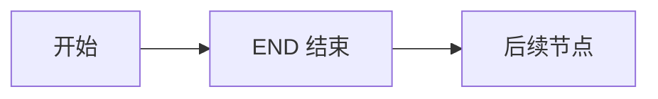
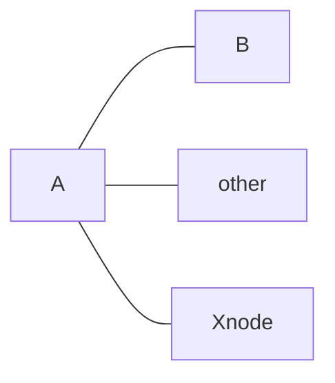
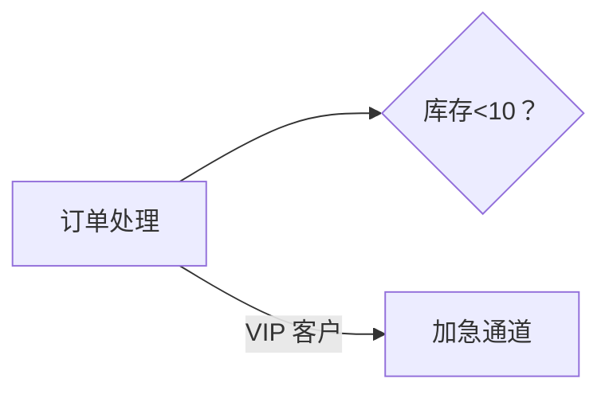
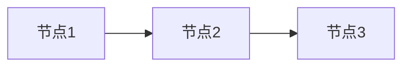
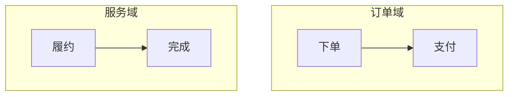
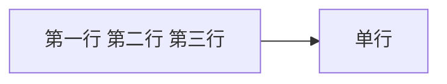
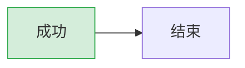

# Mermaid 常见问题与最佳实践（FAQ & Best Practices）

Mermaid 用受 Markdown 启发的文本定义图表，语法简洁但**有若干容易踩的坑**。本章汇总 12 个高频问题（现象→原因→解决方案），提炼 8 条最佳实践，并与 SpecWeave 项目内的 [安全编码六规则](../../../best-practices/mermaid-guide.md) 对接。所有事实均以 Mermaid 官方文档（https://mermaid.js.org/）为准。

> **提前速查**：若你只是想快速排查，可直接跳到「[与项目安全编码六规则的对接](#四、与项目安全编码六规则的对接)」，或运行项目内置的 `python .agents/scripts/check-mermaid.py --fix` 自动检测修复。

## 一、常见问题（FAQ）

### Q1. 流程图节点名叫 `end` 导致图表被破坏

**现象**：节点或文本内容出现 `end` 时，图表在渲染时被截断或报语法错误。

**原因**：`end` 是流程图（以及 subgraph、sequenceDiagram 的块结构）的保留关键字，用于标记 `subgraph ... end`、`loop ... end` 等块结束。解析器遇到 `end` 会提前终止块，破坏后续结构（官方文档明确给出 WARNING）。

**解决方案**：若节点文本必须用到 `end`，改为大小写变体（如 `End`、`END`）：



### Q2. 节点名以 `o` 或 `x` 开头生成 circle/cross 边

**现象**：连接某个节点时，本该是普通箭头却渲染成了圆圈（circle）或叉号（cross）边。

**原因**：`--o`（圆形边）和 `--x`（交叉边）是 Mermaid 的连线类型语法。当节点名以字母 `o` 或 `x` 开头时，如 `A---oB`，解析器会把 `oB` 误判为圆形边的 `o` 标记，`A---xB` 误判为交叉边的 `x` 标记。

**解决方案**：给节点名加空格或改为大写，避免首字母歧义。



### Q3. Pie 饼图的数值为负导致报错

**现象**：饼图数据中出现负数时渲染报错或拒绝绘制。

**原因**：Pie 图的数据格式为 `"label": positive numeric value`，官方规定数值必须为**正的、大于零的数**，且最多支持两位小数；负值会触发解析错误。

**解决方案**：检查数据，将负值替换为合法正值，或用其他图表（如 bar 图）表达。

```text
pie title 数据分布
    "已发到达" : 85
    "处理中" : 12
    "待处理" : 3
```

### Q4. 中文/含空格文本未加引号导致渲染失败或乱码

**现象**：含中文、空格或特殊字符（`()`、`#`、`:`、`-` 等）的节点文本、边标签未加引号时，渲染失败或显示异常。

**原因**：Mermaid 解析器把未加引号的特殊字符当作语法标记。中文本身通常可渲染，但一旦夹杂空格或特殊字符未加引号，就会与语法冲突；跨平台还可能因字符编码不一致出现乱码。

**解决方案**：所有含中文/空格/特殊字符的文本一律用双引号包裹。



### Q5. 代码块内空行导致解析中断

**现象**：图表在代码块中间留空行后，后续内容完全不渲染，或只在部分渲染器（如飞书）中失败。

**原因**：部分 Markdown 渲染器会把空行解析为代码块结束标记，导致 `mermaid` 围栏提前闭合，后续行被当作普通文本。

**解决方案**：代码块内**禁止任何空行**（含仅含空格的行），所有行连续无间断。



### Q6. subgraph 中文 ID 报错

**现象**：`subgraph 中文标题` 直接写中文作为 ID 时解析失败。

**原因**：subgraph 的 ID 需要是合法的标识符；直接塞入中文/全角字符/空格会破坏语法。

**解决方案**：采用「纯英文 ID + 方括号内双引号中文标题」格式，`subgraph EN_ID ["中文标题"]`。



### Q7. 节点内 `\n` 不换行

**现象**：在节点文本里写 `\n` 希望换行，结果渲染成字面文本或被压缩成单行。

**原因**：在 flowchart、stateDiagram 等图表中，`\n` 不会被解释为换行符。

**解决方案**：节点内换行统一用 HTML 的 `<br/>` 标签。



### Q8. 版本差异导致语法不兼容

**现象**：同一段代码在 mermaid.live 能渲染，在本地旧版本或某个渲染器中报错。

**原因**：Mermaid 语法随版本演进，大量能力带版本门槛。例如 sankey（v10.3.0+）、frontmatter 配置（v10.5.0+）、timeline 方向（v11.14.0+）、pie donutHole/ER 可空属性（v11.16.0+）、flowchart 30 个新形状与 icon/image（v11.3.0+）等。旧版本不认识这些语法。

**解决方案**：锁定并统一版本（见最佳实践 B7），在写新版语法前确认目标渲染器版本。

```text
# 版本门槛对照（节选）
sankey            : v10.3.0+
frontmatter 配置  : v10.5.0+（取代 directives）
flowchart 扩展形状: v11.3.0+
timeline LR/TD    : v11.14.0+
pie donutHole     : v11.16.0+
```

### Q9. securityLevel=strict 下交互失效

**现象**：`click` 回调、链接跳转、tooltip 等交互在启用 `securityLevel='strict'` 后全部失效。

**原因**：`strict`（默认）是安全级别之一，该级别下会**禁用 click 交互**以净化输入，防止脚本注入；`loose` 下才启用交互。

**解决方案**：对外部用户开放的站点建议保持 `strict`；确需交互且环境可控时，在初始化中显式放宽为 `loose`。

```html
<script type="module">
    import mermaid from 'https://cdn.jsdelivr.net/npm/mermaid@11/dist/mermaid.esm.min.mjs';
    mermaid.initialize({ startOnLoad: true, securityLevel: 'loose' });
</script>
```

### Q10. elk 渲染器未配置不生效

**现象**：配置了 `elk` 渲染器但图表仍按 `dagre` 布局，或报「未加载」错误。

**原因**：flowchart 默认渲染器是 `dagre`；`elk` 是 v9.4+ 的实验性渲染器，需在配置中显式指定 `flowchart.defaultRenderer: "elk"`，部分场景还需启用懒加载。

**解决方案**：在初始化或 frontmatter 中明确指定渲染器。

```yaml
---
config:
  flowchart:
    defaultRenderer: "elk"
---
```

### Q11. 中文乱码

**现象**：图表中的中文显示为乱码或方块。

**原因**：渲染环境（如 mermaid-cli）缺少对应中文字体，或编码未统一为 UTF-8。

**解决方案**：统一使用 UTF-8 编码；在 mermaid-cli 的 JSON 配置中通过 `fontFamily` 指定包含中文的系统字体。

```json
{
    "theme": "default",
    "fontFamily": "PingFang SC, Microsoft YaHei, Noto Sans CJK SC"
}
```

### Q12. 节点文本以「数字. 空格」「- 空格」「* 空格」开头触发列表解析

**现象**：节点文本写成 `"1. 启动"`、`"- 项目"`、`"* 注意"` 时，渲染报 「Unsupported markdown: list」错误。

**原因**：引号无法穿透 Markdown 层，这些模式会被 Markdown 渲染器识别为列表触发。

**解决方案**：改用无空格的写法或用其他分隔符（英文句点改中文冒号、去空格、改用 emoji）。

| ❌ 禁止 | ✅ 正确 |
|--------|--------|
| `["1. 启动"]` | `["1：启动"]` |
| `["- 项目"]` | `["-项目"]` |
| `["* 注意"]` | `["⚠ 注意"]` |

## 二、最佳实践（Best Practices）

### B1. 统一用双引号包裹含中文/空格/特殊字符的文本

凡是节点文本、边标签、subgraph 标题、participant 别名，只要含中文、空格或特殊字符，一律用双引号包裹。纯英文单词可省略：`A[Start]`。

### B2. 换行统一用 `<br/>` 而非 `\n`

节点内换行用 `<br/>`。虽然 sequenceDiagram 的 Note 和消息文本中 `\n` 可以换行，但统一用 `<br/>` 可避免记忆上下文差异，减少出错。

### B3. subgraph 用纯英文 ID + 方括号中文标题

格式 `subgraph EN_ID ["中文标题"]`，ID 为字母开头的纯英文标识符，标题放方括号内双引号中，ID 与方括号间保留一个空格。

### B4. 按最严格渲染器书写

不同平台容错度不同（GitHub 宽松、VS Code 中等、飞书严格）。编写时按最严格渲染器（如飞书）的要求来，不要依赖容错，这样在任意平台都能稳定渲染。

### B5. 用 check-mermaid.py 自动校验

写完图表后运行项目内置检查脚本，可自动检测并修复 10 类安全编码问题（空行、引号、`\n`、subgraph ID 等）：

```powershell
python .agents/scripts/check-mermaid.py --fix
```

### B6. 善用 mermaid.live 快速验证

在 https://mermaid.live/ 左侧输入代码、右侧实时渲染，可快速验证语法、调试错误，支持导出 PNG/SVG 与分享链接。先在线验证再嵌入文档，可显著减少返工。

### B7. 版本锁定

集成时固定具体版本号（如 `mermaid@11.14.0`），避免依赖浮动大版本（`mermaid@11`）导致升级后语法/行为变化。CDN 引用与 package.json 均建议锁定。

### B8. 样式用 classDef 而非外部 CSS

外部 CSS 覆盖节点样式不可靠（内部样式带 `!important` 且作用域限于 SVG 元素 ID）。应使用 `classDef` 定义样式类，再用 `class`/`:::` 应用。



### B9. 用 `%%` 注释标注图内说明

Mermaid 支持以 `%%` 开头的行注释（整行跳过，行内保留）。可用它在复杂图表中标注分区，便于协作与维护。

### B10. 边标签用 `-->|"标签"|` 统一格式

含中文/特殊字符的边标签用双引号包裹，且标签与箭头之间不留空格：`CHECK -->|"是"| YES`。

## 三、最佳实践清单速查

| # | 实践 | 关键点 |
|---|------|--------|
| B1 | 文本加引号 | 中文/空格/特殊字符一律双引号 |
| B2 | 换行用 `<br/>` | 禁止 `\n` |
| B3 | subgraph 纯英文 ID | `subgraph EN_ID ["标题"]` |
| B4 | 按最严格渲染器书写 | 以飞书严格度为准 |
| B5 | check-mermaid.py 校验 | 提交前跑 `--fix` |
| B6 | mermaid.live 验证 | 先在线调试再嵌入 |
| B7 | 版本锁定 | 固定具体版本号 |
| B8 | 样式用 classDef | 不用外部 CSS 覆盖 |
| B9 | `%%` 注释 | 图内标注说明 |
| B10 | 边标签格式 | `-->|"标签"|` 无空格 |

## 四、与项目安全编码六规则的对接

SpecWeave 项目在 [mermaid-guide.md](../../../best-practices/mermaid-guide.md) 中定义了 **Mermaid 安全编码六规则**，是项目内写图必须遵守的操作级规范。本章 FAQ 与最佳实践与之对接如下：

| 项目六规则 | 核心要求 | 对应本章 |
|-----------|---------|---------|
| ① 禁止空行 | 代码块内严禁空行（含仅空格行） | Q5、B4 |
| ② 文本加引号 | 中文/特殊字符/空格一律双引号 | Q4、B1 |
| ②b 避免列表触发 | 禁止「数字.空格」「- 空格」「* 空格」 | Q12 |
| ②c 换行用 `<br/>` | 禁止 `\n` | Q7、B2 |
| ③ subgraph 安全格式 | 纯英文 ID + `["中文标题"]` | Q6、B3 |
| ④ 边标签格式 | `-->|"标签"|` 无空格 | B10 |

> **六规则的完整版**：见 [mermaid-guide.md 安全编码六规则章节](../../../best-practices/mermaid-guide.md#安全编码六规则)；**自动检查工具**：见 [check-mermaid.py](../../../../../scripts/check-mermaid.py)（检测 10 类问题，含自动修复）。
>
> **实践总原则**：本教程的示例图表用于「学习与理解」，不一定每条都满足项目安全规范；在 SpecWeave 项目正式文档中嵌入 Mermaid 图表时，务必以安全编码六规则为准，并运行 `check-mermaid.py` 校验至 0 错误。

---

**上一章**：[第 8 章 — 集成与生态 ←](08-integrations-ecosystem.md) | **返回**：[教程总览 →](00-overview.md)