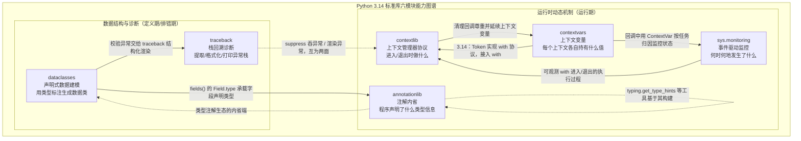

# Python 3.14 标准库教程 — 跨模块综合分析

> 一句话摘要：`contextlib`、`contextvars`、`sys.monitoring`、`annotationlib` 四个模块构成 Python 运行时"动态能力"的底层拼图；而 `dataclasses` 与 `traceback` 则分别补上"声明式数据建模"与"运行时异常诊断"两块基石。六个模块彼此补充、跨簇协作，共同覆盖"减少样板、可靠运行、可观测"这条日常开发主线。

## 一、六模块定位总览

先把六个模块放到同一张表里做全景对比：

| 模块 | 解决的核心问题 | 关键抽象 | 作用于 | 引入版本 |
|---|---|---|---|---|
| `contextlib` | 资源的获取与释放、临时改变全局状态 | 上下文管理器（`__enter__`/`__exit__`）、`ExitStack` 回调栈 | 代码块的边界（进入/退出） | 长期存在 |
| `contextvars` | 并发执行单元的"上下文局部"状态隔离 | `ContextVar` + `Token` + `Context` 上下文栈 | 每个执行单元的取值 | 3.7（PEP 567） |
| `sys.monitoring` | 低开销观测运行时执行事件 | 工具 ID + 事件集合 + 回调 | 代码对象的执行过程 | 3.12（PEP 669） |
| `annotationlib` | 可靠内省懒惰求值的类型注解 | `Format`（VALUE/FORWARDREF/STRING）+ `ForwardRef` | 模块/类/函数的声明 | 3.14（PEP 649/749） |
| `dataclasses` | 用类型标注声明式生成数据类 | `@dataclass` 装饰器 + `field()` + `Field` | 类的定义期 | 3.7（PEP 557） |
| `traceback` | 提取、格式化与打印异常栈回溯 | `TracebackException` + `StackSummary` + `FrameSummary` | 异常的诊断期 | 早期存在（关键 API 3.4/3.5） |

### 两大能力簇

这六个模块可以归为两大簇，二者恰好互补：

- **簇 A：运行时动态机制**（`contextlib` / `contextvars` / `sys.monitoring` / `annotationlib`）——在程序**运行过程中**管理动态状态与程序元数据：进入/退出做什么、并发上下文各自持有什么、何时何地发生了什么、程序声明了什么。
- **簇 B：数据结构与诊断**（`dataclasses` / `traceback`）——在程序**定义与排错过程中**减少样板：声明式地定义数据结构，结构化地诊断运行时错误。

两簇的共同取向可概括为三点（详见第四节）：

1. **消除样板（boilerplate）**；
2. **以数据/元数据为核心**；
3. **轻量、按需、可组合**。

## 二、簇 A 内部：四模块的协作关系

### 1. `contextlib` 与 `contextvars`：执行上下文 vs 状态上下文

二者都含"上下文"二字，但关注点完全不同、互为补充：

- `contextlib` 服务于 `with` 语句，即**上下文管理器协议**，解决"进入与退出时做什么"（资源的进入与退出）。
- `contextvars` 解决**并发执行上下文中的状态隔离**问题，与 `with` 语法本身无直接关系。

两点交汇：

- **清理回调尊重上下文**：官方文档在 `aclosing` 中特别指出，其保证"生成器的异步退出代码在与迭代相同的上下文中执行，这样异常和**上下文变量**将能按预期工作"——即 `contextlib` 的清理机制（含 `ExitStack`/`@contextmanager` 的回调）尊重并延续 `contextvars` 建立的上下文。
- **3.14 的新桥接**：`ContextVar.set()` 返回的 `Token` 自 3.14 起实现了上下文管理器协议，于是可以写 `with var.set(value):`，在退出时自动还原变量——把 contextvars 的状态还原能力"挂接"到了 `with` 语法上。

典型协作：在 `@contextmanager` 维护一个 `ContextVar`，让"进入时设置、退出时还原"既受 `with` 语法管理、又天然地在并发上下文里彼此隔离。

### 2. `sys.monitoring` 与 `contextvars`：异步/高并发监控中的状态归因

`sys.monitoring` 的事件与回调是"全局 / 代码对象"维度的，**本身不区分异步任务**。在 `asyncio` 场景中，多个协程任务可能在同一执行流上交错运行，同一个监控回调会在不同任务的上下文中被反复触发。

此时 `contextvars` 恰好补上"这是谁的上下文"这一环：`asyncio` 为每个任务维护独立的 context，回调被调用时可借 `ContextVar.get()` 读取当前任务专属的状态，从而把监控数据正确归因到对应逻辑流，而不是混在同一个全局计数里。

**分工**：`sys.monitoring` 负责"何时、何地触发"，`contextvars` 负责"当前属于谁的上下文"。

### 3. `annotationlib` 与运行时元数据处理

`annotationlib` 属于**定义期元数据的运行时读取**维度，与前三个模块关注"运行期行为/状态"形成一静一动之别：

- 前三个模块在程序**运行过程中**做事（清理、隔离、观测）；
- `annotationlib` 读取的是程序**声明阶段**沉淀下来的信息（类型注解），它是"静态信息在运行时的可靠入口"。

它与 `contextlib` 之类并无直接交互，而是与 `typing` 生态对接：`annotationlib.get_annotations()` 是底层、格式可控、不做类型系统加工的内省原语，`typing.get_type_hints()` 是在其上的便捷封装；`typing.ForwardRef` 自 3.14 起成为 `annotationlib.ForwardRef` 的别名。

## 三、簇 B 内部与跨簇协作

### 4. `dataclasses` 与 `annotationlib`：类型注解生态的两端

`dataclasses` 与 `annotationlib` 都围绕"类型注解"工作，但站在注解生命周期的两端：

- `dataclasses` 在**类定义期**消费类型注解——`@dataclass` 通过读取类体的 `__annotations__` 来发现字段（字段就是带类型标注的类变量），据此生成 `__init__`、`__repr__`、`__eq__` 等方法，并把每个字段的类型存入 `Field.type`。
- `annotationlib` 在**运行时**提供可靠的注解内省入口——它面向迭代器求值（lazy evaluation）后的注解，`get_annotations(obj, format=...)` 能按需取出"已求值类型对象 / 前向引用代理 / 源码字符串"。

一个自然的接点：用 `dataclasses.fields(C)` 拿到 `Field` 列表后，每个 `Field.type` 就是该字段声明的类型；若想进一步深究"这个类型背后完整的注解结构（含 `Annotated` 元数据、前向引用等）",可交给 `annotationlib.get_annotations(C, format=...)`。二者分别在"定义侧"和"内省侧"补齐类型注解生态。

### 5. `dataclasses` 与 `traceback`：结构化数据 + 结构化诊断

这是簇 B 内部最自然的一对组合：

- `dataclasses` 产出**结构化的数据对象**（字段、类型、`asdict`/`replace`/`fields` 反射）。
- `traceback` 产出**结构化的诊断对象**（`StackSummary`/`FrameSummary`/`TracebackException`）。

二者协同的典型场景：在 `dataclass` 的 `__post_init__` 中对字段做校验，校验失败 `raise` 异常；外层用 `traceback.TracebackException.from_exception(...)` 捕获轻量表示并渲染为日志。这样"数据建模"与"错误诊断"收敛为同一套可组合、可序列化的数据流，见 [09 综合示例](09-usage-examples.md) 的示例六、七。

### 6. `traceback` 与 `contextlib`：异常处理的两面

`traceback` 负责"把异常**呈现**出来"，`contextlib.suppress` 负责"把指定异常**吞掉**"，二者是异常处理的两个极端，但都建立在同一条异常传播机制上：

- 诊断路径：异常向上传播 → `traceback` 捕获并渲染。
- 宽容路径：`with suppress(SomeError):` 在指定范围内静默忽略异常。

此外，`TracebackException` 的"轻量投影"思路（只存渲染所需的最小状态、不持有异常/帧引用）与 `contextlib` 中"清理动作集中登记、按后进先出执行"的 `ExitStack` 一样，都体现了"把反复出现的手工活收敛为可组合的单一职责"这一取向。

## 四、统一设计哲学归纳

六个模块分属两个簇，但共享同一套设计取向：

1. **消除样板**：`dataclasses` 消除"每个数据类手写魔术方法"的样板；`traceback` 消除"每次诊断手搓 `sys.exc_info()` 拼字符串"的样板；`@contextmanager` 消除"手写 `__enter__`/`__exit__`"的样板。
2. **以数据/元数据为核心**：`dataclasses` 的核心是"字段"这一声明式数据；`traceback` 的核心是"栈帧/回溯"这一结构化数据；`annotationlib` 的核心是"注解元数据";`contextvars` 的核心是"上下文取值"。它们都不依赖全局魔法，而是把能力沉淀为可组合的数据对象。
3. **轻量、低开销**：`copy_context()` 为 O(1)；`sys.monitoring` 通过局部事件 + `DISABLE` 让开销趋近于零；`annotationlib` 的惰性求值避免导入期执行注解的开销；`TracebackException` 通过不持帧引用降低内存驻留。
4. **上下文/事件驱动，而非全局一把抓**：`contextvars` 用"当前上下文"取代进程级全局变量；`sys.monitoring` 只在显式开启的事件上触发回调；`contextlib` 的 `redirect_stdout`/`chdir` 虽是全局改动的特例，但官方明确警告其不适合库代码与并发程序——反向印证"能用上下文就用上下文"。
5. **面向不同维度、彼此正交**：执行边界（contextlib）、状态归属（contextvars）、时序观测（sys.monitoring）、声明元数据（annotationlib）、数据建模（dataclasses）、异常诊断（traceback）互不重叠，拼合起来才完整。

## 五、能力图谱

下图用一张图概括六个模块的定位与关系（实线为主协作关系，虚线为较弱/间接关系）：

> 图中两条双向边表示"互为桥接"：`contextlib` 的清理机制沿用了 `contextvars` 的上下文，而 `contextvars.Token`（3.14）反过来接入了 `with` 协议；`dataclasses` 在定义侧消费类型注解、`annotationlib` 在运行时提供注解的内省入口，二者共同拼出类型注解生态。

## 六、章节导航

- [上一章：traceback](07-traceback.md) ←
- [下一章：综合使用示例](09-usage-examples.md) →