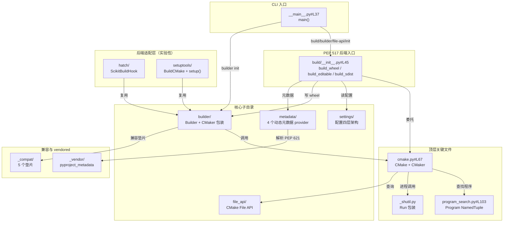

# 项目目录结构与模块功能

> 本章是 scikit-build-core 源码阅读的导航地图。读完本章，你将清楚：`src/scikit_build_core/` 下 13 个顶层 `.py` 文件各自做什么、14 个子目录如何按"核心/兼容/实验性/vendored"四类性质划分、PEP 517 钩子在哪一行被导出、8 步 wheel 构建流程每一步对应哪个源码文件、配置系统四层架构的源码位置、CMake File API 的工作流、元数据插件与可编辑安装的源码组织。
>
> 本章含 1 张 Mermaid 图（模块依赖关系图），所有源码引用均标注 `src/scikit_build_core/<path>#L<行号>` 锚点，可点击追溯。
>
> 本章与 [01-concepts-architecture.md](01-concepts-architecture.md) 互为表里：01 章讲概念，本章讲源码定位。

## 源码总体结构

scikit-build-core 的源码根位于 `external/tools/scikit-build-core/`，核心代码集中在 `src/scikit_build_core/`。整个包按"核心 / 兼容 / 实验性 / vendored"四类性质划分：

| 性质 | 含义 | 涉及模块 |
|---|---|---|
| 核心 | PEP 517 后端主体逻辑，构建 wheel/sdist 的必备路径 | `build/`、`builder/`、`settings/`、`file_api/`、`metadata/`、`init/`、`resources/`、`utils/`、`cmake.py` 等 |
| 兼容 | 跨 Python 版本与第三方库的垫片，Ruff 强制使用 | `_compat/` |
| 实验性 | 未定稿特性，需 `experimental=true` 或独立入口点 | `hatch/`、`setuptools/`、`_variants.py` |
| vendored | 第三方库内嵌副本，禁止 lint 或手改 | `_vendor/pyproject_metadata/` |

```
src/scikit_build_core/
├── __init__.py              # 包入口，导出 __version__
├── __main__.py              # CLI 入口 main()，注册 4 个子命令
├── cmake.py                 # CMake 值对象 + CMaker 构建器
├── errors.py                # 项目异常体系
├── format.py                # 模板格式化
├── program_search.py        # CMake/Ninja/Make 程序查找
├── _logging.py              # 基于 rich 的彩色日志
├── _reproducible.py         # 可复现构建辅助
├── _shutil.py               # subprocess 包装类 Run
├── _variants.py             # PEP 817 实验性变体
├── _check_extra.py          # 可选依赖缺失告警
├── _version.pyi             # 版本字符串类型存根
├── py.typed                 # PEP 561 类型标记
├── _compat/                 # 兼容垫片（tomllib/typing/importlib/...）
├── _vendor/                 # vendored 库（pyproject_metadata）
├── ast/                     # AST 解析器（overrides 条件表达式）
├── build/                   # PEP 517 构建后端入口与 wheel/sdist 实现
├── builder/                 # 高层 CMake 构建编排
├── file_api/                # CMake File API 客户端
├── hatch/                   # hatchling 插件（实验性）
├── init/                    # 项目脚手架生成器
├── metadata/                # 4 个内置动态元数据提供者
├── resources/               # 打包资源（_editable_redirect.py、schema.json）
├── settings/                # 配置系统（数据模型 + 源链 + 覆盖 + Schema）
├── setuptools/              # setuptools 兼容层（实验性）
└── utils/                   # 通用工具（typing 反射）
```

13 个顶层 `.py` 文件 + 13 个顶层子目录 + 1 个 notable 子子目录（`resources/find_python/`）= 27 个模块条目。下文逐一解析。

### 模块依赖关系图

下图展示顶层文件与子目录的依赖关系：`__main__.py` 作为 CLI 入口分发到 4 个子命令模块，`build/__init__.py` 作为 PEP 517 后端入口委托到 `build/wheel.py` 与 `build/sdist.py`，二者共用 `builder/`、`settings/`、`file_api/`、`metadata/` 等核心子目录。



## 顶层文件职责表（13 个 .py + 类型标记）

下表列出 `src/scikit_build_core/` 下全部 13 个顶层文件，每项标注源码锚点与性质分类。

| 文件 | 性质 | 一句话职责 | 源码锚点 |
|---|---|---|---|
| `__init__.py` | 核心 | 包入口，导出 `__version__`（由 hatch-vcs 写入 `_version.py`） | `src/scikit_build_core/__init__.py` |
| `__main__.py` | 核心 | CLI 入口 `main()`，注册 4 个子命令：`build` / `builder` / `file-api` / `init` | `src/scikit_build_core/__main__.py#L37` |
| `cmake.py` | 核心 | `CMake`（值对象，含 `default_search`）与 `CMaker`（重量级构建器，封装 configure/build/install） | `src/scikit_build_core/cmake.py#L67` |
| `errors.py` | 核心 | 项目异常体系（`CMakeNotFoundError`、`CMakeConfigError`、`FailedLiveProcessError` 等） | `src/scikit_build_core/errors.py` |
| `format.py` | 核心 | 模板格式化 `pyproject_format`，用于 `generate` 配置项与字符串替换 | `src/scikit_build_core/format.py` |
| `program_search.py` | 核心 | 系统中 CMake/Ninja/Make 程序查找（`Program` NamedTuple、`best_program`、`get_cmake_programs` 等） | `src/scikit_build_core/program_search.py#L103` |
| `_logging.py` | 核心 | 基于 rich 的彩色结构化日志（`ScikitBuildLogger`、`LEVEL_VALUE`、`rich_print`/`rich_error`/`rich_warning`） | `src/scikit_build_core/_logging.py` |
| `_reproducible.py` | 核心 | 可复现构建辅助（`get_reproducible_epoch`、`normalize_file_permissions`、`parse_source_date_epoch`，ZIP 时间戳边界 1980–2107） | `src/scikit_build_core/_reproducible.py` |
| `_shutil.py` | 核心 | subprocess 包装类 `Run`，统一进程调用与日志 | `src/scikit_build_core/_shutil.py` |
| `_variants.py` | 实验性 | PEP 817 变体支持（`variant_build_requires`、`validate_variant_settings`、`get_wheel_variant`） | `src/scikit_build_core/_variants.py` |
| `_check_extra.py` | 核心 | 可选依赖缺失告警（`warn_missing_extra`） | `src/scikit_build_core/_check_extra.py` |
| `_version.pyi` | 核心 | 版本字符串类型存根 | `src/scikit_build_core/_version.pyi` |
| `py.typed` | 核心 | PEP 561 类型标记（空文件，标识包提供类型信息） | `src/scikit_build_core/py.typed` |

> **性质标记说明**：
> - **核心**：构建 wheel/sdist 的必备路径，11 个文件
> - **实验性**：未定稿特性，1 个文件（`_variants.py`）
> - **类型标记**：`_version.pyi` 与 `py.typed` 是类型系统辅助文件，不包含运行时逻辑

## 子目录职责矩阵（14 个）

下表列出 `src/scikit_build_core/` 下 13 个顶层子目录 + 1 个 notable 子子目录（`resources/find_python/`），每项标注性质分类与关键文件锚点。

| 目录 | 性质 | 一句话职责 | 关键文件锚点 |
|---|---|---|---|
| `build/` | 核心 | PEP 517 构建后端入口与 wheel/sdist 实现的核心目录 | `build/__init__.py#L45`、`build/wheel.py#L215`、`build/sdist.py#L129`、`build/metadata.py#L53` |
| `builder/` | 核心 | 高层 CMake 构建编排（`Builder` 类、generator 选择、wheel tag、sysconfig、macos 跨编译、get_requires） | `builder/builder.py#L213`、`builder/generator.py#L39`、`builder/wheel_tag.py#L67`、`builder/get_requires.py#L113` |
| `settings/` | 核心 | 配置系统：数据模型 + 源链 + 覆盖 + JSON Schema 生成 + 自动版本检测 | `settings/skbuild_model.py#L815`、`settings/skbuild_read_settings.py#L263`、`settings/skbuild_overrides.py#L354`、`settings/skbuild_schema.py#L41` |
| `file_api/` | 核心 | CMake File API 客户端：`query.py` 写入 stateless query，`reply.py` 读取回复，`model/` 为 6 个响应数据类 | `file_api/query.py#L19`、`file_api/reply.py#L150`、`file_api/reply.py#L50` |
| `metadata/` | 核心 | 4 个内置动态元数据提供者（`regex`、`template`、`setuptools_scm`、`fancy_pypi_readme`） | `metadata/regex.py`、`metadata/template.py`、`metadata/setuptools_scm.py`、`metadata/fancy_pypi_readme.py` |
| `init/` | 核心 | 项目脚手架生成器，支持 8 种后端模板（pybind11/nanobind/c/cython/swig/fortran/abi3/abi3t） | `init/__main__.py#L128`、`init/__main__.py#L45` |
| `resources/` | 核心 | 打包资源：`_editable_redirect.py`（可编辑安装重定向 shim）、`find_python/`（CMake FindPython 助手）、`scikit-build.schema.json`（生成的 JSON Schema） | `resources/_editable_redirect.py`、`resources/scikit-build.schema.json` |
| `utils/` | 核心 | 通用工具：`typing.py`（`get_target_raw_type`、`is_union_type`、`process_union`，供 settings 反射用） | `utils/typing.py` |
| `_compat/` | 兼容 | 跨版本兼容垫片：`tomllib`、`typing`（`Self`/`Annotated`/`assert_never`）、`importlib`（`metadata`/`resources`）、`setuptools.errors`、`builtins`（`ExceptionGroup` 回退） | `_compat/tomllib.py`、`_compat/typing.py`、`_compat/importlib.py`、`_compat/builtins.py` |
| `hatch/` | 实验性 | hatchling 构建钩子插件，`ScikitBuildHook` 复用 Builder/CMaker 基础设施 | `hatch/hooks.py#L19`、`hatch/plugin.py#L73` |
| `setuptools/` | 实验性 | setuptools 兼容层：`build_meta.py` 包装 `setuptools.build_meta`，`build_cmake.py` 实现 distutils `build_cmake` 命令，`wrapper.py` 提供 `setup()` | `setuptools/build_meta.py#L14`、`setuptools/build_cmake.py#L378`、`setuptools/wrapper.py#L39` |
| `_vendor/` | vendored | vendored 第三方库目录，含 `pyproject_metadata/`（解析 PEP 621 `[project]` 表为 `StandardMetadata`）。**禁止 lint 或手改** | `_vendor/pyproject_metadata/` |
| `ast/` | 核心 | 自定义 AST 解析器（`tokenizer.py`、`ast.py`），用于解析 overrides 中的条件表达式（如 `if.env.X`、`if.python-version`） | `ast/ast.py`、`ast/tokenizer.py` |
| `resources/find_python/` | 核心 | CMake `find_python` 模块资源子目录，提供 FindPython 助手模块（`resources/find_python/` 内的 CMake 模块文件） | `resources/find_python/` |

> **性质分类说明**：
> - **核心目录（9 个）**：`build/`、`builder/`、`settings/`、`file_api/`、`metadata/`、`init/`、`resources/`、`utils/`、`ast/`
> - **兼容目录（1 个）**：`_compat/`
> - **实验性目录（2 个）**：`hatch/`、`setuptools/`
> - **vendored 目录（1 个）**：`_vendor/`（含 `pyproject_metadata/` 子目录）
> - **资源子目录（1 个）**：`resources/find_python/`（`resources/` 的子目录，单独列出因其含 CMake 模块资源）

## PEP 517 钩子入口表

scikit-build-core 作为 PEP 517 后端，从 `src/scikit_build_core/build/__init__.py` 导出 8 个钩子函数。下表完整列出每个钩子的源码锚点、委托目标与调用时机。

| 钩子名 | 源码锚点 | 委托目标 | 调用时机 |
|---|---|---|---|
| `build_wheel` | `src/scikit_build_core/build/__init__.py#L45-L58` | `_build_wheel_impl(..., editable=False)` | `pip install`、`python -m build --wheel` |
| `build_editable` | `src/scikit_build_core/build/__init__.py#L61-L74` | `_build_wheel_impl(..., editable=True)` | `pip install -e`、`python -m build --wheel`（PEP 660） |
| `prepare_metadata_for_build_wheel` | `src/scikit_build_core/build/__init__.py#L95-L104` | `_build_wheel_impl(None, ...)` 返回 dist-info 目录 | `pip install`（仅当 `_has_safe_metadata()` 为真） |
| `prepare_metadata_for_build_editable` | `src/scikit_build_core/build/__init__.py#L106-L116` | 同上，`editable=True` | `pip install -e`（仅当 `_has_safe_metadata()` 为真） |
| `build_sdist` | `src/scikit_build_core/build/__init__.py#L124-L131` | `build.sdist.build_sdist` | `python -m build --sdist` |
| `get_requires_for_build_sdist` | `src/scikit_build_core/build/__init__.py#L134-L150` | `GetRequires.from_config_settings(state="sdist")` | pip/build 解析依赖时 |
| `get_requires_for_build_wheel` | `src/scikit_build_core/build/__init__.py#L173-L176` | `_get_requires_for_build_wheel(state="wheel")` | pip/build 解析依赖时 |
| `get_requires_for_build_editable` | `src/scikit_build_core/build/__init__.py#L179-L182` | `_get_requires_for_build_wheel(state="editable")` | pip/build 解析依赖时（PEP 660） |

### `_has_safe_metadata()` 的禁用机制

`_has_safe_metadata()`（`src/scikit_build_core/build/__init__.py#L77-L90`）会扫描 `tool.scikit-build.overrides[].if.failed`，若存在 `if.failed` 选择器，则以"不安全"模式**禁用** `prepare_metadata_for_build_wheel` 与 `prepare_metadata_for_build_editable` 两个钩子。

**原因**：`if.failed` 用于实现"构建失败则回退纯 Python wheel"的重试机制。如果在 metadata 阶段就调用了 `prepare_metadata_*`，一旦失败，后续的 retry 流程将无法正确触发。因此 scikit-build-core 选择在存在 `if.failed` 时禁用 metadata 钩子，确保 retry 机制可靠。

源码实现（`build/__init__.py#L93-L121`）：

```python
if _has_safe_metadata():

    def prepare_metadata_for_build_wheel(
        metadata_directory: str,
        config_settings: dict[str, list[str] | str] | None = None,
    ) -> str:
        ...
```

`prepare_metadata_*` 钩子仅在 `if _has_safe_metadata():` 为真时才被定义并加入 `__all__`，否则模块不导出这两个函数，前端会跳过 metadata 阶段直接调用 `build_wheel`。

### 入口点注册表

scikit-build-core 在自身的 `pyproject.toml`（`external/tools/scikit-build-core/pyproject.toml`）中注册了 6 类入口点：

| 入口点类别 | 名称 | 目标 | 源码锚点 |
|---|---|---|---|
| CLI 脚本 | `scikit-build` | `scikit_build_core.__main__:main` | `pyproject.toml#L76` |
| CLI 脚本 | `scikit-build-core` | `scikit_build_core.__main__:main` | `pyproject.toml#L78` |
| distutils 命令 | `distutils.commands.build_cmake` | `scikit_build_core.setuptools.build_cmake:BuildCMake` | `pyproject.toml#L81` |
| distutils setup 关键字（6 个） | `cmake_source_dir`/`cmake_args`/`cmake_install_dir`/`cmake_process_manifest_hook`/`cmake_install_target`/`cmake_with_sdist` | `scikit_build_core.setuptools.build_cmake` | `pyproject.toml#L82-L87` |
| setuptools finalize | `setuptools.finalize_distribution_options.scikit_build_entry` | `scikit_build_core.setuptools.build_cmake:finalize_distribution_options` | `pyproject.toml#L88` |
| validate_pyproject schema | `validate_pyproject.tool_schema.scikit-build` | `scikit_build_core.settings.skbuild_schema:get_skbuild_schema` | `pyproject.toml#L89` |
| hatchling 插件 | `hatch.scikit-build` | `scikit_build_core.hatch.hooks` | `pyproject.toml#L90` |
| 动态元数据 provider（4 个） | `scikit_build_core.metadata.{regex,template,setuptools_scm,fancy_pypi_readme}` | 对应模块的 `Provider` 类 | `pyproject.toml#L95-L98` |

## 构建流程调用图

本节从源码定位视角描述 8 步 wheel 构建流程。概念解释详见 [01-concepts-architecture.md](01-concepts-architecture.md#wheel-构建流程8-步详解)。

完整调用链：`build_wheel`（`build/__init__.py#L45`）→ `_build_wheel_impl`（`build/wheel.py#L215`）→ `_build_wheel_impl_impl`（`build/wheel.py#L310`）。

| 步骤 | 操作 | 源码锚点 |
|---|---|---|
| 1 | `SettingsReader.from_file` 读取并合并配置（三源 + overrides + auto-detect） | `src/scikit_build_core/settings/skbuild_read_settings.py#L669`（`from_file` 类方法） |
| 2 | `get_standard_metadata` 解析 PEP 621 元数据（调用 vendored `pyproject_metadata`） | `src/scikit_build_core/build/metadata.py#L53` |
| 3 | `CMake.default_search` 查找系统 CMake（委托 `program_search`） | `src/scikit_build_core/cmake.py#L71` |
| 4 | `Builder.configure` 写 file-api query + 运行 `cmake -S -B`（注入 Python 发现变量、Stable ABI、macOS 跨编译） | `src/scikit_build_core/builder/builder.py#L257` |
| 5 | `Builder.build` 运行 `cmake --build` | `src/scikit_build_core/builder/builder.py#L488` |
| 6 | `Builder.install` 运行 `cmake --install` 到 staging 目录 | `src/scikit_build_core/builder/builder.py#L502` |
| 7 | 打包 Python 文件（`iter_force_include`、`packages_to_file_mapping`、`resolve_wheel_tree`） | `src/scikit_build_core/build/_pathutil.py`、`src/scikit_build_core/build/_file_processor.py` |
| 8 | `WheelWriter` 写 .whl + 计算 tag（`WheelTag.compute_best`） | `src/scikit_build_core/build/_wheelfile.py`、`src/scikit_build_core/builder/wheel_tag.py#L67` |

> **验收要求**：上表每个步骤的源码锚点必须可点击跳转到对应文件行号。若锚点失效，说明源码版本与本文档不一致，请参考 [06-resources.md](06-resources.md) 的版本信息。

## 配置系统四层架构（源码视角）

配置系统的概念解释详见 [01-concepts-architecture.md](01-concepts-architecture.md#配置系统四层架构)。本节从源码定位视角补充关键行号锚点。

### 数据模型层（settings/skbuild_model.py）

主数据类 `ScikitBuildSettings`（`src/scikit_build_core/settings/skbuild_model.py#L815`）聚合 11 个子节 + 顶级字段。下表列出每个子节的源码锚点：

| 子节 / 字段 | 行号锚点 | 说明 |
|---|---|---|
| `cmake: CMakeSettings` | `skbuild_model.py#L164` | CMake 二进制版本/路径/args/define/build-type/toolchain 等 |
| `search: SearchSettings` | `skbuild_model.py#L270` | CMake/Ninja 查找上下文 |
| `ninja: NinjaSettings` | `skbuild_model.py#L278` | Ninja 版本/路径 |
| `logging: LoggingSettings` | `skbuild_model.py#L313` | 日志级别 |
| `sdist: SDistSettings` | `skbuild_model.py#L323` | sdist 配置（`cmake`/`reproducible`/`include`/`exclude`/`force-include`/`strip`/`add` 等） |
| `wheel: WheelSettings` | `skbuild_model.py#L434` | wheel 配置（`platlib`/`pure-python`/`py-api`/`license-files`/`build-tag`/`exclude` 等） |
| `backport: BackportSettings` | `skbuild_model.py#L626` | Python 旧版本回退配置（`find-python` 等） |
| `editable: EditableSettings` | `skbuild_model.py#L636` | 可编辑安装（`mode`、`rebuild`、`verbose`、`install_dir`） |
| `build: BuildSettings` | `skbuild_model.py#L689` | 构建目录、工具选择、component 安装目标 |
| `install: InstallSettings` | `skbuild_model.py#L718` | 安装目标路径映射（components、strip） |
| `generate: List[GenerateSettings]` | `skbuild_model.py#L759` | 文件生成项（template/template-path + path） |
| `messages: MessagesSettings` | `skbuild_model.py#L798` | 自定义构建阶段消息 |
| `metadata: Dict[str, Dict[str, Any]]` | `skbuild_model.py#L829` | 旧式动态元数据表（legacy） |
| `env: Annotated[Dict[str, EnvValue], "EnvTable"]` | `skbuild_model.py#L834` | CMake 子进程环境变量（v1.0+） |
| `strict_config: bool = True` | `skbuild_model.py#L850` | 严格校验未知配置项 |
| `experimental: bool = False` | `skbuild_model.py#L859` | 启用未定稿特性 |
| `variant` / `variant_name` / `variant_label` / `null_variant` | `skbuild_model.py#L864` | PEP 817 实验性变体（override-only，不能在静态表设置） |
| `minimum_version: Optional[Version]` | `skbuild_model.py#L912` | 向后兼容版本门 |
| `build_dir: str = ""` | `skbuild_model.py#L922` | CMake 构建目录（默认临时目录） |
| `fail: Optional[bool]` | `skbuild_model.py#L929` | override-only，立即失败 |

两个关键辅助类型：

- `CMakeSettingsDefine`（`src/scikit_build_core/settings/skbuild_model.py#L61`）：str 子类型，自动将 bool/list 归一化为 CMake 表示（`TRUE`/`FALSE`/分号分隔列表）
- `EnvValue`（`skbuild_model.py#L85`）：支持 `{env, default, force}` 表或裸字符串，延迟到构建时解析

### 源链层（settings/sources.py）

文件顶部 docstring（`src/scikit_build_core/settings/sources.py#L1-L79`）描述三个具体 Source 与 `SourceChain`：

| Source | 输入 | 编码 |
|---|---|---|
| `EnvSource` | `SKBUILD_*` 环境变量 | 列表 `a;b`，dict `k=v;k2=v2` |
| `ConfSource` | PEP 517 `config-settings`（扁平点号键，如 `-Ca.b=c`） | 同上 |
| `TOMLSource` | `tool.scikit-build` 嵌套 TOML 表 | 原生 TOML 类型 |
| `SourceChain` | 按顺序查询，第一个匹配的 source 转换值 | dict 跨源合并而非替换 |

优先级：env > config-settings > TOML。

### 编排层（settings/skbuild_read_settings.py）

`SettingsReader` 类（`src/scikit_build_core/settings/skbuild_read_settings.py#L263`）的处理步骤：

| 步骤 | 方法/调用 | 源码锚点 |
|---|---|---|
| 1 | 用 `SourceChain` 合并三源 | `skbuild_read_settings.py#L263`（`__init__` 内） |
| 2 | `process_overrides` 应用条件覆盖 | `skbuild_read_settings.py#L282`（调用 `skbuild_overrides.py#L354`） |
| 3 | `_handle_minimum_version` 版本兼容改写 | `src/scikit_build_core/settings/skbuild_read_settings.py#L71` |
| 4 | `find_min_cmake_version` 解析 `cmake_minimum_required` | `src/scikit_build_core/settings/auto_cmake_version.py` |
| 5 | `get_min_requires` 自动检测最小依赖 | `src/scikit_build_core/settings/auto_requires.py` |
| 6 | `load_config_providers` 加载入口点配置提供者 | `src/scikit_build_core/settings/_load_entrypoint_config.py` |
| 7 | 校验未知选项、override-only 字段 | `skbuild_read_settings.py#L619`（`validate_may_exit`） |

`SettingsReader.from_file`（`src/scikit_build_core/settings/skbuild_read_settings.py#L669`）是从 `pyproject.toml` 文件加载配置的入口类方法。

### Schema 层（settings/skbuild_schema.py）

| 函数 | 源码锚点 | 说明 |
|---|---|---|
| `generate_skbuild_schema` | `src/scikit_build_core/settings/skbuild_schema.py#L41` | 从 `ScikitBuildSettings` 数据类生成完整 JSON Schema |
| `get_skbuild_schema` | `src/scikit_build_core/settings/skbuild_schema.py#L233` | 从打包资源读取已生成的 schema |

生成的 schema 落地于 `src/scikit_build_core/resources/scikit-build.schema.json`，由 `nox -t gen` 重新生成。`generate_skbuild_schema` 通过 `settings/json_schema.py` 的 `to_json_schema` 转换，特殊处理包括：`generate` 项的 `template`/`template-path` 互斥（oneOf）、`metadata` 限制字段集、`override-only` 字段单独分组、生成 `if_overrides` 与 `inherit` 定义。

## 条件覆盖（overrides）系统

`process_overrides`（`src/scikit_build_core/settings/skbuild_overrides.py#L354`）是 overrides 系统的入口函数。

### 12 种 `if` 选择器（4 类）

| 类别 | 选择器 | 说明 |
|---|---|---|
| 版本类 | `scikit-build-version`、`python-version`、`implementation-version` | 按 PEP 440 版本匹配 |
| 字符串类 | `implementation-name`、`platform-system`、`platform-machine`、`platform-node`、`state`、`from-sdist` | 按字符串相等匹配 |
| 布尔类 | `failed`、`system-cmake`、`cmake-wheel` | 按 true/false 匹配 |
| 复合类 | `env`（环境变量正则或布尔）、`abi-flags`、`any`（任一子条件满足） | 复合条件 |

`state` 取值：`sdist`/`wheel`/`editable`/`metadata_wheel`/`metadata_editable`。

多条件 `if` 全部满足才生效；`if.any` 满足任一子条件即生效。

### `inherit` 三模式

`inherit`（schema 定义见 `skbuild_schema.py`）控制覆盖是否继承默认值：

| 模式 | 行为 |
|---|---|
| `none`（默认） | 覆盖值完全替换默认值 |
| `append` | 覆盖值追加到默认值列表后 |
| `prepend` | 覆盖值前置于默认值列表前 |

### `OverrideRecord` 与 `override-only` 字段

`OverrideRecord`（`src/scikit_build_core/settings/skbuild_overrides.py#L50`）记录覆盖动作的原始值、最终值与原因，用于调试与审计。

`override-only` 字段（如 `variant`/`variant_name`/`variant_label`/`null_variant`/`fail`）不能在静态 `[tool.scikit-build]` 表中设置，只能通过 `config-settings` 或 `overrides` 设置。

### `failed` 重试机制（0.10+）

`if.failed=true` 实现"构建失败则回退纯 Python wheel"：当首次构建失败时，scikit-build-core 在 retry 时应用带 `if.failed=true` 的 override 块，通常用于切换到纯 Python 回退方案。这也是 `_has_safe_metadata()` 禁用 `prepare_metadata_*` 钩子的原因（见上文）。

## CMake 集成三层抽象（源码视角）

CMake 三层抽象的概念解释详见 [01-concepts-architecture.md](01-concepts-architecture.md#cmake-集成机制)。本节列出三个类的完整方法表与源码锚点。

### `CMake` 值对象（cmake.py#L67）

frozen dataclass，持有 `version` 与 `cmake_path`。

| 方法 | 源码锚点 | 说明 |
|---|---|---|
| `default_search` | `src/scikit_build_core/cmake.py#L71` | 类方法，按 `SpecifierSet` 在系统路径与 PyPI 包中查找 CMake |
| `__fspath__` | `cmake.py#L97` | 文件系统路径协议，支持 `os.fspath()` |

### `CMaker` 重量级构建器（cmake.py#L102）

管理构建目录生命周期与 CMake 子进程调用。

| 方法 | 源码锚点 | 说明 |
|---|---|---|
| `configure` | `src/scikit_build_core/cmake.py#L284` | 写 `CMakeInit.txt`（含所有 `SKBUILD_*` cache entry），运行 `cmake -S … -B …`，配置前写 file-api query |
| `build` | `src/scikit_build_core/cmake.py#L327` | 运行 `cmake --build`，按 generator 传递参数 |
| `install` | `src/scikit_build_core/cmake.py#L352` | 运行 `cmake --install` 到 staging 目录，映射到 wheel 布局 |
| `get_generator` | `cmake.py#L275` | 从 args/defines/env 提取 generator |

`CMaker.configure`（`cmake.py#L284`）详解：

1. 调用 `_compute_cmake_args` 计算所有 CMake 参数（defines + cmake_args）
2. 调用 `get_generator` 提取 generator（支持 `-GNinja` 与 `-G Ninja` 两种形式）
3. 若为单配置 generator（Ninja/Makefiles）且指定了 `build_type`，插入 `-DCMAKE_BUILD_TYPE`
4. 调用 `Run(env=self.env).live(self.cmake, *all_args)` 运行 CMake
5. 若 file-api query 文件存在，调用 `load_reply_dir` 解析响应

### `Builder` 高层包装（builder/builder.py#L213）

被 `build/wheel.py` 使用，封装 Python 生态特定的 CMake 集成逻辑。

| 方法 | 源码锚点 | 说明 |
|---|---|---|
| `configure` | `src/scikit_build_core/builder/builder.py#L257` | 注入 Python 发现变量、Stable ABI、macOS 跨编译，然后委托给 `CMaker.configure` |
| `build` | `src/scikit_build_core/builder/builder.py#L488` | 委托给 `CMaker.build` |
| `install` | `src/scikit_build_core/builder/builder.py#L502` | 委托给 `CMaker.install` |

`Builder.configure`（`builder.py#L257`）详解：

- 注入 Python 发现变量：`PYTHON_EXECUTABLE`、`Python3_EXECUTABLE`
- 注入 Limited API / Stable ABI：`SKBUILD_SOABI`、`SKBUILD_SABI_*`，由 `_SabiMode` 枚举（`builder.py#L64-L67`）控制
- 注入 macOS 跨编译：`ARCHFLAGS` → `CMAKE_OSX_ARCHITECTURES`，由 `get_archs`（`builder.py#L75`）解析
- 注入 entry-point 注册的 CMake 模块路径
- 委托给 `CMaker.configure`

### 程序查找（program_search.py）

| 函数 / 类 | 源码锚点 | 说明 |
|---|---|---|
| `Program` NamedTuple | `src/scikit_build_core/program_search.py#L103` | 程序候选者数据结构 |
| `get_cmake_program` | `program_search.py#L145` | 单路径包装 |
| `get_cmake_programs` | `program_search.py#L197` | 从 PATH 与 PyPI 安装位置枚举 CMake 候选 |
| `get_ninja_programs` | `program_search.py#L207` | 枚举 Ninja 候选 |
| `get_make_programs` | `program_search.py#L236` | 枚举 Make 候选 |
| `best_program` | `program_search.py#L247` | 按版本 specifier 选择最佳 |
| `_macos_binary_is_x86` | `program_search.py#L57` | macOS 上检测二进制架构 |

### Generator 选择（builder/generator.py）

| 函数 | 源码锚点 | 说明 |
|---|---|---|
| `parse_generator` | `src/scikit_build_core/builder/generator.py#L39` | 从 CMake args 中提取 `-G` 指定的 generator |
| `set_environment_for_gen` | `builder/generator.py` | 为 generator 设置环境变量（Ninja 路径等） |
| `parse_help_default` | `builder/generator.py#L58` | 解析 `cmake --help` 默认 generator |

## CMake File API 工作流

CMake File API 的概念解释详见 [01-concepts-architecture.md](01-concepts-architecture.md#cmake-file-api-状态机)。本节从源码定位视角描述工作流。

### 工作流三步

| 步骤 | 函数 | 源码锚点 | 说明 |
|---|---|---|---|
| 1. 写 query | `stateless_query` | `src/scikit_build_core/file_api/query.py#L19` | 在 `build_dir/.cmake/api/v1/query/` 创建 4 个空文件 |
| 2. CMake 写 reply | （CMake 自动） | — | CMake configure 时自动写入 `reply/` 目录响应 |
| 3. 解析 reply | `load_reply_dir` | `src/scikit_build_core/file_api/reply.py#L150` | 定位最新 `index-*.json`，通过 `Converter` 类解析 |

`stateless_query`（`file_api/query.py#L19`）创建的 4 个 query 文件（`file_api/query.py#L24-L27`）：

```python
query.joinpath("codemodel-v2").touch()
query.joinpath("cache-v2").touch()
query.joinpath("cmakeFiles-v1").touch()
query.joinpath("toolchains-v1").touch()
```

### `Converter` 类与 6 个 typed dataclass

`Converter` 类（`src/scikit_build_core/file_api/reply.py#L50`）负责将 JSON 响应转换为 typed dataclass。

| 数据类 | 源码文件 | 说明 |
|---|---|---|
| `Index` | `file_api/model/index.py` | file-api 入口索引 |
| `CodeModel` / `Target` | `file_api/model/codemodel.py` | 项目结构与目标 |
| `Cache` | `file_api/model/cache.py` | CMakeCache.txt 解析 |
| `CMakeFiles` | `file_api/model/cmakefiles.py` | 参与的 CMake 文件 |
| `Toolchains` | `file_api/model/toolchains.py` | 工具链信息 |
| `Directory` | `file_api/model/directory.py` | 目录结构 |

用途：用于 wheel 文件结构推断、stale cache 检测。

### CLI 子命令

`scikit-build file-api` 子命令（`src/scikit_build_core/file_api/__main__.py#L35`）提供两个操作：

- `scikit-build file-api query`：手动写 query 文件
- `scikit-build file-api reply`：手动解析 reply 目录

## 元数据插件机制（源码视角）

元数据插件机制的概念解释详见 [01-concepts-architecture.md](01-concepts-architecture.md#元数据插件机制)。

### `get_standard_metadata` 4 步处理流程

`get_standard_metadata`（`src/scikit_build_core/build/metadata.py#L53`）的处理流程：

| 步骤 | 操作 | 说明 |
|---|---|---|
| 1 | 处理 legacy `tool.scikit-build.metadata` 表 | `process_legacy_dynamic_metadata` |
| 2 | 处理新式 `[[tool.dynamic-metadata]]` | `process_dynamic_metadata`（dynamic-metadata 0.3） |
| 3 | SDist 阶段标记 `dynamic_metadata` 字段为 Dynamic | METADATA 2.2 |
| 4 | 调用 vendored `StandardMetadata.from_pyproject` | 解析 PEP 621 静态字段 |

`minimum_version` 控制 name 归一化、metadata version 等行为。

### 4 个内置 provider

| Provider | 源码锚点 | 适用字段 | 说明 |
|---|---|---|---|
| `regex` | `src/scikit_build_core/metadata/regex.py` | `version` 等 | 正则替换，从文件抽取，支持 `result`/`remove` 后处理（0.10+） |
| `template` | `src/scikit_build_core/metadata/template.py` | 任意字段 | 模板填充，引用其他 metadata 字段做模板输出（0.11.2+） |
| `setuptools_scm` | `src/scikit_build_core/metadata/setuptools_scm.py` | `version` | 从 git tag 或 `.git_archival.txt` 读版本 |
| `fancy_pypi_readme` | `src/scikit_build_core/metadata/fancy_pypi_readme.py` | `readme` | 包装 hatch-fancy-pypi-readme |

入口点注册：`pyproject.toml#L95-L98`（4 个 `dynamic_metadata.provider` 入口点）。

### 字段分类

`metadata/__init__.py` 定义字段分类，用于 provider 校验：

| 分类 | 说明 |
|---|---|
| `_STR_FIELDS` | 字符串字段（如 `name`、`version`） |
| `_LIST_STR_FIELDS` | 字符串列表字段（如 `classifiers`、`requires-python`） |
| `_DICT_STR_FIELDS` | 字符串字典字段 |
| `_LIST_DICT_FIELDS` | 字典列表字段（如 `authors`、`maintainers`） |
| `_SCALAR_FIELDS` | 标量字段（如 `version`） |
| `_EXTENDABLE_FIELDS` | 可扩展字段（PEP 808，允许 provider 追加而非替换） |

### 第三方 provider 注意事项

第三方 provider 需 `experimental=true`，接口可能在 minor 版本间变化。

## 可编辑安装两种模式

可编辑安装的概念解释详见 [01-concepts-architecture.md](01-concepts-architecture.md#可编辑安装原理)。

### redirect 模式（默认）

`editable_redirect`（`src/scikit_build_core/build/_editable.py#L48`）：

1. 读取 `resources/_editable_redirect.py` 模板
2. 生成 `.pth` 文件 + `_editable_skbc_<pkg>.py` shim
3. 使用 `sys.meta_path` 映射 import
4. 若 `editable.rebuild=true`，import 时触发 CMake 重建

### inplace 模式

`editable_inplace`：生成简单 `.pth` 指向源码包目录，不支持 CMake 重建。

### 辅助函数

| 函数 | 源码锚点 | 说明 |
|---|---|---|
| `get_packages` | `build/_editable.py` | 获取包列表 |
| `package_search_dirs` | `build/_editable.py` | 包搜索目录 |
| `collect_search_locations` | `build/_editable.py` | 收集搜索位置 |
| `mapping_to_modules` | `build/_editable.py` | 路径映射到模块名 |
| `libdir_to_installed` | `build/_editable.py` | 库目录到已安装位置 |
| `editable_redirectable` | `src/scikit_build_core/build/_pathutil.py#L362` | 判断路径是否可重定向 |

## 后端适配层

### Hatchling 插件（hatch/，实验性）

| 文件 | 源码锚点 | 说明 |
|---|---|---|
| `hatch/hooks.py` | `src/scikit_build_core/hatch/hooks.py#L19` | `hatch_register_build_hook` 注册函数，返回 `ScikitBuildHook` |
| `hatch/plugin.py` | `src/scikit_build_core/hatch/plugin.py#L73` | `ScikitBuildHook` 类（继承 `BuildHookInterface`），让 hatchling 驱动 CMake 构建 |

`ScikitBuildHook` 复用 `Builder`/`CMaker` 基础设施，但产物回填给 hatchling 而非自组装 wheel。

入口点：`hatch.scikit-build` → `scikit_build_core.hatch.hooks`（`pyproject.toml#L90`）。

### Setuptools 兼容层（setuptools/，实验性）

| 文件 | 源码锚点 | 说明 |
|---|---|---|
| `setuptools/build_meta.py` | `src/scikit_build_core/setuptools/build_meta.py#L14-L19` | 从 `setuptools.build_meta` 重导出 `build_sdist`/`build_wheel`/`prepare_metadata_for_build_wheel` |
| `setuptools/build_meta.py#L25-L47` | `src/scikit_build_core/setuptools/build_meta.py#L25` | 条件定义 `build_editable`，先 `_validate_editable_settings` 再委托 |
| `setuptools/build_cmake.py` | `src/scikit_build_core/setuptools/build_cmake.py#L378` | `BuildCMake` 类（distutils 命令），含 `cmake_source_dir`/`cmake_args`/`cmake_install_dir`/`cmake_process_manifest_hook`/`cmake_install_target`/`cmake_with_sdist` 等 setup() 关键字 |
| `setuptools/build_cmake.py` | `src/scikit_build_core/setuptools/build_cmake.py#L744` | `finalize_distribution_options` 钩子，注入 setup() 关键字处理 |
| `setuptools/wrapper.py` | `src/scikit_build_core/setuptools/wrapper.py#L39` | `setup()` 函数，兼容旧 `scikit-build` 项目的 setup() 包装 |

`BuildCMake` 类（`setuptools/build_cmake.py#L378`）实现 distutils `build_cmake` 命令，通过入口点注册（`pyproject.toml#L81`），含 6 个 setup() 关键字（`pyproject.toml#L82-L87`），并通过 `finalize_distribution_options` 钩子（`pyproject.toml#L88`）注入。

## Init 脚手架（init/__main__.py）

`generate_project`（`src/scikit_build_core/init/__main__.py#L128`）是脚手架生成入口，交互式生成最小 CMake + scikit-build-core 项目。

`_BACKENDS` 字典（`src/scikit_build_core/init/__main__.py#L45`）支持 8 种后端模板：

| 后端 | 依赖 | `py-api` 配置 | 说明 |
|---|---|---|---|
| `pybind11` | `pybind11` | 默认 | C++ pybind11 绑定 |
| `nanobind` | `nanobind` | 默认 | C++ nanobind 绑定 |
| `c` | — | 默认 | 纯 C 扩展 |
| `cython` | `cython` + `cython-cmake` | 默认 | Cython 扩展 |
| `swig` | `swig` | 默认 | SWIG 包装 |
| `fortran` | `numpy` + `f2py-cmake` | 默认 | Fortran f2py 扩展 |
| `abi3` | — | `cp38` | Stable ABI（一个 wheel 支持多 Python 版本） |
| `abi3t` | — | `cp315.cp315t` | 自由线程 Stable ABI（Python 3.13+） |

`_Backend` 数据类（`init/__main__.py#L35-L41`）描述后端所需的 `requires` / `dependencies` / `tool` 片段。

## CLI 子命令树

`scikit-build` CLI 入口 `main()`（`src/scikit_build_core/__main__.py#L37`）注册 4 个子命令：

| 子命令 | 功能 | 源码锚点 |
|---|---|---|
| `build` | 构建后端工具 | `src/scikit_build_core/build/__main__.py#L110` |
| `builder` | 系统与构建环境信息 | `src/scikit_build_core/builder/__main__.py#L77` |
| `file-api` | CMake File API 工具 | `src/scikit_build_core/file_api/__main__.py#L35` |
| `init` | 生成起始项目 | `src/scikit_build_core/init/__main__.py#L230` |

### 8 个具体子命令

| 子命令 | 源码锚点 | 说明 |
|---|---|---|
| `scikit-build build requires` | `src/scikit_build_core/build/__main__.py#L58` | 输出 PEP 517 requires |
| `scikit-build build project-table` | `src/scikit_build_core/build/__main__.py#L44` | 输出含动态元数据的 project 表 |
| `scikit-build builder` | `src/scikit_build_core/builder/__main__.py#L32` | 输出系统信息概览 |
| `scikit-build builder wheel-tag` | `src/scikit_build_core/builder/wheel_tag.py#L255` | 输出计算的 wheel 标签 |
| `scikit-build builder sysconfig` | `src/scikit_build_core/builder/sysconfig.py#L361` | 输出 sysconfig 信息 |
| `scikit-build file-api query` | `src/scikit_build_core/file_api/query.py#L31` | 请求 CMake file API |
| `scikit-build file-api reply` | `src/scikit_build_core/file_api/reply.py#L154` | 处理 CMake file API 响应 |
| `scikit-build init` | `src/scikit_build_core/init/__main__.py#L169` | 生成起始项目 |

## 兼容性与 vendored 目录

### `_compat/` 兼容垫片

`_compat/` 目录提供 5 个跨版本兼容垫片：

| 垫片 | 说明 |
|---|---|
| `tomllib` | Python < 3.11 缺少 `tomllib`，回退到 `tomli` |
| `typing` | `Self`/`Annotated`/`assert_never` 等新类型工具 |
| `importlib` | `metadata`/`resources` 在旧版本的回退 |
| `setuptools.errors` | setuptools `OptionError` 等异常的兼容 |
| `builtins` | `ExceptionGroup` 在 Python < 3.11 的回退 |

**Ruff 强制规则**：禁止直接 import 标准库对应模块，必须通过 `_compat/` 导入。例如：

```python
# 禁止：from tomllib import load
# 必须：
from scikit_build_core._compat import tomllib
```

### `_vendor/pyproject_metadata/` vendored 库

`_vendor/pyproject_metadata/` 是 vendored 的 `pyproject_metadata` 库，解析 PEP 621 `[project]` 表为 `StandardMetadata` 对象。

**禁止事项**：

- 禁止 lint（Ruff 配置排除该目录）
- 禁止手动修改（应通过升级 vendored 版本解决）

vendored 的原因：scikit-build-core 需要对 `pyproject_metadata` 的行为做细粒度控制（如动态元数据处理），且避免与下游项目的 `pyproject_metadata` 版本冲突。

## 实验性特性

### PEP 817 variants

PEP 817 是 wheel 变体的实验性标准。scikit-build-core 通过 `_variants.py`（`src/scikit_build_core/_variants.py`）支持：

| 字段 | 源码锚点 | 说明 |
|---|---|---|
| `variant` | `skbuild_model.py#L864` | 变体标识符列表（override-only） |
| `variant_name` | `skbuild_model.py#L864` | 变体名称 |
| `variant_label` | `skbuild_model.py#L864` | 变体标签（用于 wheel 文件名） |
| `null_variant` | `skbuild_model.py#L864` | 空变体（不构建任何变体） |

`_variants.py` 提供的关键函数：

- `variant_build_requires`：变体构建依赖
- `validate_variant_settings`：校验变体配置
- `get_wheel_variant`：获取当前 wheel 变体

**启用条件**：需 `experimental=true`，且只能在 `config-settings` 或 `overrides` 中设置（不能在静态 `[tool.scikit-build]` 表中设置）。

### `experimental` 字段

`experimental`（`src/scikit_build_core/settings/skbuild_model.py#L859`，默认 `false`）是所有实验性特性的总开关。设为 `true` 后启用：

- PEP 817 variants
- 第三方动态元数据 provider
- 其他未定稿特性

> **警告**：实验性特性的接口可能在 minor 版本间变化，生产环境慎用。

## 生成文件清单

以下文件由 `nox -t gen` 自动生成，**禁止手动编辑**：

| 文件 | 生成来源 | 说明 |
|---|---|---|
| `src/scikit_build_core/resources/scikit-build.schema.json` | `generate_skbuild_schema`（`settings/skbuild_schema.py#L41`） | 从 `ScikitBuildSettings` 数据类生成的 JSON Schema |
| `README.md` cog 段 | `settings/skbuild_docs_readme.py` | 配置项文档（cog 自动生成段） |
| `docs/reference/configs.md` cog 段 | `settings/skbuild_docs_sphinx.py` | 配置参考文档（cog 自动生成段） |

### `nox -t gen` 工作流

修改 `settings/skbuild_model.py` 中的数据类后，必须运行 `nox -t gen` 重新生成：

1. 重新生成 `scikit-build.schema.json`
2. 重新生成 `README.md` 中的配置项文档段
3. 重新生成 `docs/reference/configs.md` 中的配置参考段

**遗漏此步骤会导致**：schema 与代码不一致、文档与实际配置项不匹配、`validate_pyproject` 校验失败。

## 本章小结

本章从源码定位视角，逐模块解析了 `src/scikit_build_core/` 的完整模块树：

- **13 个顶层 `.py` 文件**：从 CLI 入口（`__main__.py`）到 CMake 集成（`cmake.py`）到程序查找（`program_search.py`），每个文件标注了源码锚点
- **14 个子目录**：按"核心（9 个）/ 兼容（1 个）/ 实验性（2 个）/ vendored（1 个）/ 资源子目录（1 个）"五类性质划分
- **PEP 517 钩子入口表**：8 个钩子函数的完整源码锚点与委托链，含 `_has_safe_metadata()` 禁用机制说明
- **8 步构建流程调用图**：每步对应文件:行号锚点
- **配置系统四层架构**：数据模型层 11 个子节的行号锚点、源链层三源优先级、编排层 7 步处理流程、Schema 层生成机制
- **overrides 系统**：12 种 `if` 选择器、`inherit` 三模式、`override-only` 字段约束、`failed` 重试机制
- **CMake 三层抽象**：`CMake`/`CMaker`/`Builder` 三个类的完整方法表
- **File API 工作流**：`stateless_query` 写 4 个 query 文件 → CMake 写 reply → `load_reply_dir` 解析为 6 个 typed dataclass
- **元数据插件**：4 个内置 provider、字段分类、入口点机制
- **可编辑安装**：redirect（默认）vs inplace 两种模式
- **后端适配层**：hatchling 插件与 setuptools 兼容层
- **Init 脚手架**：8 种后端模板
- **CLI 子命令树**：4 个子命令、8 个具体操作
- **兼容性与 vendored**：`_compat/` 5 个垫片与 Ruff 强制规则、`_vendor/pyproject_metadata/` 禁止 lint/手改
- **实验性特性**：PEP 817 variants 与 `experimental` 开关
- **生成文件清单**：3 个由 `nox -t gen` 自动生成的文件

下一章将从 API 与配置视角，详解 8 个 PEP 517 钩子的签名与用法、`[tool.scikit-build]` 全部配置项、CMakeLists.txt 集成示例。

---
← 上一章：[概念与架构](01-concepts-architecture.md) | [返回目录](00-overview.md) | 下一章：[核心 API 与配置](03-core-api-and-config.md) →
