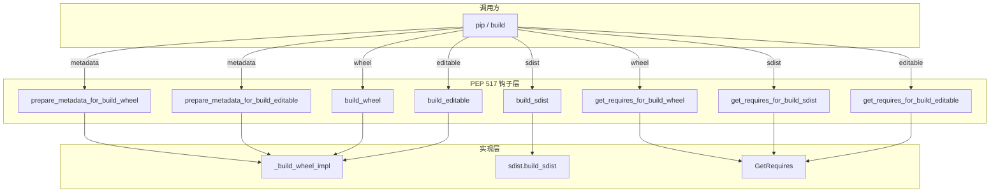

# 核心 API 使用与配置详解

本章系统讲解 scikit-build-core 暴露给下游项目的两类核心接口：**PEP 517 构建后端钩子**与 **`[tool.scikit-build]` 配置项全集**，并给出 `CMakeLists.txt` 集成的标准写法。本章是后续 [04-quickstart-to-advanced.md](04-quickstart-to-advanced.md) 实战章节的理论依据，所有论断均可回溯到 `external/tools/scikit-build-core/src/scikit_build_core/` 下的具体源码行号。

> 阅读建议：如果你只想要"能跑起来"，直接跳到 [CMakeLists.txt 集成示例](#cmakeliststxt-集成示例) 与 [完整最小配置](#完整最小配置示例)；如果你需要做条件配置或动态元数据，重点阅读 [Overrides 系统](#overrides-系统) 与 [动态元数据](#动态元数据) 两节。

## PEP 517 钩子详解

scikit-build-core 把所有 PEP 517/660 钩子集中在 `src/scikit_build_core/build/__init__.py`（共 8 个），下游项目通过 `pyproject.toml` 声明 `build-backend = "scikit_build_core.build"` 后由 `pip`/`build` 调用。下表汇总 8 个钩子的源码锚点与委托目标，随后逐个展开。

| 钩子 | 源码锚点 | 委托目标 | 调用时机 |
|---|---|---|---|
| `build_wheel` | `src/scikit_build_core/build/__init__.py#L45-L58` | `_build_wheel_impl(..., editable=False)` | `pip install`、`python -m build --wheel` |
| `build_editable` | `src/scikit_build_core/build/__init__.py#L61-L74` | `_build_wheel_impl(..., editable=True)` | `pip install -e`、`python -m build --wheel` 配合 editable |
| `prepare_metadata_for_build_wheel` | `src/scikit_build_core/build/__init__.py#L95-L104` | `_build_wheel_impl(None, ...)` | `pip` 探测元数据阶段（仅当 `_has_safe_metadata()` 为真） |
| `prepare_metadata_for_build_editable` | `src/scikit_build_core/build/__init__.py#L106-L116` | 同上，`editable=True` | 同上 |
| `build_sdist` | `src/scikit_build_core/build/__init__.py#L124-L131` | `build.sdist.build_sdist` | `python -m build --sdist` |
| `get_requires_for_build_sdist` | `src/scikit_build_core/build/__init__.py#L134-L150` | `GetRequires.from_config_settings(state="sdist")` | 隔离环境装依赖前 |
| `get_requires_for_build_wheel` | `src/scikit_build_core/build/__init__.py#L173-L176` | `_get_requires_for_build_wheel(state="wheel")` | 同上 |
| `get_requires_for_build_editable` | `src/scikit_build_core/build/__init__.py#L179-L182` | `_get_requires_for_build_wheel(state="editable")` | 同上 |



### build_wheel 钩子

`build_wheel` 是最核心的钩子，负责生成二进制 wheel 文件。签名固定为三参数：

```python
def build_wheel(
    wheel_directory: str,
    config_settings: dict[str, list[str] | str] | None = None,
    metadata_directory: str | None = None,
) -> str:
    ...
```

源码锚点：`src/scikit_build_core/build/__init__.py#L45-L58`。函数体极简，仅做两件事：用 `_exit_on_failed_live_process()` 上下文管理器把 `FailedLiveProcessError` 翻译成 `SystemExit(1)`，再委托给 `build/wheel.py#L215` 的 `_build_wheel_impl(..., editable=False)`，返回 wheel 文件名。完整 8 步构建流程在 `_build_wheel_impl_impl`（`src/scikit_build_core/build/wheel.py#L310`）中实现，详见 [01-concepts-architecture.md](01-concepts-architecture.md) 的"Wheel 构建流程（8 步详解）"。

**直接调用示例**（无隔离环境时可用）：

```python
from scikit_build_core.build import build_wheel

# 在项目根目录执行；dist/ 必须预先存在
import os
os.makedirs("dist", exist_ok=True)
filename = build_wheel("dist/")
print(f"Generated: {filename}")
```

### build_editable 钩子（PEP 660）

`build_editable` 实现 PEP 660 可编辑安装，签名与 `build_wheel` 完全一致，区别仅在内部传 `editable=True`：

源码锚点：`src/scikit_build_core/build/__init__.py#L61-L74`。两种模式由 `editable.mode` 配置项控制：

- `redirect`（默认）：生成 `.pth` 文件 + `_editable_skbc_<pkg>.py` shim，通过 `sys.meta_path` 映射 import；`editable.rebuild=true` 时 import 触发 CMake 重建。实现见 `src/scikit_build_core/build/_editable.py#L48`。
- `inplace`：生成简单 `.pth` 指向源码包目录，不支持 rebuild。

**最小调用示例**：

```python
from scikit_build_core.build import build_editable

build_editable("dist/")
```

### prepare_metadata_for_build_wheel / build_editable

这两个钩子**条件导出**——仅当 `_has_safe_metadata()` 返回 `True` 时才在模块命名空间中存在。源码锚点：`src/scikit_build_core/build/__init__.py#L77-L90`（`_has_safe_metadata` 实现）与 `#L95-L116`（两个 `prepare_metadata_*` 定义）。

`_has_safe_metadata()` 的逻辑：

1. 读 `pyproject.toml`，找不到则返回 `True`（视为安全）。
2. 扫描 `[[tool.scikit-build.overrides]]` 数组，若任一 `if` 含 `failed` 键或 `if.any.failed`，返回 `False`。

禁用原因：当存在 `if.failed=true` override 时，构建失败会触发"回退纯 Python wheel"重试。如果 `prepare_metadata_*` 在 metadata 阶段先跑了一次完整构建并失败，后续 `build_wheel` 的 retry 机制就会失效。禁用 `prepare_metadata_*` 让 `pip` 直接进入 `build_wheel`，由其内部的 retry 逻辑统一处理。

> 调试提示：如果你发现 `pip install` 没有调用 `prepare_metadata_for_build_wheel`，先检查 `pyproject.toml` 中是否存在 `if.failed` override。

### build_sdist 钩子

`build_sdist` 生成源码分发 tarball，签名两参数（无 `metadata_directory`）：

源码锚点：`src/scikit_build_core/build/__init__.py#L124-L131`。委托给 `src/scikit_build_core/build/sdist.py#L129` 的 `build_sdist` 实现。

关键行为：默认 `sdist.cmake=false`（见 `SDistSettings`），即 sdist 阶段**不运行 CMake**，仅打包源码。如果需要在 sdist 阶段运行 CMake（例如生成版本头文件），设置 `sdist.cmake = true`。

**最小调用示例**：

```python
from scikit_build_core.build import build_sdist

build_sdist("dist/")
```

### get_requires_for_build_* 钩子（4 个）

这 4 个钩子返回构建所需的额外依赖列表（PEP 517 隔离环境机制），scikit-build-core 用它**智能注入** `cmake`/`ninja` 依赖。源码锚点：`src/scikit_build_core/build/__init__.py#L134-L182`。

| 钩子 | 行号 | 注入 cmake/ninja 的条件 |
|---|---|---|
| `get_requires_for_build_sdist` | `#L134-L150` | 仅当 `sdist.cmake=true` |
| `get_requires_for_build_wheel` | `#L173-L176` | 仅当 `wheel.cmake=true`（默认 true） |
| `get_requires_for_build_editable` | `#L179-L182` | 同上 |

实现集中在 `src/scikit_build_core/builder/get_requires.py#L56` 的 `GetRequires` 类，提供 `cmake()` / `ninja()` / `variants()` / `dynamic_metadata()` 四个方法。

**关键规则**：`build-system.requires` 中**不要**手动加 `cmake`/`ninja`/`setuptools`/`wheel`。scikit-build-core 会按需自动注入 `cmake`/`ninja`（仅当 `wheel.cmake=true`），例外是 Android/FreeBSD/WebAssembly/ClearLinux 等已装系统版本且无法装 PyPI 包的环境。手动添加会导致版本冲突或冗余下载。

```toml
# pyproject.toml —— 正确写法
[build-system]
requires = ["scikit-build-core>=0.10.5"]
build-backend = "scikit_build_core.build"
```

## 配置项全集

scikit-build-core 的配置系统采用四层架构（详见 [01-concepts-architecture.md](01-concepts-architecture.md) 的"配置系统四层架构"），本节聚焦**用户视角**：每一项配置的含义、默认值与写法。配置项数据模型集中在 `src/scikit_build_core/settings/skbuild_model.py#L815-L935` 的 `ScikitBuildSettings` 主数据类，聚合 12 个子节（`cmake`/`search`/`ninja`/`logging`/`sdist`/`wheel`/`backport`/`editable`/`build`/`install`/`generate`/`messages`）+ `metadata`/`env` 两个 dict 字段 + 顶级字段。

### 配置三层来源

每个配置项都可用三种方式表达，优先级为 **env > config-settings > TOML**（详见 `src/scikit_build_core/settings/sources.py#L1-L79` 的源链 docstring）：

| 来源 | 输入形式 | 编码规则 | 适用场景 |
|---|---|---|---|
| `pyproject.toml` | `[tool.scikit-build]` 嵌套 TOML 表 | 原生 TOML 类型（列表、dict、bool） | 静态首选 |
| config-settings | 扁平点号键 `-Cskbuild.a.b=c` | 列表 `a;b`，dict `k=v;k2=v2` | 动态首选（CI/命令行覆盖） |
| 环境变量 | `SKBUILD_*`（点号变下划线，全大写） | 同 config-settings | 应急用，不推荐常规 |

**同配置三种写法对照**（以 `logging.level` 为例）：

```toml
# pyproject.toml
[tool.scikit-build.logging]
level = "INFO"
```

```bash
# config-settings（命令行）
pip install . -Cskbuild.logging.level=INFO
```

```bash
# 环境变量
SKBUILD_LOGGING_LEVEL=INFO pip install .
```

### 顶层配置项

`ScikitBuildSettings` 顶层字段（非子节）位于 `src/scikit_build_core/settings/skbuild_model.py#L850-L935`：

| 字段 | 类型 | 默认值 | 行号 | 说明 |
|---|---|---|---|---|
| `build-dir` | str | `""` | `#L922` | CMake 构建目录，默认临时目录；设为 `"build/{wheel_tag}"` 可缓存复用 |
| `env` | Dict[str, EnvValue] | `{}` | `#L834-L848` | CMake 子进程环境变量，`setdefault` 语义；`force=true` 强制覆盖（1.0+） |
| `experimental` | bool | `false` | `#L859` | 启用未定稿特性（PEP 817 variants、第三方 metadata provider） |
| `fail` | Optional[bool] | `None` | `#L929` | override-only，立即失败 |
| `metadata` | Dict[str, Dict[str, Any]] | `{}` | `#L829` | legacy 动态元数据表（推荐用 `[[tool.dynamic-metadata]]` 替代） |
| `minimum-version` | Optional[Version] | `None` | `#L912` | 向后兼容版本门，建议设为 `"build-system.requires"` 自动同步 |
| `strict-config` | bool | `true` | `#L850` | 严格校验未知配置项，false 时仅警告 |
| `null-variant` | bool | `false` | `#L900-L910` | PEP 817 实验性，override-only |

> `env` 表的 `setdefault` 语义：仅当环境变量未设置时才注入；若需强制覆盖已有环境变量，用 `{env = "VAR_NAME", default = "fallback", force = true}` 表形式（`EnvValue` 定义于 `src/scikit_build_core/settings/skbuild_model.py#L85-L120`）。

### cmake.\* 配置项

`CMakeSettings` 子节定义于 `src/scikit_build_core/settings/skbuild_model.py#L164`：

| 字段 | 类型 | 默认值 | 说明 |
|---|---|---|---|
| `version` | SpecifierSet | 0.10+ 默认 `"CMakeLists.txt"`，更早 `">=3.15"` | PEP 440 specifier；`"CMakeLists.txt"` 自动读 `cmake_minimum_required` |
| `args` | List[str] | `[]` | 任意 CMake 命令行参数（如 `-G Ninja`） |
| `define` | Dict[str, CMakeSettingsDefine] | `{}` | additive 表，多次累加；bool 自动转 `TRUE`/`FALSE`，list 转分号分隔 |
| `build-type` | str \| List[str] | `"Release"` | CMake build type；列表形式触发多轮配置 |
| `source-dir` | Path | `.` | CMake 源目录 |
| `python-hints` | List[str] | `[]` | 给 FindPython 的提示路径 |

`CMakeSettingsDefine`（`#L61-L82`）是 str 子类型，自动归一化：`true` → `"TRUE"`，`["a","b"]` → `"a;b"`（分号转义）。

**最小示例**：

```toml
[tool.scikit-build.cmake]
version = ">=3.18"
build-type = "Release"
```

**完整示例**：

```toml
[tool.scikit-build.cmake]
version = "CMakeLists.txt"  # 自动从 CMakeLists.txt 读取
source-dir = "src"
build-type = "RelWithDebInfo"
args = ["-Wno-dev"]
define = { BUILD_SHARED_LIBS = "ON", ENABLE_TESTS = false }
```

### ninja.\* 与 search.\* 配置项

`NinjaSettings`（`src/scikit_build_core/settings/skbuild_model.py#L278`）：

| 字段 | 类型 | 默认值 | 说明 |
|---|---|---|---|
| `version` | SpecifierSet | `">=1.5"` | Ninja 版本要求 |
| `make-fallback` | bool | `true` | 找不到 Ninja 时回退到 Make |

`SearchSettings`（`#L270`）：

| 字段 | 类型 | 默认值 | 说明 |
|---|---|---|---|
| `site-packages` | bool | `true` | 把构建环境 site-packages 加入 CMake prefix path，便于 `find_package` 找到已装 Python 包 |

**最小示例**：

```toml
[tool.scikit-build.ninja]
version = ">=1.10"
make-fallback = false

[tool.scikit-build.search]
site-packages = true
```

### sdist.\* 配置项

`SDistSettings` 定义于 `src/scikit_build_core/settings/skbuild_model.py#L323`：

| 字段 | 类型 | 默认值 | 说明 |
|---|---|---|---|
| `include` | List[str] | `[]` | 额外包含文件（gitignore 语法） |
| `exclude` | List[str] | `[]` | 排除文件（gitignore 语法） |
| `inclusion-mode` | Literal | `"default"` | 0.12 新增；`default`/`classic`/`manual` |
| `reproducible` | bool | `true` | 可复现构建（固定时间戳） |
| `cmake` | bool | `false` | sdist 阶段是否运行 CMake |
| `force-include` | Dict[Path, Path] | `{}` | 强制把指定文件包含到 sdist 指定路径 |
| `resolve-symlinks` | bool | `false` | 解析符号链接 |
| `strip` | bool | `false` | 移除测试/缓存等冗余文件 |
| `add` | Dict[Path, Path] | `{}` | 0.12+ 额外添加文件 |

`inclusion-mode` 三种模式：

- `default`（0.12 默认）：不遍历被忽略目录，更快更可预测
- `classic`：0.12 之前的行为，遍历所有目录
- `manual`：完全不读 gitignore，仅按 `include`/`exclude` 显式控制

**最小示例**：

```toml
[tool.scikit-build.sdist]
include = ["include/*.h"]
exclude = ["tests/*"]
reproducible = true
```

### wheel.\* 配置项

`WheelSettings` 定义于 `src/scikit_build_core/settings/skbuild_model.py#L434`，是配置项最多的子节：

| 字段 | 类型 | 默认值 | 说明 |
|---|---|---|---|
| `packages` | List[str] \| Dict[str, str] | `None`（自动发现） | 0.10+ 支持 table 形式映射源→目标 |
| `py-api` | str | `""` | Python ABI tag：`cp38`/`py3`/`py2.py3`/`cp315t` 等 |
| `expand-macos-universal-tags` | bool | `false` | macOS universal2 wheel 标签扩展 |
| `install-dir` | str | `""` | 安装目录，可填 `${SKBUILD_PLATLIB_DIR}` 等前缀 |
| `license-files` | List[str] | `["LICEN[CS]E*"]` | license 文件 glob |
| `cmake` | bool | `true` | 是否运行 CMake；false 则纯 Python wheel |
| `platlib` | bool | `true` | true → platlib，false → purelib |
| `exclude` | List[str] | `[]` | 排除文件 |
| `build-tag` | str | `""` | wheel build tag |
| `force-include` | Dict[Path, Path] | `{}` | 强制包含文件 |
| `reproducible` | bool | `false` | 可复现 wheel（opt-in，默认 false） |

`py-api` 常见取值：

| 取值 | 含义 | 适用场景 |
|---|---|---|
| `cp312` | CPython 3.12 ABI | 普通扩展模块 |
| `py3` | Python 3 纯 ABI | 纯 Python 或 Stable ABI |
| `py2.py3` | Python 2/3 兼容 | 兼容旧项目 |
| `cp38` | Stable ABI（ABI3）起始 3.8 | 一个 wheel 支持多版本 |
| `cp315.cp315t` | free-threaded Stable ABI | Python 3.13+ free-threaded |

**最小示例**：

```toml
[tool.scikit-build.wheel]
py-api = "cp312"
```

**完整示例**：

```toml
[tool.scikit-build.wheel]
packages = ["src/mypackage"]  # 或 {"src/mypackage" = "mypackage"}
py-api = "cp38"               # Stable ABI
cmake = true
platlib = true
license-files = ["LICENSE", "NOTICE"]
exclude = ["**/__pycache__/**"]
reproducible = true
```

### editable.\* 配置项

`EditableSettings` 定义于 `src/scikit_build_core/settings/skbuild_model.py#L636`：

| 字段 | 类型 | 默认值 | 说明 |
|---|---|---|---|
| `mode` | Literal | `"redirect"` | `redirect`（默认）或 `inplace` |
| `verbose` | bool | `true` | rebuild 日志 |
| `rebuild` | bool | `false` | import 时触发 CMake 重建（仅 redirect 模式） |
| `rebuild-dir` | Path | `""` | rebuild 使用的构建目录 |

**最小示例**：

```toml
[tool.scikit-build.editable]
mode = "redirect"
rebuild = true
```

### build.\* / install.\* 配置项

`BuildSettings`（`src/scikit_build_core/settings/skbuild_model.py#L689`）：

| 字段 | 类型 | 默认值 | 说明 |
|---|---|---|---|
| `tool-args` | List[str] | `[]` | 直接传给 `cmake --build` 的参数 |
| `targets` | List[str] | `[]` | 构建目标（空则默认目标） |
| `verbose` | bool | `false` | `cmake --build --verbose` |
| `requires` | List[str] | `[]` | 0.11+ 注入额外 `build-system.requires` |

`InstallSettings`（`#L718`）：

| 字段 | 类型 | 默认值 | 说明 |
|---|---|---|---|
| `components` | List[str] | `[]` | 安装的组件（空则默认组件） |
| `targets` | List[str] | `[]` | 安装目标 |
| `strip` | bool | `true` | 安装时 strip 符号表 |

**最小示例**：

```toml
[tool.scikit-build.build]
verbose = true
targets = ["myext"]

[tool.scikit-build.install]
components = ["Runtime"]
strip = true
```

### generate[] 配置项

`generate` 是数组配置，每项是 `GenerateSettings`（`src/scikit_build_core/settings/skbuild_model.py#L759`）：

| 字段 | 类型 | 默认值 | 说明 |
|---|---|---|---|
| `path` | Path | （必填） | 生成文件路径（相对 platlib） |
| `template` | str | `""` | 模板字符串（与 `template-path` 互斥） |
| `template-path` | Path | `None` | 模板文件路径 |
| `location` | Literal | `"install"` | `install`/`build`/`source` |

模板使用 `string.Template` 语法，可引用 `${metadata}` 字段（如 `${version}`）。`location=source` 会自动加入 `sdist.include` 并覆盖现有文件。

**最小示例**（把版本写入 `_version.py`）：

```toml
[[tool.scikit-build.generate]]
path = "mypackage/_version.py"
template = '''__version__ = "${version}"'''
location = "install"
```

### logging.\* / backport.\* / messages.\* 配置项

`LoggingSettings`（`src/scikit_build_core/settings/skbuild_model.py#L313`）：

| 字段 | 类型 | 默认值 | 说明 |
|---|---|---|---|
| `level` | Literal | `"WARNING"` | `NOTSET`/`DEBUG`/`INFO`/`WARNING`/`ERROR`/`CRITICAL` |

`BackportSettings`（`#L626`）：

| 字段 | 类型 | 默认值 | 说明 |
|---|---|---|---|
| `find-python` | Version | `3.26.1` | 旧 CMake 自动回移植 FindPython 模块的版本 |

`MessagesSettings`（`#L798`）：

| 字段 | 类型 | 默认值 | 说明 |
|---|---|---|---|
| `after-failure` | str | `""` | 构建失败后打印的消息 |
| `after-success` | str | `""` | 构建成功后打印的消息 |

**最小示例**：

```toml
[tool.scikit-build.logging]
level = "INFO"

[tool.scikit-build.backport]
find-python = "3.26.1"

[tool.scikit-build.messages]
after-failure = "Build failed. See https://example.com/troubleshooting"
after-success = "Build succeeded."
```

### variant\*（实验性 PEP 817）

PEP 817 wheel 变体是实验性特性，需 `experimental=true`。四个字段均 `override-only`（不能在静态 `[tool.scikit-build]` 表设置，只能在 override / config-settings / 环境变量中设）。源码锚点：`src/scikit_build_core/settings/skbuild_model.py#L864-L910`。

| 字段 | 类型 | 说明 |
|---|---|---|
| `variant` | List[str] | 变体属性（如 `["cpu :: abi :: cp313"]`） |
| `variant-name` | List[str] | 用于 wheel metadata 选择的变体名 |
| `variant-label` | Optional[str] | wheel 标签覆盖 |
| `null-variant` | bool | null-variant 选择器 |

**示例**（需配合 overrides）：

```toml
[tool.scikit-build]
experimental = true

[[tool.scikit-build.overrides]]
if.variant = ["cpu"]
variant-label = "cpu"
```

## Overrides 系统

Overrides 是 scikit-build-core 的条件配置机制，源码实现在 `src/scikit_build_core/settings/skbuild_overrides.py#L38` 的 `process_overrides`。语法是 `[[tool.scikit-build.overrides]]` 数组，每个元素含 `if` 条件与若干配置覆盖。

### 12 种 if 选择器

按 4 类分组（详见 `src/scikit_build_core/settings/skbuild_schema.py#L106-L173`）：

| 类别 | 选择器 | 匹配方式 |
|---|---|---|
| 版本类 | `scikit-build-version`、`python-version`、`implementation-version`、`system-cmake` | PEP 440 specifier set |
| 字符串类 | `platform-system`、`platform-machine`、`platform-node`、`implementation-name`、`abi-flags`、`state` | 正则匹配 |
| 布尔类 | `from-sdist`、`cmake-wheel`、`failed` | 布尔 |
| 复合类 | `env.<VAR>` | 环境变量正则或布尔 |
| 任一满足 | `if.any.<selector>` | 任一子条件满足即生效 |

`state` 取值：`sdist`/`wheel`/`editable`/`metadata_wheel`/`metadata_editable`。

### inherit 三模式

`inherit`（`src/scikit_build_core/settings/skbuild_schema.py#L174-L177`）控制覆盖是否继承默认值：

| 模式 | 行为 |
|---|---|
| `none`（默认） | 完全替换默认值 |
| `append` | 在默认值后追加 |
| `prepend` | 在默认值前插入 |

### if.failed 失败回退

`if.failed=true`（0.10+）实现"构建失败则回退纯 Python wheel"：第一次构建失败后，scikit-build-core 自动重试一次，此次 `failed=true` 命中 override，可关闭 CMake 改为纯 Python wheel。

> 注意：`if.failed` 会触发 `_has_safe_metadata()` 返回 `False`，从而禁用 `prepare_metadata_*` 钩子（见 [前文](#prepare_metadata_for_build_wheel--build_editable)）。

### 最小示例：按平台条件配置

```toml
[[tool.scikit-build.overrides]]
if.platform-system = "Windows"
cmake.args = ["-G", "Ninja"]
cmake.define = { CMAKE_BUILD_TYPE = "Release" }

[[tool.scikit-build.overrides]]
if.platform-machine = "arm64"
if.platform-system = "Darwin"
cmake.args = ["-DCMAKE_OSX_ARCHITECTURES=arm64"]

[[tool.scikit-build.overrides]]
if.failed = true
wheel.cmake = false  # 回退纯 Python wheel
```

## 动态元数据

scikit-build-core 支持动态元数据：从 git、文件、模板等来源在构建时填充 `project.version`、`project.readme` 等字段。两种声明形式：

- **legacy**：`[tool.scikit-build.metadata]` 表（旧式，仍支持）
- **新式**：`[[tool.dynamic-metadata]]` 数组（dynamic-metadata 0.3+，推荐）

实现集中在 `src/scikit_build_core/build/metadata.py#L53` 的 `get_standard_metadata`。

### 内置 4 个 provider

通过 `dynamic_metadata.provider` 入口点注册（`external/tools/scikit-build-core/pyproject.toml#L95-L98`）：

| provider | 适用字段 | 说明 |
|---|---|---|
| `scikit_build_core.metadata.setuptools_scm` | `version` | 从 git tag 或 `.git_archival.txt` 读版本 |
| `scikit_build_core.metadata.regex` | `version` | 从文件 regex 抽取，支持 `result`/`remove` 后处理（0.10+） |
| `scikit_build_core.metadata.fancy_pypi_readme` | `readme` | 包装 hatch-fancy-pypi-readme |
| `scikit_build_core.metadata.template` | 任意字段 | 引用其他 metadata 字段做模板输出（0.11.2+） |

**setuptools-scm 示例**（从 git tag 读版本）：

```toml
[project]
name = "mypackage"
dynamic = ["version"]

[tool.scikit-build.metadata]
version = { provider = "scikit_build_core.metadata.setuptools_scm" }

[build-system]
requires = ["scikit-build-core", "setuptools-scm"]
```

**regex 示例**（从 `__init__.py` 抽取 `__version__`）：

```toml
[project]
name = "mypackage"
dynamic = ["version"]

[[tool.dynamic-metadata]]
field = "version"
provider = "scikit_build_core.metadata.regex"
input = "src/mypackage/__init__.py"
regex = '__version__ = "(?P<version>[^"]+)"'
```

### build.requires 注入

0.11+ 新增 `build.requires` 字段（`src/scikit_build_core/settings/skbuild_model.py#L689` 的 `BuildSettings`），可在构建时注入额外 `build-system.requires`。常与 overrides 配合：

```toml
[tool.scikit-build.build]
requires = ["pybind11"]

# 源码构建用本地路径，SDist 构建用 PyPI
[[tool.scikit-build.overrides]]
if.state = "sdist"
inherit.build.requires = "none"
build.requires = []  # sdist 不需要 pybind11
```

### generate[] 文件生成

`generate[]` 用 `string.Template` 把 metadata 写到文件，详见 [前文 generate[] 配置项](#generate-配置项)。`location=source` 会自动加入 `sdist.include` 并覆盖现有文件，常用于把版本写到 `_version.py` 以便运行时读取。

```toml
[[tool.scikit-build.generate]]
path = "mypackage/_version.py"
template = '__version__ = "${version}"'
location = "source"
```

### 第三方 provider 注意事项

- 需 `experimental=true`（`src/scikit_build_core/settings/skbuild_model.py#L859`）
- 接口可能在 minor 版本间变化，不保证向后兼容
- 第三方 provider 通过 `dynamic_metadata.provider` 入口点注册，需在 `build-system.requires` 中声明

## CMakeLists.txt 集成示例

scikit-build-core 通过 `${SKBUILD_*}` 变量与 CMakeLists.txt 通信。本节给出全套变量与推荐写法。

### 环境检测变量

| 变量 | 值 | 用途 |
|---|---|---|
| `${SKBUILD}` | `"2"`（classic scikit-build 为 `"1"`） | 检测是否在 scikit-build-core 环境 |
| `${SKBUILD_CORE_VERSION}` | 版本号字符串 | 检测 scikit-build-core 版本 |

```cmake
if(NOT SKBUILD)
    message(FATAL_ERROR "This project must be built with scikit-build-core")
endif()
```

### 项目信息变量

| 变量 | 说明 |
|---|---|
| `${SKBUILD_PROJECT_NAME}` | 项目名（来自 `project.name`） |
| `${SKBUILD_PROJECT_VERSION}` | 四段版本 `major.minor.patch.tweak`（1.0 起限制），可直接喂 `project(VERSION ...)` |
| `${SKBUILD_PROJECT_VERSION_FULL}` | 含 dev/local 后缀的完整版本 |
| `${SKBUILD_STATE}` | 构建状态：`sdist`/`wheel`/`metadata_wheel`/`editable`/`metadata_editable` |

### FindPython 推荐写法

**推荐**：仅请求 `Development.Module`（manylinux 缺 libpython，请求 `Development.Embed` 会失败）。

```cmake
find_package(Python COMPONENTS Interpreter Development.Module REQUIRED)
```

**Stable ABI**：用 `Development.SABIModule`（CMake 3.26+），通过 `${SKBUILD_SABI_COMPONENT}` 与 `${SKBUILD_SABI_VERSION}` 条件注入：

```cmake
# Stable ABI（abi3）
if(DEFINED SKBUILD_SABI_COMPONENT)
    find_package(Python COMPONENTS Interpreter ${SKBUILD_SABI_COMPONENT} REQUIRED)
else()
    find_package(Python COMPONENTS Interpreter Development.Module REQUIRED)
endif()
```

> 禁止用 `Development`（含 `Embed`），manylinux 镜像没有 `libpython`，会配置失败。

### 安装目录变量

| 变量 | 映射目标 | 用途 |
|---|---|---|
| `${SKBUILD_PLATLIB_DIR}` | site-packages（默认） | 扩展模块、Python 包 |
| `${SKBUILD_PURELIB_DIR}` | site-packages | 纯 Python 文件 |
| `${SKBUILD_DATA_DIR}` | 环境根 | 数据文件（慎用，可能污染系统目录） |
| `${SKBUILD_HEADERS_DIR}` | Python include | 头文件 |
| `${SKBUILD_SCRIPTS_DIR}` | bin/Scripts | 可执行脚本 |
| `${SKBUILD_METADATA_DIR}` | dist-info | wheel metadata（仅 wheel 阶段可用） |
| `${SKBUILD_NULL_DIR}` | 丢弃 | 不想安装的中间产物 |

### SOABI 处理

交叉编译时 FindPython 的 `Python_SOABI` 可能错误（如 Apple Silicon 交叉编译）。应使用 `${SKBUILD_SOABI}`：

```cmake
# 覆盖 FindPython 的 SOABI（非官方支持但实际有效）
if(DEFINED SKBUILD_SOABI)
    set(Python_SOABI ${SKBUILD_SOABI})
endif()

python_add_library(myext MODULE WITH_SOABI main.cpp)
```

### 语言助手

两种语言有独立 CMake 助手包，需加入 `build-system.requires`（或 `[tool.scikit-build.build] requires`）：

| 语言 | 助手包 | CMake 用法 |
|---|---|---|
| Cython | `cython-cmake` | `include(UseCython)` + `cython_transpile()` |
| Fortran | `f2py-cmake` | `include(UseF2Py)` |

### 完整最小 CMakeLists.txt 示例

下面是一个可直接复制运行的 C 扩展最小 CMakeLists.txt，覆盖上述所有推荐写法：

```cmake
cmake_minimum_required(VERSION 3.15...4.3)
project(${SKBUILD_PROJECT_NAME} LANGUAGES CXX VERSION ${SKBUILD_PROJECT_VERSION})

# 推荐：仅请求 Development.Module（manylinux 兼容）
find_package(Python COMPONENTS Interpreter Development.Module REQUIRED)

# 扩展模块（WITH_SOABI 让产物带正确 ABI tag）
python_add_library(myext MODULE WITH_SOABI main.cpp)

# 安装到 platlib（默认 → site-packages）
install(TARGETS myext DESTINATION ${SKBUILD_PROJECT_NAME})
```

配合最小 `pyproject.toml`：

```toml
[build-system]
requires = ["scikit-build-core>=0.10.5"]
build-backend = "scikit_build_core.build"

[project]
name = "myext"
version = "0.1.0"

[tool.scikit-build]
minimum-version = "build-system.requires"
```

最小 `main.cpp`：

```cpp
extern "C" {
    static PyObject* hello(PyObject* self, PyObject* args) {
        return PyUnicode_FromString("hello from myext");
    }
    static PyMethodDef methods[] = {
        {"hello", hello, METH_NOARGS, "Say hello"},
        {NULL, NULL, 0, NULL},
    };
    static struct PyModuleDef module = {
        PyModuleDef_HEAD_INIT, "myext", NULL, -1, methods,
    };
    PyMODINIT_FUNC PyInit_myext(void) {
        return PyModule_Create(&module);
    }
}
```

构建并验证：

```bash
pip install build && python -m build
pip install dist/myext-0.1.0-*.whl
python -c "import myext; print(myext.hello())"
# 输出: hello from myext
```

### 完整最小配置示例

把上述 CMake 推荐写法汇总成一个生产可用的最小 `[tool.scikit-build]` 配置：

```toml
[build-system]
requires = ["scikit-build-core>=0.10.5"]
build-backend = "scikit_build_core.build"

[project]
name = "myext"
version = "0.1.0"
requires-python = ">=3.8"

[tool.scikit-build]
minimum-version = "build-system.requires"
build-dir = "build/{wheel_tag}"

[tool.scikit-build.cmake]
version = "CMakeLists.txt"
build-type = "Release"

[tool.scikit-build.wheel]
py-api = "cp312"

[tool.scikit-build.logging]
level = "WARNING"
```

## minimum-version 兼容机制

`minimum-version`（`src/scikit_build_core/settings/skbuild_model.py#L912`）是向后兼容门，控制 scikit-build-core 各版本默认行为的差异。处理逻辑在 `src/scikit_build_core/settings/skbuild_read_settings.py` 的 `_handle_minimum_version`（`#L71`）。

### "build-system.requires" 自动同步

设为 `"build-system.requires"` 时，scikit-build-core 自动读取 `build-system.requires` 中的 `scikit-build-core` 版本 specifier，作为 `minimum-version`。这是**推荐做法**，避免配置与依赖声明脱节：

```toml
[tool.scikit-build]
minimum-version = "build-system.requires"

[build-system]
requires = ["scikit-build-core>=0.10.5"]  # minimum-version 自动同步为 0.10.5
```

### 各版本重要变更

| 版本 | 重要变更 |
|---|---|
| 0.10 | `cmake.minimum-version`/`ninja.minimum-version` 重命名为 `cmake.version`/`ninja.version`；`cmake.verbose`/`cmake.targets` 重命名为 `build.verbose`/`build.targets`；`wheel.packages` 支持 table；新增 `from-sdist`/`system-cmake`/`cmake-wheel`/`failed` override；`minimum-version` 支持 `"build-system.requires"` |
| 0.11 | 新增 `build.requires` 动态注入；`metadata.template` provider；改进 fancy-pypi-readme 版本号支持 |
| 0.12 | 新增 `sdist.inclusion-mode`（默认 `default`）；改进交叉编译；支持 fancy-pypi-readme 25.1；强制规范化 SDist 名 |
| 1.0 | `${SKBUILD_PROJECT_VERSION}` 限制四段；`env` 表加 `force` 字段；PEP 817 variant 字段（experimental） |

### 避免 upper cap 的最佳实践

- **不要**在 `build-system.requires` 中写 upper cap（如 `scikit-build-core<0.13`），这会阻碍用户使用新版本
- 用 `minimum-version = "build-system.requires"` 自动同步，scikit-build-core 内部会处理向后兼容
- 修改 `skbuild_model.py` 后必须运行 `nox -t gen` 重新生成 `resources/scikit-build.schema.json` 与文档 cog 段（`README.md`、`docs/reference/configs.md`）

---

← 上一章：[项目目录结构](02-project-structure.md) | [返回目录](00-overview.md) | 下一章：[入门到进阶指南](04-quickstart-to-advanced.md) →
