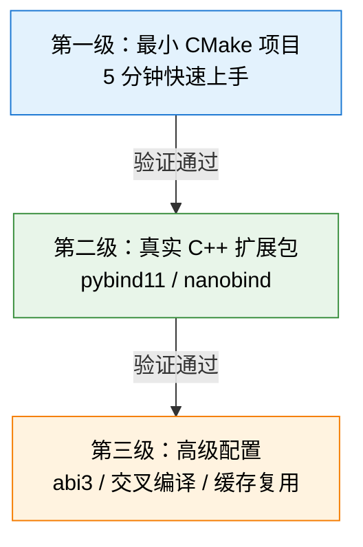
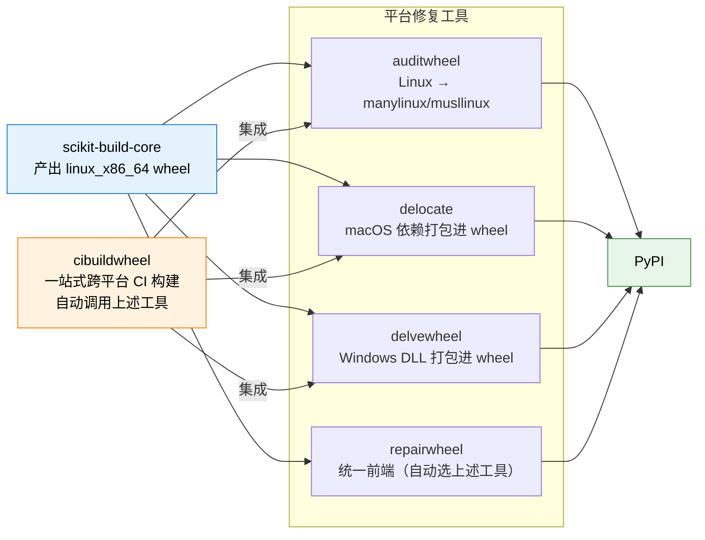

# 从入门到进阶操作指南

本章提供一条**三级递进**的实战路径，让读者从零开始把 scikit-build-core 跑起来，再逐步推进到真实 C++ 扩展包与高级配置。每一级都给出可复制的最小代码与可验证的验收标准，三级之间层层递进、彼此独立可暂停。

> 阅读建议：如果你只想要"跑通第一个 wheel"，直接照搬 [第一级](#第一级最小-cmake-项目5-分钟快速上手) 即可；如果你已经在写 pybind11/nanobind 扩展，跳到 [第二级](#第二级真实-c-扩展包pybind11nanobind)；如果你要发版到 PyPI、做交叉编译或开启 Stable ABI，重点读 [第三级](#第三级高级配置)。配置项的权威说明见 [03 - 核心 API 与配置](03-core-api-and-config.md)，本章节只给"够用最小集"。



---

## 第一级：最小 CMake 项目（5 分钟快速上手）

目标：用最少的代码跑通一次完整的"SDist → Wheel → 安装运行"流程，理解 scikit-build-core 在 PEP 517 链路里的位置。本级的产物是一个会输出 "Hello" 的 C 扩展模块。

### 三种快速启动渠道

不必从空白文件开始。scikit-build-core 1.0 起内置 `init` 脚手架，社区还有三种成熟模板可选（详见 `src/scikit_build_core/init/__main__.py#L45-L61` 的 `_BACKENDS` 字典，共 8 种后端）：

| 渠道 | 命令 | 适用场景 |
|---|---|---|
| scikit-build-core 内置 | `scikit-build init --backend c myproject` | 最快，零外部依赖；交互式选后端 |
| uv | `uv init --lib --build-backend=scikit` | 已用 uv 管理环境；自动生成 `pyproject.toml` |
| scientific-python/cookie | `cookiecutter gh:scientific-python/cookie` | 需要符合 Scientific Python 开发指南全套规范 |
| buildgen | `buildgen new myext -r py/c` | 需要同时生成多种后端的项目骨架 |

> 8 种内置后端：`pybind11`、`nanobind`、`c`、`cython`（需 `cython-cmake`）、`swig`、`fortran`（需 `numpy` + `f2py-cmake`）、`abi3`（设 `wheel.py-api = "cp38"`）、`abi3t`（设 `wheel.py-api = "cp315.cp315t"`）。每种后端模板的依赖与 `tool` 片段在 `src/scikit_build_core/init/__main__.py#L45-L61` 一目了然。

### 最小 pyproject.toml

下面是一个**完整可复制**的 C 扩展最小 `pyproject.toml`（来自 `tests/packages/simplest_c/pyproject.toml` 简化版）：

```toml
[build-system]
requires = ["scikit-build-core"]
build-backend = "scikit_build_core.build"

[project]
name = "myext"
version = "0.1.0"
requires-python = ">=3.8"
```

关键字段说明：

- `build-system.requires = ["scikit-build-core"]`：**不要**手动加 `cmake`/`ninja`/`setuptools`/`wheel`。scikit-build-core 通过 `get_requires_for_build_wheel`（`src/scikit_build_core/build/__init__.py#L173-L176`）智能判断环境并按需注入 `cmake`/`ninja`。例外仅 Android/FreeBSD/WebAssembly/ClearLinux 等无法装 PyPI 版本的系统。
- `build-backend = "scikit_build_core.build"`：8 个 PEP 517 钩子从 `src/scikit_build_core/build/__init__.py#L45-L182` 导出。
- `project.name` 与 `project.version`：PEP 621 元数据。CMake 端通过 `${SKBUILD_PROJECT_NAME}` 与 `${SKBUILD_PROJECT_VERSION}` 读取，避免重复声明。

### 最小 CMakeLists.txt

```cmake
cmake_minimum_required(VERSION 3.15...4.3)
project(${SKBUILD_PROJECT_NAME} LANGUAGES C VERSION ${SKBUILD_PROJECT_VERSION})

# 推荐：仅请求 Development.Module（manylinux 兼容，不依赖 libpython）
find_package(Python COMPONENTS Interpreter Development.Module REQUIRED)

# WITH_SOABI 让产物带正确 ABI tag（Unix 必需，PyPy 缺它无法 import）
python_add_library(myext MODULE WITH_SOABI src/myext.c)

# 安装到 ${SKBUILD_PROJECT_NAME} 包目录（→ site-packages/myext/）
install(TARGETS myext DESTINATION ${SKBUILD_PROJECT_NAME})
```

对应的最小 C 源文件 `src/myext.c`：

```c
#define PY_SSIZE_T_CLEAN
#include <Python.h>

static PyObject* hello(PyObject* self, PyObject* args) {
    return PyUnicode_FromString("Hello from scikit-build-core!");
}

static PyMethodDef methods[] = {
    {"hello", hello, METH_NOARGS, "Return a greeting."},
    {NULL, NULL, 0, NULL},
};

static struct PyModuleDef module = {
    PyModuleDef_HEAD_INIT, "myext", "Minimal example.", -1, methods,
};

PyMODINIT_FUNC PyInit_myext(void) {
    return PyModule_Create(&module);
}
```

包还需要一个空的 `src/myext/__init__.py` 让 Python 把它识别为包：

```python
from ._core import hello  # noqa: F401
```

> 注意：`_core` 是 CMake 编译产物的模块名（`python_add_library(_core ...)`），`__init__.py` 把它重导出为 `myext.hello`。如果 `python_add_library` 直接叫 `myext`，则不需要 `__init__.py` 包装层。

### 构建与安装

三种主流前端，效果等价：

```bash
# 方式 1：pipx run build（推荐，零安装）
pipx run build
# 默认产出 dist/myext-0.1.0.tar.gz 与 dist/myext-0.1.0-cp3XX-*.whl

# 方式 2：uv（最快，自带隔离环境）
uv build

# 方式 3：传统 pip + build
pip install build
python -m build            # 先 SDist 后 Wheel
python -m build --sdist    # 仅 SDist
python -m build --wheel    # 仅 Wheel（从源码直接构建，跳过 SDist）
```

构建产物安装到当前虚拟环境：

```bash
pip install dist/myext-0.1.0-cp3XX-cp3XX-*.whl
python -c "import myext; print(myext.hello())"
# 输出：Hello from scikit-build-core!
```

> `pip` 不能构建 SDist，只有 `build` 工具能。Wheel 构建在隔离环境装 `build-system.requires` 后调用 `build_wheel` 钩子（`src/scikit_build_core/build/__init__.py#L45-L58`），完整 8 步流程在 `_build_wheel_impl_impl`（`src/scikit_build_core/build/wheel.py#L310`）实现。

### 验收标准

第一级通过的标准（全部满足才算合格）：

- 成功生成 `dist/myext-0.1.0.tar.gz`（SDist）
- 成功生成 `dist/myext-0.1.0-cp3XX-*.whl`（Wheel）
- `pip install dist/*.whl` 后 `python -c "import myext; myext.hello()"` 正常输出
- `scikit-build builder` 命令输出 Python/CMake/Ninja 版本信息（CLI 入口 `src/scikit_build_core/__main__.py#L37`）

---

## 第二级：真实 C++ 扩展包（pybind11/nanobind）

第一级用纯 C 演示了构建链路，但真实项目通常用 pybind11 或 nanobind 把 C++ 类/函数暴露给 Python。本级的产物是一个 `add(a, b)` 函数，返回两数之和。

### pybind11 完整示例

下面三件套与官方 [pybind/scikit_build_example](https://github.com/pybind/scikit_build_example) 仓库同步（本地副本位于 `external/tools/scikit-build-core/docs/examples/downstream/pybind11_example/`）。

`pyproject.toml`：

```toml
[build-system]
requires = ["scikit-build-core>=0.3.3", "pybind11"]
build-backend = "scikit_build_core.build"

[project]
name = "scikit_build_example"
version = "0.0.1"
requires-python = ">=3.8"

[tool.scikit-build]
wheel.expand-macos-universal-tags = true
```

`CMakeLists.txt`（来源于 `docs/examples/downstream/pybind11_example/CMakeLists.txt`）：

```cmake
cmake_minimum_required(VERSION 3.15...4.3)
project(${SKBUILD_PROJECT_NAME} VERSION ${SKBUILD_PROJECT_VERSION} LANGUAGES CXX)

find_package(Python REQUIRED COMPONENTS Interpreter Development.Module)
find_package(pybind11 CONFIG REQUIRED)

python_add_library(_core MODULE src/main.cpp WITH_SOABI)
target_link_libraries(_core PRIVATE pybind11::headers)
target_compile_definitions(_core PRIVATE VERSION_INFO=${PROJECT_VERSION})

install(TARGETS _core DESTINATION scikit_build_example)
```

`src/main.cpp`（来源于 `docs/examples/downstream/pybind11_example/src/main.cpp`）：

```cpp
#include <pybind11/pybind11.h>

int add(int i, int j) { return i + j; }

namespace py = pybind11;

PYBIND11_MODULE(_core, m) {
    m.def("add", &add, "Add two numbers");
    m.def("subtract", [](int i, int j) { return i - j; }, "Subtract two numbers");
#ifdef VERSION_INFO
    m.attr("__version__") = VERSION_INFO;
#else
    m.attr("__version__") = "dev";
#endif
}
```

构建与安装：

```bash
pip install build
python -m build
pip install dist/scikit_build_example-0.0.1-*.whl
python -c "from scikit_build_example import _core; print(_core.add(1, 2))"
# 输出：3
```

### nanobind 完整示例

nanobind 是 pybind11 的轻量替代，原生支持 Stable ABI。下面是官方推荐配置（与 `docs/examples/downstream/nanobind_example/` 同步）。

`pyproject.toml`：

```toml
[build-system]
requires = ["scikit-build-core>=0.4.3", "nanobind>=1.3.2"]
build-backend = "scikit_build_core.build"

[project]
name = "nanobind-example"
version = "0.0.1"
requires-python = ">=3.8"

[tool.scikit-build]
# 锁定 scikit-build-core 行为，防止未来版本破坏配置
minimum-version = "0.4"
# 启用本地构建缓存（wheel_tag 维度隔离，多 Python 版本不冲突）
build-dir = "build/{wheel_tag}"
# 在 CPython 3.12+ 上启用 Stable ABI（一个 wheel 支持多版本）
wheel.py-api = "cp312"
```

`CMakeLists.txt`（来源于 `docs/examples/downstream/nanobind_example/CMakeLists.txt`）：

```cmake
cmake_minimum_required(VERSION 3.15...4.3)
project(nanobind_example LANGUAGES CXX)

# OPTIONAL_COMPONENTS Development.SABIModule：旧 CMake 无此组件时退化为普通扩展
find_package(Python 3.8 REQUIRED
    COMPONENTS Interpreter Development.Module
    OPTIONAL_COMPONENTS Development.SABIModule)

find_package(nanobind CONFIG REQUIRED)

nanobind_add_module(nanobind_example_ext
    STABLE_ABI        # 启用 Stable ABI（Python 3.12+ 才生效）
    NB_STATIC         # 静态链接 libnanobind，避免运行时依赖
    src/nanobind_example_ext.cpp)

install(TARGETS nanobind_example_ext LIBRARY DESTINATION nanobind_example)
```

`src/nanobind_example_ext.cpp`（来源于 `docs/examples/downstream/nanobind_example/src/nanobind_example_ext.cpp`）：

```cpp
#include <nanobind/nanobind.h>

namespace nb = nanobind;
using namespace nb::literals;

NB_MODULE(nanobind_example_ext, m) {
    m.def("add", [](int a, int b) { return a + b; }, "a"_a, "b"_a);
}
```

### 8 种语言/绑定后端对照表

scikit-build-core 内置脚手架支持 8 种后端（`src/scikit_build_core/init/__main__.py#L45-L61`）。完整示例库见 [scikit-build/scikit-build-sample-projects](https://github.com/scikit-build/scikit-build-sample-projects)（含 free-threading 案例）。

| 后端 | `build-system.requires` 额外依赖 | CMake 关键模块/函数 | `wheel.py-api` 默认 | 适用场景 |
|---|---|---|---|---|
| **pybind11** | `pybind11` | `find_package(pybind11 CONFIG)` + `pybind11_add_module` 或 `python_add_library` + `pybind11::headers` | `cp3XX` | C++ 大型绑定，需要 STL/智能指针映射 |
| **nanobind** | `nanobind` | `find_package(nanobind CONFIG)` + `nanobind_add_module` | `cp312`（推荐 Stable ABI） | 追求二进制体积与运行时性能 |
| **C** | 无 | `python_add_library(... MODULE WITH_SOABI)` | `cp3XX` | 单文件 C 扩展，无 C++ 依赖 |
| **Cython** | `cython`、`cython-cmake` | `include(UseCython)` + `cython_transpile()` | `cp3XX` | 已有 `.pyx` 代码或纯 Python 性能优化 |
| **SWIG** | `swig` | 手动调用 `swig` 生成 wrapper | `cp3XX` | 多语言绑定（Python + Java + ...）共享一份 SWIG 接口 |
| **Fortran** | `numpy`、`f2py-cmake` | `include(UseF2Py)` + `f2py_add_module` | `cp3XX` | 数值计算包，复用 Fortran 内核 |
| **ABI3** | 无 | `Development.SABIModule` + `python_add_library(... USE_SABI ${SKBUILD_SABI_VERSION})` | `cp38` | 一个 wheel 跨多个 Python 版本 |
| **ABI3t** | 无 | 同 ABI3，附加 `Py_TARGET_ABI3T` 定义（CMake < 4.4 需手动） | `cp315.cp315t` | free-threaded Python 3.15+ Stable ABI |

### 验收标准

第二级通过的标准：

- 成功构建 wheel 并安装到虚拟环境
- `python -c "import <name>; print(<name>._core.add(1, 2))"` 输出 `3`
- `python -c "import <name>; print(<name>._core.__file__)"` 显示 `.so`（Unix）或 `.pyd`（Windows）路径
- Linux 上 `auditwheel show dist/*.whl` 能输出 wheel 标签信息（即使还是 `linux_x86_64` 也算通过）

---

## 第三级：高级配置

第二级跑通后，真实项目还需要解决缓存复用、Stable ABI、交叉编译、可编辑安装、动态元数据、wheel 修复等问题。本节逐项给出最小可用配置。

### 自定义 CMake 选项

`cmake.define` 传递 CMake 变量，`cmake.args` 传递任意 CMake 参数。两者都可在 `pyproject.toml`、config-settings、overrides 中设置（详见 [03 - 核心 API 与配置](03-core-api-and-config.md#cmake-配置项)）。

`pyproject.toml` 写法：

```toml
[tool.scikit-build.cmake.define]
USE_FFTW = true                  # bool 自动归一化为 TRUE/FALSE
SOME_LIST = ["Foo", "Bar"]       # list 自动归一化为分号分隔字符串
```

命令行覆盖（适合 CI 临时切换选项，无需改文件）：

```bash
pip install -Ccmake.define.USE_FFTW=OFF .
```

与 overrides 配合实现条件配置：

```toml
[[tool.scikit-build.overrides]]
if.platform-machine = "arm64"
inherit.cmake.define = "append"  # 在默认 define 基础上追加
[tool.scikit-build.overrides.cmake.define]
USE_NEON = true
```

> `CMakeSettingsDefine`（`src/scikit_build_core/settings/skbuild_model.py#L61-L82`）会自动把 `True/False` 转为 `TRUE/FALSE`、把 list 转为分号分隔字符串。`cmake.define` 是 additive 表，多次设置会累加而非替换。

### Ninja 与多线程构建

scikit-build-core 默认 generator 优先级为 **Ninja > Make > MSVC**（`src/scikit_build_core/builder/generator.py#L39` 的 `parse_generator`）。Ninja 自动按核心数并行编译，无需配置。

显式控制并行度的三种方式：

```bash
# 方式 1：CMake define（推荐用于 pip 命令行）
pip install -Ccmake.define.CMAKE_BUILD_PARALLEL_LEVEL=8 .

# 方式 2：环境变量（推荐用于 CI）
CMAKE_BUILD_PARALLEL_LEVEL=8 pip install .

# 方式 3：转发已有环境变量（推荐用于多项目共享 MAX_JOBS）
```

第三种方式的 `pyproject.toml`：

```toml
[tool.scikit-build.env]
CMAKE_BUILD_PARALLEL_LEVEL = { env = "MAX_JOBS", default = "8" }
```

`env` 表用 `setdefault` 语义：仅当 CMake 子进程环境中未设置该变量时才注入默认值；如需强制覆盖，加 `force = true`。`Builder.__post_init__`（`src/scikit_build_core/builder/builder.py#L213` 附近）在 configure/build/install 之前应用 env 表。

### build-dir 缓存复用

默认 `build-dir = ""`（`src/scikit_build_core/settings/skbuild_model.py#L922`）使用临时目录，每次构建重新 configure，慢但安全。

启用缓存复用：

```toml
[tool.scikit-build]
build-dir = "build/{wheel_tag}"
```

`{wheel_tag}` 占位符按当前 wheel 标签（如 `cp312-cp312-linux_x86_64`）隔离，多 Python 版本不冲突。第二次构建会命中缓存，跳过 configure 步骤，构建时间显著缩短。

> 缓存失效检测由 `.skbuild-info.json` 完成：`CMaker`（`src/scikit_build_core/cmake.py#L102`）在每次构建时写入关键配置（CMake 版本、source-dir、defines 等），下次构建比对，发现变化则视为 stale cache 强制重新 configure。

### abi3（Stable ABI）

Stable ABI（PEP 384）让一个 wheel 同时支持多个 Python 版本，显著减少发布矩阵。配置分两步：

`pyproject.toml`：

```toml
[tool.scikit-build.wheel]
py-api = "cp38"   # 最低支持的 Python 版本，cp38 = Python 3.8+
```

`CMakeLists.txt`（来源于 `tests/packages/abi3_pyproject_ext/CMakeLists.txt`）：

```cmake
cmake_minimum_required(VERSION 3.15...4.3)
project(${SKBUILD_PROJECT_NAME} LANGUAGES C VERSION ${SKBUILD_PROJECT_VERSION})

# ${SKBUILD_SABI_COMPONENT} 在 wheel.py-api 为 cp38 等 Stable ABI 目标时
# 被 Builder.configure（src/scikit_build_core/builder/builder.py#L257）注入为 "Development.SABIModule"
find_package(Python
    COMPONENTS Interpreter Development.Module ${SKBUILD_SABI_COMPONENT}
    REQUIRED)

# USE_SABI 参数取自 ${SKBUILD_SABI_VERSION}（如 3.8）
if(NOT "${SKBUILD_SABI_VERSION}" STREQUAL "")
    python_add_library(myext MODULE WITH_SOABI USE_SABI ${SKBUILD_SABI_VERSION} src/myext.c)
else()
    python_add_library(myext MODULE WITH_SOABI src/myext.c)
endif()

install(TARGETS myext DESTINATION ${SKBUILD_PROJECT_NAME})
```

> Stable ABI 不支持 PyPy（PyPy 没有 Limited API），需要为 PyPy 单独构建普通 wheel。

### abi3t（free-threaded Stable ABI）

PEP 703 的 free-threaded 模式（Python 3.13+ 实验，3.15 正式）需要 `abi3t` 后端。scikit-build-core 1.0 起支持。

`pyproject.toml`：

```toml
[tool.scikit-build.wheel]
# 一个 free-threaded build 同时产出 cp315-abi3.abi3t 标签
# 可在 CPython 3.15+ 的 GIL 与 free-threaded 两种模式上加载
py-api = "cp315.cp315t"
```

`CMakeLists.txt` 关键差异：

```cmake
# USE_SABI 取 ${SKBUILD_SABI_VERSION}，对 abi3t 自动为 3.15
python_add_library(myext MODULE WITH_SOABI USE_SABI ${SKBUILD_SABI_VERSION} src/myext.c)

# CMake < 4.4 无 abi3t 感知，需手动定义 Py_TARGET_ABI3T
if(NOT CMAKE_VERSION VERSION_GREATER_EQUAL "4.4")
    target_compile_definitions(myext PRIVATE Py_TARGET_ABI3T)
endif()
```

> Windows 特殊处理：free-threaded 构建需手动 `Py_GIL_DISABLED` C 定义。两套构建（GIL/free-threaded）共享配置文件，Python 无法自动设置，必须由 CMake 端显式区分。

### 交叉编译

scikit-build-core 内置三类交叉编译场景：

**Apple Silicon（M1/M2）**：

```bash
# 单架构交叉编译（Intel Mac 上构建 arm64 wheel）
ARCHFLAGS="-arch arm64" pip install .

# Universal2（同时含 x86_64 + arm64）
ARCHFLAGS="-arch arm64 -arch x86_64" python -m build
```

`ARCHFLAGS` 由 `Builder.configure` 解析为 `CMAKE_OSX_ARCHITECTURES`，macOS 版本字符串归一化由 `src/scikit_build_core/builder/macos.py` 的 `normalize_macos_version` 处理。

**Windows ARM**：

```bash
# _PYTHON_HOST_PLATFORM 触发交叉编译模式
set _PYTHON_HOST_PLATFORM=win32
pip install .
```

**WebAssembly/Emscripten/Pyodide**：在 Pyodide 构建环境中直接 `pip install .`，scikit-build-core 自动识别 Emscripten 工具链。

> 交叉编译时 FindPython 的 `Python_SOABI` 可能错误（如报告宿主平台 SOABI 而非目标平台）。应使用 `${SKBUILD_SOABI}`，或显式覆盖：`set(Python_SOABI ${SKBUILD_SOABI})`。

### 可编辑安装进阶

`editable.mode`（`src/scikit_build_core/settings/skbuild_model.py#L636-L637`）控制两种模式：

```toml
[tool.scikit-build.editable]
mode = "redirect"   # 默认：生成 .pth + _editable_skbc_<pkg>.py shim
rebuild = true      # import 时触发 CMake 重建（必须配 build-dir）
verbose = true      # 显示重建日志
```

| 模式 | 工作原理 | 适用场景 |
|---|---|---|
| `redirect`（默认） | `.pth` 文件 + `_editable_skbc_<pkg>.py` shim，通过 `sys.meta_path` 映射 import；支持 `rebuild=true` | 日常开发，需要边改源码边测试 |
| `inplace` | 简单 `.pth` 指向源码包目录；不支持 CMake 重建 | 已有独立构建步骤，只需 Python 端可编辑 |

`rebuild=true` 必须配合 `build-dir`（`EditableSettings` 的 docstring 明确指出）。实现见 `src/scikit_build_core/build/_editable.py#L48` 的 `editable_redirect`。

```bash
pip install -e . -Ceditable.rebuild=true
# 修改 src/main.cpp 后，下次 import 自动触发 CMake 增量编译
```

### 动态元数据实战

三种最常见场景：

**setuptools-scm 集成**（git 项目，从 tag 读版本）：

```toml
[project]
name = "myext"
dynamic = ["version"]

[tool.scikit-build.metadata.version]
provider = "scikit_build_core.metadata.setuptools_scm"
# 从 git tag 或 .git_archival.txt（SDist 中）读取
```

**regex provider**（非 git 项目，从 `__init__.py` 抽取 `__version__`）：

```toml
[tool.scikit-build.metadata.version]
provider = "scikit_build_core.metadata.regex"
input = "src/myext/__init__.py"
regex = '__version__\s*=\s*"(?P<value>[^"]+)"'
```

**generate[] 文件生成**（把版本写入 `_version.py` 供运行时读取）：

```toml
[[tool.scikit-build.generate]]
path = "src/myext/_version.py"
template = '__version__ = "${version}"'
location = "source"   # 写入源码树，自动加入 sdist.include
```

> 第三方 provider 需 `experimental = true`（`src/scikit_build_core/settings/skbuild_model.py#L859`），接口可能在 minor 版本间变化。

### Wheel 修复与分发

scikit-build-core 默认产出的 Linux wheel 标签是 `linux_x86_64`，**不能上 PyPI**（PyPI 拒绝 `linux_*` 标签）。必须用工具修复为 `manylinux_*` 或 `musllinux_*`。



平台对应的修复工具：

| 平台 | 工具 | 输出标签 |
|---|---|---|
| Linux | `auditwheel repair dist/*.whl` | `manylinux_*` / `musllinux_*` |
| macOS | `delocate dist/*.whl` | `macosx_*`（含 universal2） |
| Windows | `delvewheel repair dist/*.whl` | `win_*` |
| 任意 | `repairwheel repair dist/*.whl` | 自动选择上述工具 |

**cibuildwheel 一站式方案**（推荐）：在 GitHub Actions 矩阵构建所有平台 wheel，自动调用对应修复工具。最小配置示例：

```yaml
# .github/workflows/build.yml
jobs:
  build_wheels:
    runs-on: ${{ matrix.os }}
    strategy:
      matrix:
        os: [ubuntu-latest, macos-latest, windows-latest]
    steps:
      - uses: actions/checkout@v4
      - uses: pypa/cibuildwheel@v2.20
        env:
          CIBW_BUILD: "cp38-* cp39-* cp310-* cp311-* cp312-* cp313-*"
      - uses: actions/upload-artifact@v4
        with:
          name: wheels
          path: wheelhouse/*.whl
```

对应的 `pyproject.toml` cibuildwheel 段（参考 `docs/examples/downstream/pybind11_example/pyproject.toml`）：

```toml
[tool.cibuildwheel]
test-command = "pytest {project}/tests"
test-extras = ["test"]
test-skip = "*universal2:arm64"
build-verbosity = 1
```

### 验收标准

第三级通过的标准（按需选做，至少完成 3 项）：

- `build-dir` 配置后第二次构建时间显著缩短（cache hit，可观察日志中跳过 configure）
- abi3 wheel 在多个 Python 版本（3.8+）下均可 `pip install` 并运行
- 交叉编译 wheel 在目标平台可安装运行（如 Intel Mac 构建的 arm64 wheel 在 M1 Mac 上运行）
- `editable.rebuild=true` 修改源码后 `import` 触发自动重建（日志可见 CMake 增量编译输出）
- `cibuildwheel` 在 GitHub Actions 成功构建多平台 wheel（Linux/macOS/Windows 全绿）

---

← 上一章：[核心 API 与配置](03-core-api-and-config.md) | [返回目录](00-overview.md) | 下一章：[常见问题与最佳实践](05-faq-and-best-practices.md) →
