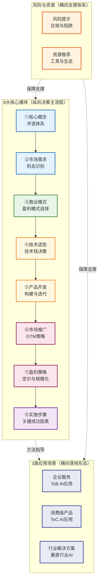
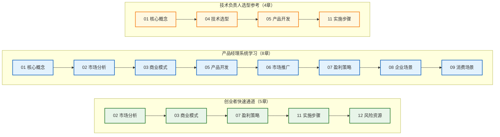

# AI变现完整指南：从技术到商业的全流程方法论

## 引言

近两年大模型与生成式 AI 的爆发，让"AI 变现"从概念走向落地成为可能。然而在工程实践中，研发团队与商业团队普遍面临三类痛点：

- **资料碎片化**：英文资料散落在 Anthropic、OpenAI、a16z、Sequoia 等厂商与机构的博客白皮书中，缺少中文系统化整合；中文社区内容多停留在"案例科普"层面，缺乏可操作的方法论。
- **认知断层**：技术团队懂模型不懂商业，业务团队懂需求不懂技术边界，导致 AI 产品的技术能力与商业模式错配，立项即埋雷。
- **路径不清**：从市场需求识别、商业模式选择、技术选型、产品开发、市场推广到盈利规模化，缺乏一条贯通的全流程主线，团队在"做完 demo 就卡住"和"上线后无法盈利"之间反复横跳。

本指南定位为**面向中文从业者的 AI 商业化全流程方法论**，目标不是罗列案例，而是建立一套可复用的决策框架：将"AI 变现"拆解为 8 大核心模块、3 类应用场景与 1 套风险资源保障体系，覆盖从概念界定到规模化盈利的完整链路。每一章都聚焦"如何决策"而非"如何做 demo"，帮助读者在选型、立项、研发、上线、变现的每个关键节点做出可解释、可审计的判断。

## 指南全景图

本指南由三条主线交织构成：纵向 8 大核心模块构成从概念到规模化的决策主流程；横向 3 类应用场景将方法论投射到 ToB、ToC、垂直行业三类典型落地形态；底部风险与资源体系为全流程提供横向支撑。

阅读全景图时把握三条线索：纵向模块回答"按什么顺序决策"，横向场景回答"决策在不同业务形态下如何变形"，底部支撑回答"决策过程中如何规避风险与调用资源"。

## 8大核心模块全景表

下表提炼每个模块要回答的核心问题与产出物，作为快速对齐认知的索引。

| # | 模块 | 核心问题 | 关键产出 |
|---|------|---------|---------|
| ① | 核心概念界定 | AI 变现涉及哪些术语？边界在哪？ | 统一术语表，避免沟通歧义 |
| ② | 市场需求分析 | 哪些 AI 机会值得做？如何评估？ | 机会评估矩阵与优先级排序 |
| ③ | 商业模式设计 | 用什么方式赚钱？模式如何选？ | 商业模式画布与盈利模式决策 |
| ④ | 技术选型 | 选什么模型、什么栈、自研还是调用？ | 技术栈决策框架与成本模型 |
| ⑤ | 产品开发 | 如何构建可迭代的 AI 产品？ | MVP 定义、数据飞轮与迭代流程 |
| ⑥ | 市场推广 | 如何把产品推向目标客户？ | GTM 策略与渠道组合 |
| ⑦ | 盈利策略 | 如何定价、如何规模化？ | 定价模型与规模化路径 |
| ⑧ | 实施步骤 | 落地分几步？关键成功因素是什么？ | 实施路线图与 KSF 清单 |

## 目标读者

本指南面向以下四类核心读者，每类读者可从不同章节切入：

- **AI 创业者 / 联合创始人**：需要从 0 到 1 跑通商业闭环，关注市场机会、商业模式、盈利策略与实施步骤。痛点是技术投入与商业回报不匹配，需要可审计的决策依据支撑融资与团队配置。
- **产品经理 / AI 产品负责人**：需要将 AI 能力转化为可商业化产品，关注需求分析、产品开发、市场推广与场景落地。痛点是 AI 产品的非确定性输出与传统软件交付模式的冲突，需要可迭代的研发与定价方法。
- **技术负责人 / 算法工程师**：需要在有限资源下做出技术选型与架构决策，关注技术选型、产品开发与实施步骤。痛点是模型能力边界、推理成本与工程稳定性的平衡，需要量化的技术决策框架。
- **投资人 / 战略规划者**：需要评估 AI 项目的商业可行性与规模化潜力，关注市场分析、商业模式与盈利策略。痛点是 AI 叙事泡沫与真实商业价值的辨识，需要可量化的评估维度。

## 阅读路径指南

不同读者可按角色选择最短路径切入。三条路径用颜色区分：绿色为创业者快速通道，蓝色为产品经理系统学习，黄色为技术负责人选型参考。

三条路径的设计逻辑：创业者优先打通"商业闭环"主线，弱化技术细节；产品经理覆盖"概念—市场—产品—场景"完整链条，强调系统性；技术负责人聚焦"概念—选型—开发—落地"主线，避免陷入商业细节。投资人可参照创业者快速通道，重点关注 02、03、07 三章。

## 13章完整导航表

下表列出本指南全部 13 章及内容简介，作为读者跳转的完整索引。

| 章节 | 标题 | 内容简介 |
|------|------|---------|
| [00](00-overview.md) | AI变现完整指南：从技术到商业的全流程方法论 | 指南总览，8 大模块全景、3 类场景、阅读路径与 13 章导航 |
| [01](01-core-concepts.md) | 核心概念界定：AI变现术语体系 | AI、模型、Agent、变现、商业化等核心术语界定与边界澄清 |
| [02](02-market-analysis.md) | 市场需求分析：识别与评估AI商业化机会 | AI 市场机会识别方法、需求评估矩阵与优先级排序框架 |
| [03](03-business-models.md) | 商业模式设计：AI产品的盈利模式选择 | SaaS、API、订阅、按量计费、分润等商业模式对比与决策 |
| [04](04-tech-selection.md) | 技术选型：AI技术栈决策框架 | 大模型选型、自研 vs 调用、推理成本、向量库、编排框架决策 |
| [05](05-product-development.md) | 产品开发：AI产品的构建与迭代流程 | MVP 定义、数据飞轮、评估体系、灰度迭代与质量保障流程 |
| [06](06-marketing-strategy.md) | 市场推广：AI产品的GTM策略 | AI 产品的目标客户定位、渠道组合、内容营销与销售策略 |
| [07](07-profitability-strategy.md) | 盈利策略：定价模型与规模化路径 | AI 产品定价模型、单位经济模型、规模化扩张与利润优化 |
| [08](08-scenario-enterprise.md) | 企业服务场景：ToB AI应用变现路径 | ToB AI 应用的客户画像、销售模式、交付与续费策略 |
| [09](09-scenario-consumer.md) | 消费级产品场景：ToC AI应用变现路径 | ToC AI 应用的获客、留存、付费转化与商业模式 |
| [10](10-scenario-industry.md) | 行业解决方案场景：垂直行业AI变现路径 | 医疗、金融、教育、制造等垂直行业的 AI 变现路径 |
| [11](11-implementation-steps.md) | 实施步骤与关键成功因素 | 从立项到规模化的实施路线图与 KSF 清单 |
| [12](12-risks-resources.md) | 风险提示与资源推荐 | 合规风险、技术陷阱、市场风险与工具生态资源推荐 |

---

**下一章**：[01 - 核心概念界定：AI变现术语体系](01-core-concepts.md)
