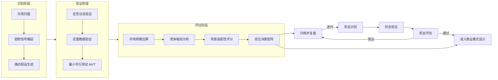

# 市场需求分析：识别与评估AI商业化机会

AI 商业化的起点不是技术，而是真实且可规模化的需求。本章提供一套从机会识别到落地评估的完整方法论，帮助你在投入研发资源前，系统性地回答三个问题：**需求是否真实？市场是否够大？我们能否赢？**

## 0. 方法论总览：机会识别 → 验证 → 评估

完整的 AI 商业化机会评估遵循三阶段闭环。每个阶段都有明确的产出物和"通过/淘汰"判定标准，避免在伪需求上消耗资源。



**关键原则**：
- **假设驱动**：每个机会都以"可证伪假设"形式记录，而非模糊愿景
- **成本意识**：验证阶段的成本应低于研发成本的 5%，否则验证本身失去意义
- **退出机制**：每个阶段设定明确的淘汰标准，避免沉没成本陷阱

---

## 1. 市场调研方法

### 1.1 定量调研 vs 定性调研

AI 产品的市场调研与传统软件有本质差异：AI 产品的价值往往建立在用户**尚未意识到**的需求上（潜在需求），单纯依赖问卷会严重低估市场潜力。因此需要定量与定性结合，先用定性挖掘需求，再用定量验证规模。

| 维度 | 定量调研 | 定性调研 |
|------|---------|---------|
| **核心目标** | 验证假设、量化规模 | 发现未知、理解动机 |
| **典型方法** | 问卷、数据分析、A/B 测试 | 深度访谈、焦点小组、田野观察 |
| **样本规模** | 数百至数万 | 5-30 人 |
| **数据形态** | 结构化数值、统计指标 | 文本、行为、情境描述 |
| **结论性质** | 可推广的统计结论 | 启发性的深度洞察 |
| **适用阶段** | 验证期、规模化期 | 探索期、概念期 |
| **AI 场景要点** | 需测量用户对 AI 输出的满意度分布 | 需观察用户与 AI 交互时的真实行为 |

### 1.2 三大定量方法在 AI 场景的应用

**问卷调研**：适用于验证已有用户群体的需求强度。AI 场景下需特别注意问卷设计陷阱——用户对 AI 能力的认知滞后会导致需求被低估。建议在问卷前先做 1-2 个能力演示视频，再询问付费意愿。

**数据分析**：基于现有产品埋点或公开数据集分析。AI 场景下重点关注三类信号：用户重复使用频率（粘性）、任务完成时间缩短比例（效率提升）、人工干预率（自动化程度）。

**A/B 测试**：最可靠的验证方式，但对 AI 产品有特殊要求——AI 输出具有非确定性，相同输入可能产生不同结果，因此需要更大的样本量和更长的观察周期（通常 ≥2 周）。

### 1.3 三大定性方法在 AI 场景的应用

**深度访谈**：探索用户对 AI 的真实态度（信任、恐惧、期待）。关键技巧是避免引导性提问，例如不要问"你觉得 AI 能帮你写报告吗"，而应问"你上次写报告时最痛苦的是什么"。

**焦点小组**：适用于评估 AI 产品的概念接受度。注意群体效应——技术乐观者会主导讨论，需主持人主动平衡发言。

**田野观察**：观察用户在实际工作场景中的行为，发现用户自己无法言明的需求。这是 AI 产品调研最有价值的方法，因为 AI 的最大机会往往藏在用户"习以为常"的低效环节中。

---

## 2. 用户需求挖掘

### 2.1 需求挖掘方法对比

| 方法 | 核心工具 | 适用场景 | 产出物 | 局限性 |
|------|---------|---------|--------|--------|
| **用户访谈** | 5Whys、JTBD 框架 | 探索深层动机 | 用户故事、痛点清单 | 样本量小、主观偏差 |
| **问卷调研** | Likert 量表、MaxDiff | 验证需求广度 | 需求强度排名、付费意愿 | 无法挖掘深层原因 |
| **数据洞察** | 埋点、漏斗、留存分析 | 验证行为假设 | 转化漏斗、留存曲线 | 只反映"做了什么"不反映"为什么" |

**最佳实践**：三类方法配合使用——访谈发现假设，问卷验证广度，数据洞察确认行为真实性。当三者结论一致时，需求可信度最高。

### 2.2 用户访谈技巧

#### 5Whys 深挖法

5Whys 用于挖掘表面需求背后的真实动机。关键原则：每次追问都要基于用户的上一个回答，而非预设路径。

```
用户："我需要一个 AI 帮我整理会议纪要。"
Why 1："为什么需要 AI 整理？"
用户："因为手动整理太花时间。"
Why 2："整理花多少时间？主要花在哪？"
用户："大概 1 小时，主要在提炼行动项。"
Why 3："为什么提炼行动项这么难？"
用户："因为会上讨论发散，我得重新听录音确认。"
Why 4："为什么不边开会边记录？"
用户："我是会议主持，没法同时做记录。"
Why 5："如果 AI 能实时生成行动项，你愿意付多少？"
用户："每月 200 元以内可以接受。"

→ 真实需求：会议主持场景下的实时行动项提取，付费意愿 200 元/月
```

#### JTBD（Jobs To Be Done）框架

JTBD 关注用户"雇佣"产品要完成的任务，而非产品功能本身。AI 产品的 JTBD 分析应特别关注三类任务：

- **功能性任务**：用户要完成的具体工作（如"在 1 小时内写出周报"）
- **情感性任务**：用户希望获得的感受（如"显得专业且有条理"）
- **社会性任务**：用户希望在他人眼中的形象（如"被领导认可为高效员工"）

AI 的差异化机会常出现在情感性与社会性任务上——这是传统工具难以满足的维度。

### 2.3 问卷设计要点

AI 产品问卷设计的三大陷阱：

1. **能力幻觉**：用户看到 AI 演示后会高估其能力，导致需求虚高。对策：在付费意愿问题前设置"能力边界认知"问题
2. **价格锚定**：先问价格会锚定后续回答。对策：价格问题放在问卷最后，且使用 Van Westendorp 价格敏感度测试
3. **社会期望偏差**：用户倾向于给出"政治正确"的答案。对策：使用间接提问法（"你的同事会怎么用"而非"你会怎么用"）

### 2.4 数据洞察三件套

**埋点设计**：AI 产品需埋点的关键事件包括——AI 调用次数、AI 输出采纳率、用户编辑 AI 输出的比例、重试次数。这些指标直接反映 AI 产品的真实价值。

**漏斗分析**：识别用户从"首次使用"到"持续使用"的流失节点。AI 产品的典型漏斗：注册 → 首次体验 AI → 看到价值 → 二次使用 → 付费转化。

**留存分析**：AI 产品的健康留存曲线应为"微笑曲线"——首日留存较低（用户在摸索用法），3-7 日留存回升（用户发现价值），30 日留存趋于稳定。若留存持续下降，说明 AI 输出未创造真实价值。

---

## 3. 竞争格局分析

### 3.1 波特五力模型在 AI 场景的应用

波特五力模型在 AI 行业需要重新解读——AI 的"力量"动态性远高于传统行业，技术突破可能在 6 个月内重塑竞争格局。

| 五力 | 传统解读 | AI 场景特殊解读 | 评估关键问题 |
|------|---------|----------------|-------------|
| **供应商议价能力** | 上游供应商控制成本 | 算力/模型 API 供应商（如 OpenAI、Anthropic）锁定定价权 | 是否有自研模型或多供应商策略？ |
| **购买者议价能力** | 客户集中度高则议价强 | 转换成本低，用户可快速迁移 | 数据资产是否能形成切换壁垒？ |
| **潜在进入者威胁** | 资本与渠道门槛 | 开源模型大幅降低进入门槛 | 是否有数据/场景/合规的护城河？ |
| **替代品威胁** | 替代产品满足相同需求 | 人工流程、规则引擎、传统 SaaS | AI 方案相比替代品的 10 倍优势在哪？ |
| **行业竞争强度** | 现有竞争者数量与实力 | 巨头（Google/Microsoft/字节）直接下场 | 巨头是否会进入这个细分场景？ |

**AI 场景的第六力——技术颠覆力**：建议补充评估"基础模型能力跃迁"对业务的颠覆风险。例如，GPT-5 的发布可能让基于 GPT-4 微调的产品瞬间失去差异化。

### 3.2 竞品矩阵构建（四维度）

构建竞品矩阵时，从四个维度系统化对比：

- **功能维度**：核心功能覆盖度、AI 能力深度、集成生态
- **定价维度**：定价模式（订阅/按量/永久）、价格区间、免费额度
- **技术维度**：底层模型、推理速度、上下文窗口、定制化能力
- **数据维度**：训练数据规模、领域数据壁垒、用户反馈数据闭环

### 3.3 差异化定位识别

差异化定位的三个层次（从低到高）：

1. **功能差异化**（最易被复制）：某项功能比别人强
2. **场景差异化**（中等壁垒）：深耕某个垂直场景，理解行业 know-how
3. **数据差异化**（最高壁垒）：拥有别人无法获取的数据资产，形成数据飞轮

**AI 产品的差异化优先级**：数据差异化 > 场景差异化 > 功能差异化。若三者皆无，不建议进入该市场。

---

## 4. 市场规模估算

### 4.1 TAM / SAM / SOM 定义

- **TAM（Total Addressable Market，总可达市场）**：整个市场若 100% 渗透的规模
- **SAM（Serviceable Available Market，可服务市场）**：你的产品定位能覆盖的市场细分
- **SOM（Serviceable Obtainable Market，可获取市场）**：在 3-5 年内实际能拿到的市场份额

### 4.2 三种估算方法

#### 方法一：自上而下（Top-Down）

从行业总规模出发，逐层切分到目标市场。

```
示例：估算"AI 会议纪要 SaaS"的 SOM

行业总规模（全球 SaaS 市场）：2000 亿美元
→ 协作 SaaS 细分：200 亿美元（10%）
→ 会议协作细分：40 亿美元（20%）
→ AI 增强会议纪要细分：4 亿美元（10%）
→ 中国市场：0.8 亿美元（20%）
→ 3 年内可获取份额（SOM）：800 万美元（10%）
```

**优点**：快速、数据易获取。**局限**：每层切分假设的误差会累积放大。

#### 方法二：自下而上（Bottom-Up）

从目标用户数 × 单用户价值出发估算。

```
示例：估算"AI 会议纪要 SaaS"在中国的 SOM

目标用户：中国 500 人以上企业约 5000 家
→ 渗透率假设：3 年内 20% 采用 = 1000 家
→ ARPU（年均付费）：3 万元/家
→ SOM = 1000 × 3 万 = 3000 万元人民币
```

**优点**：更贴近实际、假设可追溯。**局限**：依赖渗透率假设的准确性。

#### 方法三：价值理论法（Value Theory）

基于产品为用户创造的价值估算定价空间。

```
示例：估算"AI 会议纪要 SaaS"的定价上限

用户场景：每周 3 次会议，每次会议后整理 1 小时
→ 年节省时间：3 × 1 × 48 周 = 144 小时
→ 用户时薪（目标用户中层管理者）：300 元/小时
→ 年创造价值：144 × 300 = 43200 元
→ 定价上限（取价值的 10-20%）：4320 - 8640 元/年
```

**优点**：定价有理论依据。**局限**：用户感知价值低于实际价值，需打折。

### 4.3 AI 市场估算的特殊性

AI 市场估算需额外考虑三个不确定性因素：

1. **技术不确定性**：模型能力迭代速度不可预测，可能突然扩大或缩小市场。对策：设定乐观/中性/悲观三套假设
2. **渗透率假设**：AI 产品的采用曲线可能呈"S 型"而非线性——早期缓慢，突破临界点后爆发。对策：参考类似技术（如云计算）的历史采用曲线
3. **价格侵蚀**：基础模型成本下降会传导到终端价格。对策：估算时假设年降价 20-30%

**估算结果呈现建议**：永远给出区间而非点估计，例如"SOM 为 800-3000 万元人民币（3 年内）"，并标注关键假设。

---

## 5. AI 场景适配性评估框架

### 5.1 五维度评估矩阵

在完成市场调研和规模估算后，需要对具体 AI 场景进行适配性评估。以下框架从五个维度打分（每维度 1-5 分），帮助量化决策。

| 维度 | 权重 | 1 分（极差） | 3 分（中等） | 5 分（优秀） |
|------|------|-------------|-------------|-------------|
| **技术可行性** | 25% | 现有模型完全无法实现 | 需大量微调与工程优化 | 现成模型即可达到可用水平 |
| **数据可得性** | 25% | 数据稀缺且无法获取 | 公开数据可用但质量一般 | 拥有独家高质量数据资产 |
| **商业价值** | 20% | 价值低，用户付费意愿弱 | 中等价值，有替代方案 | 高价值，用户无替代选择 |
| **竞争强度** | 15% | 巨头已主导，红海市场 | 有竞争但未饱和 | 蓝海市场，先发优势明显 |
| **合规风险** | 15% | 高风险（医疗/金融/司法） | 中等风险需合规设计 | 低风险（内部工具/非决策类） |

**综合评分公式**：`总分 = Σ(各维度得分 × 权重)`，满分 5 分。

**决策阈值建议**：
- **≥4.0 分**：优先投入，快速验证
- **3.0-4.0 分**：谨慎投入，先做 MVP 验证薄弱维度
- **<3.0 分**：暂不投入，归档观察

### 5.2 评估示例：三个场景对比

| 评估维度 | AI 法律合同审查 | AI 心理健康陪伴 | AI 内部知识库问答 |
|---------|----------------|----------------|------------------|
| 技术可行性 | 4（LLM 已能理解法律文本） | 3（情感理解仍有局限） | 5（RAG 技术成熟） |
| 数据可得性 | 3（合同数据分散） | 2（隐私数据难获取） | 4（企业内部可控） |
| 商业价值 | 5（律师时薪高，价值显著） | 4（心理咨询需求旺盛） | 3（提效但难单独定价） |
| 竞争强度 | 3（已有 Harvey 等玩家） | 4（赛道尚早期） | 2（大厂通用产品挤压） |
| 合规风险 | 2（法律建议高风险） | 1（心理健康高风险） | 4（内部使用低风险） |
| **加权总分** | **3.45** | **2.80** | **3.65** |

**评估结论**：
- AI 内部知识库问答（3.65 分）——优先投入，合规风险低且技术成熟
- AI 法律合同审查（3.45 分）——谨慎投入，需重点解决合规问题
- AI 心理健康陪伴（2.80 分）——暂不投入，合规与数据双重瓶颈

### 5.3 评估框架使用建议

1. **多人独立评分**：至少 3 位团队成员独立打分后取平均，减少个人偏差
2. **定期复评**：AI 领域变化快，建议每季度复评一次，技术可行性维度尤其需要更新
3. **记录评分依据**：每个评分需附简短理由，便于复盘评分准确性
4. **权重可调**：不同企业战略下权重应调整——技术驱动型公司可提高技术可行性权重，合规敏感行业提高合规风险权重

---

## 6. 本章小结

市场需求分析是 AI 商业化的"地基工程"。核心要点：

1. **调研方法组合拳**：定性挖掘 + 定量验证，避免单一方法的盲区
2. **需求挖掘三件套**：访谈找动机、问卷验广度、数据看行为
3. **竞争分析要补"第六力"**：技术颠覆力是 AI 行业的独特变量
4. **规模估算给区间不给点值**：永远标注关键假设，准备三套情景
5. **场景评估用矩阵**：五维度量化打分，让决策可追溯、可复评

完成本章分析后，你应能回答："这个 AI 机会值不值得投入资源？"——若答案是肯定的，下一章将解决"如何设计盈利模式"的问题。

---

**上一章**：[01 - 核心概念界定：AI变现术语体系](01-core-concepts.md)  
**下一章**：[03 - 商业模式设计：AI产品的盈利模式选择](03-business-models.md)  
**返回目录**：[00 - 总览](00-overview.md)
