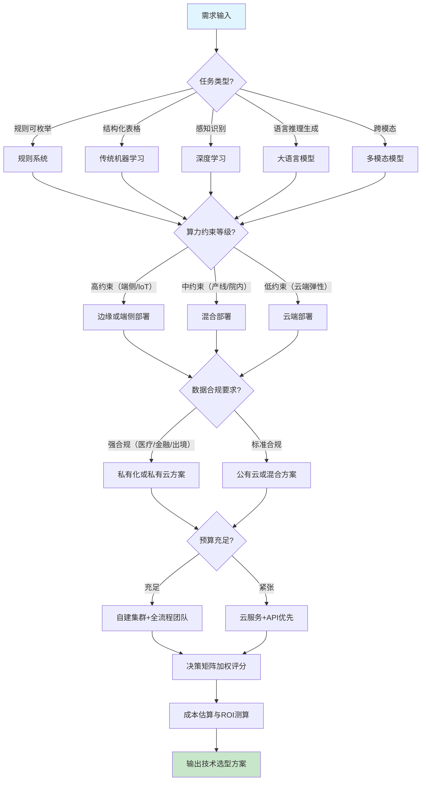

# 技术选型：AI技术栈决策框架

AI 产品的技术选型决定了成本结构、能力上限与商业化可行性。选型失误的代价非线性放大：算法选错导致数据返工，算力选错导致预算超支，部署方式选错导致合规风险。本章提供一套从算法到部署的完整决策框架，覆盖六个关键维度，帮助团队在立项阶段做出可审计、可复用的技术决策。

## 1. 算法选型

### 1.1 五类算法能力对比

AI 算法按能力边界可划分为五层，从确定性规则到跨模态生成，能力递增但成本与不确定性也递增。

| 算法类型 | 适用边界 | 数据需求 | 开发成本 | 推理成本 | 可解释性 |
|---|---|---|---|---|---|
| 规则系统 | 业务逻辑明确、可枚举（风控规则、配置校验） | 无需训练数据 | 低（工程师1-2周） | 极低（CPU毫秒级） | 完全可解释 |
| 传统机器学习 | 结构化表格数据、特征工程可行（信用评分、销量预测） | 千-万级标注样本 | 中（1-3月，含特征工程） | 低（CPU百毫秒级） | 高（特征权重可查） |
| 深度学习 | 感知与识别任务（图像分类、语音识别、目标检测） | 万-百万级标注样本 | 高（3-6月，含数据清洗与调参） | 中高（需GPU，10-100ms） | 中低（注意力可视化辅助） |
| 大语言模型（LLM） | 自然语言理解与生成、推理、代码（客服对话、文档摘要、代码助手） | 万级指令微调样本或调用闭源API | 高（自训练需百万级Token，API集成1-2月） | 高（GPU推理，秒级） | 低（黑盒，需对齐技术） |
| 多模态模型 | 跨模态理解与生成（图文搜索、视频理解、文生图） | 百万级对齐样本 | 极高（6-12月，含模态对齐） | 极高（多GPU并行，秒级以上） | 极低 |

### 1.2 任务类型到推荐算法映射

选型的第一原则是"任务定义清楚，算法自然浮现"。下表给出常见 AI 变现任务的算法推荐：

| 任务类型 | 推荐算法 | 备选方案 | 关键考量 |
|---|---|---|---|
| 离线规则审批（贷款准入、订单风控） | 规则系统 | 传统ML（梯度提升树） | 规则可枚举则用规则系统，需泛化则上传统ML |
| 表格预测（销量、流失、定价） | 传统ML（XGBoost/LightGBM） | 深度学习（TabNet） | 数据量<10万行优先传统ML，调参成本低 |
| 图像识别（质检、医学影像） | 深度学习（ResNet/ViT） | 预训练模型微调 | 优先用预训练权重，避免从零训练 |
| 语音转写（会议纪要、字幕） | 深度学习（Whisper类模型） | 闭源API（Azure/讯飞） | 数据敏感用本地Whisper，否则用API |
| 文本生成（营销文案、客服对话） | LLM（开源微调或闭源API） | 模板+规则系统 | 创意性高用LLM，结构稳定用模板 |
| 代码生成（IDE助手、单元测试） | LLM（代码专用模型） | 检索增强生成（RAG） | 内部代码场景必须RAG+微调 |
| 图文理解（电商搜索、内容审核） | 多模态（CLIP类） | 双塔分别编码后融合 | 标注成本高，优先用预训练对齐模型 |
| 视频生成（广告素材、短视频） | 多模态（扩散模型/视频生成） | 模板合成 | 算力成本极高，按生成量计费模型设计 |

> **选型反模式**：用 LLM 解决规则系统能做的事（如枚举性审批），推理成本可能高出 100-1000 倍；用深度学习解决传统 ML 能做的事（小样本表格预测），开发周期可能延长 3 倍且效果未必更好。

## 2. 算力配置

### 2.1 三种算力方案对比

| 维度 | 自建集群 | 公有云服务 | 混合方案 |
|---|---|---|---|
| 初期投入 | 高（硬件+机房+网络，百万元起） | 低（按量付费，零资产） | 中（核心节点自建+弹性上云） |
| 单位算力成本 | 低（满载时边际成本最低） | 高（含云厂商溢价） | 中（自建摊薄+云补峰） |
| 弹性扩缩容 | 弱（采购周期数月） | 强（分钟级扩容） | 中（自建保底+云扛峰） |
| 运维负担 | 高（需专职团队，硬件故障/驱动/散热） | 低（云厂商托管） | 中（自建部分需运维） |
| 数据安全 | 完全可控（物理隔离） | 依赖云厂商合规认证 | 敏感数据自建+非敏感上云 |
| 适用阶段 | 业务稳定、算力需求可预测 | 起步验证期、突发流量 | 业务规模化、有混合负载特征 |

> **决策建议**：起步阶段一律用公有云验证，月算力支出稳定超过自建折旧+运维成本（经验阈值约 50 万元/月）时再评估自建。混合方案适合有稳定基线负载 + 突发峰值的场景（如白天推理高峰、夜间训练低谷）。

### 2.2 主流云厂商 AI 服务对比

| 厂商 | 核心AI服务 | 算力优势 | 生态优势 | 适用场景 |
|---|---|---|---|---|
| AWS SageMaker / Bedrock | 全流程MLOps+托管模型市场 | P5实例（H100）、Inferentia推理芯片 | 全球化部署、企业级合规 | 出海业务、全球用户分发 |
| Azure ML / OpenAI | 与OpenAI深度绑定、企业版GPT | ND H100 v5系列 | 与Office/AAD无缝集成 | 企业内协同、合规要求高的ToB |
| Google Cloud Vertex AI | Gemini系列+TPU | TPU v5e/v6（专用张量计算） | 与BigQuery数据栈联动 | 大规模训练、推荐系统 |
| 阿里云 PAI / 通义 | 通义千问+百炼平台 | A800/H800实例、含中文优化 | 国内合规、电商生态 | 国内ToB、电商场景 |
| 腾讯云 TI / 混元 | 混元大模型+TI平台 | 多种GPU实例、推流优化 | 社交内容场景、游戏生态 | 内容生成、社交游戏 |

### 2.3 GPU 选型参考

| GPU 型号 | 显存 | 算力（FP16） | 典型场景 | 参考价格（年折旧） |
|---|---|---|---|---|
| A100 80G | 80GB | 312 TFLOPS | 大模型训练（70B以下）、推理 | 约 10-15 万元/卡 |
| H100 80G | 80GB | 989 TFLOPS | 大模型训练（175B级）、高性能推理 | 约 25-35 万元/卡 |
| H200 141G | 141GB | 989 TFLOPS | 超大模型训练、长上下文推理 | 约 35-45 万元/卡 |
| L40S 48G | 48GB | 362 TFLOPS | 推理优化、视觉任务、性价比推理 | 约 6-9 万元/卡 |
| RTX 4090 24G | 24GB | 165 TFLOPS | 小模型训练/推理、研发原型 | 约 1.5-2 万元/卡 |
| RTX 6000 Ada 48G | 48GB | 182 TFLOPS | 中型模型推理、工作站部署 | 约 4-6 万元/卡 |
| 推理卡 T4 16G | 16GB | 8 TFLOPS | 轻量推理、低延迟边缘 | 约 0.5-1 万元/卡 |

> **选型要点**：训练看显存（决定能放下多大模型）+ 算力（决定迭代速度）；推理看吞吐（QPS）+ 延迟。4090 适合研发原型与中小模型微调，A100/H100 适合生产训练，L40S/推理专用卡适合线上推理。

## 3. 数据策略

### 3.1 数据采集

数据是 AI 产品的护城河，采集策略决定能力上限。四类来源按可控性递减、成本递增排列：

- **自有业务数据**：产品运行产生的日志、用户行为、交易记录。质量最高、最贴合业务，但需埋点体系支撑。起步阶段必须建立的数据基础设施。
- **公开数据集**：HuggingFace、Kaggle、政府开放数据。成本低但通用性强，难以形成差异化。适合冷启动与基线测试。
- **数据采购**：从数据供应商购买垂直领域数据（医疗影像、法律文书、行业报告）。成本高但质量可控，需审查授权范围与数据来源合规性。
- **合成数据**：用已有模型生成训练数据（如 GPT-4 蒸馏小模型）。成本低、规模可控，但需评估分布偏差与"模型坍缩"风险。

### 3.2 数据标注

| 方案 | 成本 | 质量 | 适用阶段 | 注意事项 |
|---|---|---|---|---|
| 内部团队标注 | 高（人力+培训） | 高（业务理解深） | 冷启动、高质量种子数据 | 标注规范需文档化，避免人员流失导致标准漂移 |
| 外包标注 | 中（按条计费） | 中（需质检流程） | 大规模通用任务 | 必须抽检（建议10%）+ 双盲复核关键样本 |
| 半自动标注（主动学习+预标注） | 低 | 中高 | 大规模、有预训练模型可用 | 模型预标注+人工修正，效率提升5-10倍 |
| 弱监督/远程监督 | 低 | 中（噪声多） | 规则可枚举的场景 | 需要清洗与去噪流程 |

### 3.3 数据治理

数据治理决定模型迭代速度与可复现性。三个必须建立的机制：

- **版本管理**：使用 DVC / LakeFS / Delta Lake 对数据集版本化，每次训练可追溯到具体数据版本。无版本化的数据集是黑盒实验，无法复现。
- **质量监控**：建立数据质量看板（缺失率、分布漂移、标签一致性），上线后持续监控特征分布与训练分布的偏移（PSI指标）。
- **数据血缘**：记录数据从采集→清洗→标注→训练的全链路，支持回溯任意模型版本的训练数据组成。监管审计与故障排查必备。

### 3.4 数据合规

| 法规体系 | 适用范围 | 核心要求 | 违规风险 |
|---|---|---|---|
| 个人信息保护法（PIPL） | 中国境内处理个人信息 | 知情同意、最小必要、单独同意（敏感信息）、出境安全评估 | 罚款+业务整改，最高营业额5% |
| GDPR | 处理欧盟居民数据 | 合法依据、数据主体权利、DPIA评估、72小时 breach 通知 | 罚款最高2000万欧元或营业额4% |
| 行业规范 | 医疗（HIPAA）、金融（PCI-DSS）、教育等 | 行业特定数据脱敏与存储要求 | 行业准入处罚、牌照风险 |
| 生成式AI专项 | 中国《生成式人工智能服务管理暂行办法》 | 训练数据合法、标注合规、安全评估、算法备案 | 服务下架、行政处罚 |

> **实操建议**：立项阶段即引入法务评估数据合规性，建立"数据合规清单"。涉及个人信息的数据必须有用户授权链路，出境数据必须完成安全评估。合规问题在产品上线后被发现，返工成本是立项阶段评估的 10 倍以上。

## 4. 模型部署方式

### 4.1 三种部署方式对比

| 维度 | 云端部署 | 边缘部署 | 端侧部署 |
|---|---|---|---|
| 延迟 | 中（50-500ms，含网络） | 低（10-50ms） | 极低（1-10ms） |
| 单位推理成本 | 中（按调用计费） | 中高（硬件摊销） | 低（用户设备摊销） |
| 隐私保护 | 中（数据上云） | 中高（本地处理） | 高（数据不离设备） |
| 算力约束 | 低（弹性扩容） | 中（专用边缘设备） | 高（手机/IoT算力受限） |
| 模型规模上限 | 高（大模型可行） | 中（中小模型） | 低（量化压缩后的小模型） |
| 运维复杂度 | 低（云厂商托管） | 中（设备管理） | 高（多设备适配） |
| 离线可用性 | 否 | 部分支持 | 是 |

### 4.2 典型场景对应表

| 场景 | 推荐部署方式 | 选型理由 |
|---|---|---|
| 在线客服对话 | 云端部署 | 大模型推理、需要知识库实时更新 |
| 工业质检（产线实时） | 边缘部署 | 毫秒级延迟要求、产线断网容忍 |
| 手机端人脸解锁 | 端侧部署 | 隐私敏感、毫秒级响应、离线可用 |
| 医疗影像辅助诊断 | 边缘/私有云 | 数据合规、不能出院内网络 |
| 车载语音助手 | 端侧+云端混合 | 唤醒词端侧、复杂指令云端 |
| 智能家居IoT | 端侧部署 | 算力受限、隐私敏感、断网可用 |
| 文档翻译（批量） | 云端部署 | 无实时要求、利用大模型能力 |
| 实时视频审核 | 边缘部署 | 高吞吐、低延迟、本地缓存 |

## 5. 技术选型决策矩阵

### 5.1 四维度加权评分模型

将候选方案在四个维度上打分（1-5 分），按业务优先级加权求和，得分最高者胜出。

| 维度 | 权重参考 | 5分 | 3分 | 1分 |
|---|---|---|---|---|
| 算法能力 | 视业务定（0.2-0.4） | 完全满足+扩展性强 | 满足核心需求 | 能力不足需妥协 |
| 算力成本 | 视预算定（0.2-0.3） | 成本可控（预算内） | 可接受（需优化） | 超预算严重 |
| 数据可得性 | 视领域定（0.2-0.3） | 数据充足且合规 | 部分需采购/标注 | 数据缺失或合规风险高 |
| 部署约束 | 视场景定（0.1-0.2） | 完全适配场景约束 | 需妥协（如延迟稍高） | 不满足关键约束（如离线） |

### 5.2 评分示例

假设某医疗影像辅助诊断项目，权重为：算法能力 0.35 / 算力成本 0.20 / 数据可得性 0.25 / 部署约束 0.20。

| 候选方案 | 算法能力(0.35) | 算力成本(0.20) | 数据可得性(0.25) | 部署约束(0.20) | 加权总分 |
|---|---|---|---|---|---|
| 方案A：自训ResNet+本地部署 | 4 | 2 | 3 | 5 | 3.45 |
| 方案B：API调用云端模型 | 5 | 4 | 4 | 1 | 3.75 |
| 方案C：开源ViT微调+边缘部署 | 4 | 3 | 3 | 4 | 3.50 |

解读：方案B总分最高但部署约束低分（数据出境不合规），实际应淘汰；方案A虽总分稍低但合规且可控，是落地首选。决策矩阵只是辅助，关键约束具有"一票否决"权。

## 6. 成本估算

### 6.1 AI 项目成本构成

| 成本类别 | 占比参考 | 主要构成 | 说明 |
|---|---|---|---|
| 算力成本 | 30-50% | 训练算力+推理算力+存储 | 训练阶段集中支出，推理阶段持续支出 |
| 数据成本 | 15-25% | 采购+标注+清洗+治理工具 | 高质量标注是主要开销，单价 0.5-10 元/条 |
| 人力成本 | 25-40% | 算法+工程+数据+产品+运维 | 高级算法工程师占总人力成本 40%+ |
| 运维成本 | 5-15% | 监控+迭代+故障处理+合规审计 | 上线后持续支出，常被低估 |

### 6.2 粗略估算公式

**训练成本估算**：

```
训练总成本 = GPU单价 × 所需GPU数 × 训练时长
所需GPU数 ≈ 模型参数量(B) × 6 / 单卡显存(GB)
训练时长(小时) ≈ Token数 × 模型参数量 / (GPU算力 × GPU数 × MFU)
```

> 经验值：MFU（模型算力利用率）通常 30-50%，保守按 30% 估算。

**推理成本估算**：

```
单次推理成本 = GPU单价/3600 × 单次推理时长(秒) / 单卡并发数
云端API调用：单次成本 = API单价/千Token × 平均输入输出Token数 / 1000
```

**示例**：训练 7B 参数模型，使用 8 张 A100（单价 15 元/小时），Token 数 1000 亿：
- 所需GPU：7×6/80 ≈ 0.5（1张足够，8张并行加速）
- 训练时长：1000亿×7亿 / (312 TFLOPS × 8 × 30%) ≈ 93500 秒 ≈ 26 小时
- 训练成本：15 × 8 × 26 ≈ 3120 元（仅算力，不含数据与人力）

> **成本陷阱提醒**：算力只是冰山一角，数据标注与人力成本常被低估。立项时按 算力 : 数据 : 人力 = 4 : 2 : 4 的比例做预算，比纯按算力估算更接近实际。推理成本随用户增长线性上升，必须在商业模式设计阶段就规划好单用户算力成本与 ARPU 的关系。

## 7. 技术选型决策流程



## 8. 选型检查清单

立项阶段完成技术选型后，逐项确认以下清单，避免遗漏关键决策点：

- [ ] 任务类型已明确分类，对应算法层已选定
- [ ] 算力方案（自建/云/混合）已与业务阶段匹配
- [ ] GPU 选型已区分训练场景与推理场景
- [ ] 数据来源已确定，合规清单已通过法务评估
- [ ] 部署方式已与场景的延迟/隐私/离线约束对齐
- [ ] 决策矩阵已完成加权评分，关键约束具备一票否决
- [ ] 成本估算已拆解到算力/数据/人力/运维四类
- [ ] 推理成本与商业模式 ARPU 已对齐，盈利模型成立

> 技术选型不是一次性决策，而是随业务规模、数据积累、模型迭代持续演进的动态过程。建议每季度复盘一次选型假设是否仍然成立，及时调整避免技术债累积。

---

**上一章**：[03 - 商业模式设计：AI产品的盈利模式选择](03-business-models.md)  
**下一章**：[05 - 产品开发：AI产品的构建与迭代流程](05-product-development.md)  
**返回目录**：[00 - 总览](00-overview.md)
