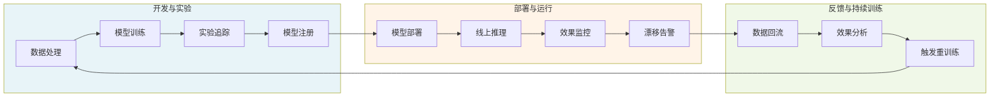

# 产品开发：AI产品的构建与迭代流程

> AI 产品的开发不是"先把模型训好再找场景"，也不是"照搬传统软件工程流程套上模型接口"。模型的不确定性、数据的依赖性、效果的渐进性，决定了 AI 产品开发需要一套区别于传统 SaaS 的工程方法。本章围绕原型设计（POC）、迭代开发（MLOps）、测试验证、数据飞轮、效果度量五个环节，给出可落地的开发流程与判断准则。

---

## 一、原型设计：POC 验证

### 1.1 POC 的目标设定

POC（Proof of Concept）的核心目标不是"做出一个 demo"，而是**用最低成本回答一个关键假设是否成立**。AI 产品的 POC 必须在动工前明确回答三个问题：

1. **可行性假设**：当前模型能力 + 可得数据，能否在目标场景达到"可用"门槛（而非"惊艳"门槛）？
2. **价值假设**：用户愿意为这个能力付出什么（时间/金钱/数据/工作流改造）？
3. **差异化假设**：相比现有方案（含人工 + 通用大模型直接调用），我们的方案是否有结构性优势？

> **避坑提示**：POC 最常见的失败不是"做不出来"，而是"做出来了但没人用"。原因往往是把"技术可行性"等同于"商业可行性"，跳过了价值假设与差异化假设的验证。

### 1.2 最小验证标准（MVS）

POC 的验收不应使用"主观感觉不错"这类模糊标准，而要设定可量化的最小验证标准（Minimum Validation Standard）：

| 维度 | 最小验证标准示例 | 说明 |
|------|----------------|------|
| **效果门槛** | 核心任务准确率 ≥ 80%（或人工评估 ≥ 4/5 分） | 低于此值用户会认为"不可用" |
| **延迟门槛** | 首 token ≤ 2s，完整响应 ≤ 10s | 超过用户容忍阈值会显著流失 |
| **成本门槛** | 单次调用成本 ≤ 用户愿付价格的 30% | 留出毛利空间与规模化降价余地 |
| **样本覆盖** | 至少在 50 条真实样本上验证，覆盖 ≥ 3 类典型场景 | 避免只在"友好样本"上自测 |
| **用户反馈** | 5 名目标用户中 ≥ 3 名表示"愿意继续使用/付费" | 验证价值假设而非技术指标 |

### 1.3 快速原型工具选型

POC 阶段应优先选择"上手快、迭代快、可演示"的工具，避免过早投入工程化建设。常用选型对照如下：

| 工具 | 适用场景 | 优势 | 局限 |
|------|---------|------|------|
| **Streamlit** | 数据应用、表单交互、可视化演示 | Python 原生、几十行代码出页面、组件丰富 | 复杂交互与状态管理较弱 |
| **Gradio** | 模型直接演示、输入输出可视化 | 与 HuggingFace 生态深度集成、一行代码分享 | UI 定制性有限 |
| **LangChain / LlamaIndex** | LLM 应用编排、RAG、Agent | 抽象层完善、快速拼装链路 | 抽象泄漏多、生产化需重构 |
| **Chainlit** | 对话型应用、流式输出 | 对话交互开箱即用、支持人机协作 | 通用性不如 Streamlit |
| **Jupyter + Voila** | 探索性分析转可演示页面 | 复用已有 notebook | 不适合面向真实用户 |

**选型准则**：POC 工具选型的首要标准是"能否在 1-3 天内跑通核心链路并演示给目标用户"，而非"是否便于后续工程化"。工程化重构是 MVP 阶段的事。

### 1.4 POC 到 MVP 的转化判断标准

POC 通过后不等于可以直接进入 MVP 开发，需逐项确认以下转化条件：

- **假设已验证**：上述三项假设（可行性/价值/差异化）均有数据支撑，而非主观判断
- **核心路径已跑通**：从输入到输出端到端可用，不存在"靠人工兜底"的关键环节
- **成本结构可承受**：按预期用户量推算的调用成本、数据成本、人力成本在可接受范围
- **有明确的下一步**：清楚 MVP 要补齐哪些能力（稳定性/规模性/体验/合规），而非"把 POC 做得更完善"
- **用户有承诺**：至少有 1-2 名种子用户承诺在 MVP 阶段持续使用并反馈

> **判断准则**：如果 POC 通过后仍说不出"MVP 要解决的核心问题是什么"，说明 POC 只验证了技术而非产品，应回到 1.1 重新设定价值假设。

---

## 二、迭代开发：敏捷与 MLOps

### 2.1 敏捷开发在 AI 项目的适配

传统敏捷以"功能交付"为节奏单位，AI 项目则以"效果提升"为节奏单位。两者的关键差异：

| 维度 | 传统软件敏捷 | AI 项目敏捷 |
|------|------------|------------|
| 交付物 | 可运行的功能 | 效果可度量的模型 + 功能 |
| 验收标准 | 功能符合需求规格 | 效果指标达到阈值且无回归 |
| 不确定性来源 | 需求变更 | 数据分布漂移 + 模型行为不确定 |
| 迭代驱动力 | 产品需求清单 | 数据反馈 + 指标看板 |
| 回归风险 | 代码改动破坏既有功能 | 模型更新导致旧场景效果下降 |

适配建议：保留敏捷的短周期反馈与小步快跑，但在 sprint 目标设定上从"交付 N 个功能"改为"将核心指标提升 X% 且无关键回归"。

### 2.2 MLOps 实践

MLOps 是 DevOps 在机器学习场景的延伸，核心是让"数据—模型—部署—反馈"形成可自动化、可追溯的闭环。关键实践包括：

- **数据版本管理**：使用 DVC / LakeFS / 自建数据集版本，保证每次训练的数据可复现。数据是模型的根因，数据不可复现则实验不可复现。
- **模型版本管理**：使用 MLflow Model Registry / Weights & Biases，记录每次训练的模型、超参、数据版本、评估结果。
- **实验追踪**：记录每次实验的完整上下文（代码 commit + 数据版本 + 超参 + 环境 + 指标），支持实验对比与回溯。
- **CI/CD/CT**：在传统 CI（代码集成）、CD（持续部署）之上增加 CT（Continuous Training，持续训练），即数据/指标触发自动重训练。
- **监控与告警**：线上不仅监控基础设施指标（延迟/错误率/资源），更要监控模型效果指标（预测分布漂移、准确率衰减、用户反馈负向占比）。

### 2.3 AI 项目的 sprint 节奏建议

AI 项目的 sprint 不宜照搬纯软件的 2 周节奏，因为模型训练、数据标注、效果评估的周期往往跨多个 sprint。建议采用"双轨节奏"：

- **工程轨（1-2 周）**：按敏捷节奏交付功能、接口、体验改进，与纯软件开发一致
- **模型轨（2-4 周）**：按"数据—训练—评估—灰度"周期推进，一个模型迭代可能跨越多个工程 sprint

每个模型迭代结束需召开"模型评审会"，对照指标基线决定是否灰度、回滚或继续优化，避免"训了就上"。

---

## 三、测试验证：功能、性能、效果与对齐

### 3.1 四层测试体系

AI 产品的测试不能停留在"功能跑通"，需要覆盖以下四个层次。各层失败的成本递增：功能 bug 影响体验，对齐问题可能引发公关与法律风险。

| 测试层 | 关注问题 | 典型方法 | 通过准则 |
|--------|---------|---------|---------|
| **功能测试** | 接口、链路、边界条件是否正确 | 单元测试、集成测试、端到端测试 | 覆盖率 ≥ 80%，关键路径 100% |
| **性能测试** | 延迟、吞吐、资源占用是否达标 | 压测、负载测试、长稳测试 | P95 延迟达标，峰值吞吐满足 SLA |
| **效果评测** | 模型输出质量是否达标 | 离线指标 + 人工评估 + 线上 AB | 核心指标无回归且达到目标值 |
| **对齐测试** | 安全性、偏见、幻觉是否可控 | 红队测试、对抗样本、合规审查 | 无高危对齐问题，合规要求全通过 |

### 3.2 性能测试关键指标

| 指标 | 定义 | 典型阈值（参考） |
|------|------|----------------|
| 首 token 延迟（TTFT） | 从请求到首个 token 返回的时间 | ≤ 2s（对话场景） |
| 端到端延迟（E2E） | 从请求到完整响应返回的时间 | ≤ 10s（短文本生成） |
| 吞吐量（QPS） | 单位时间成功处理的请求数 | 按 SLA 峰值 1.5 倍预留 |
| 资源利用率 | GPU/CPU/内存占用率 | 峰值 ≤ 80%，留扩容余量 |
| 长稳表现 | 持续运行 N 小时的稳定性 | 24h 无内存泄漏、延迟无显著衰减 |

### 3.3 效果评测方法

效果评测是 AI 产品区别于传统软件的核心测试环节，需结合自动指标与人工评估：

- **分类任务**：准确率（Accuracy）、精确率（Precision）、召回率（Recall）、F1
- **生成任务**：BLEU、ROUGE、BERTScore（机器翻译/摘要），但生成质量最终需人工评估
- **检索任务**：召回率@K、NDCG、MRR（RAG 场景的检索质量）
- **人工评估**：双盲打分、偏好对比（A/B 优于单点打分）、多维 Rubric（相关性/流畅性/事实性/有用性）

> **关键认知**：自动指标只能作为快速迭代参考，最终效果判断必须以人工评估 + 线上 AB 实验为准。自动指标高但用户体验差的情况在生成式 AI 中极为常见。

### 3.4 AI 对齐测试

对齐测试关注模型行为是否符合安全、伦理与合规要求，是上线前的最后一道门禁：

- **安全性测试**：注入越狱提示、诱导有害输出，验证护栏有效性
- **偏见测试**：跨性别/种族/地域/年龄的公平性评估，识别系统性偏差
- **幻觉测试**：事实验证、来源可追溯性、对未知问题的"拒答"能力
- **合规审查**：数据来源合规、隐私脱敏、行业准入（医疗/金融等特殊行业）

---

## 四、数据飞轮构建

### 4.1 数据飞轮的概念与价值

数据飞轮（Data Flywheel）是指"产品使用产生数据 → 数据改进模型 → 模型提升体验 → 体验带来更多使用与数据"的正反馈循环。其价值在于：随用户规模增长，模型效果持续提升，形成后来者难以追赶的数据壁垒。

飞轮成立的前提是**反馈数据可闭环、可量化、可用于训练**。如果用户数据只用于运营分析而无法回流到模型训练，飞轮不会自动转起来。

### 4.2 飞轮构建步骤

完整的飞轮由七个环节构成闭环：

1. **采集**：埋点收集用户输入、模型输出、用户行为（点击/修改/采纳/放弃）
2. **清洗**：去重、脱敏、过滤低质量样本与异常流量
3. **标注**：明确标注来源（隐式反馈/显式反馈/人工标注），区分正负样本
4. **训练**：将清洗标注后的数据用于增量训练或微调
5. **部署**：新模型经评测通过后灰度上线
6. **反馈**：线上收集新模型的真实表现数据
7. **回流**：将反馈数据沉淀为下一轮训练样本，回到采集环节

### 4.3 飞轮加速策略

飞轮不会自然加速，需主动设计加速机制：

- **降低反馈摩擦**：用隐式反馈（采纳/修改/放弃）替代显式评分，提升数据密度
- **缩短闭环周期**：从"季度重训"压缩到"周级/日级增量训练"，让飞轮转得更快
- **主动学习**：让模型主动挑选"最有信息量"的样本请求人工标注，提升单位标注的边际收益
- **冷启动数据**：在用户数据不足时用合成数据、开源数据、采购数据填充，但需标注来源避免污染
- **数据资产化**：将飞轮沉淀的数据按场景/质量分桶管理，形成可复用的数据资产而非一次性样本

> **避坑提示**：飞轮不是"数据越多效果越好"。低质量数据、分布偏移样本、标注噪声都会让飞轮"反转"——数据越多效果越差。数据质量治理是飞轮的生命线。

---

## 五、效果度量指标体系

### 5.1 三层指标体系

AI 产品的效果度量需要三层指标协同，任何单层指标都无法独立判断产品健康度：

- **产品指标**：反映用户是否在使用、是否留下来
- **模型指标**：反映模型能力是否达标、是否在退化
- **商业指标**：反映产品是否在创造价值、是否可持续

三层指标需建立因果关联：模型指标改善 → 产品指标提升 → 商业指标增长。若出现模型指标提升但商业指标不动，说明优化方向偏离了真实价值。

### 5.2 指标定义表

| 层级 | 指标 | 定义 | 用途 |
|------|------|------|------|
| **产品** | 次日留存率 | 首次使用后次日的回访用户占比 | 衡量产品即时价值 |
| **产品** | 周活跃率（WAU/MAU） | 周活跃用户占月活跃比例 | 衡量使用粘性 |
| **产品** | 关键转化率 | 完成核心价值动作的用户占比 | 衡量价值传递效率 |
| **产品** | 任务完成率 | 用户在单次会话中完成目标任务的占比 | 衡量 AI 实际可用性 |
| **模型** | 准确率/F1 | 分类任务的核心效果指标 | 离线评估与回归监控 |
| **模型** | P95 延迟 | 95 分位响应时间 | 体验与成本平衡 |
| **模型** | 单次调用成本 | 推理 + 数据 + 人力折算的单次成本 | 毛利与规模化可行性 |
| **模型** | 漂移度 | 线上数据分布相对训练分布的偏移 | 触发重训练的预警 |
| **商业** | 月经常性收入（MRR） | 订阅产品的月度稳定收入 | 衡量商业化规模 |
| **商业** | 毛利率 | (收入 - 变动成本) / 收入 | 衡量规模化盈利能力 |
| **商业** | NPS | 净推荐值，推荐者占比减贬损者占比 | 衡量用户满意度与口碑 |

### 5.3 指标治理建议

- **北极星指标**：从三层中选一个最能反映"产品为用户创造价值"的指标作为北极星（通常为任务完成率或关键转化率），其余指标作为支撑
- **指标分级告警**：模型指标波动 > 5% 黄色、> 10% 红色，商业指标连续两周下降即触发复盘
- **避免指标孤岛**：产品、模型、算法、商业团队共享同一指标看板，避免各看各的导致优化方向冲突
- **指标可解释**：每个指标必须能回答"它为什么重要""它恶化意味着什么""应该由谁负责"，无主指标即废弃

> **经验教训**：AI 产品最危险的信号不是某个指标下降，而是"模型指标持续优化但用户留存持续下滑"。这通常意味着团队在优化可被度量的指标而非真实价值，是飞轮反转的前兆。

---

**上一章**：[04 - 技术选型：AI技术栈决策框架](04-tech-selection.md)  
**下一章**：[06 - 市场推广：AI产品的GTM策略](06-marketing-strategy.md)  
**返回目录**：[00 - 总览](00-overview.md)
